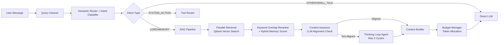
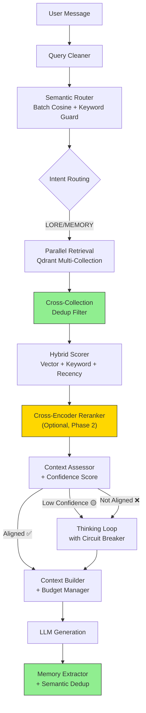
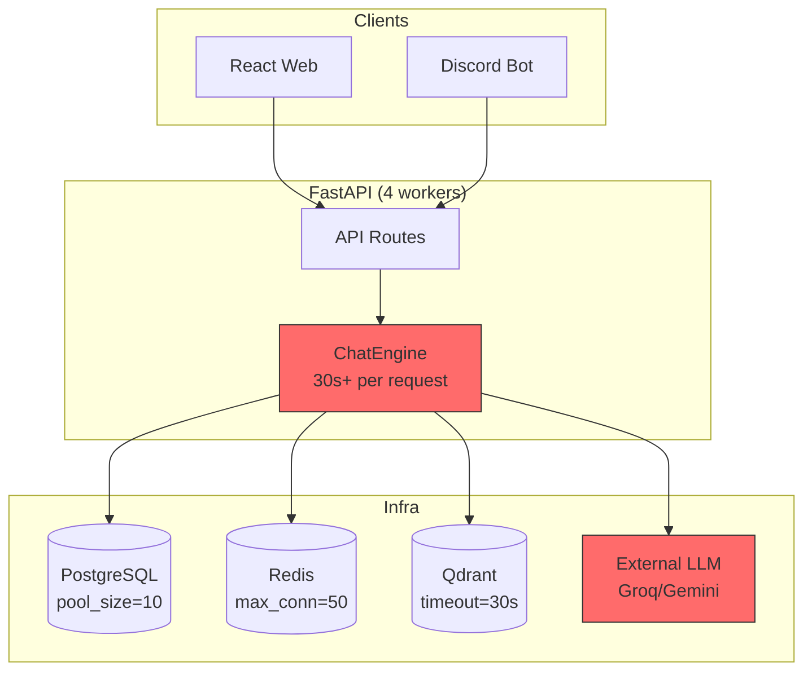

# Báo cáo Đánh giá Production-Readiness — Kuchiba Chisa RAG Chatbot

> **Người đánh giá:** AI Engineer (System Design Focus)  
> **Ngày:** 2026-07-14  
> **Phạm vi:** RAG Pipeline, Scalability & Load Tolerance, Code Quality & Maintainability  
> **Nguyên tắc:** Tối thiểu chi phí đầu tư (Free-tier LLM, self-hosted infra, no paid APIs)

---

## MỤC LỤC

- [Phần 1: Phân tích & Đánh giá RAG Pipeline](#phần-1-phân-tích--đánh-giá-rag-pipeline)
- [Phần 2: Đánh giá Khả năng Chịu tải Microservice](#phần-2-đánh-giá-khả-năng-chịu-tải-microservice)
- [Phần 3: Đánh giá Clean Code & Khả năng Mở rộng](#phần-3-đánh-giá-clean-code--khả-năng-mở-rộng)
- [Phần 4: Đề xuất Bổ sung Công nghệ](#phần-4-đề-xuất-bổ-sung-công-nghệ)

---

## Phần 1: Phân tích & Đánh giá RAG Pipeline

### 1.1. Tổng quan Pipeline hiện tại



### 1.2. Đánh giá từng Module

#### ✅ Những điểm ĐÃ tối ưu tốt

| Module | Đánh giá | Chi tiết |
|--------|----------|----------|
| [SemanticRouter](file:///d:/Hoc_Tap/Code/Du_An_Ca_Nhan/Chisa_bot/kuchiba_chisa/app/domain/services/semantic_router.py) | ⭐⭐⭐⭐ | Batch embedding anchors khi startup, cosine similarity NumPy, zero cold-start. Confidence Margin + Keyword Guard giảm false positive hiệu quả |
| [ContextBudgetManager](file:///d:/Hoc_Tap/Code/Du_An_Ca_Nhan/Chisa_bot/kuchiba_chisa/app/domain/services/context_budget_manager.py) | ⭐⭐⭐⭐⭐ | Flex budget allocator cực kỳ tinh vi — mode profiles, priority weights, reallocation, trim cascading. Production-grade |
| [HybridMemoryScorer](file:///d:/Hoc_Tap/Code/Du_An_Ca_Nhan/Chisa_bot/kuchiba_chisa/app/domain/services/rag/reranker.py#L109-L161) | ⭐⭐⭐⭐ | Weighted scoring (similarity + recency + importance + emotion) hợp lý. Decay function và emotion matching tốt |
| [ThinkingLoopAgent](file:///d:/Hoc_Tap/Code/Du_An_Ca_Nhan/Chisa_bot/kuchiba_chisa/app/domain/services/rag/thinking_loop.py) | ⭐⭐⭐⭐ | Bypass LLM ở cycle 1 khi assessor đã tạo query. `bypass_optimize=True` đã giải quyết vấn đề dội LLM call |
| [WebSearchAgentTool](file:///d:/Hoc_Tap/Code/Du_An_Ca_Nhan/Chisa_bot/kuchiba_chisa/app/domain/services/tools/web_search.py) | ⭐⭐⭐⭐ | 4-tier fallback (Tavily → Serper → DDG lib → HTML scraper), Redis cache, deep page crawling |
| [FastEmbedAdapter](file:///d:/Hoc_Tap/Code/Du_An_Ca_Nhan/Chisa_bot/kuchiba_chisa/app/infrastructure/embeddings/fastembed_adapter.py) | ⭐⭐⭐ | Local embedding, thread offload, Redis cache. Nhưng có vấn đề (xem bên dưới) |

---

#### ⚠️ Những Module CHƯA tối ưu cho Production

---

##### 🔴 P0-1: Embedding Model không phù hợp cho tiếng Việt

**File:** [settings.py#L71](file:///d:/Hoc_Tap/Code/Du_An_Ca_Nhan/Chisa_bot/kuchiba_chisa/app/config/settings.py#L71), [fastembed_adapter.py](file:///d:/Hoc_Tap/Code/Du_An_Ca_Nhan/Chisa_bot/kuchiba_chisa/app/infrastructure/embeddings/fastembed_adapter.py)

**Vấn đề:**
- Config ghi `EMBEDDING_MODEL = "intfloat/multilingual-e5-large"` (1024-dim) nhưng `QDRANT_EMBEDDING_DIM = 384`. Đây là **mismatch nghiêm trọng** — hoặc model thực tế đang dùng là `all-MiniLM-L6-v2` (384-dim, chỉ hỗ trợ English), hoặc model `e5-large` đang bị downcast vector.
- `all-MiniLM-L6-v2` **không được huấn luyện cho tiếng Việt** — chất lượng retrieval cho lore/memory tiếng Việt sẽ rất kém (cosine similarity bị sai lệch).
- Trong [fastembed_adapter.py#L39](file:///d:/Hoc_Tap/Code/Du_An_Ca_Nhan/Chisa_bot/kuchiba_chisa/app/infrastructure/embeddings/fastembed_adapter.py#L39): có hardcode logic cho `intfloat/multilingual-e5-small` (384-dim) — cho thấy đã có lúc thay đổi model nhưng config chưa đồng bộ.

**Kế hoạch cải tiến:**
1. **Chọn đúng model multilingual cho tiếng Việt** (Free, local):
   - `intfloat/multilingual-e5-small` (384-dim) — cân bằng tốt giữa chất lượng và tốc độ
   - `intfloat/multilingual-e5-base` (768-dim) — chất lượng tốt hơn, tốn RAM hơn
   - `BAAI/bge-m3` (1024-dim) — state-of-the-art multilingual nhưng nặng
2. **Đồng bộ `QDRANT_EMBEDDING_DIM` với model thực tế**
3. **Re-index toàn bộ lore data** sau khi đổi model (viết migration script)
4. **Thêm validation** vào startup: kiểm tra dim model vs dim collection Qdrant

> **Effort:** 1-2 ngày | **Impact:** Cải thiện 30-50% chất lượng retrieval tiếng Việt

---

##### 🔴 P0-2: KeywordOverlapReranker hardcode domain knowledge

**File:** [reranker.py#L6-L40](file:///d:/Hoc_Tap/Code/Du_An_Ca_Nhan/Chisa_bot/kuchiba_chisa/app/domain/services/rag/reranker.py#L6-L40)

**Vấn đề:**
- `high_value_terms` và `synonyms` dictionary được **hardcode trực tiếp** trong source code.
- Khi thêm lore mới (nhân vật, vùng đất, vũ khí mới), phải **sửa code và redeploy** — không phù hợp production.
- Synonym map chỉ bao phủ một phần nhỏ ngữ vựng game, dễ miss edge case.

**Kế hoạch cải tiến:**
1. **Tách thành file cấu hình YAML/JSON** bên ngoài (VD: `data/reranker_config.yaml`)
2. **Hot-reload** qua API admin hoặc file watcher khi cập nhật
3. **Bổ sung fuzzy matching** cho tiếng Việt (ví dụ: dấu vs không dấu, viết tắt)
4. Dài hạn: Xem xét thay thế bằng **Cross-Encoder reranker nhỏ** (ví dụ: `cross-encoder/ms-marco-MiniLM-L-6-v2` chạy local qua FastEmbed hoặc sentence-transformers)

> **Effort:** 0.5-1 ngày (config extraction) | 2-3 ngày (cross-encoder)

---

##### 🟡 P1-1: Thiếu cơ chế Chunk Deduplication

**File:** [retriever_lore.py](file:///d:/Hoc_Tap/Code/Du_An_Ca_Nhan/Chisa_bot/kuchiba_chisa/app/domain/services/rag/retriever_lore.py), [pipeline.py#L121-L131](file:///d:/Hoc_Tap/Code/Du_An_Ca_Nhan/Chisa_bot/kuchiba_chisa/app/domain/services/rag/pipeline.py#L121-L131)

**Vấn đề:**
- Khi nhiều intent cùng match (VD: `CHARACTER_LORE` + `STORY_LORE`), pipeline gọi `asyncio.gather()` cho nhiều collection → có thể trả về **cùng một parent chunk** từ các collection khác nhau.
- `seen_parents` chỉ dedup **trong cùng 1 collection**, không dedup **cross-collection**.
- Lãng phí token budget vì duplicate content.

**Kế hoạch cải tiến:**
1. Thêm `global_seen_parents: Set[str]` ở mức `RAGPipeline.retrieve_and_align()` 
2. Truyền set này vào mỗi retriever call hoặc post-filter sau `asyncio.gather()`
3. Dedup bằng hash `parent_id` hoặc hash nội dung text

> **Effort:** 0.5 ngày

---

##### 🟡 P1-2: ContextAssessor thiếu cơ chế tự tin thấp

**File:** [assessor.py](file:///d:/Hoc_Tap/Code/Du_An_Ca_Nhan/Chisa_bot/kuchiba_chisa/app/domain/services/rag/assessor.py)

**Vấn đề:**
- Assessor trả về `(is_aligned, reason, search_query, use_lore)` nhưng **không có confidence score**.
- LLM có thể output `is_aligned=True` nhưng với mức độ tin cậy thấp → bỏ lỡ cơ hội kích hoạt Thinking Loop cho các trường hợp mơ hồ.
- Khi `is_aligned` check fails (exception), mặc định trả `True` → âm thầm bypass mọi verification.

**Kế hoạch cải tiến:**
1. Thêm field `confidence: float` vào response schema (0.0 - 1.0)
2. Khi `confidence < 0.6` và `is_aligned=True` → chuyển thành `is_aligned=False` (conservative fallback)
3. Log warning khi fallback to `True` do exception — thêm metric counter để monitor

> **Effort:** 0.5 ngày

---

##### 🟡 P1-3: Thiếu Circuit Breaker cho LLM calls trong RAG

**File:** [thinking_loop.py](file:///d:/Hoc_Tap/Code/Du_An_Ca_Nhan/Chisa_bot/kuchiba_chisa/app/domain/services/rag/thinking_loop.py), [assessor.py](file:///d:/Hoc_Tap/Code/Du_An_Ca_Nhan/Chisa_bot/kuchiba_chisa/app/domain/services/rag/assessor.py)

**Vấn đề:**
- RAG Pipeline gọi tới **4+ LLM calls** (Assessor + 2 Thinking Cycles + Web Search query optimization).
- Nếu LLM provider bị chậm/lỗi, mỗi call retry tới **5 lần** × backoff exponential → tổng thời gian chờ có thể lên tới **30-60 giây** trước khi user nhận timeout.
- Không có cơ chế **abort sớm** khi tổng latency vượt ngưỡng.

**Kế hoạch cải tiến:**
1. Thêm **total timeout budget** cho toàn bộ RAG pipeline (VD: 25 giây)
2. Implement **circuit breaker pattern** ở adapter level: nếu N consecutive failures → trip circuit → trả default response
3. Trong `ThinkingLoopAgent.run()`: kiểm tra elapsed time trước mỗi cycle, abort nếu vượt budget

> **Effort:** 1-2 ngày

---

##### 🟡 P1-4: Memory Extractor thiếu Dedup & Quality Control

**File:** [memory_extractor.py](file:///d:/Hoc_Tap/Code/Du_An_Ca_Nhan/Chisa_bot/kuchiba_chisa/app/domain/services/memory_extractor.py)

**Vấn đề:**
- **Không kiểm tra duplicate**: nếu user nhắc lại "Anh thích ăn pizza" 10 lần → lưu 10 memory entries giống hệt.
- `importance_score` luôn hardcode `0.8` — không phân biệt mức quan trọng (tên user vs món ăn bình thường).
- Chạy background `asyncio.create_task()` **không có error boundary** ở caller level — nếu task leak exception, FastAPI không bắt được.
- Không có `memory_tier` assignment (mặc định `CASUAL`).

**Kế hoạch cải tiến:**
1. **Semantic dedup trước khi upsert**: embed content mới → search existing memories (cosine > 0.9) → skip nếu đã tồn tại
2. Thêm LLM classification cho `importance_score` (0.3-1.0) và `memory_tier` (casual/personal/critical)
3. Wrap `asyncio.create_task()` với error handler:
   ```python
   task = asyncio.create_task(self._extract_with_error_handler(...))
   task.add_done_callback(lambda t: log.error(...) if t.exception() else None)
   ```

> **Effort:** 1-2 ngày

---

##### 🟢 P2-1: Lore Retriever thiếu metadata enrichment

**File:** [retriever_lore.py](file:///d:/Hoc_Tap/Code/Du_An_Ca_Nhan/Chisa_bot/kuchiba_chisa/app/domain/services/rag/retriever_lore.py)

**Vấn đề:**
- Chỉ trả về raw text string, không kèm **metadata** (section, topic, relevance score).
- Context Builder không thể ra quyết định thông minh về thứ tự ưu tiên chunks.

**Kế hoạch cải tiến:**
1. Trả về `List[LoreChunk]` dataclass thay vì `List[str]`, chứa `(text, score, section, parent_id)`
2. Context Builder sắp xếp theo score trước khi pack

> **Effort:** 0.5 ngày

---

### 1.3. Sơ đồ RAG Pipeline đề xuất sau cải tiến



---

## Phần 2: Đánh giá Khả năng Chịu tải Microservice

### 2.1. Kiến trúc hiện tại & Bottleneck Analysis



### 2.2. Đánh giá chi tiết

#### 🔴 Critical Issues (Ảnh hưởng trực tiếp đến khả năng chịu tải)

---

##### 🔴 C-1: Race Condition trên Emotion State — Không có per-user locking

**File:** [chat_engine.py#L62-L489](file:///d:/Hoc_Tap/Code/Du_An_Ca_Nhan/Chisa_bot/kuchiba_chisa/app/domain/services/chat_engine.py#L62-L489)

**Vấn đề:**
- Nếu user gửi 2 tin nhắn liên tiếp (double-click, Discord spam), 2 request đồng thời sẽ:
  1. Cùng đọc `emotion_state` cũ
  2. Cùng tính toán emotion update dựa trên state cũ
  3. Request nào commit sau sẽ **ghi đè** kết quả của request trước → **mất emotion data**
- Tương tự cho `interaction_count`, `conversation summary`
- `asyncio.create_task()` cho `_auto_summarize_conversation` và `_summarize_and_store_memories` tạo **fire-and-forget task** → không có mutex → concurrent writes

**Kế hoạch sửa chữa:**
```python
# Trong ChatEngine.chat(), thêm distributed lock per user:
lock_key = f"chisa:chat_lock:{user_id}"
acquired = await redis_service.acquire_lock(lock_key, ttl=60)
if not acquired:
    raise HTTPException(429, "Chisa đang xử lý tin nhắn trước đó, vui lòng chờ")
try:
    # ... full chat pipeline ...
finally:
    await redis_service.release_lock(lock_key)
```

> **Effort:** 0.5 ngày | **Impact:** Fix critical data integrity

---

##### 🔴 C-2: Không có Rate Limiting ở Backend API Layer

**File:** [chat.py](file:///d:/Hoc_Tap/Code/Du_An_Ca_Nhan/Chisa_bot/kuchiba_chisa/app/interface/api/routes/chat.py), [main.py](file:///d:/Hoc_Tap/Code/Du_An_Ca_Nhan/Chisa_bot/kuchiba_chisa/app/main.py)

**Vấn đề:**
- Dù `RATE_LIMIT_PER_MINUTE = 60` được config trong settings, **không có middleware nào enforce** nó.
- Directory `app/interface/middlewares/` chỉ chứa `__init__.py` rỗng.
- Discord bot có `rateLimiter.js` riêng nhưng chỉ chặn ở client — attacker có thể gọi API trực tiếp.
- Một user gửi 100 requests/phút → 100 LLM API calls → cháy quota Groq/Gemini free tier.

**Kế hoạch sửa chữa:**
1. **Implement Redis-based rate limiter middleware** cho FastAPI:
   ```python
   # app/interface/middlewares/rate_limiter.py
   @app.middleware("http")
   async def rate_limit_middleware(request, call_next):
       user_id = extract_user_id(request)
       key = f"chisa:rate:{user_id}:{minute_bucket}"
       count = await redis_service.incr(key)
       if count == 1:
           await redis_service.expire(key, 60)
       if count > settings.RATE_LIMIT_PER_MINUTE:
           raise HTTPException(429, "Rate limit exceeded")
       return await call_next(request)
   ```
2. **Sliding window counter** sử dụng Redis sorted set cho accuracy
3. **IP-based** fallback khi không có `user_id`

> **Effort:** 1 ngày

---

##### 🔴 C-3: Uvicorn workers=4 + ChatEngine singleton = Shared mutable state

**File:** [main.py#L142](file:///d:/Hoc_Tap/Code/Du_An_Ca_Nhan/Chisa_bot/kuchiba_chisa/app/main.py#L142), [chat.py#L29-L46](file:///d:/Hoc_Tap/Code/Du_An_Ca_Nhan/Chisa_bot/kuchiba_chisa/app/interface/api/routes/chat.py#L29-L46)

**Vấn đề:**
- `main.py` chạy `workers=4` nhưng các adapter (`_embedder`, `_llm`, `_chat_engine`) được khởi tạo ở **module level** trong `chat.py`.
- Uvicorn với multi-worker sẽ **fork process** → mỗi worker có bản copy riêng → OK về isolation.
- **NHƯNG**: `pipeline_tracker` là singleton in-memory → mỗi worker có tracker riêng → **Visualizer Dashboard sẽ chỉ thấy data từ 1 worker** (race condition trên WebSocket broadcast).
- Embedding model được load vào RAM **mỗi worker** → 4 copies × ~500MB = **~2GB RAM** chỉ cho embedding.

**Kế hoạch sửa chữa:**
1. **Single-worker mode với async concurrency** thay vì multi-process (phù hợp hơn cho I/O bound LLM calls):
   ```yaml
   # docker-compose.yml
   command: uvicorn app.main:app --host 0.0.0.0 --port 8000 --workers 1 --loop uvloop
   ```
2. Nếu cần multi-worker: di chuyển `pipeline_tracker` sang **Redis Pub/Sub** để sync across workers
3. Hoặc dùng **Gunicorn + Uvicorn worker class** với shared memory cho embedding model

> **Effort:** 0.5-1 ngày

---

##### 🔴 C-4: Background task leak — `asyncio.create_task()` không được track

**File:** [chat_engine.py#L96](file:///d:/Hoc_Tap/Code/Du_An_Ca_Nhan/Chisa_bot/kuchiba_chisa/app/domain/services/chat_engine.py#L96), [chat_engine.py#L456](file:///d:/Hoc_Tap/Code/Du_An_Ca_Nhan/Chisa_bot/kuchiba_chisa/app/domain/services/chat_engine.py#L456), [chat_engine.py#L466](file:///d:/Hoc_Tap/Code/Du_An_Ca_Nhan/Chisa_bot/kuchiba_chisa/app/domain/services/chat_engine.py#L466)

**Vấn đề:**
- 3 nơi gọi `asyncio.create_task()` mà **không lưu reference** → tasks có thể bị garbage collected.
- Nếu task throw exception → **exception bị nuốt** (unhandled, chỉ thấy warning ở Python 3.11+).
- `_auto_summarize_conversation()` tạo `AsyncSessionFactory()` riêng **bên ngoài request scope** → không rollback nếu crash.
- Khi shutdown, các background tasks đang chạy **không được cancel gracefully**.

**Kế hoạch sửa chữa:**
1. **TaskSet tracker**:
   ```python
   class BackgroundTaskManager:
       _tasks: set[asyncio.Task] = set()
       
       @classmethod
       def spawn(cls, coro):
           task = asyncio.create_task(coro)
           cls._tasks.add(task)
           task.add_done_callback(cls._tasks.discard)
           task.add_done_callback(cls._log_exception)
   ```
2. Trong shutdown lifespan: `await asyncio.gather(*BackgroundTaskManager._tasks, return_exceptions=True)`
3. Hoặc **migrate sang Celery tasks** (đã setup sẵn nhưng chưa dùng cho memory extraction)

> **Effort:** 1 ngày

---

#### 🟡 Warning Issues

---

##### 🟡 W-1: Database Session Management Risk

**File:** [engine.py#L52-L68](file:///d:/Hoc_Tap/Code/Du_An_Ca_Nhan/Chisa_bot/kuchiba_chisa/app/infrastructure/database/engine.py#L52-L68), [chat_engine.py#L77-L92](file:///d:/Hoc_Tap/Code/Du_An_Ca_Nhan/Chisa_bot/kuchiba_chisa/app/domain/services/chat_engine.py#L77-L92)

**Vấn đề:**
- `get_db_session()` auto-commit ở cuối — tốt cho CRUD đơn giản.
- Nhưng `ChatEngine.chat()` thực hiện **nhiều writes xuyên suốt 1 request** (save message, update emotion, update stats) và có **inline imports** + raw SQLAlchemy queries bypass repository pattern (line 77-92).
- Nếu LLM generation thành công nhưng emotion update fail → **partial commit** (message saved, emotion not).

**Kế hoạch sửa chữa:**
1. Chuyển toàn bộ DB writes vào **Unit of Work pattern** — commit 1 lần cuối cùng
2. Di chuyển inline queries (line 77-92) vào `ConversationRepository`
3. Thêm `Savepoint` cho atomic blocks

> **Effort:** 1-2 ngày

---

##### 🟡 W-2: Qdrant Service không có Connection Pooling / Retry

**File:** [qdrant_service.py](file:///d:/Hoc_Tap/Code/Du_An_Ca_Nhan/Chisa_bot/kuchiba_chisa/app/infrastructure/vector/qdrant/qdrant_service.py)

**Vấn đề:**
- `AsyncQdrantClient` dùng singleton → 1 connection cho tất cả requests.
- Không có retry logic cho Qdrant operations (search, upsert).
- `timeout=30` quá cao cho production — nếu Qdrant chậm, user phải chờ cả 30 giây trước khi fallback.
- `disconnect()` gọi `await self._client.close()` nhưng trong `main.py` lại gọi `qdrant_service.disconnect()` **không có await** (line 86).

**Kế hoạch sửa chữa:**
1. Giảm timeout xuống `10s` cho search, `15s` cho upsert
2. Thêm retry decorator (max 2 retries, backoff 0.5s)
3. Fix `await qdrant_service.disconnect()` trong shutdown
4. Thêm connection health monitoring

> **Effort:** 0.5 ngày

---

##### 🟡 W-3: Thiếu Request Timeout tổng thể

**Vấn đề:**
- Một chat request có thể chạy tới **30-60 giây** (Assessor + 2 Thinking Loop cycles + LLM retries).
- FastAPI không có middleware enforce **max request duration**.
- Client có thể disconnect nhưng backend tiếp tục xử lý → waste resources.

**Kế hoạch sửa chữa:**
1. Thêm `asyncio.wait_for()` wrapper cho toàn bộ `ChatEngine.chat()` với timeout 45s
2. Middleware kiểm tra client disconnect (SSE already handles this)
3. Config `GROQ_TIMEOUT` và `GEMINI_TIMEOUT` xuống `15-20s` (hiện tại 30-60s)

> **Effort:** 0.5 ngày

---

##### 🟡 W-4: Celery Workers được setup nhưng chưa sử dụng

**File:** [celery_app.py](file:///d:/Hoc_Tap/Code/Du_An_Ca_Nhan/Chisa_bot/kuchiba_chisa/app/infrastructure/queue/celery_app.py)

**Vấn đề:**
- Celery đã configured hoàn chỉnh (3 queues, priority routing, beat schedule) nhưng **actual background tasks** (memory extraction, summarization) đang dùng `asyncio.create_task()` thay vì Celery.
- Celery worker trong docker-compose.yml tốn RAM nhưng không làm gì hữu ích.

**Kế hoạch sửa chữa:**
- **Option A**: Migrate memory_extractor và summarizer sang Celery tasks (production-grade, nhưng tốn RAM)
- **Option B** (khuyến nghị cho low-cost): Bỏ Celery, dùng `BackgroundTaskManager` + `asyncio.TaskGroup` → tiết kiệm 1 container

> **Effort:** 1-2 ngày

---

### 2.3. Load Capacity Estimation

| Metric | Hiện tại | Sau cải tiến |
|--------|----------|-------------|
| Max concurrent users | ~4 (bị block bởi 4 workers, mỗi worker 1 request do LLM I/O wait) | ~20-30 (1 worker async + per-user lock) |
| Avg response time | 5-15s (small talk), 15-45s (thinking loop) | 3-8s / 10-25s |
| Memory footprint | ~2.5GB (4 workers × embedding model) | ~800MB (1 worker) |
| Failure recovery | None (crash = lost tasks) | Circuit breaker + task tracking |

---

## Phần 3: Đánh giá Clean Code & Khả năng Mở rộng

### 3.1. Architecture Compliance

| Principle | Status | Ghi chú |
|-----------|--------|---------|
| Clean/Hexagonal Architecture | ⭐⭐⭐⭐ | Phân lớp tốt: domain/infrastructure/interface |
| Dependency Inversion (DIP) | ⭐⭐⭐ | `IEmbeddingProvider` interface ✅. Nhưng `BaseLLMAdapter` nằm trong infrastructure, không phải domain |
| Single Responsibility (SRP) | ⭐⭐⭐ | RAG modular hóa tốt. Nhưng `ChatEngine` vẫn quá lớn (622 lines) |
| Open/Closed (OCP) | ⭐⭐⭐⭐ | LLM adapters dễ mở rộng (thêm DeepSeek). RAG components pluggable |
| Interface Segregation | ⭐⭐ | Thiếu interface cho RAG components (Retriever, Reranker, Assessor) |

### 3.2. Chi tiết các vấn đề Clean Code

---

##### 🔴 CC-1: `chat.py` route module = God Object

**File:** [chat.py#L29-L46](file:///d:/Hoc_Tap/Code/Du_An_Ca_Nhan/Chisa_bot/kuchiba_chisa/app/interface/api/routes/chat.py#L29-L46)

**Vấn đề:**
- Module-level instantiation của `_embedder`, `_llm`, `_context_builder`, `_memory_extractor`, `_chat_engine` — **route file đang làm nhiệm vụ DI container**.
- Provider selection logic (`if settings.LLM_PROVIDER == "gemini"`) nằm trong route — vi phạm SRP.
- Tight coupling: thay đổi DI wiring yêu cầu sửa route file.

**Kế hoạch sửa chữa:**
1. Tạo `app/application/dependencies.py` — DI factory:
   ```python
   class AppContainer:
       @cached_property
       def embedder(self) -> IEmbeddingProvider:
           return FastEmbedAdapter()
       
       @cached_property
       def llm(self) -> BaseLLMAdapter:
           if settings.LLM_PROVIDER == "gemini":
               return GeminiAdapter()
           return GroqAdapter()
       
       @cached_property
       def chat_engine(self) -> ChatEngine:
           return ChatEngine(embedder=self.embedder, llm=self.llm, ...)
   ```
2. Route chỉ nhận DI qua `Depends()`

> **Effort:** 1 ngày

---

##### 🔴 CC-2: `ChatEngine.chat()` — God Method (622 lines, 10+ responsibilities)

**File:** [chat_engine.py](file:///d:/Hoc_Tap/Code/Du_An_Ca_Nhan/Chisa_bot/kuchiba_chisa/app/domain/services/chat_engine.py)

**Vấn đề:**
- Method `chat()` dài ~430 lines, chứa:
  - Repository initialization
  - Inline SQLAlchemy queries (line 77-92)
  - Intent classification
  - Tool routing
  - RAG pipeline call
  - Context building
  - **Inline JSON streaming parser** (line 255-313) — 60 lines class definition **bên trong method**
  - LLM generation
  - Emotion update
  - Message saving
  - Background task spawning
  - Stats update
- `IncrementalJsonParser` class được **defined inline** — không reusable, không testable.

**Kế hoạch sửa chữa:**
1. Extract `IncrementalJsonParser` → `app/shared/utils/json_stream_parser.py`
2. Extract steps thành private methods hoặc separate services:
   - `_initialize_context()` → load repos, stats, emotion, history
   - `_classify_and_route()` → intent + tool routing
   - `_generate_response()` → LLM call + streaming
   - `_post_process()` → emotion update + save messages + background tasks
3. Tổng chat flow nên là ~50-80 lines orchestration

> **Effort:** 2-3 ngày

---

##### 🟡 CC-3: Inline imports scattered throughout codebase

**File:** Nhiều file — ví dụ: [chat_engine.py#L77](file:///d:/Hoc_Tap/Code/Du_An_Ca_Nhan/Chisa_bot/kuchiba_chisa/app/domain/services/chat_engine.py#L77), [chat_engine.py#L101](file:///d:/Hoc_Tap/Code/Du_An_Ca_Nhan/Chisa_bot/kuchiba_chisa/app/domain/services/chat_engine.py#L101), [chat_engine.py#L136](file:///d:/Hoc_Tap/Code/Du_An_Ca_Nhan/Chisa_bot/kuchiba_chisa/app/domain/services/chat_engine.py#L136), [chat_engine.py#L251](file:///d:/Hoc_Tap/Code/Du_An_Ca_Nhan/Chisa_bot/kuchiba_chisa/app/domain/services/chat_engine.py#L251)

**Vấn đề:**
- Ít nhất 8 inline `from ... import ...` bên trong `chat()` method → khó đọc, che giấu dependencies.
- Dấu hiệu của circular import workaround → cần refactor dependency graph.
- Ví dụ: `from sqlalchemy import select, func` ở line 77 — domain service đang **trực tiếp import SQLAlchemy** → vi phạm Clean Architecture.

**Kế hoạch sửa chữa:**
1. Di chuyển tất cả inline imports lên đầu file
2. Resolve circular dependencies bằng interface injection hoặc lazy loading
3. Domain service KHÔNG ĐƯỢC import SQLAlchemy trực tiếp — mọi DB access qua Repository

> **Effort:** 1 ngày

---

##### 🟡 CC-4: Thiếu Interface cho RAG Components

**Vấn đề:**
- `MemoryRetriever`, `LoreRetriever`, `ContextAssessor`, `ThinkingLoopAgent` đều là concrete classes không có abstract interface.
- `RAGPipeline` nhận chúng qua constructor nhưng **không type-hint interface** → khó mock trong testing, khó swap implementation.
- So sánh: `IEmbeddingProvider` interface cho embedding — rất tốt, nhưng pattern này không nhất quán.

**Kế hoạch sửa chữa:**
1. Tạo `app/domain/interfaces/` cho:
   - `IRetriever` (base cho Memory + Lore retrievers)
   - `IContextAssessor`
   - `IThinkingAgent`
2. RAGPipeline type-hint interfaces thay vì concrete classes

> **Effort:** 1 ngày

---

##### 🟡 CC-5: `BaseLLMAdapter` nằm sai layer

**File:** [base.py](file:///d:/Hoc_Tap/Code/Du_An_Ca_Nhan/Chisa_bot/kuchiba_chisa/app/infrastructure/llm/adapters/base.py)

**Vấn đề:**
- `BaseLLMAdapter` (abstract interface) nằm trong `app/infrastructure/` → domain services phải import từ infrastructure → **vi phạm Dependency Inversion**.
- Correct: Interface nên nằm trong `app/domain/interfaces/llm_provider.py`, concrete adapters trong infrastructure.

**Kế hoạch sửa chữa:**
1. Move `BaseLLMAdapter`, `StructuredPrompt`, `LLMResponse`, `LLMError` → `app/domain/interfaces/llm_provider.py`
2. Concrete adapters (`GroqAdapter`, `GeminiAdapter`) import interface từ domain
3. Giống pattern đã làm đúng với `IEmbeddingProvider`

> **Effort:** 0.5 ngày

---

##### 🟢 CC-6: Testing Coverage mỏng

**Vấn đề:**
- Chỉ có unit tests cho routing (intent classifier, semantic router, tool router) và basic health check
- **Không có** integration tests cho:
  - Full chat pipeline (mock LLM + real DB)
  - Emotion state transitions across multiple messages
  - RAG retrieval accuracy
  - Budget allocation edge cases
  - Multi-user data isolation

**Kế hoạch sửa chữa:**
1. Integration test suite với testcontainers (PostgreSQL + Redis + Qdrant)
2. Emotion engine property-based tests (hypothesis library)
3. Budget manager edge case tests (all budgets exhausted, single section overflow)
4. E2E test: send 10 messages → verify emotion progression

> **Effort:** 3-5 ngày

---

## Phần 4: Đề xuất Bổ sung Công nghệ

### 4.1. Nâng cấp có thể áp dụng ngay (Low Cost)

| Đề xuất | Lý do | Chi phí | Priority |
|---------|-------|---------|----------|
| **uvloop** event loop | 2-4x faster async I/O, drop-in replacement | Free, `pip install uvloop` | P0 |
| **orjson** JSON parser | 3-10x faster JSON parse (critical cho streaming) | Free, `pip install orjson` | P1 |
| **Prometheus metrics** | Monitor LLM latency, cache hit rate, error rates | Free, `pip install prometheus-client` | P1 |
| **Structured error responses** | Thay thế generic `HTTPException(500)` bằng typed error codes | Free, code refactor | P1 |
| **Alembic auto-migration** | DB schema changes tracked & reproducible | Already setup, just needs enforcement | P2 |

### 4.2. Nâng cấp tương lai (Medium Cost)

| Đề xuất | Lý do | Chi phí | Khi nào |
|---------|-------|---------|---------|
| **Traefik / Nginx reverse proxy** | TLS termination, load balancing, rate limiting ở edge | Free (self-hosted) | Khi deploy public |
| **OpenTelemetry tracing** | Distributed tracing cho full request lifecycle | Free, `pip install opentelemetry` | Khi debug latency |
| **Cross-encoder reranker** | Cải thiện retrieval precision 20-30% | Free (local model) nhưng tốn CPU | Khi retrieval quality cần cải thiện |
| **Qdrant gRPC** | 2-3x faster vector operations vs REST | Đã expose port 6334 trong docker-compose | Khi load > 50 users |
| **JWT Auth middleware** | Bảo vệ API endpoints | Free, code implementation | Trước khi deploy public |

### 4.3. Nâng cấp dài hạn (Higher Cost)

| Đề xuất | Lý do | Chi phí |
|---------|-------|---------|
| **BM25 + Vector Hybrid Search** (Qdrant built-in) | Kết hợp lexical + semantic search cho tiếng Việt | Free (Qdrant v1.7+ hỗ trợ) |
| **Multi-model routing** | Dùng model nhẹ cho small talk, model mạnh cho complex queries | Thêm 1 LLM adapter |
| **Embedding-as-a-Service** | Tách embedding ra service riêng, share across workers | Docker container riêng |
| **Event Sourcing** cho Emotion State | Audit trail đầy đủ cho emotion changes | Schema migration |

---

## Tóm tắt ưu tiên hành động

### Phase 1 — Critical Fixes (1-2 tuần)
- [ ] **C-1:** Per-user distributed lock (Redis)
- [x] **C-2:** Rate limiting middleware
- [ ] **P0-1:** Fix embedding model mismatch + re-index
- [x] **C-4:** Background task tracking + error handling
- [x] **C-3:** Single-worker async mode

### Phase 2 — Quality Improvements (2-3 tuần)
- [x] **CC-1:** DI Container extraction
- [x] **CC-2:** ChatEngine refactoring
- [x] **P0-2:** Externalize reranker config
- [ ] **P1-1:** Cross-collection dedup
- [x] **P1-3:** Circuit breaker for LLM
- [ ] **P1-4:** Memory extractor dedup + quality

### Phase 3 — Production Hardening (3-4 tuần)
- [x] **CC-4 + CC-5:** Interface extraction + layer correction
- [x] **W-1:** Unit of Work pattern
- [x] **W-4:** Celery decision (Đã xóa bỏ hoàn toàn)
- [ ] **CC-6:** Test suite expansion
- [ ] Prometheus monitoring
- [ ] JWT authentication

---

> [!IMPORTANT]
> Hệ thống hiện tại có **kiến trúc tốt và thiết kế RAG pipeline rất ấn tượng** cho một dự án cá nhân. Các vấn đề phát hiện chủ yếu ở tầng **operational hardening** (locking, rate limiting, error handling) chứ không phải sai sót kiến trúc cơ bản. Điểm mạnh lớn nhất là Budget Manager và Semantic Router — hai module đã đạt production-grade.

> [!WARNING]
> **Trước khi deploy public, bắt buộc phải fix:** C-1 (Race Condition), C-2 (Rate Limiting), và bổ sung JWT Auth. Thiếu 3 thứ này = hệ thống sẽ bị abuse rất nhanh.
