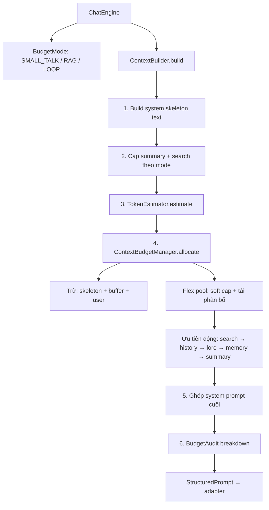

# Kế hoạch sửa chữa / nâng cấp / tối ưu Budget & Prompt

**Dự án:** kuchiba_chisa  
**Ngày lập:** 2026-07-07  
**Dựa trên:** [`BAO_CAO_KIEN_TRUC_BUDGET_PROMPT.md`](./BAO_CAO_KIEN_TRUC_BUDGET_PROMPT.md)  
**Mục tiêu:** Biến `total_budget` từ soft allocator thành **hard cap có flex buffer** cho prompt gửi LLM — vừa kiểm soát chi phí, vừa **bung linh động** theo từng case (intent, section trống, search vs lore).

> **Cập nhật 2026-07-07:** Bổ sung mô hình **Flex Budget** — soft cap `(min/target/max)`, tái phân bổ pool, ceiling +8%, skeleton headroom +5%.

---

## 1. Mục tiêu & phạm vi

### 1.1. Mục tiêu (Goals)

| # | Mục tiêu | KPI đo được |
|---|----------|-------------|
| G1 | Tổng input token ≤ `total_budget` + **flex buffer** (mặc định 8%) | Unit test + log pipeline |
| G2 | System skeleton được trừ trước với **headroom ~5%** (không chỉ đo khít) | Code review + breakdown log |
| G3 | Summary/search/lore/memory dùng **soft cap + tái phân bổ**, không khóa cứng từng ô | Config + test |
| G4 | Một nguồn ước lượng token duy nhất | `TokenEstimator` dùng chung |
| G5 | Pipeline tracker log breakdown đầy đủ | Visualizer hiển thị được |
| G6 | Không regression chất lượng chat (smoke test 10 scenario) | Manual / scratch script |

### 1.2. Ngoài phạm vi (Non-goals) — giai đoạn này

- Rút gọn `PERSONA_TEXT` (có thể làm Phase 4 tùy chọn)
- Tích hợp tiktoken theo từng model provider (Phase 3 optional)
- Thay đổi kiến trúc RAG retrieval
- Celery / auto-summarize pipeline

---

## 2. Kiến trúc mục tiêu



### 2.1. Công thức budget — lớp cứng + lớp linh động

Thay vì cap cứng từng phần, dùng **2 lớp**:

| Lớp | Ý nghĩa | Hành vi |
|-----|---------|---------|
| **Hard floor** | Phần bắt buộc phải giữ | Skeleton + user message — không cắt |
| **Soft pool** | Phần còn lại sau floor | Chia theo *target* + *priority*, được **vay/mượn** lẫn nhau |
| **Flex ceiling** | Trần mềm toàn prompt | `total_budget × (1 + FLEX_RATIO)` — chỉ hard-trim khi vượt |

```
effective_ceiling = total_budget × (1 + FLEX_RATIO)     # FLEX_RATIO mặc định 0.08 (8%)
user_reserve      = estimate(user_message) + 20
skeleton_measured = persona + state + output_format
skeleton_reserve  = skeleton_measured × (1 + SKELETON_HEADROOM)   # HEADROOM mặc định 0.05

hard_floor = skeleton_reserve + user_reserve
flex_pool  = total_budget - hard_floor               # có thể âm nhẹ → kích hoạt flex ceiling

# Mỗi section có (min, target, max) — không phải một số cố định
sections = [search, history, lore, memory, summary]   # thứ tự ưu tiên có thể đảo theo intent

for section in sections_by_priority:
    need = estimate(section.content)
    grant = clamp(need, min=section.min, max=section.max)
    grant = min(grant, flex_pool_remaining)
    flex_pool_remaining -= grant
    if need > grant and flex_pool_remaining == 0:
        mark_trimmed(section)

# Nếu section trống → donate target về flex_pool (tái phân bổ)
if not lore_chunks:  flex_pool += lore.target
if not memories:     flex_pool += memory.target
if not tool_result:  flex_pool += search.target

# Hard trim cuối: chỉ khi tổng > effective_ceiling
while total_used > effective_ceiling:
    trim_lowest_priority_section()   # summary → lore → memory → history cũ → search
```

**Invariant mềm:** `total_used ≤ effective_ceiling`  
**Invariant cứng:** `skeleton + user` không bị cắt; history luôn giữ ≥ `HISTORY_MIN_TURNS` tin mới nhất (mặc định 4 turn).

### 2.2. Soft cap theo mode (min / target / max)

Giá trị **target** là mặc định; section có thể nhận tới **max** nếu flex pool còn dư, hoặc chỉ **min** khi pool thiếu.

#### Mode SMALL_TALK (total 5 000, ceiling 5 400)

| Section | min | target | max | Ghi chú |
|---------|-----|--------|-----|---------|
| skeleton | đo thực | — | — | +5% headroom |
| summary | 0 | 300 | **600** | Bung gấp đôi target khi pool rộng |
| search | 0 | 0 | 0 | — |
| lore / memory | 0 | 0 | 0 | — |
| history | 800 | **3 200** | **4 200** | Ưu tiên cao nhất |

#### Mode RAG (total 8 000, ceiling 8 640)

| Section | min | target | max | Ghi chú |
|---------|-----|--------|-----|---------|
| summary | 0 | 500 | **900** | |
| search | 0 | 800 | **1 600** | Chỉ khi có tool_result |
| lore | 0 | 1 000 | **1 600** | Trống → donate ~1 000 vào pool |
| memory | 0 | 600 | **1 000** | Trống → donate ~600 vào pool |
| history | 600 | **2 400** | **4 000** | Hưởng phần donate |

#### Mode LOOP (total 12 000, ceiling 12 960)

| Section | min | target | max | Ghi chú |
|---------|-----|--------|-----|---------|
| summary | 0 | 600 | **1 000** | |
| search | 400 | **1 800** | **3 200** | Ưu tiên cao — factual / web |
| lore | 0 | 800 | **1 500** | Giảm target vs cũ, nhường search |
| memory | 0 | 600 | **1 000** | |
| history | 800 | **3 500** | **6 000** | Hưởng pool lớn nhất |

### 2.3. Tái phân bổ theo intent (linh động case)

`intent_name` điều chỉnh **priority order** và **weight**, không đổi `total_budget`:

| Intent / case | Ưu tiên tăng | Ưu tiên giảm |
|---------------|--------------|--------------|
| `OTHER` + có search | search, history | lore |
| `CHARACTER_LORE` / `WORLD_LORE` | lore, memory | search |
| `MEMORY` | memory, history | lore |
| Small talk | history, summary | lore, search, memory |
| Loop thinking active | search, history | lore |

```python
PRIORITY_WEIGHTS = {
    "default":       {"search": 1.2, "history": 1.0, "lore": 0.9, "memory": 0.8, "summary": 0.6},
    "factual_other": {"search": 1.8, "history": 1.1, "lore": 0.4, "memory": 0.7, "summary": 0.5},
    "lore_query":    {"lore": 1.6, "memory": 1.0, "history": 0.9, "search": 0.5, "summary": 0.5},
}
# grant(section) = min(need, max) × weight_normalized, rồi clamp vào flex_pool
```

### 2.4. Config linh động (`.env`)

```python
PROMPT_FLEX_RATIO: float = 0.08          # +8% trần mềm toàn prompt
PROMPT_SKELETON_HEADROOM: float = 0.05   # +5% skeleton reserve
PROMPT_HISTORY_MIN_TURNS: int = 4        # Luôn giữ ít nhất 4 turn mới nhất
PROMPT_REALLOCATE_EMPTY: bool = True     # Section trống → trả target về pool
```

**Ví dụ case linh động:**

1. **Hỏi Thiên An Môn (OTHER + loop):** lore=0 → donate ~800 tok → search max 3 200 + history rộng.
2. **Hỏi lore Chisa, không search:** search target=0 → donate ~1 800 → lore max 1 500 + history 4 000+.
3. **Small talk 25 turn, summary dài:** summary nhận tới 600; history vẫn giữ min 4 turn; cắt tin cũ trước.
4. **Skeleton persona tăng sau edit prompt:** headroom 5% hấp thụ, không đạp history ngay.

### 2.5. So sánh mô hình cũ vs mới

| | Kế hoạch cứng (trước) | Kế hoạch flex (nay) |
|--|----------------------|---------------------|
| Cap section | Một số max cố định | min / target / max |
| Section trống | Pool lãng phí | Donate về flex pool |
| Vượt budget | Cắt ngay @ 8000 | Cho phép tới +8% rồi mới hard-trim |
| Skeleton | Đo khít | Đo thực + 5% headroom |
| Intent | Optional | Priority weights theo case |

---

## 3. Phân chia giai đoạn

| Phase | Tên | Effort | Rủi ro | Phụ thuộc |
|-------|-----|--------|--------|-----------|
| **P1** | TokenEstimator + refactor budget core | 1–2 ngày | Trung bình | — |
| **P2** | ContextBuilder reorder + caps | 1 ngày | Thấp | P1 |
| **P3** | Observability + config settings | 0.5 ngày | Thấp | P1 |
| **P4** | Trim thông minh + history fetch | 1 ngày | Thấp | P1, P2 |
| **P5** | Test + docs + smoke | 0.5–1 ngày | Thấp | P1–P4 |
| **P6** *(optional)* | Persona slim + tiktoken | 1–2 ngày | Cao (ảnh hưởng tone) | P5 |

**Tổng ước lượng:** 4–6 ngày dev (không tính P6).

---

## 4. Chi tiết từng phase

### Phase 1 — TokenEstimator & Budget Core (P0)

**Mục tiêu:** Một module đo token, refactor `ContextBudgetManager` thành allocator thật.

#### 4.1.1. Tạo `app/shared/utils/token_estimator.py`

```python
class TokenEstimator:
    CHARS_PER_TOKEN_VI = 2  # tiếng Việt + JSON, conservative

    @classmethod
    def estimate(cls, text: str) -> int: ...

    @classmethod
    def trim_to_budget(cls, text: str, max_tokens: int, suffix: str = "...") -> str: ...
```

- Dùng `2 ký tự/token` (conservative, đã validate trong báo cáo)
- `trim_to_budget()` cắt theo ký tự an toàn, thêm suffix rõ ràng
- **Không** gọi async LLM adapter — sync, deterministic

#### 4.1.2. Refactor `ContextBudgetManager`

**File:** `app/domain/services/context_budget_manager.py`

Thay `enforce_budget()` bằng API mới:

```python
@dataclass
class BudgetAllocation:
    trimmed_lore: list[str]
    trimmed_memories: list
    trimmed_history: list[dict]
    trimmed_summary: str | None
    trimmed_search: str
    audit: BudgetAudit

@dataclass
class BudgetAudit:
    mode: str
    total_budget: int
    used: dict[str, int]   # persona, state, format, summary, search, lore, memory, history, user
    remaining: int
    trimmed_sections: list[str]  # ["history", "search", ...]

class ContextBudgetManager:
    # Soft cap: (min, target, max) per section — không phải một số cứng
    MODE_PROFILES = {
        "small_talk": {
            "total": 5000,
            "sections": {
                "summary": (0, 300, 600),
                "search":  (0, 0, 0),
                "lore":    (0, 0, 0),
                "memory":  (0, 0, 0),
                "history": (800, 3200, 4200),
            },
        },
        "rag": {
            "total": 8000,
            "sections": {
                "summary": (0, 500, 900),
                "search":  (0, 800, 1600),
                "lore":    (0, 1000, 1600),
                "memory":  (0, 600, 1000),
                "history": (600, 2400, 4000),
            },
        },
        "loop": {
            "total": 12000,
            "sections": {
                "summary": (0, 600, 1000),
                "search":  (400, 1800, 3200),
                "lore":    (0, 800, 1500),
                "memory":  (0, 600, 1000),
                "history": (800, 3500, 6000),
            },
        },
    }

    @classmethod
    def allocate(
        cls,
        *,
        mode: str,
        system_fixed_tokens: int,
        intent_name: str = "",
        reallocate_empty: bool = True,
        ...
    ) -> BudgetAllocation:
        """
        1. Reserve skeleton × (1 + HEADROOM) + user
        2. Build flex_pool; donate target of empty sections
        3. Grant by priority weights (intent-aware)
        4. Hard-trim only if total > total × (1 + FLEX_RATIO)
        """
```

**Thay đổi hành vi:**

- Xóa `system_reserve = 800` cố định
- Nhận `system_fixed_tokens` đo thực + **headroom 5%**
- Section dùng **(min, target, max)** — grant theo priority, không khóa cứng từng ô
- Section trống → **donate target** về flex pool (`PROMPT_REALLOCATE_EMPTY`)
- Hard-trim chỉ khi vượt `effective_ceiling = total × 1.08`

#### 4.1.3. Thêm enum mode budget

**File:** `app/domain/services/context_budget_manager.py` hoặc `app/domain/models/budget_mode.py`

```python
class BudgetMode(str, Enum):
    SMALL_TALK = "small_talk"
    RAG = "rag"
    LOOP = "loop"
```

**File:** `app/domain/services/chat_engine.py`

```python
def _resolve_budget_mode(is_st: bool, thinking_steps: list) -> BudgetMode: ...
```

Thay magic numbers 5000/8000/12000 bằng `BudgetMode.RAG.total`.

#### Acceptance criteria P1

- [ ] `TokenEstimator.estimate("PERSONA_TEXT")` ≈ 1446 ± 50
- [ ] `allocate(mode="rag", ...)` → tổng used ≤ 8640 (8000 × 1.08)
- [ ] Lore trống → history/search nhận thêm token (reallocate test)
- [ ] Unit test 3 mode pass (migrate từ `scratch/test_budget_enforcement.py`)

---

### Phase 2 — ContextBuilder Reorder (P0)

**Mục tiêu:** Đo system trước, cắt sau, ghép cuối.

#### 4.2.1. Tách helper build sections

**File:** `app/domain/services/context_builder.py`

```python
def _build_system_skeleton(self, emotion, attachment_bonus) -> str: ...
def _build_format_section(self) -> str: ...
def _build_summary_section(self, summary: str | None) -> str: ...
def _build_search_section(self, tool_result: str) -> tuple[str, str]: ...  # (body, instructions)
def _build_lore_section(self, chunks: list[str]) -> str: ...
def _build_memories_section(self, memories: list) -> str: ...
```

#### 4.2.2. Luồng `build()` mới

```
1. Format history (assistant → JSON)          # giữ nguyên
2. Build skeleton text (persona+state+format)
3. estimate skeleton_tokens
4. ContextBudgetManager.allocate(
       mode=...,
       system_fixed_tokens=skeleton_tokens,
       intent_name=intent_name,              # điều chỉnh priority weights
       conversation_summary=...,
       tool_result=...,
       lore=..., memories=..., history=...,
       user_message=...,
   )
5. Ghép system từ allocation đã trim
6. Return StructuredPrompt + attach audit
```

#### 4.2.3. Soft cap search / summary (không còn một số cứng duy nhất)

Áp dụng `(min, target, max)` từ §2.2 — `ContextBuilder` truyền nội dung thô, `allocate()` quyết định grant.

| Mode | Search (min/target/max) | Summary (min/target/max) |
|------|-------------------------|--------------------------|
| small_talk | 0 / 0 / 0 | 0 / 300 / 600 |
| rag | 0 / 800 / **1 600** | 0 / 500 / **900** |
| loop | 400 / 1 800 / **3 200** | 0 / 600 / **1 000** |

Instructions `[SEARCH DATA]` (~300 token) tính vào `search` grant, không nằm ngoài budget.

#### 4.2.4. Intent-aware priority (bắt buộc trong P2)

```python
def _resolve_priority_profile(intent_name: str, has_search: bool) -> str:
    if has_search and "OTHER" in intent_name:
        return "factual_other"
    if any(x in intent_name for x in ("LORE", "STORY", "CHARACTER", "WORLD")):
        return "lore_query"
    return "default"
```

Không còn hack `caps["lore"] // 2` — dùng weight map §2.3.

#### 4.2.5. History floor

Luôn giữ ≥ `PROMPT_HISTORY_MIN_TURNS` (4) turn mới nhất **trước** khi hard-trim; chỉ cắt tin cũ hơn khi vượt flex ceiling.

#### Acceptance criteria P2

- [ ] `build()` không gọi `enforce_budget()` cũ
- [ ] Summary 5000 ký tự → grant tới max mode (900 rag / 1000 loop), không cắt về 600 cứng
- [ ] OTHER + search: search grant > lore grant khi cùng flex pool
- [ ] Lore trống → history nhận thêm so với case có lore
- [ ] End-to-end: total ≤ effective_ceiling (budget × 1.08)

---

### Phase 3 — Config & Observability (P1)

#### 4.3.1. Settings tập trung

**File:** `app/config/settings.py`

```python
PROMPT_BUDGET_SMALL_TALK: int = 5000
PROMPT_BUDGET_RAG: int = 8000
PROMPT_BUDGET_LOOP: int = 12000
PROMPT_CHARS_PER_TOKEN: int = 2
PROMPT_FLEX_RATIO: float = 0.08           # trần mềm +8%
PROMPT_SKELETON_HEADROOM: float = 0.05    # skeleton +5%
PROMPT_HISTORY_MIN_TURNS: int = 4
PROMPT_REALLOCATE_EMPTY: bool = True
```

`ContextBudgetManager.MODE_PROFILES` đọc `total` từ settings; min/target/max có thể override qua env JSON nếu cần tune production.

#### 4.3.2. Pipeline tracker breakdown

**File:** `app/domain/services/chat_engine.py`

Thay metric cũ:

```python
pipeline_tracker.add_step("context_building", {
    "system_prompt": prompt.system,
    "history_count": len(prompt.history),
    "budget_audit": allocation.audit.__dict__,
    "total_estimated_tokens": audit.sum(),
    "effective_ceiling": audit.total_budget * (1 + settings.PROMPT_FLEX_RATIO),
    "flex_pool_initial": audit.flex_pool_initial,
    "reallocated_from": audit.reallocated_from,   # e.g. ["lore", "search"]
    "budget_mode": mode.value,
    "within_budget": audit.total_used <= audit.effective_ceiling,
})
```

#### 4.3.3. Visualizer (optional P3)

**File:** `app/interface/api/templates/visualizer_dashboard.html`

Thêm card hiển thị breakdown token khi click step `context_building`:
- Persona / Lore / Memory / History / Search / Summary / User
- Bar chart % budget used

#### Acceptance criteria P3

- [ ] Visualizer hoặc log JSON có `budget_audit.used`
- [ ] `within_budget: true` trên 3 mode test

---

### Phase 4 — Trim thông minh & History fetch (P2)

#### 4.4.1. Lore/memory: score-aware trim

**File:** `context_budget_manager.py`

Thay first-fit bằng:

```python
# Input: chunks với score (nếu có) hoặc index = proxy score
# Greedy: sort by score desc, pack until cap
```

**File:** `rag/pipeline.py` / `chat_engine.py`

Truyền lore chunks kèm score nếu retriever có (hoặc giữ thứ tự Qdrant rank — đã sort).

#### 4.4.2. History fetch scale theo mode

**File:** `conversation_repository.py`

```python
async def get_recent_history(..., limit: int = 15)
```

**File:** `chat_engine.py`

```python
history_limit = {"small_talk": 15, "rag": 25, "loop": 40}[mode]
history = await conv_repo.get_recent_history(..., limit=history_limit)
```

Budget manager vẫn cắt token; fetch limit chỉ tránh lấy quá ít từ DB.

#### 4.4.3. Assistant JSON inflate — tối ưu nhẹ

Option A (khuyến nghị): Chỉ inflate assistant khi **đo budget**, gửi LLM giữ plain text nếu adapter cho phép.  
Option B (an toàn hơn): Inflate như hiện tại, tăng `user_reserve` +20 token/message trong estimate.

**Quyết định:** Giữ Option B trong P4 để tránh thay đổi LLM behavior; revisit sau.

#### Acceptance criteria P4

- [ ] Lore cap 1200 tok: chunk score cao được giữ trước chunk dài score thấp
- [ ] Mode loop fetch ≤ 40 messages từ DB

---

### Phase 5 — Test & Documentation (bắt buộc)

#### 4.5.1. Unit tests mới

**File:** `tests/unit/test_context_budget_manager.py`

| Test case | Mô tả |
|-----------|--------|
| `test_small_talk_within_budget` | Không lore/mem, history fit |
| `test_rag_persona_exceeds_old_reserve` | skeleton ~1815 + headroom, vẫn ≤ ceiling 8640 |
| `test_empty_lore_reallocates_to_history` | lore=[] → history grant tăng |
| `test_factual_other_prioritizes_search` | OTHER+search → search > lore |
| `test_loop_search_can_exceed_target` | search grant tới 3200 khi pool rộng |
| `test_flex_ceiling_hard_trim` | input cực đại → trim theo priority, giữ 4 turn |
| `test_invariant_sum` | sum(used) ≤ total × 1.08 |

**File:** `tests/unit/test_context_builder_budget.py`

- Integration `ContextBuilder.build()` với mock emotion, fake lore/history
- Assert `BudgetAudit.within_budget`

Migrate logic từ `scratch/test_budget_enforcement.py` → pytest formal.

#### 4.5.2. Smoke scenarios (manual hoặc scratch)

| # | Scenario | Mode | Kiểm tra |
|---|----------|------|----------|
| 1 | "hi" | small_talk | Phản hồi bình thường |
| 2 | Hỏi lore Chisa | rag | Có [LORE], ≤ 8k |
| 3 | Thiên An Môn 1989 | loop | Có search, ≤ 12k |
| 4 | Chat 25 turn + summary dài | rag | Summary bị cap |
| 5 | Code block dài trong history | rag | History trim, tin mới giữ |

#### 4.5.3. Cập nhật docs

- [`WALKTHROUGH.md`](./WALKTHROUGH.md) — section Dynamic Context Budgeting
- [`BAO_CAO_KIEN_TRUC_BUDGET_PROMPT.md`](./BAO_CAO_KIEN_TRUC_BUDGET_PROMPT.md) — thêm mục "Trạng thái sau sửa"
- [`PHAN_TICH_WORKSPACE_CHI_TIET.md`](./PHAN_TICH_WORKSPACE_CHI_TIET.md) — cập nhật mô tả budget (nếu cần)

#### Acceptance criteria P5

- [ ] `pytest tests/unit/test_context_budget_manager.py tests/unit/test_context_builder_budget.py -v` pass
- [ ] 5 smoke scenario pass
- [ ] Docs cập nhật

---

### Phase 6 — Tối ưu optional (P3 future)

#### 6.1. Rút gọn PERSONA (~1446 → ~900 token)

- Tách rule ít dùng sang `PERSONA_EXTENDED` chỉ inject khi intent phù hợp
- **Rủi ro:** Đổi tone / compliance — cần A/B với user

#### 6.2. Tiktoken / model-specific estimator

```python
async def estimate_tokens(text, provider, model) -> int
```

Fallback `chars//2` khi offline.

#### 6.3. Pre-compute `system_fixed_tokens` cache

`persona + format` static → cache at startup, chỉ cộng state động (~30 tok).

---

## 5. Thứ tự triển khai đề xuất (sprint)

### Sprint 1 (2–3 ngày) — Core fix

| Ngày | Task |
|------|------|
| D1 AM | P1: `TokenEstimator` + `BudgetMode` + `BudgetAudit` |
| D1 PM | P1: Refactor `ContextBudgetManager.allocate()` + unit tests |
| D2 AM | P2: Refactor `ContextBuilder.build()` luồng mới |
| D2 PM | P2: Cap summary/search + integration test |
| D3 AM | P3: Settings + pipeline breakdown log |
| D3 PM | P5: pytest + smoke + fix regression |

### Sprint 2 (1–2 ngày) — Polish

| Ngày | Task |
|------|------|
| D4 | P4: Score-aware trim + history limit |
| D5 | P3: Visualizer budget card (optional) |
| D5 | Docs + review |

---

## 6. Rủi ro & giảm thiểu

| Rủi ro | Xác suất | Impact | Giảm thiểu |
|--------|----------|--------|-------------|
| Cắt quá mạnh → mất context chat | Trung bình | Cao | Flex pool + reallocate; history min 4 turn; ceiling +8% |
| Estimate 2c/t vẫn lệch model thật | Trung bình | Trung bình | FLEX_RATIO 8% + skeleton headroom 5%; log estimate vs actual |
| Loop mode thiếu search sau cap | Thấp | Cao | Search max 3200 + priority weight factual_other |
| Pool lãng phí khi thiếu lore | Trung bình | Trung bình | `PROMPT_REALLOCATE_EMPTY=true` |
| Regression persona/tone | Thấp | Trung bình | Không sửa PERSONA trong P1–P5 |
| Breaking API Visualizer | Thấp | Thấp | Giữ field `system_prompt` backward compatible |

### Rollback plan

- Feature flag `USE_LEGACY_BUDGET=true` trong settings → gọi `enforce_budget()` cũ
- Giữ hàm cũ `@deprecated` 1 sprint trước khi xóa

---

## 7. Checklist file thay đổi

| File | Hành động | Phase |
|------|-----------|-------|
| `app/shared/utils/token_estimator.py` | **Tạo mới** | P1 |
| `app/domain/services/context_budget_manager.py` | **Refactor lớn** | P1 |
| `app/domain/services/context_builder.py` | **Refactor lớn** | P2 |
| `app/domain/services/chat_engine.py` | Sửa mode + log audit | P1, P3 |
| `app/config/settings.py` | Thêm budget settings | P3 |
| `app/infrastructure/database/repositories/conversation_repository.py` | Param limit | P4 |
| `app/interface/api/templates/visualizer_dashboard.html` | Budget breakdown UI | P3 |
| `tests/unit/test_context_budget_manager.py` | **Tạo mới** | P5 |
| `tests/unit/test_context_builder_budget.py` | **Tạo mới** | P5 |
| `scratch/test_budget_enforcement.py` | Migrate → pytest | P5 |
| `WALKTHROUGH.md` | Cập nhật | P5 |

---

## 8. Định nghĩa hoàn thành (Definition of Done)

- [ ] Mọi request production có `budget_audit` + `effective_ceiling` trong pipeline trace
- [ ] `within_budget == true` (≤ ceiling × 1.08) trên unit test cả 3 mode
- [ ] Reallocate empty section hoạt động (test lore trống)
- [ ] Intent OTHER + search ưu tiên search over lore
- [ ] Không còn `system_reserve = 800` hardcode
- [ ] Pytest budget ≥ 8 test cases pass
- [ ] Smoke 5 scenario pass
- [ ] WALKTHROUGH cập nhật sơ đồ budget mới
- [ ] (Optional) Visualizer hiển thị token breakdown

---

## 9. Sau triển khai — metric theo dõi

Theo dõi 1 tuần trên production/dev:

| Metric | Nguồn | Mục tiêu |
|--------|-------|----------|
| `estimated_tokens / prompt_tokens` (API) | LLM response usage | Ratio 0.85–1.15 |
| `within_budget` rate | pipeline_tracker | ≥ 99% (so với ceiling, không phải nominal) |
| `reallocated_from` frequency | audit log | Theo dõi — kỳ vọng >40% request RAG có donate |
| Avg input tokens theo mode | log aggregate | Giảm 10–20% vs trước (linh hoạt hơn cứng nên không ép cắt sớm) |
| History trim rate | `trimmed_sections` | < 30% request (tuỳ usage) |
| User complaint "quên context" | manual | Không tăng |

---

*Kế hoạch này là tài liệu triển khai đi kèm báo cáo audit. Bắt đầu từ Phase 1 (P0) trước khi touch Visualizer hoặc persona.*
