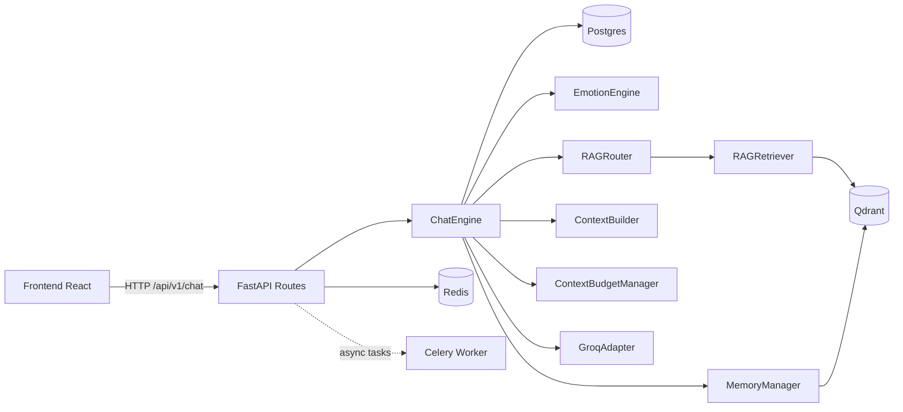
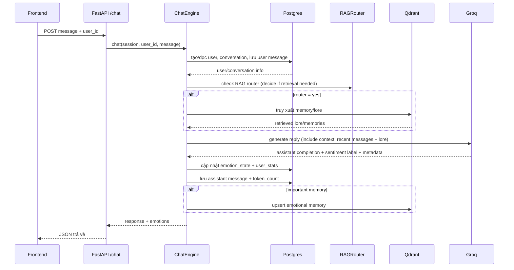

# Phân tích toàn bộ workspace `kuchiba_chisa`

Tài liệu này tổng hợp đầy đủ mã nguồn hiện tại như một buổi handover kỹ thuật ở mức senior engineer.

Ghi chú này được đối chiếu trực tiếp với code và cấu hình hiện có trong workspace, đặc biệt là `app/main.py`, `app/config/settings.py`, `app/interface/api/routes/chat.py`, `docker-compose.yml`, `.env.example`, `frontend/package.json` và các migration hiện hành.

---

## 1) Dự án làm gì?

Đây là hệ thống chatbot nhân vật Chisa, tập trung vào:

- Trò chuyện nhiều lượt theo ngữ cảnh.
- Ghi nhớ ngắn hạn (STM) bằng Postgres.
- Ghi nhớ dài hạn (LTM) bằng vector database Qdrant.
- Duy trì trạng thái cảm xúc theo từng người dùng (joy, sadness, trust, irritation, attachment).
- Kết hợp RAG để truy xuất lore và ký ức cá nhân khi cần.

Frontend React đóng vai trò giao diện chat; backend FastAPI xử lý toàn bộ nghiệp vụ, kết nối LLM Groq, embedding FastEmbed, Postgres, Redis, Qdrant.

---

## 2) Kiến trúc hệ thống

Kiến trúc theo hướng phân lớp rõ ràng:

- `domain`: nghiệp vụ cốt lõi (chat orchestration, emotion, memory, rag, context).
- `infrastructure`: adapter công nghệ (DB, Redis, Qdrant, Groq, Celery, logging, embeddings).
- `interface`: API layer (routes + schemas).
- `scripts`: tiện ích vận hành/test thủ công.
- `frontend`: UI người dùng.

### Hiện trạng runtime đang có trong code

- Backend API là FastAPI, khởi động qua `app.main:app`.
- Startup lifecycle kiểm tra Postgres, Redis và Qdrant, sau đó khởi tạo collection Qdrant theo kiểu idempotent.
- API hiện include 2 nhóm route chính: `health` và `chat`.
- `chat` đang cung cấp các endpoint cho chat, lịch sử chat, cảm xúc hiện tại và xóa memory theo `user_id`.
- `docker-compose.yml` hiện dựng đủ `postgres`, `redis`, `qdrant`, `app` và `celery_worker`.

### Sơ đồ mức cao

---

## 3) Cấu trúc thư mục (đầy đủ file)

## Root

- `.gitignore`: quy tắc ignore cho git.
- `.env.example`: mẫu biến môi trường.
- `README.md`: mô tả tổng quan dự án.
- `WALKTHROUGH.md`: giải thích chi tiết flow và thành phần.
- `STARTUP_GUIDE.md`: hướng dẫn chạy local + monitor.
- `Makefile`: lệnh tiện dụng cho dev/test/lint/migrate.
- `pyproject.toml`: cấu hình ruff, mypy, pytest, coverage.
- `requirements-dev.txt`: dependency phục vụ phát triển.
- `Dockerfile`: build backend container.
- `docker-compose.yml`: dựng toàn bộ stack local (postgres/redis/qdrant/app/worker).
- `alembic.ini`: cấu hình Alembic.
- `start.ps1`: script startup trên Windows.
- `LICENSE`: giấy phép MIT.
- `debug_rag.txt`: file debug kết quả RAG.

## `assets/`

- `assets/chisa_lore.md`: lore gốc để ingest sang Qdrant.

## `app/`

### App entry + config

- `app/main.py`: khởi tạo FastAPI app, lifespan, CORS, include router.
- `app/config/settings.py`: đọc/validate biến môi trường bằng Pydantic Settings.

### API routes hiện có

- `app/interface/api/routes/health.py`: health/readiness cho Postgres, Redis, Qdrant.
- `app/interface/api/routes/chat.py`: `POST /api/v1/chat`, `GET /api/v1/chat/emotions/{user_id}`, `GET /api/v1/chat/history/{user_id}`, `DELETE /api/v1/chat/clear/{user_id}`.

### Domain interfaces

- `app/domain/interfaces/embedding_provider.py`: interface/protocol cho embedding provider.

### Domain services (xương sống nghiệp vụ)

- `app/domain/services/chat_engine.py`: bộ điều phối toàn bộ luồng chat.
- `app/domain/services/context_builder.py`: xây dựng prompt có cấu trúc từ hệ thống + lore + memory + history.
- `app/domain/services/context_budget_manager.py`: quản lý ngân sách token, cắt bớt context.
- `app/domain/services/emotion_engine.py`: cập nhật trạng thái cảm xúc theo rule.
- `app/domain/services/memory_manager.py`: tính importance và lưu memory vào vector DB.
- `app/domain/services/memory_summarizer.py`: tóm tắt hội thoại cho memory nền.
- `app/domain/services/rag_retriever.py`: truy xuất memory/lore với scoring kết hợp.
- `app/domain/services/rag_router.py`: quyết định có truy xuất RAG hay không.

### Interface API

- `app/interface/api/routes/chat.py`: endpoint chat, history, emotions, clear memory.
- `app/interface/api/routes/health.py`: endpoint health/readiness.
- `app/interface/api/schemas/chat.py`: schema request/response cho API chat.

### Infrastructure database

- `app/infrastructure/database/engine.py`: async engine + session maker + health checks.
- `app/infrastructure/database/models/base.py`: declarative base + mixin.
- `app/infrastructure/database/models/__init__.py`: export model cho Alembic.
- `app/infrastructure/database/models/user.py`: bảng người dùng.
- `app/infrastructure/database/models/conversation.py`: bảng hội thoại.
- `app/infrastructure/database/models/message.py`: bảng tin nhắn.
- `app/infrastructure/database/models/emotion_state.py`: bảng trạng thái cảm xúc.
- `app/infrastructure/database/models/user_stats.py`: bảng thống kê user.
- `app/infrastructure/database/models/memory_metadata.py`: metadata cho memory.

### Infrastructure khác

- `app/infrastructure/cache/redis/redis_service.py`: wrapper Redis service.
- `app/infrastructure/embeddings/fastembed_adapter.py`: adapter embed query/text.
- `app/infrastructure/llm/adapters/base.py`: abstraction cho LLM adapter.
- `app/infrastructure/llm/adapters/groq.py`: adapter gọi Groq API + parse response.
- `app/infrastructure/vector/qdrant/qdrant_service.py`: thao tác collection/search/filter Qdrant.
- `app/infrastructure/logging/logger.py`: chuẩn hóa logging.
- `app/infrastructure/queue/celery_app.py`: cấu hình Celery app.
- `app/infrastructure/queue/worker.py`: entrypoint worker.
- `app/infrastructure/queue/tasks/affection_tasks.py`: task nền cho affection (stub/chưa hoàn chỉnh).
- `app/infrastructure/queue/tasks/embedding_tasks.py`: task nền embedding (stub/chưa hoàn chỉnh).
- `app/infrastructure/queue/tasks/memory_tasks.py`: task nền memory (stub/chưa hoàn chỉnh).

### Frontend hiện có

- `frontend/src/main.jsx`: bootstrap React app.
- `frontend/src/App.jsx`: UI chat chính.
- `frontend/src/index.css`: style chính.
- `frontend/package.json`: scripts `dev`, `build`, `lint`, `preview` với React 19 + Vite.

## `alembic_migrations/`

- `alembic_migrations/env.py`: bootstrap Alembic cho online/offline migration.
- `alembic_migrations/script.py.mako`: template tạo revision.
- `alembic_migrations/versions/f4eea57ac3c7_phase_3a_initial_schema.py`: migration schema ban đầu.
- `alembic_migrations/versions/fb20eea4d022_create_true_uuid_userstats_and_.py`: migration bổ sung `emotion_state` và `user_stats`.

## `scripts/`

- `scripts/init_db.py`: tạo bảng trực tiếp qua SQLAlchemy metadata.
- `scripts/run_alembic.py`: script chạy alembic command.
- `scripts/init_qdrant.py`: khởi tạo collection vector DB.
- `scripts/ingest_chisa_lore.py`: chunk + embed + upsert lore.
- `scripts/wipe_qdrant.py`: xóa dữ liệu memory trong Qdrant.
- `scripts/interactive_chat.py`: chạy chat kiểu CLI.
- `scripts/clear_temp_user_memory.py`: dọn memory user tạm.
- `scripts/watch_emotions.py`: theo dõi realtime emotion state.
- `scripts/watch_tokens.py`: theo dõi token usage trong DB.
- `scripts/test_api.py`: smoke test endpoint chat.
- `scripts/test_chat_api.py`: kiểm tra nhiều user và cách ly dữ liệu.
- `scripts/test_embeddings_integration.py`: kiểm tra pipeline embedding + vector search.
- `scripts/test_emotion_intensity.py`: test logic intensity/damping cảm xúc.
- `scripts/test_lore_recall.py`: test chất lượng truy xuất lore.
- `scripts/test_py311_compatibility.py`: test tương thích async Python 3.11.
- `scripts/test_query.py`: script test query (có dấu hiệu lệch so với API/service hiện tại).
- `scripts/test_rag.py`: test truy xuất RAG và dump kết quả.
- `scripts/test_sentiment.py`: test classify sentiment kết hợp history.

## `tests/`

- `tests/conftest.py`: fixture pytest + test client.
- `tests/test_health.py`: test endpoint health/readiness.

## `frontend/`

- `frontend/.gitignore`: ignore frontend artifacts.
- `frontend/README.md`: README mặc định Vite.
- `frontend/package.json`: scripts + dependency frontend.
- `frontend/package-lock.json`: lock dependency tree.
- `frontend/index.html`: entry html.
- `frontend/eslint.config.js`: cấu hình eslint.
- `frontend/vite.config.js`: cấu hình vite dev server/build.
- `frontend/src/main.jsx`: bootstrap React app.
- `frontend/src/App.jsx`: màn hình chat chính và gọi API.
- `frontend/src/index.css`: style chính.
- `frontend/src/App.css`: css mẫu từ Vite.

---

## 4) Luồng chạy chính

### Luồng runtime chat

### Luồng khởi tạo dữ liệu

- Chạy migration DB bằng Alembic.
- Khởi tạo Qdrant collections.
- Ingest lore từ `assets/chisa_lore.md`.
- Khởi chạy backend + worker + frontend.

---

## 5) Module và class quan trọng

- `ChatEngine`: trung tâm điều phối toàn pipeline chat.
- `EmotionEngine`: cập nhật vector cảm xúc theo tín hiệu sentiment.
- `RAGRouter`: quyết định điều kiện kích hoạt retrieval (tránh truy xuất thừa).
- `RAGRetriever`: lấy memory/lore bằng truy vấn vector và scoring lai (ngữ nghĩa + importance + recency + emotion).
- `ContextBuilder`: hợp nhất persona, memory, lore, history thành prompt rõ ngữ cảnh.
- `ContextBudgetManager`: giữ prompt trong giới hạn token an toàn.
- `MemoryManager`: đánh giá độ quan trọng và lưu ký ức dài hạn.
- `QdrantService`: tạo/search/filter payload theo `user_id`.
- `GroqAdapter`: lớp giao tiếp LLM, parse/validate kết quả trả về.

---

## 6) Logic nghiệp vụ cốt lõi

### Quản lý bộ nhớ

- STM nằm trong DB (`messages`) để giữ hội thoại gần.
- LTM nằm trong Qdrant cho retrieval dài hạn.
- Chỉ lưu memory khi thông điệp đạt importance đủ cao.
- Có cơ chế tóm tắt memory để giảm nhiễu context.

### Cảm xúc theo user

- Mỗi user có `emotion_state` riêng.
- Tin nhắn được phân loại thành cờ sentiment.
- `EmotionEngine` áp dụng rule tăng/giảm với damping để tránh dao động cực đoan.
- Emotion hiện tại được đưa vào context để định hình giọng phản hồi.

### RAG chọn lọc

- Không phải mọi message đều gọi retrieval.
- Router cân nhắc intent/ngữ cảnh để quyết định retrieval.
- Nếu cần: lấy lore toàn cục + memory theo user rồi hợp nhất.

### Tính nhất quán persona

- Prompt hệ thống mang persona Chisa.
- ContextBuilder chèn lore + memory đúng trật tự ưu tiên.
- Budget manager cắt phần ít quan trọng trước để giữ mạch chính.

---

## 7) Công nghệ sử dụng

### Backend

- Python 3.11
- FastAPI
- SQLAlchemy Async + Alembic
- Pydantic Settings
- structlog/logging
- Celery
- Có hỗ trợ provider LLM chuyển đổi qua biến môi trường: Groq là mặc định, Gemini cũng đã được code sẵn trong `chat.py` và `settings.py`.

### Dữ liệu và hạ tầng

- PostgreSQL
- Nhóm DB: `DATABASE_URL`.
- Nhóm Redis: `REDIS_URL`, `REDIS_PASSWORD`.
- Nhóm Qdrant: `QDRANT_URL`, `QDRANT_API_KEY`, `QDRANT_EMBEDDING_DIM`.
- Nhóm Groq: `GROQ_API_KEY`, `GROQ_MODEL`, `GROQ_MAX_TOKENS`, `GROQ_TEMPERATURE`, `GROQ_TIMEOUT`.
- Nhóm LLM đa provider: `LLM_PROVIDER`, `GEMINI_API_KEY`, `GEMINI_MODEL`, `GEMINI_MAX_TOKENS`, `GEMINI_TEMPERATURE`, `GEMINI_TIMEOUT`.
- Nhóm embedding: `EMBEDDING_MODEL`, `OPENAI_API_KEY` (để tương thích một số ngữ cảnh).
- Nhóm bảo mật/auth: `JWT_SECRET`, `JWT_ALGORITHM`, `JWT_EXPIRE_MINUTES`, `JWT_REFRESH_EXPIRE_DAYS`.
- Nhóm giới hạn: `RATE_LIMIT_PER_MINUTE`.
- Nhóm worker: `CELERY_BROKER_URL`, `CELERY_RESULT_BACKEND`, `WORKER_CONCURRENCY`.

Nhận xét: cấu hình đã tương đối đầy đủ cho local/dev, nhưng cần khóa chặt profile production. `settings.py` hiện bắt buộc `DATABASE_URL`, `SECRET_KEY` và `JWT_SECRET` phải đủ mạnh; các biến còn lại có default để hỗ trợ chạy local.

---

## 9) Rủi ro bảo mật và điểm yếu

### Mức cao (ưu tiên xử lý ngay)

- API đang tin `user_id` do client gửi, chưa có cơ chế xác thực ownership mạnh.
- Endpoint xóa memory theo `user_id` có thể bị lạm dụng nếu thiếu auth.
- Có secret mẫu/giá trị mặc định trong tài liệu cấu hình, dễ bị dùng nhầm ở môi trường thật.
- `clear_user_memory` đang xóa STM, emotion state, stats và các vector Qdrant theo `user_id`; luồng này đúng chức năng nhưng cần auth chặt khi đưa lên production.

### Mức trung bình

- Validation output LLM còn lỏng, dễ sinh response không đúng schema mong muốn.
- Có nguy cơ race condition khi dùng chung adapter/model nếu mutate trạng thái runtime.
- Một số script test ghi file debug có thể làm lộ dữ liệu hội thoại nếu chạy trên máy chung.

### Mức kỹ thuật vận hành

- Có dấu hiệu lệch giữa script test và code hiện tại (drift), tăng rủi ro khi bảo trì.
- Test chính thức trong `tests/` còn mỏng, chưa bao phủ deep business flow.

---

## 10) Đề xuất cải thiện

### Ưu tiên P0

- Bắt buộc auth (JWT hoặc session), ánh xạ `user_id` từ token thay vì nhận trực tiếp từ client.
- Bảo vệ endpoint xóa dữ liệu: auth + kiểm tra owner + audit log.
- Tách model phân loại cảm xúc khỏi adapter dùng chung để tránh tranh chấp đồng thời.
- Ép chính sách secrets production (không cho chạy với giá trị mặc định/yếu).

### Ưu tiên P1

- Nâng validation response LLM bằng schema strict (Pydantic/JSON schema).
- Chuẩn hóa migration/model/script để tránh drift.
- Đưa rate limiting vào middleware thực thi thật.
- Tăng test tích hợp cho isolation theo user, clear memory, RAG quality.

### Ưu tiên P2

- Tách `VITE_API_URL` cho frontend thay vì hardcode localhost.
- Chuẩn hóa tài liệu vận hành theo code hiện hành.
- Thêm quan sát hệ thống (metrics, tracing) cho latency/token/cost.

---

## Kết luận

Codebase có nền tảng tốt cho một chatbot có trí nhớ + cảm xúc: phân lớp rõ, pipeline hợp lý, và có đầy đủ thành phần AI hiện đại. Điểm cần nâng cấp trọng tâm nằm ở bảo mật định danh người dùng, độ chặt validation đầu ra LLM, và mở rộng test coverage cho các luồng nghiệp vụ quan trọng.

Tóm tắt ngắn của workspace hiện tại:

- Backend: FastAPI + SQLAlchemy Async + Alembic + Celery.
- Storage: PostgreSQL 16, Redis 7, Qdrant.
- AI: Groq là mặc định, Gemini đã có nhánh hỗ trợ.
- Frontend: React 19 + Vite + Axios + Bootstrap.
- Vận hành: Docker Compose dựng full stack local, kèm các script kiểm thử và ingest lore.
