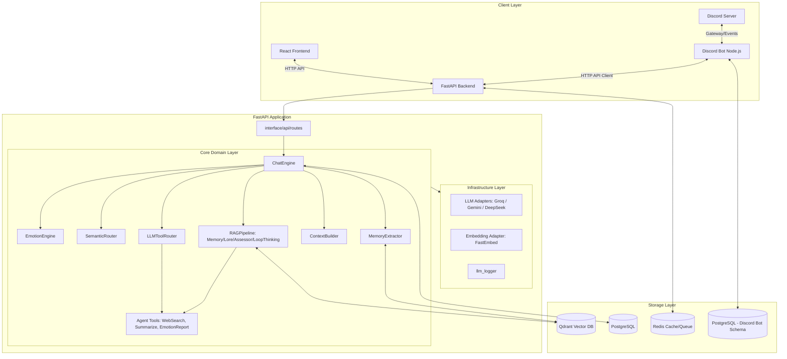

# Phân tích toàn bộ workspace `kuchiba_chisa` (Bản cập nhật chi tiết từ LLM Senior Engineer)

Tài liệu này tổng hợp toàn bộ mã nguồn, kiến trúc hệ thống, logic nghiệp vụ AI/LLM, cấu trúc dữ liệu và các luồng vận hành của chatbot nhân vật **Kuchiba Chisa** dưới góc nhìn của một kỹ sư LLM chuyên môn cao. 

---

## 1. Tổng quan dự án & Nghiệp vụ cốt lõi

**Chisa AI** là hệ thống chatbot nhập vai nhân vật anime (Kuchiba Chisa trong game Wuthering Waves). Cô ấy là một Mutant Resonator hệ Havoc với năng lực phân tích cấu trúc vạn vật.
*   **Mục tiêu**: Trò chuyện tự nhiên, nhập vai Kuudere (bề ngoài lạnh lùng lý trí, bên trong ấm áp ngọt ngào), ghi nhớ thông tin dài hạn của người dùng (Senpai), và biến chuyển cảm xúc linh hoạt dựa trên nội dung hội thoại.
*   **Trọng tâm kỹ thuật**:
    1.  **Bộ nhớ ngắn hạn (STM)**: Được lưu giữ thông qua lịch sử hội thoại trong PostgreSQL.
    2.  **Bộ nhớ dài hạn (LTM)**: Được lưu giữ thông qua cơ chế RAG phân vùng trên Vector Database Qdrant sử dụng xếp hạng lai (Hybrid Scoring) và truy xuất cha-con (Parent-Child Retrieval).
    3.  **Trạng thái cảm xúc**: Tính toán theo thời gian thực dựa trên 5 chỉ số cảm xúc ẩn (`joy`, `sadness`, `trust`, `irritation`, `attachment`), tích hợp mô hình phân rã thời gian và phản ứng Plutchik.
    4.  **Hỗ trợ đa nền tảng**: Giao diện Web (React) và Bot Discord (Node.js).

---

## 2. Kiến trúc hệ thống toàn cục

Hệ thống được thiết kế theo mô hình kiến trúc phân lớp rõ rệt (Clean/Hexagonal Architecture), tách biệt giữa Domain logic và Infrastructure adapters.



---

## 3. Cấu trúc chi tiết mã nguồn trong Workspace

### 3.1. Backend (`app/`)
*   `app/main.py`: Khởi tạo ứng dụng FastAPI, cấu hình CORS, thiết lập lifespan để kiểm tra kết nối và khởi tạo tài nguyên PostgreSQL, Redis, Qdrant khi startup.
*   `app/config/settings.py`: Khai báo cấu hình hệ thống bằng `pydantic-settings`. Hỗ trợ chuyển đổi LLM Provider (`gemini` hoặc `groq`), thiết lập chế độ dev/production, các secret key, cấu hình token budget, v.v.
*   `app/domain/`:
    *   `services/chat_engine.py`: Bộ điều phối luồng chat chính của hệ thống (trước đây là ProductionChatEngine).
    *   `services/context_builder.py`: Tạo prompt với các nhãn cảm xúc định tính thông qua `StateManager` và kiểm soát token budget phân mảnh.
    *   `services/context_budget_manager.py`: Kiểm soát kích thước prompt để không vượt quá giới hạn token.
    *   `services/emotion_engine.py`: Lõi tính toán cập nhật cảm xúc dựa trên phản ứng cảm xúc của Chisa và Senpai.
    *   `services/intent_classifier.py`: Phân loại ý định của người dùng bằng màng lọc Regex/Từ khóa kết hợp LLM API.
    *   `services/semantic_router.py`: Tầng 1 - Định tuyến ngữ nghĩa (Semantic Routing) bằng NumPy để phân loại ý định người dùng (ChatIntent) nhanh chóng, tích hợp so sánh khoảng cách Cosine, tính toán độ lệch tự tin (Confidence Margin) và cộng điểm thưởng Explicit Anchor.
    *   `services/tool_router.py`: Tầng 2 - Định tuyến và thực thi các Agent Tools có cấu trúc OOP.
    *   `services/memory_extractor.py`: Trích xuất thông tin thực tế (facts) và mối quan hệ ngầm chạy async.
    *   `services/state_manager.py`: Định nghĩa nhãn định tính (`Low`/`Medium`/`High`) và `Mood` cho prompt.
    *   `services/tools/`: Thư mục các Agent Tools:
        *   `base.py`: Lớp cơ sở `BaseAgentTool`.
        *   `web_search.py`: Tìm kiếm thông tin cập nhật trên Internet qua DuckDuckGo và tối ưu hóa query với ngữ cảnh 3 lượt chat gần nhất.
        *   `summarize.py`: Tóm tắt phiên hội thoại đang hoạt động.
        *   `emotion_report.py`: Xuất báo cáo cảm xúc định lượng.
    *   `services/rag/`: Package modular RAG bao gồm:
        *   `base.py`: Định nghĩa Pydantic models `ScoredMemory` và `RAGContext`.
        *   `reranker.py`: Đóng gói `KeywordOverlapReranker` và `HybridMemoryScorer`.
        *   `retriever_memory.py` / `retriever_lore.py`: Truy xuất memories và lore từ Qdrant.
        *   `assessor.py` / `thinking_loop.py`: Đánh giá alignment và thực thi Loop Thinking (Web Search).
        *   `pipeline.py`: Bộ điều phối `RAGPipeline` E2E tích hợp alignment check và thinking loop.
*   `app/infrastructure/`:
    *   `database/`: Cấu hình SQLAlchemy Async, các model DB (`User`, `Conversation`, `Message`, `EmotionState`, `UserStats`, `MemoryMetadata`) và repositories.
    *   `cache/redis/redis_service.py`: Quản lý cache và cơ chế lưu trữ session phụ trợ.
    *   `embeddings/fastembed_adapter.py`: Vector hóa văn bản bằng model local `all-MiniLM-L6-v2`.
    *   `llm/adapters/`: Chứa base adapter và hai adapter thực tế là `GroqAdapter` (llama-3.1-8b-instant) và `GeminiAdapter` (gemini-2.5-flash-lite).
    *   `logging/`: Ghi log có cấu trúc thông qua `structlog` và module ghi log API `llm_logger.py` lưu vào file `llm_api_clean.txt`. Bao gồm `pipeline_tracker.py` — singleton theo dõi toàn bộ các bước xử lý của một request (steps, tokens, latency), tự động đặt flag `loop_thinking_activated = True` khi bước `thinking_loop_cycle_*` được ghi nhận.
    *   `queue/`: Cấu hình Celery App và các worker xử lý nền (affection, embedding, memory).
*   `app/interface/`:
    *   `api/routes/`: Các REST API endpoints (`chat.py`, `health.py`) và WebSocket endpoint phục vụ dashboard.
    *   `api/templates/visualizer_dashboard.html`: Trang giao diện HTML/CSS/JS của Bảng điều khiển trực quan thời gian thực (Visualizer Dashboard), kết nối trực tiếp với backend bằng WebSockets và có thiết kế responsive đầy đủ.

### 3.2. Bot Discord (`discord/`)
*   `discord/src/app.js` & `index.js`: Điểm khởi chạy của bot, đăng ký các module, lắng nghe tín hiệu tắt dịch vụ (`SIGINT`, `SIGTERM`) để đóng kết nối an toàn.
*   `discord/src/bot/`: Quản lý client discord, tự động nạp các commands và events.
*   `discord/src/commands/`:
    *   `ask.js`: Xử lý lệnh `/ask` hoặc tin nhắn prefix `c!ask`. Gửi request đến Backend FastAPI để lấy phản hồi của Chisa. **Khi nhận message (direct channel), bot sẽ gửi trước tin nhắn tạm thời `*Chisa đang suy nghĩ...*`, sau đó xóa đi và gửi reply thực sự (hoặc xóa khi lỗi).**
    *   `clear.js`: Thực hiện xóa toàn bộ ký ức (gọi API `/chat/clear/{user_id}`).
    *   `setup.js`: Cấu hình kênh trò chuyện trực tiếp (Direct Chat Channel) cho server.
    *   `help.js`: Liệt kê danh sách lệnh.
*   `discord/src/database/`: Quản lý kết nối PostgreSQL bằng Connection Pool và tự động khởi chạy database schema (`schema.sql`).
*   `discord/src/events/`: Lắng nghe tin nhắn mới (`messageCreate`), phân phối lệnh, hỗ trợ trò chuyện tự động trong kênh setup.
*   `discord/src/services/`:
    *   `coreRagClient.js`: Client HTTP giao tiếp trực tiếp với Backend FastAPI có tích hợp cơ chế retry và backoff. **Forward thêm trường `loopThinkingActivated` từ API response để bot có thể nhận biết trạng thái suy luận.**
    *   `rateLimiter.js`: Quản lý tần suất gửi tin nhắn của người dùng để tránh spam API.
    *   `prefixCommandRunner.js`: Phân tích cú pháp tin nhắn có prefix.

### 3.3. Giao diện Web (`frontend/`)
*   Ứng dụng Single Page xây dựng trên React 18/19 + Vite + Bootstrap.
*   `frontend/src/App.jsx`: Giao diện chat hai panel kiểu hiện đại (Sidebar quản lý kết nối, nút xóa ký ức, panel chính chứa bong bóng chat). Tự động tạo UUID duy nhất của thiết bị và lưu vào `localStorage`. **Có cơ chế escalation 2 giây: nếu sau 2s kể từ khi gửi request mà chưa nhận được phản hồi, typing indicator thông thường sẽ chuyển thành bong bóng "Loop Thinking Mode" màu tím với animation pulse/shimmer và icon xoay để thông báo Chisa đang suy luận sâu.**

---

## 4. Chi tiết luồng xử lý Chat (Chat Pipeline)

Hệ thống sử dụng một pipeline duy nhất được tối ưu hóa toàn diện để đạt hiệu năng cao, tiết kiệm token, cô lập dữ liệu và đảm bảo trải nghiệm Kuudere mượt mà nhất:

### 4.1. Chat Engine Pipeline (ChatEngine)
Được tối ưu hóa toàn diện để đạt hiệu năng cao, tiết kiệm token, cô lập dữ liệu và đảm bảo trải nghiệm Kuudere mượt mà nhất:

```
                            Senpai Message
                                  │
                                  ▼
                      [Tiền xử lý & Chuẩn hóa]
                       (query_cleaner.py)
                                  │
                                  ▼
             [LLM Call 1 / SemanticRouter - Tầng 1]
           (Bypass qua Fast-path / Small-talk regex,
       hoặc phân loại Cosine Similarity trên NumPy RAM)
                                  │
               ┌──────────────────┴──────────────────┐
               ▼ (Có SYSTEM_ACTION)                  ▼ (LORE / MEMORY / OTHER)
     [Tầng 2: LLMToolRouter (OOP Tools)]      [Lọc & Phân phối RAG Collections]
               │                                     │
       ┌───────┼───────┐                     ┌───────┼───────┐
       ▼       ▼       ▼                     ▼       ▼       ▼
    [Search] [Report][Summarize]          [Lore]  [Memory] [Other]
       │       │       │                     │       │       │
       ▼       ▼       ▼                     ▼       ▼       ▼
  [Internet] [Postgre] [DB Commit]        [Qdrant] [Qdrant] [Chitchat]
       │       │       │                     │       │       │
       └───────┬───────┘                     └───────┬───────┘
               ▼                                     ▼
         [Tool Output]                         [RAG Context Chunks]
               │                                     │
               └──────────────────┬──────────────────┘
                                  │
                                  ▼
        [StateManager: Định tính hóa nhãn cảm xúc ẩn]
                                  │
                                  ▼
               [ProductionContextBuilder: Ghép Prompt]
                                  │
                                  ▼
              [LLM Call 2: Sinh câu trả lời & Phân tích tâm lý]
                                  │
               ┌──────────────────┴──────────────────┐
               ▼ (Đồng bộ)                           ▼ (Async Tasks - Chạy ngầm)
        Save Postgres Messages,               ├──► [LLM Call 3: MemoryExtractor] (Fact saving)
        Commit EmotionState,                  └──► [LLM Call 4: Summarizer] (Every 50 turns)
        Respond to Senpai
```

Hệ thống định tuyến hành động hệ thống được chia làm 2 Tầng:
- **Tầng 1 (SemanticRouter)**: Định tuyến các tin nhắn Senpai vào 5 intents. Khi intent `SYSTEM_ACTION` được kích hoạt thông qua cơ chế Margin check và Keyword guard nghiêm ngặt để tránh false positive, luồng sẽ được rẽ sang Tầng 2.
- **Tầng 2 (LLMToolRouter)**: Định tuyến ở cấp độ tool (Tool-level). Sử dụng kiến trúc OOP với `BaseAgentTool` để đóng gói các công cụ:
  1. `WebSearchAgentTool`: Dùng LLM tối giản (Level 2b) kết hợp **3 lượt hội thoại gần nhất** để phân tích ngữ cảnh, giải quyết đại từ mập mờ thành từ khóa tìm kiếm chính xác. Sau đó cào HTML DuckDuckGo lấy các snippets thô và **trích xuất nội dung trang gốc đầu tiên (Deep Page Content)** — tải trực tiếp HTML trang kết quả, lọc bỏ layout/script/style và lấy nội dung văn bản thực tế để LLM có số liệu chính xác, không bịa.
  2. `ConversationSummarizerAgentTool`: Trích xuất lịch sử thoại và yêu cầu LLM tóm tắt, lưu vào sqlite.
  3. `EmotionReportAgentTool`: Xuất chỉ số cảm xúc dạng báo cáo định lượng.

### 4.2. Hybrid Routing Optimization (Cập nhật mới)

Đã triển khai tối ưu hóa hybrid routing theo hướng giảm false positive và giảm số lần embedding không cần thiết:

1. **IntentClassifier L2 dùng word-boundary regex chặt**:
    - Hàm `_phrase_match(...)` dùng mẫu `(?<!\\w)...(?!\\w)` thay vì substring match.
    - Giảm lỗi bắt nhầm intent khi câu chứa từ khóa ở ngữ cảnh không liên quan.

2. **SYSTEM_ACTION Fast-Path ở L2**:
    - Bổ sung tập regex pattern tường minh cho: tóm tắt hội thoại, báo cáo cảm xúc, web search.
    - Các lệnh rõ ràng như "tóm tắt nãy giờ" có thể ra quyết định ngay tại L2 trước khi vào semantic scoring.

3. **SemanticRouter được tinh chỉnh tăng tính quyết đoán & Khởi chạy tức thì**:
    - `EXPLICIT_ANCHOR_BONUS` đã tăng lên `0.06`.
    - Bổ sung cơ chế **Batch Embedding** thu thập toàn bộ anchors của các intent và gọi `embed_batch` một lần duy nhất, tối ưu hóa thời gian tính toán vector từ **~3000ms xuống ~150ms**.
    - Tích hợp gọi khởi tạo anchors trực tiếp vào **startup lifespan** của FastAPI trong [main.py](file:///d:/Hoc_Tap/Code/Du_An_Ca_Nhan/Chisa_bot/kuchiba_chisa/app/main.py), loại bỏ hoàn toàn độ trễ khởi động lạnh (zero cold-start latency) cho tin nhắn đầu tiên.

4. **Dynamic Keyword Guards cho tất cả các ý định Lore và Memory**:
    - Màng lọc từ khóa bảo vệ được cấu hình chặt chẽ cho `MEMORY`, `CHARACTER_LORE`, `WORLD_LORE`, và `STORY_LORE` khi mức độ tự tin phân loại thấp (`is_uncertain`).
    - Điều này ngăn chặn việc các câu hỏi thực tế phổ thông (như giá cổ phiếu FPT, Vinfast) bị định tuyến sai vào kho Lore/Memory, hướng luồng xử lý trôi về `OTHER` để chạy Web Search chuẩn xác.

5. **Tool Router có Keyword Fast-Path trước semantic routing**:
    - Thêm lớp `KeywordToolRouter` trong `tool_router.py`.
    - Nếu query khớp regex cứng thì trả thẳng tool (`web_search`, `summarize_conversation_memory`, `get_emotion_report`) với score `1.0`.
    - Nếu không khớp mới fallback sang `SemanticToolRouter` (cosine similarity), giúp tiết kiệm tài nguyên embedding.

6. **Bổ sung test unit cho routing**:
    - `tests/unit/test_intent_classifier.py`: kiểm tra small-talk bypass, L2 keyword fast-path, chống false positive, SYSTEM_ACTION fast-path.
    - `tests/unit/test_tool_router.py`: kiểm tra ánh xạ keyword -> tool và trường hợp không khớp.
    - `tests/unit/test_semantic_router.py`: bổ sung case false positive và case mơ hồ, đồng thời mock cơ chế `embed_batch` mới.

### 4.3. Information Alignment Check & Loop Thinking Agent

Đây là cơ chế chống ảo giác (anti-hallucination) được tích hợp vào Production Pipeline, hoạt động **sau bước RAG retrieval**, trước khi tạo câu trả lời cuối:

```
[RAG Retrieval] → [Information Alignment Check (LLM)]
                         │
              ┌──────────┴──────────┐
   is_aligned=True           is_aligned=False
              │                    │
   [Tiếp tục phản hồi]    [Loop Thinking Agent]
                                   │
                         ┌─────────┴──────────┐
                    Cycle 1: LLM suy luận     │
                    → has_enough_info=False    │
                    → Tạo search_query        │
                    → WebSearchAgentTool       │
                    → Deep Page Fetch         │
                         │                    │
                    Cycle 2: LLM đọc kết quả  │
                    → has_enough_info=True    │
                         └────────────────────┘
                                   │
                    [Phản hồi với dữ liệu thực]
```

**`ContextAssessor` (đánh giá sự thẳng hàng)**: Sau khi RAG thu thập context, LLM đánh giá xem context có chứa đủ thông tin thực tế và cụ thể để trả lời không. Câu hỏi về small talk → luôn `is_aligned=True`. Câu hỏi về giá xăng, thời tiết, sự kiện thực tế mà không có số liệu → `is_aligned=False`.

**`ThinkingLoopAgent` (Loop Thinking & Self-Correction)**: Khi `is_aligned=False`, Agent Suy luận được kích hoạt chạy tối đa 2 cycles. Mỗi cycle LLM quyết định có cần search thêm không và tạo query tối ưu. Mỗi cycle được log vào `pipeline_tracker` với step tên `thinking_loop_cycle_N` để cập nhật trạng thái hoạt động suy nghĩ lặp.

**`RAGPipeline` (Điều phối E2E RAG)**: Phối hợp toàn bộ các bước truy xuất song song (Lore & Memory), gọi `ContextAssessor` để xác thực thông tin, và kích hoạt `ThinkingLoopAgent` nếu thông tin bị thiếu. Toàn bộ logic này được đóng gói độc lập bên trong `app/domain/services/rag/`, giúp `ProductionChatEngine` tinh gọn và sạch sẽ hơn.

**Thông báo đến người dùng**:
- **Discord**: Bot gửi `*Chisa đang suy nghĩ...*` ngay trước khi gọi API, xóa tin nhắn đó sau khi nhận reply.
- **Web**: Sau 2 giây isLoading mà chưa có phản hồi, typing indicator thông thường escalate thành **bong bóng Loop Thinking Mode** màu tím với gradient animation, shimmer sweep và icon xoay `⚙️`.

---

## 5. Logic cảm xúc và tiến trình gắn kết (Emotion Engine)

`EmotionEngine` áp dụng các nguyên lý tâm lý học số hóa vào chatbot:

### 5.1. Mô hình Phân rã thời gian thực (Time-Aware Exponential Decay)
Cảm xúc của Chisa tự động phai nhạt dần về mức mặc định (baseline) theo thời gian thực (Weber-Fechner Law), tính toán theo công thức suy hao mũ:
$$V_{new} = Baseline + (V_{old} - Baseline) \times e^{-\lambda \times \Delta t}$$
Trong đó, chu kỳ bán rã (Half-life) của từng cảm xúc được thiết lập cực kỳ thực tế:
*   `joy` (Vui vẻ): Bán rã sau **45 phút** (hết vui nhanh).
*   `sadness` (Buồn bã): Bán rã sau **3 giờ** (nỗi buồn dai dẳng).
*   `trust` (Tin tưởng): Bán rã sau **7 ngày** (lòng tin bền vững).
*   `irritation` (Tức giận/Dỗi): Bán rã sau **15 phút** (nhanh nguôi giận).

### 5.2. Các cơ chế tương tác phức tạp
*   **Intensity Damping**: Khi tin nhắn của Senpai được phân loại là `is_neutral = True`, mức độ tăng cảm xúc của Chisa sẽ bị triệt tiêu bớt (chỉ lấy 30% - 55% mức tối đa) để tránh các biến động cảm xúc quá đà từ các câu hỏi xã giao thông thường.
*   **Plutchik Mutual Exclusion**: Joy và Sadness tự triệt tiêu lẫn nhau. Nếu cả hai cùng tăng cao sau lượt hội thoại, cảm xúc mạnh hơn sẽ triệt tiêu cảm xúc yếu hơn một lượng bằng $0.7 \times \min(joy, sadness)$.
*   **Emotional Withdrawal (Rút lui cảm xúc)**: Khi Chisa đồng thời chịu tổn thương (`sadness > 0.15`) và bực tức (`irritation > 0.10`), cô ấy sẽ tự động lạnh nhạt và giữ khoảng cách. Trạng thái này sẽ áp hình phạt trực tiếp làm giảm điểm gắn kết (`attachment`), bất chấp các tác động bên ngoài khác.
*   **Attachment Progression**: Điểm gắn kết tăng chậm dựa trên lịch sử tương tác (`math.log(max(1, interaction_count)) * 0.05`), nhưng nếu Senpai thô lỗ (`is_rude = True`) hoặc tiêu cực, điểm gắn kết sẽ sụt giảm nghiêm trọng.

---

## 6. Sơ đồ dữ liệu (Database Schemas)

### 6.1. Core PostgreSQL (Backend)
```
┌────────────────────────────────────────────────────────────────────────┐
│                                 USERS                                  │
├───────────────┬──────────────────────────────┬─────────────────────────┤
│ id (UUID, PK) │ username (VARCHAR)           │ discord_id (VARCHAR, N) │
└───────────────┴──────────────────────────────┴─────────────────────────┘
        │ 1
        ├───┐
        │ 1 │ 1
┌───────┴───────┴───────┐             ┌──────────────────────────────────┐
│     CONVERSATIONS     │             │          EMOTION_STATE           │
├───────────────────────┤             ├──────────────────────────────────┤
│ id (UUID, PK)         │             │ user_id (UUID, FK, Unique)       │
│ user_id (UUID, FK)    │             │ joy, sadness, trust, irritation  │
│ started_at (TIMESTAMP)│             │ attachment (FLOAT)               │
│ ended_at (TIMESTAMP)  │             │ updated_at (BIGINT - Epoch MS)   │
└───────┬───────────────┘             └──────────────────────────────────┘
        │ 1
        ├───┐
        │   │ N
┌───────┴───▼───────────┐             ┌──────────────────────────────────┐
│       MESSAGES        │             │            USER_STATS            │
├───────────────────────┤             ├──────────────────────────────────┤
│ id (UUID, PK)         │             │ user_id (UUID, FK, Unique)       │
│ conversation_id (FK)  │             │ interaction_count (INTEGER)      │
│ user_id (UUID, FK)    │             │ last_seen (BIGINT - Epoch MS)    │
│ role (user/assistant) │             └──────────────────────────────────┘
│ content (TEXT)        │
│ token_count (INT)     │             ┌──────────────────────────────────┐
│ is_success (BOOLEAN)  │             │         MEMORY_METADATA          │
│ created_at (TIMESTAMP)│             ├──────────────────────────────────┤
└───────────────────────┘             │ id (UUID, PK)                    │
                                      │ user_id (UUID, FK)               │
                                      │ collection (VARCHAR)             │
                                      │ qdrant_id (UUID)                 │
                                      └──────────────────────────────────┘
```

### 6.2. Discord PostgreSQL (Bot Local DB)
Sử dụng một cơ sở dữ liệu riêng để quản lý các tính năng đặc thù của Discord Guild.
*   `discord_users`: Lưu thông tin thành viên Discord, liên kết trực tiếp `discord_user_id` và `discord_guild_id` với `core_user_id` (UUID) của hệ thống chính.
*   `guild_settings`: Lưu cấu hình kênh chat tự động trực tiếp của từng máy chủ Discord (`chisa_channel_id`).
*   `discord_interactions`: Log chi tiết mọi tương tác qua bot (nội dung, thời gian phản hồi, trạng thái `pending`/`success`/`failed`, emotions trả về).

---

## 7. Rủi ro bảo mật & Nợ kỹ thuật hiện tại

### 7.1. Rủi ro bảo mật (P0 - Cần khắc phục trước khi Production)
1.  **Xác thực người dùng yếu**: Client Web tự sinh UUID và gửi trực tiếp qua request `user_id`. Kẻ xấu có thể giả mạo `user_id` để đọc lịch sử chat, thao túng cảm xúc hoặc xóa bộ nhớ của người dùng khác.
2.  **Thiếu cơ chế bảo vệ Endpoint nhạy cảm**: API `/chat/clear/{user_id}` cho phép xóa toàn bộ dữ liệu Postgres và vector Qdrant của bất kỳ user nào mà không cần xác thực token JWT.
3.  **Lộ thông tin nhạy cảm qua log**: File log `llm_api_clean.txt` ghi lại toàn bộ prompt và dữ liệu thô của người dùng. Cần đảm bảo file này được phân quyền chặt chẽ hoặc tắt đi trong môi trường Production.

### 7.2. Nợ kỹ thuật & Điểm hạn chế
1.  **LLM Output Validation**: Dù sử dụng JSON Mode của LLM, đôi lúc mô hình vẫn có thể trả về sai schema hoặc rỗng dưới điều kiện quá tải. Cần một lớp validation nghiêm ngặt hơn (ví dụ: dùng Pydantic parser trong adapter).
2.  **Kiểm thử tự động còn mỏng**: Thư mục `tests/` hiện tại mới chỉ có các test cases cho API health, logic emotion, và RAG router cơ bản. Các luồng phức tạp như tích hợp sâu API trong multi-user chưa được mở rộng.
3.  **Race Condition**: Nếu người dùng nhấn gửi tin nhắn liên tục trên Web/Discord khi bot chưa kịp phản hồi, các tác vụ tính toán cảm xúc và ghi nhận tin nhắn đồng thời có thể gây sai lệch chỉ số.

---

## 8. Hướng phát triển & Kế hoạch hành động tiếp theo

### 8.1. Tăng cường lớp bảo mật (Security Layer)
*   Tích hợp middleware xác thực JWT hoặc Session tokens cho toàn bộ API Gateway.
*   Đảm bảo `user_id` được trích xuất trực tiếp từ token đã xác thực, thay vì tin cậy tham số do client truyền lên.

### 8.2. Mở rộng kiểm thử tự động (Test Suite Expansion)
*   Viết các test case mô phỏng nhiều lượt trò chuyện liên tục để kiểm tra tính chính xác của `EmotionEngine` dưới các tín hiệu sentiment khác nhau.
*   Thực hiện test kiểm tra cô lập dữ liệu (data isolation) giữa các người dùng để đảm bảo ký ức của Senpai này không bị lẫn sang Senpai khác.

---

## 9. Phân Tích Hiện Tượng Dội Token & Trùng Lặp 2x2 Loop Thinking

### 9.1. Phân tích luồng thực thi thực tế vs. Hiện thị Visualizer

Khi kiểm thử các câu hỏi yêu cầu RAG sâu nhưng cơ sở dữ liệu cục bộ bị trống hoặc thiếu thông tin (ví dụ: *"Em có sở thích gì vào thời gian rảnh?"*), chúng ta quan sát thấy tổng số LLM call lên tới **7 lượt** và tiêu tốn **~17.6k tokens**.

Trên Visualizer hiển thị trình tự:
`User input -> Intent routing -> tool router -> LLM Alignment Assesor -> LLM Loop Thinking Cycle 1 -> LLM Web Search trích query -> LLM Loop Thinking Cycle 2 -> LLM Web search trích query -> RAG Retrieval -> Alignment check -> web search -> Loop Thinking Cycle 1 -> web search -> Loop thinking cycle 2 -> ...`

Thực chất, hệ thống **không** chạy song song 2x2 lần loop thinking. Hiện tượng này xảy ra do hai nguyên nhân chính:

1. **Lệch trình tự ghi log bước (Visualizer Step Order Mismatch):**
   * Trong `chat_engine.py`, các LLM calls (Alignment Assessor, Loop Thinking Cycles, Web Search query optimizer) được thực hiện bên trong hàm `rag_pipeline.retrieve_and_align()`.
   * Mỗi khi có một LLM generate, module `llm_logger.py` sẽ **ngay lập tức** đẩy bước `llm_generation` vào `pipeline_tracker` theo thời gian thực.
   * Ngược lại, các bước giải thích logic tĩnh như `rag_retrieval`, `information_alignment_check` hay các bước tóm tắt chu kỳ `thinking_loop_cycle_X` chỉ được `chat_engine.py` thêm vào **sau khi** hàm `retrieve_and_align()` đã chạy xong hoàn toàn và trả về kết quả.
   * Điều này khiến Visualizer nhận các bước thực tế (LLM call) trước, và các bước giải thích sau, tạo nên sơ đồ timeline lộn xộn, dài lê thê và gây cảm giác trùng lặp.

2. **Dội LLM Call dư thừa tại mỗi chu kỳ Loop Thinking (Query Optimization Redundancy):**
   * Trong mỗi chu kỳ (cycle) của `ThinkingLoopAgent`, LLM suy luận đã có đầy đủ ngữ cảnh để tự tạo ra một câu truy vấn rất tối ưu (`search_query`).
   * Tuy nhiên, khi câu truy vấn này được gửi vào `WebSearchAgentTool.execute()`, công cụ tìm kiếm này lại gọi tiếp LLM `_extract_search_query()` để "tối ưu hóa" lần thứ hai.
   * Lỗi thiết kế này làm dội số lượng LLM call lên gấp đôi: **2 LLM calls/cycle** (1 để suy luận tạo query + 1 để tối ưu hóa query). Với 2 chu kỳ, hệ thống tiêu tốn tới **4 LLM calls** chỉ để tìm kiếm thông tin trên mạng!

### 9.2. Sơ đồ luồng RAG & Loop Thinking hiện tại

```mermaid
sequenceDiagram
    autonumber
    participant CE as ChatEngine
    participant RP as RAGPipeline
    participant AA as ContextAssessor (LLM)
    participant TL as ThinkingLoopAgent (LLM)
    participant WS as WebSearchAgentTool (LLM)

    CE->>RP: retrieve_and_align()
    RP->>AA: assess_alignment() [LLM Call 1]
    AA-->>RP: is_aligned=False
    
    rect rgb(40, 20, 20)
        Note over RP, WS: Loop Thinking Cycles (Max 2)
        RP->>TL: run()
        
        Note over TL: Cycle 1
        TL->>TL: Generate search_query [LLM Call 2]
        TL->>WS: execute(search_query)
        WS->>WS: _extract_search_query() [LLM Call 3 - DƯ THỪA]
        WS-->>TL: DuckDuckGo Results + Deep Page
        
        Note over TL: Cycle 2
        TL->>TL: Read results & Generate new query [LLM Call 4]
        TL->>WS: execute(new_query)
        WS->>WS: _extract_search_query() [LLM Call 5 - DƯ THỪA]
        WS-->>TL: DuckDuckGo Results
    end
    
    TL-->>RP: Accumulated Context
    RP-->>CE: RAGContext
```



### 9.3. Hướng giải quyết & Kế hoạch tối ưu

1. **Bypass Query Optimization trong Loop Thinking:**
   * Thêm tham số `bypass_optimize: bool = False` vào `WebSearchAgentTool.execute()`.
   * Khi `bypass_optimize=True` (được gọi từ trong `ThinkingLoopAgent`), công cụ tìm kiếm sẽ lấy thẳng `search_query` do Loop Agent sinh ra để tìm kiếm DuckDuckGo, loại bỏ hoàn toàn cuộc gọi LLM `_extract_search_query()`.
   * Tiết kiệm ngay lập tức **2 LLM calls** (~1.5k - 2k tokens) và giảm 2-3 giây độ trễ cho mỗi phản hồi cần suy nghĩ sâu.

2. **Đồng bộ hóa thứ tự ghi log bước (Real-time Step Logging):**
   * Di chuyển việc gọi `pipeline_tracker.add_step()` cho các bước `rag_retrieval`, `information_alignment_check` và các chu kỳ `thinking_loop_cycle_X` vào **bên trong** `RAGPipeline` và `ThinkingLoopAgent` ngay tại thời điểm thực thi.
   * Đảm bảo các bước giải thích logic và các cuộc gọi LLM thực tế được ghi nhận đan xen đúng theo trình tự thời gian thực tế, hiển thị timeline trực quan, không còn bị lặp hay dồn về cuối.

