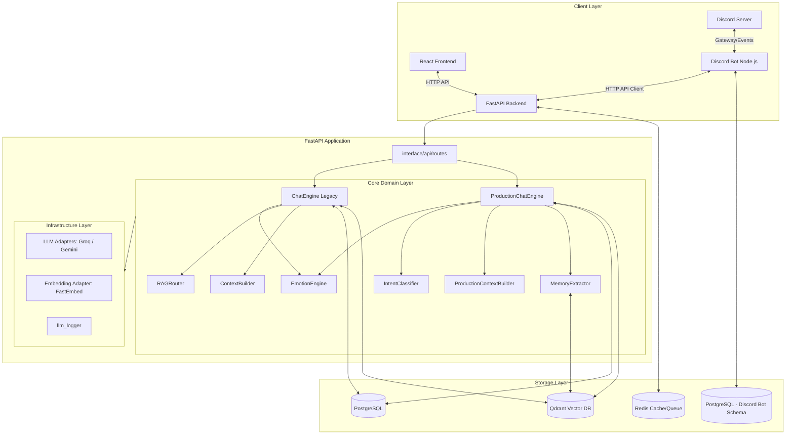

# Phân tích toàn bộ workspace `kuchiba_chisa` (Bản cập nhật chi tiết từ LLM Senior Engineer)

Tài liệu này tổng hợp toàn bộ mã nguồn, kiến trúc hệ thống, logic nghiệp vụ AI/LLM, cấu trúc dữ liệu và các luồng vận hành của chatbot nhân vật **Kuchiba Chisa** dưới góc nhìn của một kỹ sư LLM chuyên môn cao. 

---

## 1. Tổng quan dự án & Nghiệp vụ cốt lõi

**Chisa AI** là hệ thống chatbot nhập vai nhân vật anime (Kuchiba Chisa trong game Wuthering Waves). Cô ấy là một Mutant Resonator hệ Havoc với năng lực phân tích cấu trúc vạn vật.
*   **Mục tiêu**: Trò chuyện tự nhiên, nhập vai Kuudere (bề ngoài lạnh lùng lý trí, bên trong ấm áp ngọt ngào), ghi nhớ thông tin dài hạn của người dùng (Senpai), và biến chuyển cảm xúc linh hoạt dựa trên nội dung hội thoại.
*   **Trọng tâm kỹ thuật**:
    1.  **Bộ nhớ ngắn hạn (STM)**: Được lưu giữ thông qua lịch sử hội thoại trong PostgreSQL.
    2.  **Bộ nhớ dài hạn (LTM)**: Được lưu giữ thông qua cơ chế RAG phân vùng trên Vector Database Qdrant sử dụng xếp hạng lai (Hybrid Scoring) và truy xuất cha-con (Parent-Child Retrieval).
    3.  **Trạng thái cảm xúc**: Tính toán theo thời gian thực dựa trên 5 chỉ số cảm xúc ẩn (`joy`, `sadness`, `trust`, `irritation`, `attachment`), tích hợp mô hình phân rã thời gian và phản ứng Plutchik.
    4.  **Hỗ trợ đa nền tảng**: Giao diện Web (React) và Bot Discord (Node.js).

---

## 2. Kiến trúc hệ thống toàn cục

Hệ thống được thiết kế theo mô hình kiến trúc phân lớp rõ rệt (Clean/Hexagonal Architecture), tách biệt giữa Domain logic và Infrastructure adapters.



---

## 3. Cấu trúc chi tiết mã nguồn trong Workspace

### 3.1. Backend (`app/`)
*   `app/main.py`: Khởi tạo ứng dụng FastAPI, cấu hình CORS, thiết lập lifespan để kiểm tra kết nối và khởi tạo tài nguyên PostgreSQL, Redis, Qdrant khi startup.
*   `app/config/settings.py`: Khai báo cấu hình hệ thống bằng `pydantic-settings`. Hỗ trợ chuyển đổi LLM Provider (`gemini` hoặc `groq`), thiết lập chế độ dev/production, các secret key, cấu hình token budget, v.v.
*   `app/domain/`:
    *   `services/chat_engine.py`: Điều phối luồng xử lý chat truyền thống (Legacy Pipeline).
    *   `services/context_builder.py`: Xây dựng prompt tích hợp các trạng thái cảm xúc thô và lore/memory.
    *   `services/context_budget_manager.py`: Kiểm soát kích thước prompt để không vượt quá giới hạn token.
    *   `services/emotion_engine.py`: Lõi tính toán cập nhật cảm xúc dựa trên phản ứng cảm xúc của Chisa và Senpai.
    *   `services/memory_manager.py`: Đánh giá độ quan trọng của tin nhắn để lưu giữ ký ức dài hạn.
    *   `services/memory_summarizer.py`: Tóm tắt các hội thoại dài để tạo bộ nhớ nền.
    *   `services/rag_retriever.py`: Thực hiện tìm kiếm và xếp hạng lai (Hybrid Scoring) cho memories; tìm kiếm cha-con (Parent-Child) và lọc từ khóa cho lore.
    *   `services/rag_router.py`: Quyết định khi nào cần tìm kiếm RAG dựa trên regex/từ khóa.
    *   `services/production_pipeline/`:
        *   `production_chat_engine.py`: Bộ điều phối luồng chat nâng cao của Production Pipeline.
        *   `intent_classifier.py`: Phân loại ý định của người dùng bằng màng lọc Regex/Từ khóa kết hợp LLM API.
        *   `production_context_builder.py`: Tạo prompt với các nhãn cảm xúc định tính thông qua `StateManager` và kiểm soát token budget phân mảnh.
        *   `memory_extractor.py`: Trích xuất thông tin thực tế (facts) và mối quan hệ ngầm chạy async.
        *   `state_manager.py`: Định nghĩa nhãn định tính (`Low`/`Medium`/`High`) và `Mood` cho prompt.
*   `app/infrastructure/`:
    *   `database/`: Cấu hình SQLAlchemy Async, các model DB (`User`, `Conversation`, `Message`, `EmotionState`, `UserStats`, `MemoryMetadata`) và repositories.
    *   `cache/redis/redis_service.py`: Quản lý cache và cơ chế lưu trữ session phụ trợ.
    *   `embeddings/fastembed_adapter.py`: Vector hóa văn bản bằng model local `all-MiniLM-L6-v2`.
    *   `llm/adapters/`: Chứa base adapter và hai adapter thực tế là `GroqAdapter` (llama-3.1-8b-instant) và `GeminiAdapter` (gemini-2.5-flash-lite).
    *   `logging/`: Ghi log có cấu trúc thông qua `structlog` và module ghi log API `llm_logger.py` lưu vào file `llm_api_clean.txt`.
    *   `queue/`: Cấu hình Celery App và các worker xử lý nền (affection, embedding, memory).

### 3.2. Bot Discord (`discord/`)
*   `discord/src/app.js` & `index.js`: Điểm khởi chạy của bot, đăng ký các module, lắng nghe tín hiệu tắt dịch vụ (`SIGINT`, `SIGTERM`) để đóng kết nối an toàn.
*   `discord/src/bot/`: Quản lý client discord, tự động nạp các commands và events.
*   `discord/src/commands/`:
    *   `ask.js`: Xử lý lệnh `/ask` hoặc tin nhắn prefix `c!ask`. Gửi request đến Backend FastAPI để lấy phản hồi của Chisa.
    *   `clear.js`: Thực hiện xóa toàn bộ ký ức (gọi API `/chat/clear/{user_id}`).
    *   `setup.js`: Cấu hình kênh trò chuyện trực tiếp (Direct Chat Channel) cho server.
    *   `help.js`: Liệt kê danh sách lệnh.
*   `discord/src/database/`: Quản lý kết nối PostgreSQL bằng Connection Pool và tự động khởi chạy database schema (`schema.sql`).
*   `discord/src/events/`: Lắng nghe tin nhắn mới (`messageCreate`), phân phối lệnh, hỗ trợ trò chuyện tự động trong kênh setup.
*   `discord/src/services/`:
    *   `coreRagClient.js`: Client HTTP giao tiếp trực tiếp với Backend FastAPI có tích hợp cơ chế retry và backoff.
    *   `rateLimiter.js`: Quản lý tần suất gửi tin nhắn của người dùng để tránh spam API.
    *   `prefixCommandRunner.js`: Phân tích cú pháp tin nhắn có prefix.

### 3.3. Giao diện Web (`frontend/`)
*   Ứng dụng Single Page xây dựng trên React 18/19 + Vite + Bootstrap.
*   `frontend/src/App.jsx`: Giao diện chat hai panel kiểu hiện đại (Sidebar quản lý kết nối, nút xóa ký ức, panel chính chứa bong bóng chat). Tự động tạo UUID duy nhất của thiết bị và lưu vào `localStorage`.

---

## 4. Chi tiết hai luồng xử lý Chat (Pipelines)

Hệ thống có hai luồng xử lý chat được điều phối động thông qua tham số `pipeline` trong request hoặc thiết lập cấu hình `CHAT_PIPELINE` trong `.env`.

### 4.1. Legacy Pipeline (ChatEngine)
1.  **Nhận tin nhắn**: Nhận `user_id` và tin nhắn từ client.
2.  **Đọc ngữ cảnh**: Tải dữ liệu người dùng, chỉ số cảm xúc và lịch sử trò chuyện từ Postgres.
3.  **RAG Router**: Kiểm tra xem câu hỏi có chứa từ khóa kích hoạt memory không.
4.  **Truy xuất RAG**:
    *   *Lore*: Tìm kiếm trên collection `chisa_lore` với vector tương đồng, giữ lại các chunk có điểm số >= `0.35`.
    *   *Memory*: Nếu `RAGRouter` bật, truy vấn collection `emotional_memories` bằng vector.
5.  **RAG Emotion Seeding**: Nếu tin nhắn chứa các từ khóa u sầu và RAG trả về các nội dung tương quan buồn, hệ thống sẽ chủ động cộng thêm điểm `sadness` và `irritation` trước khi gửi lên LLM.
6.  **Xây dựng Prompt**: Kết hợp hướng dẫn tính cách nhân vật (System Prompt), chỉ số cảm xúc dạng số thô, lore, memory và lịch sử chat.
7.  **Gọi LLM (Single-Call)**: Groq/Gemini trả về JSON gồm phản hồi thoại Chisa và sentiment phản ứng của Senpai (`is_positive`, `is_negative`, `is_rude`, `is_neutral`).
8.  **Cập nhật cảm xúc**: `EmotionEngine` cập nhật trạng thái cảm xúc.
9.  **Lưu trữ**: Lưu tin nhắn vào Postgres. Nếu tin nhắn có độ quan trọng cao (importance >= 0.65), lưu thêm vào Qdrant `emotional_memories`.

### 4.2. Production Pipeline (ProductionChatEngine)
Được tối ưu hóa toàn diện để đạt hiệu năng cao, tiết kiệm token, cô lập dữ liệu và đảm bảo trải nghiệm Kuudere mượt mà nhất:

```
                  Senpai Message
                        │
                        ▼
            [Tiền xử lý & Chuẩn hóa]
             (query_cleaner.py:
        Sửa từ viết tắt tiếng Việt ko, đc...)
                        │
                        ▼
         [LLM Call 1: IntentClassifier]
              (Fast-Path Pre-filter:
            Tự phân loại small talk/OTHER,
        hoặc regex keywords MEMORY/LORE nhanh)
                        │
         ┌──────────────┴──────────────┐
         │ Có khớp rule / Small talk   │ Không khớp rule
         ▼                             ▼
   [Bypass LLM Call 1]        [LLM Call 1 - Slow Path]
         │                             │
         └──────────────┬──────────────┘
                        │
                        ▼ (Giao điểm Intents)
   ┌────────────────────┼────────────────────┬────────────────────┐
   ▼ CHARACTER_LORE     ▼ WORLD_LORE         ▼ STORY_LORE         ▼ MEMORY
 [qdrant_service]     [qdrant_service]     [qdrant_service]     [rag_retriever]
  character_lore       world_lore           story_lore           memories
   collection           collection           collection          collection
   (Parent-Child)       (Parent-Child)       (Parent-Child)     (Hybrid Scoring)
   ┌────────────────────┴────────────────────┼────────────────────┘
   ▼                                         ▼
[Lore chunks: Parent deduplication &        [Memories: Recency, Importance,
 Keyword Overlap re-ranking]                 Emotion Match re-ranking]
   │                                         │
   └────────────────────┬────────────────────┘
                        │
                        ▼
[StateManager: Format emotions to qualitative levels (Low/Medium/High)]
                        │
                        ▼
[ProductionContextBuilder: Trim & Enforce Token Budget]
                        │
                        ▼
[LLM Call 2: Main Generation & Sentiment Analysis]
                        │
         ┌──────────────┴──────────────┐
         ▼ (Đồng bộ)                   ▼ (Async Tasks - Chạy ngầm)
  Save Postgres Messages,       ├──► [LLM Call 3: MemoryExtractor] (Fact saving)
  Commit EmotionState,          └──► [LLM Call 4: Summarizer] (Every 50 turns)
  Respond to Senpai
```

---

## 5. Logic cảm xúc và tiến trình gắn kết (Emotion Engine)

`EmotionEngine` áp dụng các nguyên lý tâm lý học số hóa vào chatbot:

### 5.1. Mô hình Phân rã thời gian thực (Time-Aware Exponential Decay)
Cảm xúc của Chisa tự động phai nhạt dần về mức mặc định (baseline) theo thời gian thực (Weber-Fechner Law), tính toán theo công thức suy hao mũ:
$$V_{new} = Baseline + (V_{old} - Baseline) \times e^{-\lambda \times \Delta t}$$
Trong đó, chu kỳ bán rã (Half-life) của từng cảm xúc được thiết lập cực kỳ thực tế:
*   `joy` (Vui vẻ): Bán rã sau **45 phút** (hết vui nhanh).
*   `sadness` (Buồn bã): Bán rã sau **3 giờ** (nỗi buồn dai dẳng).
*   `trust` (Tin tưởng): Bán rã sau **7 ngày** (lòng tin bền vững).
*   `irritation` (Tức giận/Dỗi): Bán rã sau **15 phút** (nhanh nguôi giận).

### 5.2. Các cơ chế tương tác phức tạp
*   **Intensity Damping**: Khi tin nhắn của Senpai được phân loại là `is_neutral = True`, mức độ tăng cảm xúc của Chisa sẽ bị triệt tiêu bớt (chỉ lấy 30% - 55% mức tối đa) để tránh các biến động cảm xúc quá đà từ các câu hỏi xã giao thông thường.
*   **Plutchik Mutual Exclusion**: Joy và Sadness tự triệt tiêu lẫn nhau. Nếu cả hai cùng tăng cao sau lượt hội thoại, cảm xúc mạnh hơn sẽ triệt tiêu cảm xúc yếu hơn một lượng bằng $0.7 \times \min(joy, sadness)$.
*   **Emotional Withdrawal (Rút lui cảm xúc)**: Khi Chisa đồng thời chịu tổn thương (`sadness > 0.15`) và bực tức (`irritation > 0.10`), cô ấy sẽ tự động lạnh nhạt và giữ khoảng cách. Trạng thái này sẽ áp hình phạt trực tiếp làm giảm điểm gắn kết (`attachment`), bất chấp các tác động bên ngoài khác.
*   **Attachment Progression**: Điểm gắn kết tăng chậm dựa trên lịch sử tương tác (`math.log(max(1, interaction_count)) * 0.05`), nhưng nếu Senpai thô lỗ (`is_rude = True`) hoặc tiêu cực, điểm gắn kết sẽ sụt giảm nghiêm trọng.

---

## 6. Sơ đồ dữ liệu (Database Schemas)

### 6.1. Core PostgreSQL (Backend)
```
┌────────────────────────────────────────────────────────────────────────┐
│                                 USERS                                  │
├───────────────┬──────────────────────────────┬─────────────────────────┤
│ id (UUID, PK) │ username (VARCHAR)           │ discord_id (VARCHAR, N) │
└───────────────┴──────────────────────────────┴─────────────────────────┘
        │ 1
        ├───┐
        │ 1 │ 1
┌───────┴───────┴───────┐             ┌──────────────────────────────────┐
│     CONVERSATIONS     │             │          EMOTION_STATE           │
├───────────────────────┤             ├──────────────────────────────────┤
│ id (UUID, PK)         │             │ user_id (UUID, FK, Unique)       │
│ user_id (UUID, FK)    │             │ joy, sadness, trust, irritation  │
│ started_at (TIMESTAMP)│             │ attachment (FLOAT)               │
│ ended_at (TIMESTAMP)  │             │ updated_at (BIGINT - Epoch MS)   │
└───────┬───────────────┘             └──────────────────────────────────┘
        │ 1
        ├───┐
        │   │ N
┌───────┴───▼───────────┐             ┌──────────────────────────────────┐
│       MESSAGES        │             │            USER_STATS            │
├───────────────────────┤             ├──────────────────────────────────┤
│ id (UUID, PK)         │             │ user_id (UUID, FK, Unique)       │
│ conversation_id (FK)  │             │ interaction_count (INTEGER)      │
│ user_id (UUID, FK)    │             │ last_seen (BIGINT - Epoch MS)    │
│ role (user/assistant) │             └──────────────────────────────────┘
│ content (TEXT)        │
│ token_count (INT)     │             ┌──────────────────────────────────┐
│ is_success (BOOLEAN)  │             │         MEMORY_METADATA          │
│ created_at (TIMESTAMP)│             ├──────────────────────────────────┤
└───────────────────────┘             │ id (UUID, PK)                    │
                                      │ user_id (UUID, FK)               │
                                      │ collection (VARCHAR)             │
                                      │ qdrant_id (UUID)                 │
                                      └──────────────────────────────────┘
```

### 6.2. Discord PostgreSQL (Bot Local DB)
Sử dụng một cơ sở dữ liệu riêng để quản lý các tính năng đặc thù của Discord Guild.
*   `discord_users`: Lưu thông tin thành viên Discord, liên kết trực tiếp `discord_user_id` và `discord_guild_id` với `core_user_id` (UUID) của hệ thống chính.
*   `guild_settings`: Lưu cấu hình kênh chat tự động trực tiếp của từng máy chủ Discord (`chisa_channel_id`).
*   `discord_interactions`: Log chi tiết mọi tương tác qua bot (nội dung, thời gian phản hồi, trạng thái `pending`/`success`/`failed`, emotions trả về).

---

## 7. Rủi ro bảo mật & Nợ kỹ thuật hiện tại

### 7.1. Rủi ro bảo mật (P0 - Cần khắc phục trước khi Production)
1.  **Xác thực người dùng yếu**: Client Web tự sinh UUID và gửi trực tiếp qua request `user_id`. Kẻ xấu có thể giả mạo `user_id` để đọc lịch sử chat, thao túng cảm xúc hoặc xóa bộ nhớ của người dùng khác.
2.  **Thiếu cơ chế bảo vệ Endpoint nhạy cảm**: API `/chat/clear/{user_id}` cho phép xóa toàn bộ dữ liệu Postgres và vector Qdrant của bất kỳ user nào mà không cần xác thực token JWT.
3.  **Lộ thông tin nhạy cảm qua log**: File log `llm_api_clean.txt` ghi lại toàn bộ prompt và dữ liệu thô của người dùng. Cần đảm bảo file này được phân quyền chặt chẽ hoặc tắt đi trong môi trường Production.

### 7.2. Nợ kỹ thuật & Điểm hạn chế
1.  **LLM Output Validation**: Dù sử dụng JSON Mode của LLM, đôi lúc mô hình vẫn có thể trả về sai schema hoặc rỗng dưới điều kiện quá tải. Cần một lớp validation nghiêm ngặt hơn (ví dụ: dùng Pydantic parser trong adapter).
2.  **Kiểm thử tự động còn mỏng**: Thư mục `tests/` hiện tại mới chỉ có các test cases cho API health, logic emotion, và RAG router cơ bản. Các luồng phức tạp như tích hợp sâu API trong multi-user chưa được mở rộng.
3.  **Race Condition**: Nếu người dùng nhấn gửi tin nhắn liên tục trên Web/Discord khi bot chưa kịp phản hồi, các tác vụ tính toán cảm xúc và ghi nhận tin nhắn đồng thời có thể gây sai lệch chỉ số.

---

## 8. Hướng phát triển & Kế hoạch hành động tiếp theo

### 8.1. Tăng cường lớp bảo mật (Security Layer)
*   Tích hợp middleware xác thực JWT hoặc Session tokens cho toàn bộ API Gateway.
*   Đảm bảo `user_id` được trích xuất trực tiếp từ token đã xác thực, thay vì tin cậy tham số do client truyền lên.

### 8.2. Mở rộng kiểm thử tự động (Test Suite Expansion)
*   Viết các test case mô phỏng nhiều lượt trò chuyện liên tục để kiểm tra tính chính xác của `EmotionEngine` dưới các tín hiệu sentiment khác nhau.
*   Thực hiện test kiểm tra cô lập dữ liệu (data isolation) giữa các người dùng để đảm bảo ký ức của Senpai này không bị lẫn sang Senpai khác.
