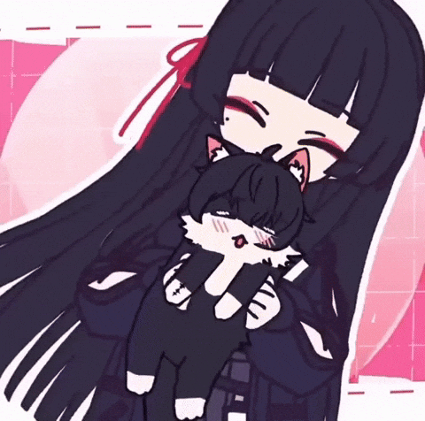

# 🌸 Kuchiba Chisa - Emotional RAG Waifu Backend 🌸

  

## ✨ Tổng quan Dự án

**Chisa AI** là một Hệ thống Backend tiên tiến được thiết kế cho **Hệ thống AI Cảm xúc + Multimodal Vision Memory RAG (Tạo sinh Tăng cường Truy xuất Ký ức Cá nhân hóa & Thị giác)**. Dự án đóng vai trò là "bộ não" và "trái tim" cho người bạn đồng hành AI (Kuchiba Chisa - Wuthering Waves), lưu giữ các cuộc trò chuyện, trích xuất tri thức dài hạn, nhận diện/ghi nhớ hình ảnh và điều hướng trạng thái cảm xúc linh hoạt dựa trên các tương tác theo thời gian thực.

Được xây dựng theo nguyên lý **Clean Architecture** kết hợp **Pipes and Filters Pipeline**, tối ưu hóa cho độ trễ siêu thấp và khả năng vận hành ổn định trên VPS.

  
  
  

---

## 🏗️ Kiến trúc & Công nghệ (Tech Stack)

- **Ngôn ngữ:** Python 3.11
- **API Framework:** FastAPI (Async) + Real-Time WebSockets
- **Cơ sở dữ liệu Quan hệ:** PostgreSQL 16 (Trí nhớ ngắn hạn, Thông tin người dùng, Trạng thái cảm xúc, Parent Docs)
- **Cơ sở dữ liệu Vector:** Qdrant (`memories`, `guild_memories`, `image_memories`, `character_lore`, `world_lore`, `story_lore`)
- **Bộ nhớ đệm & State Cache:** Redis 7 (Write-Through State Cache, Answer Cache, Pub/Sub Telemetry, Rolling Buffer)
- **Background Tasks:** Unblocked Background Worker Pool qua `BackgroundTaskManager` (Zero-lag chat response)
- **ORM:** SQLAlchemy 2.0 (Async) + Alembic hỗ trợ migrations
- **Tích hợp LLM & Vision:** DeepSeek (`deepseek-chat` / `deepseek-v4-flash-vision`), Google Gemini (Fallback)
- **Hạ tầng triển khai:** Docker & Docker Compose

---

## 🚀 Tính năng nổi bật

- 🧠 **Trí Nhớ Đa Tầng (Multi-Memory 3.0):**
  - **Personal Memories (`memories`):** Trích xuất tự động các sự thật và sở thích cá nhân của Senpai với thuật toán suy hao thích ứng **Adaptive Ebbinghaus Decay**.
  - **Server Guild Memories (`guild_memories`):** Quản lý sự kiện, lịch trình và văn hóa chung của Discord Server, tự động lọc sự kiện hết hạn.
  - **Visual Image Memories (`image_memories`):** Tự động ghi nhớ ảnh đã gửi và **Truy ngược gửi lại ảnh theo ngôn ngữ tự nhiên (Text-to-Image Reverse Retrieval)**.
- ❤️ **Hệ Thống Cảm Xúc Động (RESONA Engine 3.0):** Quản lý không gian cảm xúc 8 chiều (*Tin tưởng, Gắn bó, Ngại ngùng, Hiếu kỳ, Bình yên, Vui vẻ, Buồn bã, Khó chịu*), ma trận tương hỗ 7 Archetypes $\times$ 5 Stances, Saturation Headroom Law, Pout Shield và phân rã khí sắc máy chủ (*Server Ambient Mood*).
- ⚡ **Hiệu Năng & Tối Ưu Hóa Bộ Nhớ (Fast-Path & State Caching):**
  - **Write-Through State Cache (~0.2ms):** Cache `UserStats`, `EmotionState` và `conv_id` lên Redis L1, bỏ qua $100\%$ các câu truy vấn SQL lặp lại ở Stage 1.
  - **Hybrid Anchor Window:** Tự động cắt tỉa lịch sử hội thoại khi có bản tóm tắt, giải phóng $35\%$ token chuyển sang Flex Pool cho Lore & Memories.
- 👥 **Hỗ Trợ 3 Chế Độ Tương Tác Phân Lập:**
  - **Private Mode (1-on-1 DM):** Không gian riêng tư tuyệt đối giữa Senpai và Chisa.
  - **Semi-Private Mode (Guild Channel):** Trò chuyện cá nhân trong kênh server nhưng vẫn cảm nhận được khí sắc chung của máy chủ.
  - **Community Mode (Server Group):** Tương tác nhóm với **Live Channel Transcript** và **Community Topic Summarizer (3-Tier Synthesis + Bộ lọc rác 2 tầng)**.
- 🛡️ **Bảo Mật Thị Giác & Multimodal Sandboxing:** Chặn 19 dải IP SSRF, phòng vệ Decompression Bomb (Pillow Pixel Guard), tước bỏ $100\%$ metadata EXIF/GPS, và XML Sandboxing chống Visual Prompt Injection.
- 📊 **Bảng Điều Khiển Trực Quan Thời Gian Thực (Visualizer Dashboard):** Trang giám sát thời gian thực (`http://localhost:8000/visualizer`) truyền luồng WebSocket hiển thị toàn bộ 10 Canonical Stages, cây thực thi, token breakdown, Live Transcript và biểu đồ cảm xúc.

---

## 2. Sơ Đồ Luồng Dữ Liệu Toàn Cảnh (Chat Pipeline 3.0)

```mermaid
flowchart TD
    Inbound["Inbound Request (Discord / Web API)<br/>[User Query, Mentions, Attachments]"] --> Lock["Distributed Redis Lock (TTL 120s)<br/>'chisa:chat_lock:{user_id}'"]
    Lock --> S1

    subgraph S1_Init ["Stage 1: InitializationStage"]
        S1["Khởi tạo Phiên & Danh tính (UUID5)"] --> S1_Cache{"Kiểm tra Redis State Cache<br/>'chisa:user:{user_id}:state'"}
        S1_Cache -- "Cache HIT (~0.2ms)" --> S1_Hit["Nạp nhanh Stats & Emotion từ Redis (Bỏ qua 3 query SQL)"]
        S1_Cache -- "Cache MISS" --> S1_Miss["Nạp từ PostgreSQL & Write-Through vào Redis (TTL 7d)"]
        S1_Hit & S1_Miss --> S1_Check{"Kiểm tra Chế độ Chat"}
        S1_Check -- "Private / Semi-Private" --> S1_Priv["Nạp SQL History + 1-on-1 Summary (Redis/Postgres)"]
        S1_Check -- "Community" --> S1_Comm["Nạp Live Channel Transcript (15 msgs) + Rolling Topic Summary (Redis)"]
        S1_Check -- "Semi-Private / Community" --> S1_Amb["Nạp Server Ambient Mood (Half-life 30m Decay)"]
        S1 --> S1_Img["ImageIngestionService:<br/>SSRF Guard + Decompression Bomb Guard + WebP Re-encoding"]
    end

    S1_Img --> S2

    subgraph S2_Intent ["Stage 2: IntentStage & QueryRewriter"]
        S2["Phân loại Ý định & Ngữ cảnh"] --> S2_Check{"Phát hiện Small Talk 3 Vòng?<br/>(Hardcore + Regex + Semantic Anchors)"}
        S2_Check -- "Khớp (0ms, 0 Token)" --> S2_Fast["Fast-Path Bypass RAG (Bypass Rewrite)"]
        S2_Check -- "Không khớp" --> S2_Rewriter["Micro LLM Query Rewriter (DeepSeek Flash 2.5s)"]
        S2_Rewriter --> S2_Matrix["Ma Trận Định Tuyến 3 Cờ:<br/>1. Vector Lore | 2. Web Search | 3. Visual Memory"]
        S2_Rewriter --> S2_Lookback["Context Chaining:<br/>SQL Lookback (Private) vs Channel Transcript (Community)"]
    end

    S2_Matrix --> S3
    S2_Fast --> S3

    subgraph S3_Cache ["Stage 3: CacheStage"]
        S3["Redis Answer Cache Lookup (Pure Lore)"] --> S3_Hit{"Cache HIT?"}
        S3_Hit -- "HIT (Lore thuần)" --> S3_Done["Trả về kết quả ngay (0ms LLM)"]
        S3_Hit -- "MISS / Có ảnh" --> S4
    end

    subgraph S4_Tools ["Stage 4: ToolRoutingStage"]
        S4["Kiểm tra System Actions & Tools"] --> S4_Check{"Phân loại Công cụ"}
        S4_Check -- "Web Search" --> S4_Delegate["ỦY QUYỀN SANG STAGE 5<br/>(Bật cờ needs_web_search = True)"]
        S4_Check -- "Công cụ Hệ thống" --> S4_Exec["Thực thi Nội bộ: Emotion Report / Manual Summarizer"]
        S4_Exec --> S4_Res["Lưu Tool Result vào Context"]
    end

    S4_Delegate --> S5
    S4_Res --> S5

    subgraph S5_RAG ["Stage 5: RAGStage & RAGPipeline"]
        S5["Truy xuất Đa nguồn Song song (asyncio.gather)"]
        S5 --> R1[("5.1.a Qdrant: 'character_lore' / 'world_lore' / 'story_lore'<br/>Windowed Parent Resolution 1200 chars")]
        S5 --> R2[("5.1.b [SEARCH] DuckDuckGo & Deep Crawler<br/>(Thực thi Web Search khi needs_web_search)")]
        S5 --> R3[("5.1.c Qdrant: 'memories' (Personal Facts)<br/>Adaptive Ebbinghaus Decay")]
        S5 --> R4[("5.1.d Qdrant: 'guild_memories' (Server Facts)<br/>Exclude Expired Events")]
        S5 --> R5[("5.1.e Qdrant: 'image_memories' (Reverse Image)<br/>Self-Healing Orphan Cleanup")]
        R1 & R2 & R3 & R4 & R5 --> S5_Rank["Hybrid Scorer (0.80/0.10/0.10) + RRF Rank Fusion"]
        S5_Rank --> S5_Audit["5.2 ContextAssessor (Thẩm định 80/20 Sufficiency Gate)"]
        S5_Audit -- "Thiếu dữ kiện (<80%)" --> S5_Loop["5.3 Thinking Loop Agent<br/>(Tìm kiếm Web / Vector Thích ứng Vòng 2)"]
        S5_Audit -- "Đủ căn cứ" --> S6
        S5_Loop --> S6
    end

    subgraph S6_Prompt ["Stage 6: ContextBuildingStage & BudgetManager"]
        S6["Lắp ráp StructuredPrompt"]
        S6 --> P_Persona["Persona Skeleton & Kuudere Core"]
        S6 --> P_Env["Environment / Ambient Mood / Topic Summary"]
        S6 --> P_Mem["Retrieved Lore, Memories & Attached Images"]
        S6 --> P_Hist["Hybrid Anchor Window (Cắt tỉa tin cũ theo mốc Summary)"]
        S6 --> P_Budget["Flex Ceiling Token Budget (Phân bổ surplus cho Lore/Memories)"]
        S6 --> P_Ucurve["U-Shaped Attention Sorting (_u_curve_sort)"]
    end

    P_Ucurve --> S7

    subgraph S7_LLM ["Stage 7: LLMGenerationStage"]
        S7["DeepSeek V4 Flash / Vision Generation"]
        S7 --> S7_Parser["IncrementalJsonParser (Streaming response)"]
        S7 --> S7_Gen["Structured Output: response + sentiment + attached_images + tags"]
        S7 --> S7_Guard["Kuudere Tone Guard & Vision Roleplay Fallback"]
    end

    S7_Guard --> S8

    subgraph S8_Emotion ["Stage 8: EmotionUpdateStage"]
        S8["RESONA Emotion Engine 3.0"]
        S8 --> S8_Rel["7 Archetypes x 5 Stances Dynamic Matrix<br/>Saturation Headroom Law & Pout Shield"]
        S8 --> S8_Inhibit["Antagonistic Cross-Inhibition Layer (Joy-Sadness, Anger-Comfort)"]
        S8 --> S8_Amb["Đồng bộ Ambient Mood Server vào Redis (TTL 7200s)"]
    end

    S8_Amb --> S9

    subgraph S9_Persist ["Stage 9: Persistence & Cache Synchronization"]
        S9["9.a PersistenceStage: PostgreSQL Commit (SQLAlchemy UoW)"] --> S9_State["Đồng bộ Write-Through State Cache (Redis TTL 7d)"]
        S9_State --> S9_Lore["9.b CacheUpdateStage: Lưu Answer Cache Pure Lore (Redis TTL 24h)"]
    end

    S9_Lore --> S10

    subgraph S10_Stage ["Stage 10: BackgroundTaskStage (Khởi chạy Tác vụ Nền)"]
        S10["Lên lịch tác vụ qua BackgroundTaskManager"]
        S10 -. "spawn async (không block chat)" .-> BG_Pool["Async Background Worker Pool"]
        BG_Pool --> BG1["10.1 Batch Fact Extractor (Chu kỳ 3 lượt · Single Batched Reconcile)"]
        BG_Pool --> BG2["10.2 Pure Narrative Auto-Summarizer (Chu kỳ 10 lượt · 80-120 từ · Redis & SQL)"]
        BG_Pool --> BG3["10.3 Community Topic Summarizer (Chu kỳ 30 tin · 3-Tier · Redis Buffer)"]
        BG_Pool --> BG4["10.4 Visual Memory Ingestion (Kích hoạt khi có ảnh · Qdrant)"]
    end

    S10 --> Outbound["Trả phản hồi về Discord Client / Web API"]
```

---

## 🛠️ Trải nghiệm nhanh (Môi trường Docker)

Để thiết lập ứng dụng, khởi tạo cơ sở dữ liệu và bật các dịch vụ Docker/FastAPI, vui lòng tham khảo bản **[Hướng dẫn Khởi chạy & Triển khai (Startup & Deployment Guide)](docs/STARTUP_GUIDE.md)** chi tiết.

  

---

## 📜 Tài liệu Hệ thống & Báo cáo Kiến trúc

- **[Báo Cáo Toàn Diện Kiến Trúc Chat Pipeline 3.0 (reports/PIPELINE.md)](reports/PIPELINE.md)**: Đặc tả chi tiết $100\%$ toàn bộ 10 Canonical Stages, cơ chế 3 chế độ chat, Hybrid Anchor Window, Write-Through State Cache, và hệ thống Auto-Summarizer 3 tầng.
- **[Kế Hoạch Tích Hợp Ký Ức Thị Giác & Multimodal Vision (reports/UNIFIED_MULTIMODAL_VISION_AND_MEMORY_PLAN.md)](reports/UNIFIED_MULTIMODAL_VISION_AND_MEMORY_PLAN.md)**: Thiết kế kỹ thuật chi tiết cho tính năng đọc ảnh và Text-to-Image Reverse Retrieval.
- **[Phân Tích Cấu Trúc Hệ Thống (Detailed Architecture Analysis)](docs/PHAN_TICH_WORKSPACE_CHI_TIET.md)**: Tài liệu phân tích sâu chi tiết cấu trúc mã nguồn dự án, thiết kế cơ sở dữ liệu PostgreSQL/Qdrant và mô hình lớp dịch vụ.
- **[Hướng Dẫn Khởi Chạy & Triển Khai (Startup & Deployment Guide)](docs/STARTUP_GUIDE.md)**: Hướng dẫn thiết lập môi trường, cấu hình `.env`, chạy database migration và khởi động máy chủ FastAPI/Discord bot.

 

  
  
<i>Made with ❤️ for Kuchiba Chisa</i>

