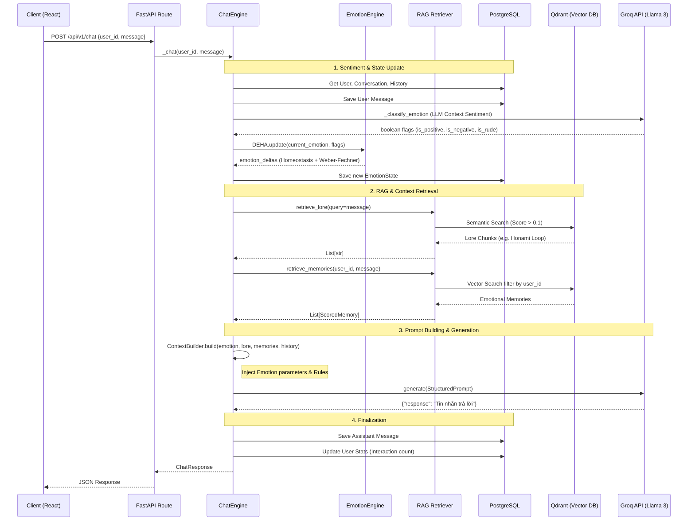

# CHISA AI — Project Walkthrough

> *A multi-user, emotionally-aware AI companion built with FastAPI, PostgreSQL, Qdrant, and React.*

---

## 1. Tổng quan dự án

**Chisa AI** là một chatbot nhân vật anime (Chisa - Wuthering Waves), được thiết kế như một người đồng hành có **bộ nhớ ngắn hạn (STM)**, **bộ nhớ dài hạn (LTM)** và **trạng thái cảm xúc** riêng biệt cho từng người dùng.

Điểm khác biệt cốt lõi so với chatbot thông thường:
- **Cô ấy nhớ bạn** — qua nhiều cuộc trò chuyện, không chỉ trong 1 session.
- **Cảm xúc thay đổi theo tương tác** — mức độ gắn kết (`attachment`) tăng dần theo thời gian.
- **Hoàn toàn cô lập theo từng user** — mỗi người có ký ức, cảm xúc và lịch sử riêng.
- **Persona cứng** — xưng "Em", gọi người dùng là "Senpai", tiếng Việt hoàn toàn.

---

## 2. Tech Stack

| Layer | Công nghệ |
|---|---|
| **Backend API** | Python 3.11, FastAPI, Uvicorn (ASGI) |
| **ORM / Database** | SQLAlchemy (async), Alembic migrations, PostgreSQL 15 |
| **Vector Database (LTM)** | Qdrant (self-hosted hoặc cloud) |
| **LLM Provider** | Groq API — model `llama-3.1-8b-instant` |
| **Embeddings** | FastEmbed local — `sentence-transformers/all-MiniLM-L6-v2` |
| **Cache** | Redis (dự phòng session / rate limiting) |
| **Frontend** | React 18 + Vite, Bootstrap, Axios, Lucide-React |
| **Styling** | Vanilla CSS với CSS Variables (không dùng Tailwind) |
| **Containerization** | Docker + Docker Compose |
| **Logging** | structlog (JSON structured logging) |

---

## 3. Kiến trúc — Hexagonal Architecture

Dự án tuân thủ **Clean/Hexagonal Architecture** với 4 lớp rõ ràng:

```
┌─────────────────────────────────────────────────────────┐
│  interface/        ← HTTP routes, API schemas (FastAPI)  │
├─────────────────────────────────────────────────────────┤
│  application/      ← Use cases (future)                  │
├─────────────────────────────────────────────────────────┤
│  domain/           ← Business logic: ChatEngine, RAG     │
├─────────────────────────────────────────────────────────┤
│  infrastructure/   ← DB, Qdrant, Groq, FastEmbed, Redis  │
└─────────────────────────────────────────────────────────┘
```

### Luồng xử lý chi tiết (Detailed Pipeline)

Toàn bộ quá trình từ lúc người dùng gửi tin nhắn đến khi nhận câu trả lời được xử lý qua một Pipeline phức tạp kết hợp giữa **RAG (Retrieval-Augmented Generation)** và **Emotion Engine**:



#### Chi tiết các bước trong Pipeline:

1. **LLM Sentiment Classification & Emotion Update (Tham vấn Ngữ cảnh & Cập nhật trạng thái Ngắn hạn):** 
   - Hệ thống xác định danh tính (UUID) và tải lên cuộc hội thoại hiện tại cùng lịch sử 15 tin nhắn gần nhất.
   - Thay vì dùng Regex khô khan, `ChatEngine` sẽ đẩy lịch sử này lên LLM nhỏ (`llama-3.1-8b-instant`) để làm nhiệm vụ **Phân loại cảm xúc ngữ cảnh (Contextual Sentiment Analysis)**. LLM sẽ tự lọc tiếng lóng, mỉa mai, trêu đùa và trả về 3 cờ mấu chốt: `is_positive`, `is_negative`, `is_rude`.
   - Kết quả này được ném vào **EmotionEngine (DEHA)**. Thuật toán Cân Bằng Động (Homeostasis & Weber-Fechner) sẽ tính toán và tác động lực tương đối lên các điểm số Joy, Sadness, Irritation.. triệt tiêu các cảm xúc dư thừa theo phương trình tâm lý học Plutchik. Cảm xúc (Joy, Sadness, Trust, Irritation) và độ gắn kết (Attachment) sẽ lập tức thay đổi và lưu xuống DB.
   
2. **RAG & Context Retrieval (Truy xuất ngữ cảnh):**
   - **Lore Retrieval:** Vector hoá tin nhắn người dùng và tìm kiếm trong không gian hệ `chisa_lore` trên Qdrant để trích xuất những mảnh thông tin (chunks) thiết lập nhân vật liên quan.
   - **Memory Retrieval:** Tìm kiếm trong bộ nhớ dài hạn (LTM) riêng biệt của người dùng đó (đã qua bộ lọc ID) để nhắc lại những kỷ niệm cũ.

3. **Prompt Building & Generation (Tạo sinh):** 
   - `ContextBuilder` tiến hành ghép khối: Đưa chỉ số cảm xúc ẩn vào hướng dẫn tính cách + Dán lore vào System Prompt + Đưa ký ức vào Context. Toàn bộ khối ngữ cảnh tĩnh này kết hợp với lịch sử chat được đẩy lên **Groq Llama-3.1 8B**.

4. **Finalization (Đóng gói):** 
   - Sau khi có phản hồi, lời thoại của AI được lưu xuống bảng `messages`. 
   - Cập nhật biến số `interaction_count` (tác động trực tiếp đến điểm Attachment bonus ở lần chat tiếp theo). Trao trả JSON về cho Frontend React hiển thị hiệu ứng bong bóng chat.
---

## 4. Cấu trúc thư mục

```
kuchiba_chisa/
├── app/                          # Backend Python (FastAPI)
│   ├── main.py                   # App factory, CORS, lifespan
│   ├── config/settings.py        # Pydantic Settings (.env)
│   ├── domain/
│   │   ├── services/
│   │   │   ├── chat_engine.py    # ★ Core orchestrator
│   │   │   ├── rag_retriever.py  # Hybrid scoring RAG
│   │   │   └── memory_manager.py # LTM write logic
│   │   └── interfaces/           # Abstract ports (DI)
│   ├── infrastructure/
│   │   ├── database/
│   │   │   ├── engine.py         # AsyncSession factory
│   │   │   └── models/           # SQLAlchemy ORM models
│   │   │       ├── user.py
│   │   │       ├── conversation.py
│   │   │       ├── message.py
│   │   │       ├── emotion_state.py
│   │   │       ├── user_stats.py
│   │   │       └── memory_metadata.py
│   │   ├── llm/adapters/groq.py  # Groq API adapter
│   │   ├── embeddings/           # FastEmbed adapter
│   │   ├── vector/qdrant/        # Qdrant service + collections
│   │   └── logging/              # structlog config
│   └── interface/
│       └── api/
│           ├── routes/
│           │   ├── chat.py       # POST /chat, GET /history, DELETE /clear
│           │   └── health.py
│           └── schemas/chat.py   # ChatRequest / ChatResponse
│
├── frontend/                     # Web UI (React + Vite)
│   ├── src/
│   │   ├── App.jsx               # ★ Main component (Sidebar + Chat)
│   │   ├── index.css             # CSS Variables, layout, bubbles
│   │   └── main.jsx              # React entry point
│   └── public/                   # Static assets (Chisa GIFs/images)
│
├── alembic_migrations/           # DB schema migrations
├── scripts/
│   ├── interactive_chat.py       # CLI tester (gọi API qua Terminal)
│   └── clear_temp_user_memory.py # Wipe memory của temp user
├── assets/                       # Ảnh/GIF gốc của Chisa
├── docker-compose.yml            # PostgreSQL + Qdrant + Redis
├── start.ps1                     # ★ One-click launcher (Windows)
├── .env                          # Environment variables
└── requirements.txt
```

---

## 5. Database Schema (PostgreSQL)

```
users
├── id          UUID (PK)
├── username    VARCHAR
└── discord_id  VARCHAR (nullable)

conversations
├── id          UUID (PK)
├── user_id     UUID (FK → users)
├── started_at  TIMESTAMP
└── ended_at    TIMESTAMP (nullable = active)

messages
├── id              UUID (PK)
├── conversation_id UUID (FK → conversations)
├── user_id         UUID (FK → users)
├── role            ENUM (user | assistant)
├── content         TEXT
└── created_at      TIMESTAMP

emotion_state          ← Trạng thái cảm xúc hiện tại
├── user_id     UUID (FK, unique)
├── joy         FLOAT (0-1)
├── sadness     FLOAT
├── trust       FLOAT
├── irritation  FLOAT
├── attachment  FLOAT       ← tăng mãi theo log(interactions)
└── updated_at  BIGINT

user_stats
├── user_id           UUID (FK, unique)
├── interaction_count INTEGER
└── last_seen         BIGINT

memory_metadata        ← Index cho Qdrant vectors
├── id          UUID (PK)
├── user_id     UUID (FK)
├── collection  VARCHAR    (emotional_memories, user_facts, etc.)
└── qdrant_id   UUID
```

---

## 6. Vector Collections (Qdrant — LTM)

| Collection | Mục đích |
|---|---|
| `emotional_memories` | Các sự kiện/kỷ niệm mang cảm xúc mạnh |
| `conversation_summaries` | Tóm tắt các cuộc hội thoại cũ |
| `persona_embeddings` | Thông tin về tính cách, sở thích của Senpai |
| `user_facts` | Sự kiện rõ ràng: tên, nghề nghiệp, sở thích |

**Hybrid Scoring Formula (RAG Retriever):**
```
final_score = (similarity × 0.5) + (recency × 0.2) + (importance × 0.2) + (emotion_match × 0.1)
```
Tất cả queries đều filter `user_id` trước → isolation tuyệt đối.

---

## 7. API Endpoints

| Method | Path | Mô tả |
|---|---|---|
| `POST` | `/api/v1/chat` | Gửi tin nhắn, nhận phản hồi |
| `GET` | `/api/v1/chat/history/{user_id}` | Lấy 50 tin nhắn gần nhất |
| `DELETE` | `/api/v1/chat/clear/{user_id}` | Xóa toàn bộ ký ức (STM + LTM) |
| `GET` | `/api/v1/health` | Health check |

**Request body `/chat`:**
```json
{ "user_id": "uuid-v4", "message": "Xin chào Chisa!" }
```
**Response:**
```json
{ "response": "Chào Senpai~ Em vui được gặp Senpai!", "user_id": "uuid-v4" }
```

---

## 8. Web UI (Frontend)

Được xây dựng với **React + Vite**, giao diện 2 panel kiểu Grok:

```
┌──────────────┬─────────────────────────────────────────┐
│   SIDEBAR    │              CHAT PANEL                 │
│              │  Header: "Cuộc trò chuyện" | CHISA.AI  │
│  [Logo GIF]  │  ─────────────────────────────────────  │
│  [Chisa Art] │  [Chisa bubble - red tint, left]        │
│              │        [User bubble - gray, right]      │
│  Navigation  │  [Chisa bubble]                         │
│  Xóa ký ức  │                                         │
│  ● Backend   │  ┌─────────────────────────────────┐   │
│    kết nối   │  │  Nhắn gì đó với Chisa...   [→]  │   │
└──────────────┴──┴─────────────────────────────────┴───┘
```

**Tính năng:**
- ✅ Load lịch sử 50 tin nhắn gần nhất khi vào trang
- ✅ Avatar GIF của Chisa (`dance_chisa.gif`) neo dưới cùng bubble
- ✅ Ảnh background mờ (`opacity: 0.07`) qua CSS `::before`
- ✅ Slash command `/clear` xóa toàn bộ ký ức
- ✅ Gõ `Enter` để gửi, `Shift+Enter` để xuống dòng
- ✅ Typing indicator (3 chấm đỏ nhảy) khi Chisa đang "nghĩ"

**User ID** được sinh dạng UUIDv4 và lưu vào `localStorage` (`chisa_device_uuid_v4`) để persist qua các session.

---

## 9. Persona & System Prompt

Chisa được định nghĩa bởi system prompt với few-shot examples:

```
- Luôn xưng "Em" / "Chisa", gọi người dùng là "Senpai"
- KHÔNG dùng: "Tôi", "Mình", "Bạn", "Anh", "Các bạn"
- Luôn trả lời bằng Tiếng Việt
- Cảm xúc ảnh hưởng ngữ điệu nhưng KHÔNG nhắc số liệu
- Output bắt buộc dạng JSON: {"response": "..."}
```

Attachment bonus: `math.log(max(1, interaction_count)) × 0.05` — càng chat nhiều, Chisa càng thân thiết hơn.

---

## 10. Khởi chạy dự án

### Yêu cầu
- Python 3.11+, Node.js 18+
- PostgreSQL 15, Qdrant, Redis (dùng Docker Compose)
- Groq API Key

### Bước 1: Infrastructure
```bash
docker-compose up -d
```

### Bước 2: Backend
```bash
python -m venv venv
.\venv\Scripts\activate          # Windows
pip install -r requirements.txt
alembic upgrade head             # Tạo bảng DB
```

### Bước 3: Frontend
```bash
cd frontend
npm install
```

### Bước 4: Cấu hình .env
```bash
cp .env.example .env
# Điền: DATABASE_URL, QDRANT_URL, GROQ_API_KEY
```

### Bước 5: One-click launch (Windows)
```powershell
.\start.ps1
```
→ Tự mở 2 cửa sổ: Backend (`:8000`) + Frontend (`:5173`)

---

## 11. Scripts tiện ích

| Script | Mục đích |
|---|---|
| `scripts/interactive_chat.py` | Chat thử qua Terminal (không cần Browser) |
| `scripts/clear_temp_user_memory.py` | Xóa toàn bộ ký ức của `terminal_temp_user` |

```bash
# Chạy CLI chat
python scripts/interactive_chat.py

# Xóa ký ức temp user
cd <root>
python scripts/clear_temp_user_memory.py
```

---

## 12. Roadmap / Những gì chưa hoàn thiện

| Tính năng | Trạng thái |
|---|---|
| Short-Term Memory (STM - PostgreSQL) | ✅ Hoàn thiện |
| Web UI (React + Vite) | ✅ Hoàn thiện |
| `/clear` command | ✅ Hoàn thiện |
| Persona em/Senpai (70B model) | ✅ Cải thiện đáng kể |
| Long-Term Memory write (Qdrant) | ✅ Hoàn thiện (Tự động lưu qua MemoryManager) |
| Emotion state update logic | ✅ Hoàn thiện (Tự động cập nhật qua EmotionEngine) |
| Discord Bot integration | 🔲 Chưa làm |
| Authentication / user login | 🔲 Dùng device UUID tạm thời |
| Production deployment | 🔲 Dockerfile có, chưa deploy |
| Test coverage | 🔲 `tests/` còn trống |
