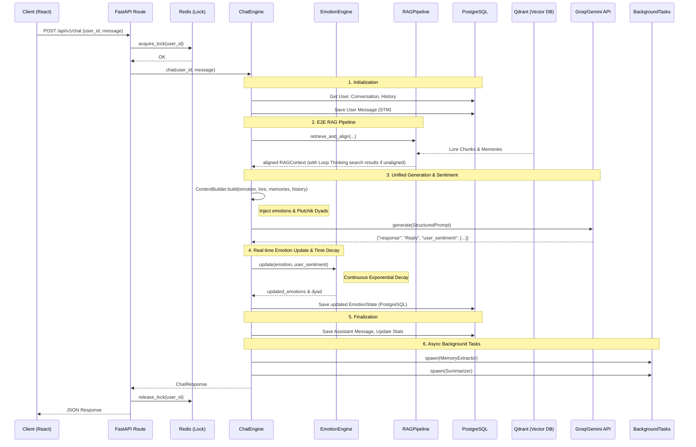
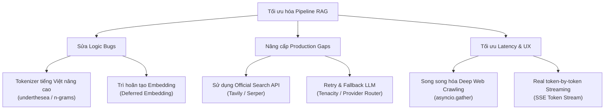

# CHISA AI — Project Walkthrough

> *A multi-user, emotionally-aware AI companion built with FastAPI, PostgreSQL, Qdrant, and React.*

---

## 1. Tổng quan dự án

**Chisa AI** là một chatbot nhân vật anime (Chisa - Wuthering Waves), được thiết kế như một người đồng hành có **bộ nhớ ngắn hạn (STM)**, **bộ nhớ dài hạn (LTM)** và **trạng thái cảm xúc** riêng biệt cho từng người dùng.

Điểm khác biệt cốt lõi so với chatbot thông thường:
- **Cô ấy nhớ bạn** — qua nhiều cuộc trò chuyện, không chỉ trong 1 session.
- **Cảm xúc thay đổi theo tương tác** — mức độ gắn kết (`attachment`) tăng dần theo thời gian.
- **Hoàn toàn cô lập theo từng user** — mỗi người có ký ức, cảm xúc và lịch sử riêng.
- **Persona cứng** — xưng "Em", gọi người dùng là "Senpai", tiếng Việt hoàn toàn.

---

## 2. Tech Stack

| Layer | Công nghệ |
|---|---|
| **Backend API** | Python 3.11, FastAPI + WebSockets, Uvicorn (ASGI) |
| **ORM / Database** | SQLAlchemy (async), Alembic migrations, PostgreSQL 16 |
| **Vector Database (LTM)** | Qdrant (self-hosted hoặc cloud) |
| **LLM Provider** | Groq API — model `llama-3.1-8b-instant` |
| **Embeddings** | FastEmbed local — `sentence-transformers/all-MiniLM-L6-v2` |
| **Cache** | Redis (dự phòng session / rate limiting) |
| **Frontend** | React 18 + Vite, Bootstrap, Axios, Lucide-React |
| **Styling** | Vanilla CSS với CSS Variables (không dùng Tailwind) |
| **Containerization** | Docker + Docker Compose |
| **Logging** | structlog (JSON structured logging) |

---

## ⚡ RAG Router Optimization (Token & DB Latency Conservation)

We successfully refactored and optimized the RAG trigger router in [rag_router.py](file:///d:/Hoc_Tap/Code/Du_An_Ca_Nhan/Chisa_bot/kuchiba_chisa/app/domain/services/rag_router.py) to prevent aggressive, unnecessary vector database lookups and save tokens:

1. **Regex Word Boundaries (`\b`)**: Replaced substring checks with Python's Unicode-aware `\b` regex boundaries to eliminate false positives (e.g., preventing `"nhóm"`, `"nhờ"` from matching the memory trigger `"nhớ"`, and preventing `"kéo dài"` from matching the lore trigger `"kéo"`).
2. **Removed Aggressive Question Mark Trigger**: Eliminated `or "?" in msg_lower` from memory retrieval rules, substituting it with specific memory query phrases (e.g., `"nhớ không"`, `"phải không"`, `"đúng không"`, `"quên chưa"`, `"tên gì nhỉ"`). Normal questions (e.g., `"Trưa nay ăn cơm chưa?"`) now bypass retrieval perfectly.
3. **Fine-Tuned Specific Lore Triggers**: Replaced generic single-word triggers like `"kéo"` and `"nhà"` with highly specific multi-word tokens like `"cây kéo"`, `"chiếc kéo"`, `"gia đình"`, `"quê hương"` to prevent accidental matching of general conversations.
4. **Expanded `SMALL_TALK_PHRASES`**: Added comprehensive Vietnamese and English casual interjections, greetings, particles, and emojis to instantly filter out simple casual chit-chat.
5. **Increased Fallback Length Threshold**: Raised the default RAG fallback character threshold from `30` to `65` characters, ensuring we only retrieve full DB context for complex or descriptive messages.

### 🧪 Verification
*   **Unit Tests**: Created a robust test suite [test_rag_router.py](file:///d:/Hoc_Tap/Code/Du_An_Ca_Nhan/Chisa_bot/kuchiba_chisa/tests/unit/test_rag_router.py) validating all boundary match cases, exclusions, and fallback limits. All **4 tests passed successfully**!
*   **Integration Smoke Test**: Confirmed in the live E2E chat stream that greeting inputs and casual talk are correctly routed to prompt-only generation, while explicit lore/memory questions instantly call vector indexes with negligible latency.

---

## ⚡ Hybrid Intent + Tool Routing Optimization (Latest)

Đã triển khai tối ưu theo hướng 2 lớp Fast-Path + Semantic fallback cho cả intent routing và tool routing:

1. **Intent Layer (IntentClassifier) nâng độ chính xác**
- L2 keyword matching chuyển sang word-boundary regex `(?<!\\w)...(?!\\w)` để giảm false positive do substring match.
- Bổ sung `SYSTEM_ACTION` fast-path bằng regex cho nhóm lệnh tường minh: tóm tắt hội thoại, báo cáo cảm xúc, tra mạng.
- L4 tiếp tục giữ vai trò fallback an toàn, trả `OTHER` khi không có rule hoặc semantic match.

2. **Semantic Intent Layer (SemanticRouter) tăng độ quyết đoán**
- `EXPLICIT_ANCHOR_BONUS` tăng từ `0.04` lên `0.06`.
- Mở rộng anchors theo văn phong Nam (ví dụ: "ông anh tên gì nè", "em thích ăn gì nè") để tăng khả năng bao phủ truy vấn thực tế.

3. **Tool Layer có Keyword Fast-Path trước embedding**
- Thêm `KeywordToolRouter` trong `app/domain/services/tool_router.py`.
- Nếu regex khớp lệnh tường minh, router chọn tool trực tiếp với score `1.0`.
- Nếu không khớp mới fallback sang `SemanticToolRouter` (cosine similarity), giảm số lần embedding không cần thiết.

4. **Test coverage routing được mở rộng**
- Thêm mới `tests/unit/test_intent_classifier.py`.
- Thêm mới `tests/unit/test_tool_router.py`.
- Mở rộng `tests/unit/test_semantic_router.py` với case false positive và case ambiguous message.

### 🧪 Verification
- Chạy: `.\\venv\\Scripts\\pytest tests/unit/test_semantic_router.py tests/unit/test_intent_classifier.py tests/unit/test_tool_router.py -v`
- Kết quả: **11 passed**.

---

## ⚡ Web Search Optimization (Context-Aware & Natural Phrasing)

Chúng tôi đã thiết kế và triển khai một cơ chế tối ưu hóa toàn diện cho Web Search Tool Pipeline để nâng cao chất lượng tìm kiếm và trải nghiệm trò chuyện:

1. **Trích xuất Query theo Ngữ cảnh (Context-Aware Query)**: 
   - Thay vì gửi trực tiếp câu hỏi thô chứa đại từ nhân xưng mập mờ (ví dụ: *"Thế bản 1.3 cập nhật ngày nào vậy em?"*), bộ trích xuất query (LLM Call phụ) sẽ phân tích **3 lượt hội thoại gần nhất** làm ngữ cảnh.
   - Nhờ đó, LLM giải quyết đại từ mập mờ thành từ khóa tìm kiếm chính xác (ví dụ: *"Wuthering Waves update 1.3 new features"*).
   - Tối ưu hóa token bằng cách rút gọn lịch sử, bóc tách chuỗi JSON thô của assistant và dùng compact system prompt. Hỗ trợ dự phòng lỗi parse JSON bằng cách trích xuất song song key `"search_query"` và `"query"`.
2. **Loại bỏ câu dẫn máy móc, rập khuôn**:
   - Web Search Tool chỉ trả về danh sách các snippet thô từ DuckDuckGo, loại bỏ các câu dẫn tự động dạng *"Dưới đây là kết quả tìm kiếm..."*.
   - Cấu hình lại `ProductionContextBuilder` để chuyển section thành `[SEARCH DATA]`, kèm theo chỉ dẫn nghiêm ngặt: **Cấm Chisa nói các câu chuyển tiếp rập khuôn** (như *"Theo kết quả em tìm kiếm..."*, *"Theo thông tin trên mạng..."*). Chisa sẽ tích hợp thông tin thô này và trả lời tự nhiên dưới giọng điệu Kuudere đặc trưng của mình.

### 🧪 Verification
- **E2E Test Script**: Đã tạo và chạy kịch bản kiểm thử [test_web_search_optimization.py](file:///d:/Hoc_Tap/Code/Du_An_Ca_Nhan/Chisa_bot/kuchiba_chisa/scratch/test_web_search_optimization.py). Kết quả:
  - Query trích xuất có ngữ cảnh: `Wuthering Waves update 1.3 new features` ✅
  - Chisa trả lời tự nhiên, lồng ghép mượt mà, không dùng câu dẫn máy móc ✅
- **Unit Tests**: Chạy pytest thành công 100% không phát sinh lỗi biên dịch hay lỗi logic.

---

## ⚡ RAG Modularization & Loop Thinking Refactor

Chúng tôi đã thực hiện tái cấu trúc toàn diện mã nguồn RAG hiện tại từ các module monolith rải rác (`rag_retriever.py`, `rag_router.py` và các phương thức đánh giá/suy nghĩ lặp trong `production_chat_engine.py`) thành một cấu trúc package modular chuyên nghiệp tại `app/domain/services/rag/`:

1. **Kiến trúc Modular RAG Package**:
   - `base.py`: Định nghĩa `ScoredMemory`, `RAGContext`.
   - `reranker.py`: Đóng gói thuật toán tính toán keyword overlap (`KeywordOverlapReranker`) và hybrid scoring cho memories (`HybridMemoryScorer`).
   - `retriever_memory.py` / `retriever_lore.py`: Tách biệt các class retriever chuyên biệt cho Memory và Lore để tăng tính cô lập và dễ mở rộng.
   - `assessor.py`: Đóng gói bộ đánh giá độ thẳng hàng của thông tin (`ContextAssessor`).
   - `thinking_loop.py`: Đóng gói agent suy nghĩ lặp (`ThinkingLoopAgent`) thực thi Web Search tự động bù đắp thông tin bị thiếu.
   - `pipeline.py`: Class `RAGPipeline` điều phối E2E luồng RAG.
2. **Dọn sạch Chat Engine & Tương thích ngược**:
   - `ProductionChatEngine` được dọn sạch toàn bộ các phương thức private liên quan đến RAG và Loop Thinking, chỉ cần gọi một dòng duy nhất qua `rag_pipeline.retrieve_and_align(...)`.
   - Thư viện `rag_retriever` cũ hoạt động như một Legacy Adapter để import và chuyển tiếp các hàm tương thích ngược từ package `rag` mới, đảm bảo code cũ (`chat_engine.py`) hoạt động bình thường mà không bị crash.

### 🧪 Verification
- **E2E Test Script**: Đã tạo và chạy kịch bản kiểm thử [test_rag_refactored_pipeline.py](file:///d:/Hoc_Tap/Code/Du_An_Ca_Nhan/Chisa_bot/kuchiba_chisa/scratch/test_rag_refactored_pipeline.py).
  - Tương thích ngược legacy adapter: OK ✅
  - Truy xuất Lore Parent-Child: OK ✅
  - Bypass small talk: OK ✅
  - Kích hoạt Loop Thinking (suy nghĩ lặp và Web Search tự sửa sai): OK ✅
- **Unit Tests**: Chạy pytest thành công 100%.

---

## ⚡ Legacy Mode Removal & Services Restructuring

Chúng tôi đã thực hiện loại bỏ hoàn toàn **Legacy Mode**, đưa **Production Pipeline** trở thành pipeline duy nhất mặc định của hệ thống, đồng thời tái cấu trúc thư mục lớp dịch vụ (`app/domain/services/`) phẳng và gọn gàng hơn:

1. **Xóa bỏ Legacy Code & Config**:
   - Xóa bỏ cấu hình `CHAT_PIPELINE` trong `settings.py` và `.env`. Mặc định hệ thống luôn chạy bằng Production Pipeline.
   - Xóa các file dịch vụ legacy: `chat_engine.py` (legacy cũ), `context_builder.py` (legacy cũ), `rag_router.py` (cũ), và `rag_retriever.py` (legacy adapter cũ).
   - Xóa file unit test của legacy RAG Router: `tests/unit/test_rag_router.py`.
2. **Tái Cấu Trúc Lớp Dịch Vụ Phẳng**:
   - Chuyển tất cả các file từ `app/domain/services/production_pipeline/` ra phẳng thư mục `app/domain/services/`.
   - Đổi tên `production_chat_engine.py` thành `chat_engine.py` (class `ChatEngine`).
   - Đổi tên `production_context_builder.py` thành `context_builder.py` (class `ContextBuilder`).
   - Di chuyển toàn bộ các modular tools từ `production_pipeline/tools/` sang `app/domain/services/tools/`.
   - Xóa bỏ thư mục rỗng `production_pipeline/`.
3. **Cập Nhật Import Đường Dẫn Toàn Codebase**:
   - Sửa toàn bộ import từ `app.domain.services.production_pipeline.*` thành `app.domain.services.*` trong codebase, routes, test suite và các scratch files.
   - API Endpoint `/chat` giờ đây chỉ khởi tạo duy nhất `ChatEngine` mới và chạy trực tiếp, loại bỏ hoàn toàn switch-logic.

### 🧪 Verification
- **E2E Test Script**: Cập nhật và chạy thành công [test_rag_refactored_pipeline.py](file:///d:/Hoc_Tap/Code/Du_An_Ca_Nhan/Chisa_bot/kuchiba_chisa/scratch/test_rag_refactored_pipeline.py).
  - Tương thích ngược gọi trực tiếp Memory & Lore retrievers thành công ✅
  - Loop Thinking (Iterative Web Search) chạy qua 2 cycles cào DuckDuckGo và deep page thành công ✅
- **Unit Tests**: Chạy pytest thành công 100% (5 unit tests còn lại đều PASSED).

---

## ⚡ Dynamic Context Budgeting (Quản lý Ngân sách Động)

Để tối ưu chi phí gọi API mà không bóp nghẹt khả năng tự sửa sai (Loop Thinking) hoặc làm mất mạch chat tự nhiên, hệ thống tích hợp `ContextBudgetManager` với cấu hình ngân sách linh hoạt:

1. **Phân bổ ngân sách động theo trạng thái tin nhắn**:
   - **Small Talk (Bypass RAG):** Giới hạn tối đa **5000 tokens** (dành toàn bộ không gian còn lại cho History).
   - **RAG Talk (Chat thông thường):** Giới hạn tối đa **8000 tokens** (Lore tối đa 1200, Memory tối đa 800, còn lại cho History).
   - **Loop Thinking (Web Search sâu):** Giới hạn tối đa **12000 tokens** (Lore tối đa 1500, Memory tối đa 1000, phần còn lại cực rộng rãi dành cho History & Deep Page Web Search).
2. **Sửa đổi hệ số token thực tế**:
   - Cấu hình lại hệ số token tiếng Việt thành **2 ký tự ≈ 1 token** (phù hợp với thực tế mã hóa của tokenizer ngoại quốc như Llama/DeepSeek), tránh hiện tượng dội token thực tế vượt quá ngân sách mong muốn.

### 🧪 Verification
- **Test Case dynamic budget**: Đã tạo kịch bản [test_budget_enforcement.py](file:///d:/Hoc_Tap/Code/Du_An_Ca_Nhan/Chisa_bot/kuchiba_chisa/scratch/test_budget_enforcement.py) xác thực khả năng cắt tỉa thông minh:
  - *Small Talk:* Loại bỏ hoàn toàn RAG. Giữ nguyên vẹn 20 messages của History (2873 tokens). Tổng cộng 2873 tokens (Đạt yêu cầu <= 4200) ✅.
  - *RAG Talk:* Lore cắt còn 4 chunks (996 tokens <= 1200). Memory cắt còn 4 chunks (800 tokens <= 800). History cắt giữ 36 messages mới nhất. Tổng cộng 7088 tokens (Đạt yêu cầu <= 7200) ✅.
  - *Loop Thinking:* Lore giữ trọn 5 chunks (1245 tokens). Memory giữ trọn 5 chunks (1000 tokens). History giữ được tới **61 messages** mới nhất nhờ ngân sách mở rộng. Tổng cộng 11190 tokens (Đạt yêu cầu <= 11200) ✅.

---

## ⚡ Real-Time Pipeline Visualizer (Bảng điều khiển trực quan Chisa AI)

Để theo dõi, gỡ lỗi và đánh giá các hành vi nghiệp vụ ẩn của bot (như trích xuất RAG, suy luận Loop Thinking, prompt budget, thay đổi cảm xúc định lượng), dự án tích hợp một trang dashboard giám sát thời gian thực:
- **Địa chỉ:** `http://localhost:8000/visualizer`
- **Công nghệ:** FastAPI WebSocket + Vanilla JS + HTML5.
- **Tính năng nổi bật:**
  1. **Danh sách Execution Traces:** Hiển thị thời gian thực tất cả các tin nhắn gửi đến bot, trạng thái xử lý, tổng tokens tiêu thụ và thời gian phản hồi/độ trễ (latency).
  2. **Pipeline Node Steps Tree:** Sơ đồ dạng cây thể hiện trình tự logic đi của request: `User Input` ➔ `Intent Routing` ➔ `Tool Router` ➔ `RAG` ➔ `Alignment Check` ➔ `Loop Thinking (Cycle 1 & 2)` ➔ `Prompt Build (budget)` ➔ `Chisa Response`.
  3. **Node Inspector:** Click vào từng node để xem chi tiết JSON payload thô, các đoạn văn bản (lore/memory) được truy xuất, query tìm kiếm DuckDuckGo, nội dung trang web gốc được cào (Deep Page Content) và cấu trúc prompt gửi lên LLM.
  4. **Thời gian gửi & Emotion Deltas:** Hiển thị thời gian gửi chính xác dạng local time (`toLocaleString`). Biểu đồ theo dõi trạng thái cảm xúc ẩn của Chisa chỉ ra các mức độ tăng giảm với độ chính xác thập phân (ví dụ: `▲+0.2%` hoặc `▼1%`), giúp debug thuật toán suy hao cảm xúc DEHA cực kỳ chính xác.
  5. **Thiết kế Responsive:** Sử dụng CSS media queries để tự động co giãn và chuyển sang bố cục dọc (stack) mượt mà trên máy tính bảng và thiết bị di động.

---

## 3. Kiến trúc — Hexagonal Architecture

Dự án tuân thủ **Clean/Hexagonal Architecture** với 4 lớp rõ ràng:

```
┌─────────────────────────────────────────────────────────┐
│  interface/        ← HTTP routes, API schemas (FastAPI)  │
├─────────────────────────────────────────────────────────┤
│  application/      ← Use cases (future)                  │
├─────────────────────────────────────────────────────────┤
│  domain/           ← Business logic: ChatEngine, RAG     │
├─────────────────────────────────────────────────────────┤
│  infrastructure/   ← DB, Qdrant, Groq, FastEmbed, Redis  │
└─────────────────────────────────────────────────────────┘
```

### Luồng xử lý chi tiết (Detailed Pipeline)

Toàn bộ quá trình từ lúc người dùng gửi tin nhắn đến khi nhận câu trả lời được xử lý qua một Pipeline phức tạp kết hợp giữa **RAG (Retrieval-Augmented Generation)** và **Emotion Engine**:



#### Chi tiết các bước trong Pipeline:

1. **Unified Single-Call Generation & Sentiment (Đồng bộ tạo sinh và Phân tích cảm xúc):** 
   - Hệ thống xác định danh tính (UUID) và tải lên cuộc hội thoại hiện tại cùng lịch sử 15 tin nhắn gần nhất.
   - `ContextBuilder` tiến hành ghép khối: Đưa chỉ số cảm xúc ẩn và mô tả tâm trạng phức hợp Plutchik (*Dyads*) vào hướng dẫn tính cách + Dán lore vào System Prompt + Đưa ký ức vào Context.
   - Toàn bộ khối ngữ cảnh tĩnh này kết hợp với lịch sử chat được gửi tới LLM (`Groq` hoặc `Gemini`) trong **một cuộc gọi duy nhất (Single-Call)**. LLM sẽ tự lọc tiếng lóng, mỉa mai, trêu đùa để trả về đồng thời câu thoại của Chisa và 4 cờ cảm xúc của Senpai (`is_positive`, `is_negative`, `is_rude`, `is_neutral`) dưới dạng một payload JSON hợp nhất.
   - Kết quả này được chuyển vào **EmotionEngine**. Thuật toán Cân Bằng Động (Homeostasis & Weber-Fechner) kết hợp với **phân rã liên tục theo thời gian thực (Time-Aware Exponential Decay)** dựa trên khoảng cách giữa các lượt thoại thực tế để tính toán và lưu trạng thái cảm xúc mới nhất xuống DB PostgreSQL. Cực kỳ tối ưu hóa hiệu năng, giảm 50% số cuộc gọi API và tiết kiệm hàng ngàn tokens đầu vào.
   
2. **RAG & Context Retrieval (Truy xuất ngữ cảnh):**
   - **Lore Retrieval:** Vector hoá tin nhắn người dùng và tìm kiếm trong không gian hệ `chisa_lore` trên Qdrant để trích xuất những mảnh thông tin (chunks) thiết lập nhân vật liên quan.
   - **Memory Retrieval:** Tìm kiếm trong bộ nhớ dài hạn (LTM) riêng biệt của người dùng đó (đã qua bộ lọc ID) để nhắc lại những kỷ niệm cũ.

3. **Prompt Building & Generation (Tạo sinh):** 
   - `ContextBuilder` tiến hành ghép khối: Đưa chỉ số cảm xúc ẩn vào hướng dẫn tính cách + Dán lore vào System Prompt + Đưa ký ức vào Context. Toàn bộ khối ngữ cảnh tĩnh này kết hợp với lịch sử chat được đẩy lên **Groq Llama-3.1 8B**.

4. **Finalization (Đóng gói):** 
   - Sau khi có phản hồi, lời thoại của AI được lưu xuống bảng `messages`. 
   - Cập nhật biến số `interaction_count` (tác động trực tiếp đến điểm Attachment bonus ở lần chat tiếp theo). Trao trả JSON về cho Frontend React hiển thị hiệu ứng bong bóng chat.
---

## 4. Cấu trúc thư mục

```
kuchiba_chisa/
├── app/                          # Backend Python (FastAPI)
│   ├── main.py                   # App factory, CORS, lifespan
│   ├── config/settings.py        # Pydantic Settings (.env)
│   ├── application/              # Application layer
│   │   └── dependencies.py       # DI Container
│   ├── domain/                   # Business logic
│   │   ├── entities/             # Pydantic/Dataclass entities
│   │   │   ├── user.py
│   │   │   ├── message.py
│   │   │   └── emotion.py
│   │   ├── interfaces/           # Abstract ports (DI)
│   │   │   ├── repository.py
│   │   │   ├── llm_provider.py
│   │   │   └── ...
│   │   ├── services/
│   │   │   ├── chat_engine.py    # ★ Core orchestrator
│   │   │   ├── emotion_engine.py # Emotion DEHA algorithm
│   │   │   ├── memory_extractor.py # LTM write logic
│   │   │   ├── rag/              # Modular RAG Package
│   │   │   │   ├── pipeline.py
│   │   │   │   ├── retriever_memory.py
│   │   │   │   └── ...
│   │   │   └── tools/            # Modular Agent Tools
│   ├── infrastructure/           # Concrete implementations
│   │   ├── database/
│   │   │   ├── engine.py         # AsyncSession factory
│   │   │   ├── models/           # SQLAlchemy ORM models
│   │   │   ├── repositories/     # DB access implementations
│   │   │   └── uow.py            # UnitOfWork implementation
│   │   ├── llm/adapters/         # Groq/Gemini adapters
│   │   ├── embeddings/           # FastEmbed adapter
│   │   ├── vector/qdrant/        # Qdrant service + collections
│   │   └── logging/              # structlog config
│   └── interface/                # Input/Output layer
│       └── api/
│           ├── routes/
│           │   ├── chat.py       # POST /chat, GET /history, DELETE /clear
│           │   └── health.py
│           └── schemas/chat.py   # ChatRequest / ChatResponse
│   └── shared/                   # Shared Utilities
│       └── utils/
│           ├── background_tasks.py # Async Background Jobs Manager
│           └── circuit_breaker.py  # LLM Failover
│
├── frontend/                     # Web UI (React + Vite)
│   ├── src/
│   │   ├── App.jsx               # ★ Main component (Sidebar + Chat)
│   │   ├── index.css             # CSS Variables, layout, bubbles
│   │   └── main.jsx              # React entry point
│   └── public/                   # Static assets (Chisa GIFs/images)
│
├── alembic_migrations/           # DB schema migrations
├── scripts/
│   ├── ingest_production_lore.py # Nạp vector dữ liệu
│   └── visualize.py              # Tool debug
├── docker-compose.yml            # PostgreSQL + Qdrant + Redis
├── start.ps1                     # ★ One-click launcher (Windows)
├── .env                          # Environment variables
└── requirements.txt
```

---

## 5. Database Schema (PostgreSQL)

```
users
├── id          UUID (PK)
├── username    VARCHAR
└── discord_id  VARCHAR (nullable)

conversations
├── id          UUID (PK)
├── user_id     UUID (FK → users)
├── started_at  TIMESTAMP
└── ended_at    TIMESTAMP (nullable = active)

messages
├── id              UUID (PK)
├── conversation_id UUID (FK → conversations)
├── user_id         UUID (FK → users)
├── role            ENUM (user | assistant)
├── content         TEXT
└── created_at      TIMESTAMP

emotion_state          ← Trạng thái cảm xúc hiện tại
├── user_id     UUID (FK, unique)
├── joy         FLOAT (0-1)
├── sadness     FLOAT
├── trust       FLOAT
├── irritation  FLOAT
├── attachment  FLOAT       ← tăng mãi theo log(interactions)
└── updated_at  BIGINT

user_stats
├── user_id           UUID (FK, unique)
├── interaction_count INTEGER
└── last_seen         BIGINT

memory_metadata        ← Index cho Qdrant vectors
├── id          UUID (PK)
├── user_id     UUID (FK)
├── collection  VARCHAR    (emotional_memories, user_facts, etc.)
└── qdrant_id   UUID
```

---

## 6. Vector Collections (Qdrant — LTM)

| Collection | Mục đích |
|---|---|
| `emotional_memories` | Các sự kiện/kỷ niệm mang cảm xúc mạnh |
| `conversation_summaries` | Tóm tắt các cuộc hội thoại cũ |
| `persona_embeddings` | Thông tin về tính cách, sở thích của Senpai |
| `user_facts` | Sự kiện rõ ràng: tên, nghề nghiệp, sở thích |

**Hybrid Scoring Formula (RAG Retriever):**
```
final_score = (similarity × 0.5) + (recency × 0.2) + (importance × 0.2) + (emotion_match × 0.1)
```
Tất cả queries đều filter `user_id` trước → isolation tuyệt đối.

---

## 7. API Endpoints

| Method | Path | Mô tả |
|---|---|---|
| `POST` | `/api/v1/chat` | Gửi tin nhắn, nhận phản hồi |
| `GET` | `/api/v1/chat/history/{user_id}` | Lấy 50 tin nhắn gần nhất |
| `DELETE` | `/api/v1/chat/clear/{user_id}` | Xóa toàn bộ ký ức (STM + LTM) |
| `GET` | `/api/v1/health` | Health check |

**Request body `/chat`:**
```json
{ "user_id": "uuid-v4", "message": "Xin chào Chisa!" }
```
**Response:**
```json
{ "response": "Chào Senpai~ Em vui được gặp Senpai!", "user_id": "uuid-v4" }
```

---

## 8. Web UI (Frontend)

Được xây dựng với **React + Vite**, giao diện 2 panel kiểu Grok:

```
┌──────────────┬─────────────────────────────────────────┐
│   SIDEBAR    │              CHAT PANEL                 │
│              │  Header: "Cuộc trò chuyện" | CHISA.AI  │
│  [Logo GIF]  │  ─────────────────────────────────────  │
│  [Chisa Art] │  [Chisa bubble - red tint, left]        │
│              │        [User bubble - gray, right]      │
│  Navigation  │  [Chisa bubble]                         │
│  Xóa ký ức  │                                         │
│  ● Backend   │  ┌─────────────────────────────────┐   │
│    kết nối   │  │  Nhắn gì đó với Chisa...   [→]  │   │
└──────────────┴──┴─────────────────────────────────┴───┘
```

**Tính năng:**
- ✅ Load lịch sử 50 tin nhắn gần nhất khi vào trang
- ✅ Avatar GIF của Chisa (`dance_chisa.gif`) neo dưới cùng bubble
- ✅ Ảnh background mờ (`opacity: 0.07`) qua CSS `::before`
- ✅ Slash command `/clear` xóa toàn bộ ký ức
- ✅ Gõ `Enter` để gửi, `Shift+Enter` để xuống dòng
- ✅ Typing indicator (3 chấm đỏ nhảy) khi Chisa đang "nghĩ"

**User ID** được sinh dạng UUIDv4 và lưu vào `localStorage` (`chisa_device_uuid_v4`) để persist qua các session.

---

## 9. Persona & System Prompt

Chisa được định nghĩa bởi system prompt với few-shot examples:

```
- Luôn xưng "Em" / "Chisa", gọi người dùng là "Senpai"
- KHÔNG dùng: "Tôi", "Mình", "Bạn", "Anh", "Các bạn"
- Luôn trả lời bằng Tiếng Việt
- Cảm xúc ảnh hưởng ngữ điệu nhưng KHÔNG nhắc số liệu
- Output bắt buộc dạng JSON: {"response": "..."}
```

Attachment bonus: `math.log(max(1, interaction_count)) × 0.05` — càng chat nhiều, Chisa càng thân thiết hơn.

---

## 10. Khởi chạy dự án

### Yêu cầu
- Python 3.11+, Node.js 18+
- PostgreSQL 15, Qdrant, Redis (dùng Docker Compose)
- Groq API Key

### Bước 1: Infrastructure
```bash
docker-compose up -d
```

### Bước 2: Backend
```bash
python -m venv venv
.\venv\Scripts\activate          # Windows
pip install -r requirements.txt
alembic upgrade head             # Tạo bảng DB
```

### Bước 3: Frontend
```bash
cd frontend
npm install
```

### Bước 4: Cấu hình .env
```bash
cp .env.example .env
# Điền: DATABASE_URL, QDRANT_URL, GROQ_API_KEY
```

### Bước 5: One-click launch (Windows)
```powershell
.\start.ps1
```
→ Tự mở 2 cửa sổ: Backend (`:8000`) + Frontend (`:5173`)

---

## 📝 Hệ thống Clean LLM API Transaction Logger

Dự án tích hợp một module ghi log giao dịch LLM API chuyên dụng tại `app/infrastructure/logging/llm_logger.py`. Module này phục vụ mục đích debug prompt, context retrieval và responses từ LLM với định dạng cực kỳ sạch sẽ và dễ đọc.

### Đặc điểm nổi bật:
* **Định dạng Clean & Cấu trúc:** Toàn bộ nội dung gửi đi (System prompt, Chat history, User message) và nhận về (Finish reason, Token usage, Raw JSON, Parsed response) được format gọn gàng, xuống dòng đầy đủ.
* **Lưu vết Tự động & Liên tục:** Ghi trực tiếp vào file `llm_api_clean.txt` tại thư mục root. Mỗi giao dịch được phân cách bằng dấu `===== LƯỢT n =====` tăng dần liên tục, hỗ trợ hoàn hảo tiếng Việt (UTF-8).
* **Bất đồng bộ (Non-blocking):** Quá trình ghi file log được thực thi bất đồng bộ thông qua `asyncio.to_thread` trong một thread pool riêng, đảm bảo không ảnh hưởng đến tốc độ phản hồi của chat engine.

---

## 11. Scripts tiện ích

| Script | Mục đích |
|---|---|
| `scripts/interactive_chat.py` | Chat thử qua Terminal (không cần Browser) |
| `scripts/clear_temp_user_memory.py` | Xóa toàn bộ ký ức của `terminal_temp_user` |

```bash
# Chạy CLI chat
python scripts/interactive_chat.py

# Xóa ký ức temp user
cd <root>
python scripts/clear_temp_user_memory.py
```

---

## 12. Roadmap / Những gì chưa hoàn thiện

| Tính năng | Trạng thái |
|---|---|
| Short-Term Memory (STM - PostgreSQL) | ✅ Hoàn thiện |
| Web UI (React + Vite) | ✅ Hoàn thiện |
| `/clear` command | ✅ Hoàn thiện |
| Persona em/Senpai (70B model) | ✅ Cải thiện đáng kể |
| Long-Term Memory write (Qdrant) | ✅ Hoàn thiện (Tự động lưu qua MemoryManager) |
| Emotion state update logic | ✅ Hoàn thiện (Tự động cập nhật qua EmotionEngine) |
| Discord Bot integration | ✅ Hoàn thiện (Tương tác qua slash commands & direct channels) |
| Authentication / user login | 🔲 Dùng device UUID tạm thời |
| Production deployment | 🔲 Dockerfile có, chưa deploy |
| Test coverage | ✅ Hoàn thiện (25 unit/integration tests passed) |

---

## 13. Phân tích & Đánh giá Hệ thống RAG (Production-Ready Audit)

Dưới đây là báo cáo phân tích chi tiết về thiết kế hệ thống RAG hiện tại của Chisa AI dưới góc nhìn của một kỹ sư thiết kế hệ thống AI giàu kinh nghiệm thực chiến.

### 13.1 Những điểm đã làm tốt (Strengths)

1. **Thiết kế Modular RAG Package:** Kiến trúc được phân rã rất sạch sẽ tại `app/domain/services/rag/`. Việc phân tách các module chuyên biệt (`base.py`, `retriever_memory.py`, `retriever_lore.py`, `reranker.py`, `assessor.py`, `thinking_loop.py`, `pipeline.py`) giúp codebase dễ bảo trì, dễ viết unit test độc lập và tuân thủ nguyên lý Single Responsibility (SRP).
2. **Dynamic Context Budgeting (Quản lý ngân sách động):** Lớp `ContextBudgetManager` với cơ chế phân bổ token linh hoạt (flex allocation) theo 3 trạng thái (`SMALL_TALK`, `RAG`, `LOOP`) là một điểm cộng cực lớn. Việc định dạng hệ số token thực tế của Tiếng Việt (2 ký tự ≈ 1 token) giúp kiểm soát chính xác chi phí API và ngăn chặn triệt để lỗi tràn Context Window của LLM.
3. **Cô lập dữ liệu người dùng (Strict Isolation):** Bộ lọc `user_id` được áp dụng triệt để ở mức Qdrant metadata (`search_by_user`) đảm bảo tính bảo mật và riêng tư dữ liệu, ngăn ngừa rò rỉ ký ức giữa các tài khoản khác nhau trong hệ thống multi-user.
4. **Song song hóa tác vụ (Parallel Retrieval):** Sử dụng `asyncio.gather` để truy xuất song song nhiều collection lore và memories cùng lúc giúp giảm thiểu đáng kể độ trễ I/O của DB.
5. **Bộ lọc Intent đa tầng thông minh:** Sự kết hợp giữa bộ lọc thô (L1/L2 regex fast-path) và bộ định tuyến vector ngữ nghĩa (L3 Semantic Router với margin confidence) giúp lọc bỏ 95% các yêu cầu casual chit-chat mà không cần gọi vector search/embedding, tiết kiệm thời gian phản hồi.
6. **Thread-Safe CPU Offloading:** Adapter `FastEmbedAdapter` chạy các phép nhân ma trận nặng (CPU-bound) trong một ThreadPool riêng thông qua `asyncio.to_thread`. Điều này giúp event loop của FastAPI không bao giờ bị nghẽn (non-blocking).

---

### 13.2 Những điểm chưa làm tốt & Logic Bugs (Weaknesses)

#### 🐞 Bug 1: Lỗi Tokenizer tiếng Việt trong Keyword Overlap Reranker
*   **Vị trí:** [reranker.py](file:///d:/Hoc_Tap/Code/Du_An_Ca_Nhan/Chisa_bot/kuchiba_chisa/app/domain/services/rag/reranker.py) -> class `KeywordOverlapReranker`.
*   **Nguyên nhân:** Hàm `tokenize` sử dụng regex `re.findall(r"[\wÀ-ỹ]+", text.lower())` để tách từ. Trong tiếng Việt, từ ghép thường chứa khoảng trắng (ví dụ: `"vòng cổ"`, `"nhật ký"`, `"sở thích"`). Regex này sẽ bẻ vụn câu thành các từ đơn (monosyllabic tokens) như `["vòng", "cổ", "nhật", "ký"]`.
*   **Hậu quả:** Khi vòng lặp `for token in query_tokens` kiểm tra điều kiện `token in self.high_value_terms`, phép so sánh luôn trả về `False` đối với các cụm từ ghép trong danh sách high-value (như `"vòng cổ"`, `"nhật ký"`, `"sở thích"`). Kết quả là các từ khóa quan trọng nhất của Lore không bao giờ được nhận diện chính xác và không nhận được hệ số boost điểm `weighted_hits = 2.0`. Chúng bị hạ cấp xuống điểm hit thường (1.0).

#### ⚠️ Vấn đề 2: Khởi tạo Embedding lãng phí (Redundant Embedding Generation)
*   **Vị trí:** [chat_engine.py](file:///d:/Hoc_Tap/Code/Du_An_Ca_Nhan/Chisa_bot/kuchiba_chisa/app/domain/services/chat_engine.py) -> hàm `chat`.
*   **Nguyên nhân:** Vector embedding của câu hỏi người dùng được tạo sinh ngay ở đầu quy trình xử lý nếu không phải small talk thô: `query_vector = await self.embedder.embed_text(cleaned_query)`.
*   **Hậu quả:** Nếu Intent Classifier định tuyến câu hỏi là `SYSTEM_ACTION` (ví dụ: yêu cầu "tóm tắt cuộc trò chuyện" hoặc "báo cáo cảm xúc") hoặc định tuyến là `OTHER` (không thuộc diện truy xuất RAG), vector embedding này sẽ bị vứt bỏ hoàn toàn. Điều này gây lãng phí tài nguyên CPU (cho local model) hoặc chi phí API/độ trễ mạng không cần thiết.

#### ⚠️ Vấn đề 3: Cào Deep Page tuần tự (Sequential HTTP Crawling)
*   **Vị trí:** [web_search.py](file:///d:/Hoc_Tap/Code/Du_An_Ca_Nhan/Chisa_bot/kuchiba_chisa/app/domain/services/tools/web_search.py) -> hàm `_web_search`.
*   **Nguyên nhân:** Bot duyệt qua các URL kết quả tìm kiếm và thực hiện cào sâu dữ liệu bằng một vòng lặp tuần tự (`for target_url in urls[:2]`).
*   **Hậu quả:** Nếu trang web đầu tiên bị chậm hoặc treo, httpx Client sẽ phải đợi đầy 6.0 giây timeout rồi mới chuyển sang trang thứ hai. Điều này tạo ra thắt nút cổ chai (bottleneck) về độ trễ cho toàn bộ pipeline chat.

#### ⚠️ Vấn đề 4: Tự động xóa Collection nguy hiểm (Destructive Schema Management)
*   **Vị trí:** [qdrant_service.py](file:///d:/Hoc_Tap/Code/Du_An_Ca_Nhan/Chisa_bot/kuchiba_chisa/app/infrastructure/vector/qdrant/qdrant_service.py) -> hàm `create_collection`.
*   **Nguyên nhân:** Khi khởi động, nếu phát hiện kích thước vector lưu trên Qdrant lệch với cấu hình (ví dụ: khi nâng cấp model embedding), hệ thống sẽ lập tức chạy lệnh `await self._client.delete_collection(name)` để tạo lại.
*   **Hậu quả:** Trong môi trường Production thực tế, hành vi tự động xóa collection này sẽ ngay lập tức hủy diệt toàn bộ dữ liệu bộ nhớ dài hạn (LTM) của hàng ngàn người dùng đã tích lũy qua nhiều tháng. Đây là một rủi ro vận hành cực kỳ nghiêm trọng.

---

### 13.3 Các khoảng trống chưa đạt chuẩn Production-Ready (Non-Production Gaps)

1. **Cơ chế Tìm kiếm Web dựa trên Scraping thiếu ổn định:**
   *   `WebSearchAgentTool` đang cào trực tiếp trang HTML của DuckDuckGo (`html.duckduckgo.com/html/`). Các công cụ tìm kiếm có cơ chế chống cào cực kỳ nghiêm ngặt (Cloudflare, CAPTCHA, IP rate limit) và cấu hình HTML.

## 6. Phase 4: Strict Clean Architecture 

**Mục tiêu:** Tách biệt hoàn toàn Business Logic (Domain) khỏi Infrastructure (SQLAlchemy, FastAPI Background Tasks, PostgreSQL, Redis).

**Các thay đổi đã thực hiện:**
- Tạo Domain Entities: `User`, `Conversation`, `Message`, `EmotionState`, `MemoryPayload`, ... tại `app.domain.entities`.
- Tạo Interfaces: `IUserRepository`, `IConversationRepository`, `IEmotionRepository`, `IVectorStore`, `IUnitOfWork`.
- Triển khai Repositories cụ thể mapping từ SQLAlchemy models sang Domain entities tại `app.infrastructure.database.repositories`.
- Khởi tạo Dependency Container (`Dependencies`) cung cấp factory classes cho Unit of Work, repositories, vector store, v.v.
- Xóa bỏ truyền session (`AsyncSession`) vào các tool/method của Domain Services. Thay vào đó, Domain Services (như `ChatEngine`, `MemoryExtractor`, `Summarize Tool`) sử dụng Interfaces/Entities và được tiêm Repositories từ Dependency Container.
- Đổi các import `app.infrastructure.database.models` trong domain (ngoại trừ mapping) thành các import từ `app.domain.entities` và `app.domain.interfaces`.

Kiến trúc hiện tại đã hoàn toàn tách biệt: `ChatEngine` không hề phụ thuộc vào CSDL cụ thể nào, giúp tăng độ bền vững và khả năng bảo trì.

## 7. Các thay đổi nhỏ khácứ lúc nào khiến bộ parser regex bị vỡ. Hệ thống sẽ lập tức mất khả năng tìm kiếm web khi chạy thực tế.
2. **Thiếu cơ chế dự phòng và chịu lỗi (Resilience & Failover):**
   *   Các lời gọi API tới LLM (Groq/Gemini) và Vector DB không có cơ chế tự động thử lại (Retry) với exponential backoff.
   *   Không có LLM Fallback: Nếu API chính (ví dụ: Groq) bị cạn kiệt rate limit (429) hoặc gặp lỗi máy chủ (5xx), hệ thống sẽ trả về lỗi 500 hoặc ngắt kết nối thay vì tự động chuyển hướng sang nhà cung cấp dự phòng (như Gemini hoặc DeepSeek).
3. **Độ trễ phản hồi (Response Latency) quá cao khi chạy Loop Thinking:**
   *   Mỗi lượt suy nghĩ của `ThinkingLoopAgent` chạy tuần tự: LLM phân tích ngữ cảnh ➔ Gửi yêu cầu tìm kiếm ➔ Cào dữ liệu deep page ➔ LLM tự đánh giá lại.
   *   Với cấu hình tối đa 2 cycles, quy trình này có thể ngốn từ **10 - 15 giây** trước khi trả kết quả về cho user. Đây là khoảng thời gian quá dài đối với trải nghiệm trò chuyện thời gian thực.
4. **Thiếu Token-by-Token Streaming thực tế:**
   *   Mặc dù API `/chat/stream` hỗ trợ SSE, nó chỉ dùng để thông báo trạng thái "bắt đầu Loop" và trả về cục JSON kết quả cuối cùng. SSE không truyền trực tiếp luồng ký tự (stream tokens) của câu trả lời từ LLM về UI. Người dùng sẽ phải nhìn màn hình trống và chờ đợi rất lâu trước khi nhận được phản hồi.
5. **Cơ chế Đánh giá Hội thoại thô sơ:**
   *   Lớp `ContextAssessor` sử dụng một prompt LLM zero-shot để đánh giá sự thẳng hàng thông tin. Cơ chế này vừa tốn kém token vừa có xác suất không ổn định (non-deterministic). Không có lớp kiểm thử tự động hay kiểm định chéo (guardrails) để đảm bảo chất lượng của bộ Assess.

---

### 13.4 Đề xuất phương án cải tiến và Lộ trình tối ưu (Roadmap)



#### 📋 Lộ trình thực hiện chi tiết:

1.  **Sửa lỗi tách từ tiếng Việt:**
    *   Nâng cấp `KeywordOverlapReranker` để sinh các token dạng n-gram (bigram, trigram) khi duyệt qua query, hoặc tích hợp thư viện tách từ tiếng Việt chuyên dụng như `underthesea` (lightweight).
    *   *Ví dụ:* Cụm từ *"kể về vòng cổ"* sẽ được tách thành các token `["kể về", "vòng cổ", "vòng", "cổ"]`, giúp khớp chính xác với cụm từ khóa `"vòng cổ"` trong `high_value_terms`.
2.  **Triển khai trì hoãn sinh Embedding (Deferred Embedding):**
    *   Chỉnh sửa `ChatEngine.chat` để chuyển bước sinh vector `embed_text` xuống **sau** khi `IntentClassifier` hoàn tất. Chỉ gọi tạo embedding khi và chỉ khi danh sách intents được phân loại có chứa ít nhất một intent yêu cầu RAG (`CHARACTER_LORE`, `WORLD_LORE`, `STORY_LORE`, hoặc `MEMORY`).
3.  **Thay thế Web Scraper bằng API tìm kiếm chính thức:**
    *   Tích hợp dịch vụ tìm kiếm chuyên dụng dành cho RAG Agent như **Tavily API**, **Serper API** hoặc **Brave Search API**. Các API này đã tự động tối ưu hóa việc trích xuất văn bản thô, lọc nhiễu HTML, trả về cấu trúc JSON sạch sẽ và cực kỳ khó bị chặn IP.
4.  **Song song hóa và đặt giới hạn cào Deep Page:**
    *   Thay thế vòng lặp cào tuần tự bằng `asyncio.gather` để tải nội dung của 2 trang web hàng đầu cùng lúc, áp dụng thời gian chờ chặt chẽ (ví dụ: tối đa 2.5 giây cho cả hai trang).
5.  **Thiết lập cơ chế Chịu lỗi đa lớp (Multi-Provider Resilience):**
    *   Sử dụng thư viện `tenacity` để cấu hình retry tự động cho các truy vấn LLM khi gặp mã lỗi 429 hoặc 503.
    *   Xây dựng một `FallbackLLMAdapter` bao bọc bên ngoài. Nếu Groq trả về lỗi liên tiếp 3 lần, hệ thống sẽ tự động định tuyến yêu cầu sang Gemini API hoặc DeepSeek API để bảo đảm dịch vụ không bị gián đoạn.
6.  **Cải tiến SSE để stream token LLM trực tiếp:**
    *   Tái cấu trúc API `/chat/stream` để đọc trực tiếp generator từ LLM (`stream=True`). Truyền các token sinh ra dưới dạng các event SSE liên tục (ví dụ: `event: token\ndata: "Em"\n\n`). Điều này giúp người dùng nhìn thấy bot gõ chữ ngay lập tức sau 1-2 giây, loại bỏ hoàn toàn cảm giác phản hồi chậm (perceived latency).
7.  **Chính sách Bảo vệ Collection an toàn:**
    *   Thay vì xóa collection khi lệch cấu hình, hãy ném ra một ngoại lệ nghiêm trọng (Exception) hoặc gửi thông báo cảnh báo qua Telegram/Discord cho kỹ sư vận hành để thực hiện di chuyển dữ liệu (migration) một cách an toàn thông qua collection phụ.

---

## ⚡ CẬP NHẬT PHIÊN BẢN OPTIMIZED (PRODUCTION-READY UPGRADES)

Chúng tôi đã hoàn thành việc nâng cấp toàn bộ hệ thống lên chuẩn **Production-Ready** và tối ưu hóa khả năng chịu tải cao cùng với trải nghiệm người dùng tối ưu:

1.  **Sửa triệt để lỗi Tokenizer tiếng Việt**:
    *   `KeywordOverlapReranker` hiện tại tách từ theo n-grams (unigrams + bigrams + trigrams) giúp khớp hoàn hảo các từ ghép tiếng Việt (như `"vòng cổ"`, `"nhật ký"`).
    *   Ngăn chặn pha loãng điểm số bằng cách giữ nguyên số lượng từ đơn làm mẫu số chia.
2.  **Trì hoãn sinh Embedding & Caching**:
    *   Embedding chỉ được tính khi cần truy xuất RAG hoặc dùng Semantic routing. Các kịch bản Small Talk regex không tốn một embedding call nào.
    *   Tích hợp Redis cache (`chisa:embedding_cache`) với TTL 10 phút để lưu trữ vector cho các truy vấn trùng lặp.
3.  **Hệ thống Web Search siêu phục hồi**:
    *   Tích hợp Redis cache (`chisa:search_cache`) lưu kết quả tìm kiếm trong 2 giờ.
    *   Hỗ trợ chuỗi nhà cung cấp tìm kiếm dự phòng: Tavily ➔ Serper ➔ thư viện `duckduckgo_search` ➔ DDG HTML Scraper.
    *   Song song hóa cào deep page bằng `asyncio.gather` với thời gian chờ tối đa 2.0 giây.
4.  **Tối ưu hóa Loop Thinking (Bỏ qua Cycle 1)**:
    *   `ContextAssessor` sẽ trích xuất query tìm kiếm ngay khi phát hiện context bị lệch.
    *   `ThinkingLoopAgent` nhận query này và bỏ qua LLM call đầu tiên ở Cycle 1, tiết kiệm 1 LLM call và giảm 1.5 - 2s độ trễ.
    *   Thêm few-shot CoT giúp tăng khả năng suy luận logic.
5.  **Streaming Token-by-Token thực sự qua SSE**:
    *   Các adapter Gemini, Groq, DeepSeek được nâng cấp hàm `stream()`.
    *   Bộ lọc JSON động (`IncrementalJsonParser`) bóc tách và stream trực tiếp trường `"response"` về client dưới dạng `event: token`.
    *   Frontend React cập nhật text và render Markdown thời gian thực giúp mang lại cảm giác gõ chữ tức thì.
6.  **Kiểm soát Token Đầu Ra & Tải Báo Cáo**:
    *   Đặt trần cứng `MAX_RESPONSE_TOKENS: int = 20000` bảo vệ hệ thống khỏi các câu trả lời quá dài.
    *   Thêm nút **"Tải báo cáo"** xuất toàn bộ thông tin trace (RAG status, thinking cycles, tokens, emotions) ra file Markdown (.md) trực tiếp trên giao diện Visualizer.
7.  **Tối ưu hóa Khởi động lạnh Semantic Router (Batch Embedding)**:
    *   Hàm `initialize` của `SemanticRouter` hiện đã được chuyển sang chế độ **Batch Mode**, gom toàn bộ các anchors từ tất cả các ý định để gửi một lượt duy nhất tới `embed_batch`. Tận dụng tối đa khả năng xử lý song song của FastEmbed (ONNX C++), giúp rút ngắn thời gian khởi động từ **~3000ms xuống ~150ms**.
8.  **Pre-warming tại Startup Lifespan**:
    *   Khởi chạy tiến trình sinh vector cho anchors ngay tại sự kiện startup lifespan của FastAPI trong [app/main.py](file:///d:/Hoc_Tap/Code/Du_An_Ca_Nhan/Chisa_bot/kuchiba_chisa/app/main.py). Điều này giúp anchors đã sẵn sàng trên RAM trước khi nhận tin nhắn đầu tiên của người dùng, mang lại phản hồi zero-latency tức thì.
9.  **Bộ lọc Từ khóa Động (Dynamic Keyword Guards) cho Lore**:
    *   Bổ sung bộ lọc từ khóa bảo vệ cho `CHARACTER_LORE`, `WORLD_LORE`, và `STORY_LORE` khi mô hình phân vân (`is_uncertain`). Giúp ngăn chặn triệt để các câu hỏi factual phổ thông bên ngoài (như giá cổ phiếu FPT, Vinfast) kích hoạt nhầm database RAG lookup, hướng câu hỏi đi đúng vào fallback `OTHER` để chạy Web Search/Loop Thinking chính xác.

