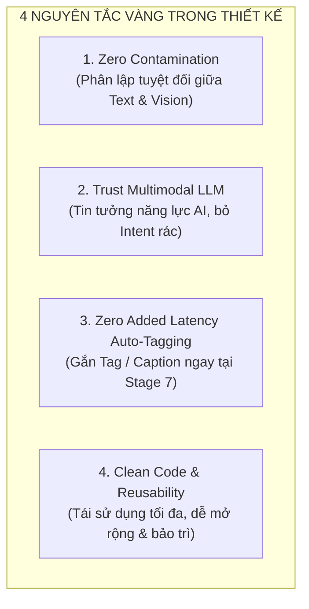
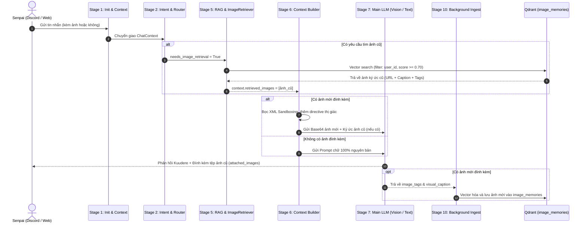

# KẾ HOẠCH TỔNG THỂ: NÂNG CẤP HỆ THỐNG THỊ GIÁC ĐA PHƯƠNG TIỆN & TRUY HỒI KÝ ỨC HÌNH ẢNH (UNIFIED MULTIMODAL VISION & VISUAL MEMORY PLAN)

> **Dự án**: Trợ lý AI Kuchiba Chisa (Wuthering Waves AI Companion)  
> **Nhánh thực hiện**: `feat/text-to-image-memory-retrieval`  
> **Phiên bản**: 3.0 Multimodal  
> **Trạng thái**: Thiết kế hoàn thiện & Sẵn sàng triển khai  

---

## 1. NGUYÊN LÝ THIẾT KẾ CỐT LÕI (CORE ARCHITECTURAL PRINCIPLES)

1. **Phân Lập Tuyệt Đối (Zero Contamination)**:
   - Khi người dùng chat chữ thuần túy (`has_images == False`), System Prompt và Response Schema **100% sạch sẽ**, không bị nhồi nhét bất kỳ directive thị giác, XML sandbox hay metadata ảnh nào.
   - Không lãng phí token ngân sách (Context Budget) của các cuộc hội thoại thường nhật.
2. **Tin Tưởng Năng Lực Của Mô Hình Thị Giác (Trust Multimodal Intelligence)**:
   - Loại bỏ hoàn toàn việc phân loại sub-intent nhân tạo cứng nhắc (`GAMEPLAY_STATS_EVALUATION`, `MEME_REACTION`, `DOCUMENT_OCR`, `CODE_ANALYSIS`, `ARTWORK_EVALUATION`).
   - Main Vision LLM (DeepSeek V4 Vision / Gemini Vision) tự động nhận diện và phân tích toàn diện mọi chi tiết trên bức ảnh theo đúng phong cách Kuudere của Chisa.
3. **Tự Động Gắn Tag & Visual Caption Không Độ Trễ (Zero Added Latency / 0 Extra Call)**:
   - Thay vì chạy thêm 1 worker LLM ngầm hay dựa hoàn toàn vào từ điển regex, Main LLM tại Stage 7 tự động xuất `image_tags` và `visual_caption` trong cùng một lượt sinh phản hồi.
4. **Bảo Mật & Phân Quyền Riêng Tư (Strict Privacy Isolation)**:
   - Ký ức hình ảnh được phân lập nghiêm ngặt trong Qdrant theo `user_id` (tin nhắn riêng) hoặc `guild_id` (server cộng đồng).

---

## 2. MA TRẬN 4 KỊCH BẢN HOẠT ĐỘNG TOÀN DIỆN (END-TO-END SCENARIO MATRIX)

| Kịch bản | `has_images` | `needs_image_retrieval` | Hành vi Pipeline | Input Payload | Output Deliverable |
| :--- | :---: | :---: | :--- | :--- | :--- |
| **Kịch bản 1: Chat Chữ Thuần Túy** | `False` | `False` | 100% Text Pipeline. 0ms Fast Bypass RAG cho Small Talk, tra cứu Lore / Web nếu cần. | Text thuần | Text Response JSON |
| **Kịch bản 2: Đọc Ảnh Mới** | `True` | `False` | Nạp Base64, bọc XML Sandboxing. Vision LLM đọc ảnh, phản hồi + sinh `image_tags` & `visual_caption`. Stage 10 lưu Qdrant. | Base64 Image + Text | Text Response JSON |
| **Kịch bản 3: Truy Hồi Ký Ức Ảnh Cũ** | `False` | `True` | Router/Anchor kích hoạt `RETRIEVE_PAST_IMAGE`. Qdrant tìm ảnh cũ theo `user_id`. Nạp mô tả ảnh cũ vào Prompt (Pure Text). | Text truy vấn | Text Response + `attached_images` (Gửi tệp Discord) |
| **Kịch bản 4: Kép Hybrid (Ảnh Mới + Ảnh Cũ)** | `True` | `True` | Vision LLM nhìn ảnh mới trên mắt + đọc mô tả ảnh cũ trong đầu. Đưa ra nhận xét so sánh, gửi lại ảnh cũ và lưu ảnh mới vào Qdrant. | Base64 Image Mới + Text | Text So Sánh + `attached_images` Ảnh Cũ |

---

## 3. SƠ ĐỒ KIẾN TRÚC LUỒNG DỮ LIỆU TỔNG THỂ

---

## 4. BẢNG CHI TIẾT CÁC MODULE CẦN TỐI ƯU & NÂNG CẤP

### A. Tầng Domain & Entities
1. **[`app/domain/models/intent_result.py`](file:///D:/Hoc_Tap/Code/Du_An_Ca_Nhan/Chisa_bot/kuchiba_chisa/app/domain/models/intent_result.py)**:
   - Tinh gọn `ChatIntent` về 9 intent cốt lõi: `SMALL_TALK`, `KNOWLEDGE_OR_TASK`, `LORE`, `MEMORY`, `CONVERSATIONAL`, `SYSTEM_ACTION`, `IMAGE_ANALYSIS`, `RETRIEVE_PAST_IMAGE`, `OTHER`.
2. **[`app/domain/entities/image_memory.py`](file:///D:/Hoc_Tap/Code/Du_An_Ca_Nhan/Chisa_bot/kuchiba_chisa/app/domain/entities/image_memory.py)**:
   - Thực thể `ImageMemoryPayload`: `image_id`, `user_id`, `guild_id`, `url`, `thumbnail_url`, `visual_caption`, `tags`, `width`, `height`, `size_bytes`, `created_at`.

### B. Tầng Routing & RAG
1. **[`app/domain/services/rag/query_rewriter.py`](file:///D:/Hoc_Tap/Code/Du_An_Ca_Nhan/Chisa_bot/kuchiba_chisa/app/domain/services/rag/query_rewriter.py)**:
   - Giữ Schema tinh gọn: `rewritten_query`, `needs_vector_search`, `needs_web_search`, `needs_image_retrieval`.
2. **[`app/domain/services/chat_pipeline/stages/intent_stage.py`](file:///D:/Hoc_Tap/Code/Du_An_Ca_Nhan/Chisa_bot/kuchiba_chisa/app/domain/services/chat_pipeline/stages/intent_stage.py)**:
   - Dọn sạch toàn bộ các anchor sets dư thừa.
   - Giữ duy nhất `IMAGE_RETRIEVAL_ANCHORS` / `IMAGE_NOUNS` cho truy hồi ảnh nhanh.
   - Hỗ trợ phân nhánh độc lập cho cả 4 kịch bản (Text, Vision, Retrieval, Hybrid).
3. **[`app/domain/services/rag/retriever_image_memory.py`](file:///D:/Hoc_Tap/Code/Du_An_Ca_Nhan/Chisa_bot/kuchiba_chisa/app/domain/services/rag/retriever_image_memory.py)**:
   - Tìm kiếm ảnh ký ức tương đồng theo vector embedding.
   - Áp dụng bộ lọc `user_id` / `guild_id` và ngưỡng `min_score >= 0.70`.

### C. Tầng Đóng Gói Prompt & Sinh Lời Thoại (Stages 6 & 7)
1. **[`app/domain/services/context_builder.py`](file:///D:/Hoc_Tap/Code/Du_An_Ca_Nhan/Chisa_bot/kuchiba_chisa/app/domain/services/context_builder.py)**:
   - Chỉ nạp section `[KÝ ỨC HÌNH ẢNH TÌM THẤY TRONG KHO]` khi `retrieved_images` có dữ liệu.
   - Đảm bảo System Prompt không bị ô nhiễm khi không có ảnh.
2. **[`app/domain/services/chat_pipeline/stages/context_building_stage.py`](file:///D:/Hoc_Tap/Code/Du_An_Ca_Nhan/Chisa_bot/kuchiba_chisa/app/domain/services/chat_pipeline/stages/context_building_stage.py)**:
   - Bọc XML Sandboxing `VisualPromptDefense` chỉ khi `has_images == True`.
   - Cài đặt nhiệt độ `0.4` cố định cho multimodal, không phân nhánh phức tạp.
3. **[`app/domain/services/chat_pipeline/stages/llm_generation_stage.py`](file:///D:/Hoc_Tap/Code/Du_An_Ca_Nhan/Chisa_bot/kuchiba_chisa/app/domain/services/chat_pipeline/stages/llm_generation_stage.py)**:
   - Trích xuất `attached_images` cho đầu ra Discord.
   - Thu nhận `image_tags` và `visual_caption` khi có ảnh mới để chuyển cho Stage 10.

### D. Tầng Tác Vụ Nền & Lưu Trữ (Stage 10)
1. **[`app/domain/services/visual_memory_ingestion.py`](file:///D:/Hoc_Tap/Code/Du_An_Ca_Nhan/Chisa_bot/kuchiba_chisa/app/domain/services/visual_memory_ingestion.py)**:
   - Ưu tiên lưu `visual_caption` và `image_tags` sinh ra từ Main LLM.
   - Sử dụng từ điển `_TAG_PATTERNS` làm fallback an toàn.

### E. Tầng Visualizer Telemetry & Discord Gateway
1. **Visualizer Dashboard** (`node-inspector.js`, `inspector-widgets.js`, `pipeline-tree.js`):
   - Hiển thị bước `image_memory_retrieval` (5.1.e) với thumbnail và score badge.
   - Hiển thị `attached_images` tại node Stage 7.
2. **Discord Gateway** (`ask.js`, `coreRagClient.js`, `reply.js`):
   - Đính kèm tệp ảnh thật bằng `AttachmentBuilder` khi có `attached_images`.

---

## 5. KẾ HOẠCH KIỂM THỬ & TIÊU CHÍ NGHIỆM THU

### A. Danh Sách Test Suites Đã Được Xây Dựng
1. **`tests/unit/test_text_to_image_memory_retrieval.py`** (9 tests):
   - `test_image_memory_entity_and_ingestion_worker`
   - `test_intent_classification_image_retrieval_anchors`
   - `test_image_memory_retriever_dm_privacy_isolation`
   - `test_image_memory_retriever_score_threshold_filtering`
   - `test_context_builder_injects_retrieved_images_section`
   - `test_llm_generation_stage_extracts_and_fallbacks_attached_images`
   - `test_llm_router_semantic_image_retrieval_fallback`
   - `test_llm_router_semantic_vision_lore_intent_fallback`
   - `test_hybrid_image_input_and_image_retrieval_scenario` (Kịch bản 4 Hybrid)
2. **`tests/unit/test_multimodal_vision_pipeline.py`** (8 tests):
   - Payload construction, XML sandboxing, Resilience fallback, Cache bypass, Temperature setting.
3. **`tests/unit/security/test_vision_security.py`** (4 tests):
   - SSRF protection, Decompression bomb defense, EXIF stripping, Visual Prompt Injection sandboxing.
4. **`tests/unit/test_community_pipeline.py` & `test_multi_memory_dynamics.py`** (9 tests):
   - Bảo đảm tính năng mới không gây lỗi hồi quy (zero regressions).

### B. Tiêu Chí Nghiệm Thu (Acceptance Criteria)
* ✅ Toàn bộ **30/30 unit tests** chạy thành công trong thời gian dưới 2 giây.
* ✅ Mã nguồn tuân thủ Clean Architecture, SOLID và không còn bất kỳ biến/hằng số thừa nào.
* ✅ Luồng hội thoại chữ thông thường chạy mượt mà, giữ nguyên vẹn 100% tính cách Kuudere của Kuchiba Chisa.
