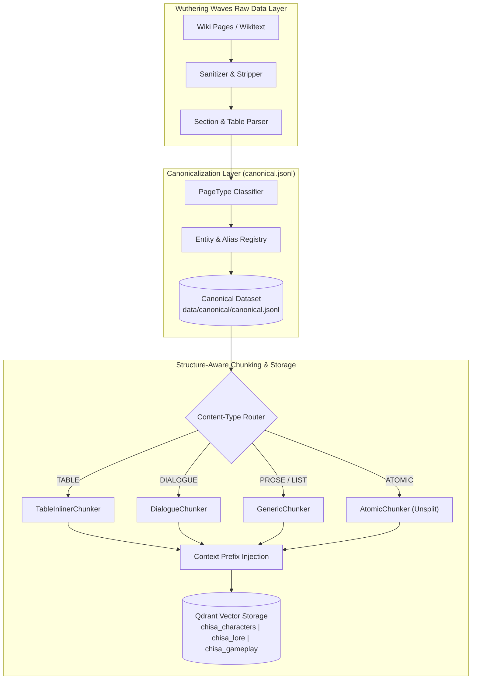
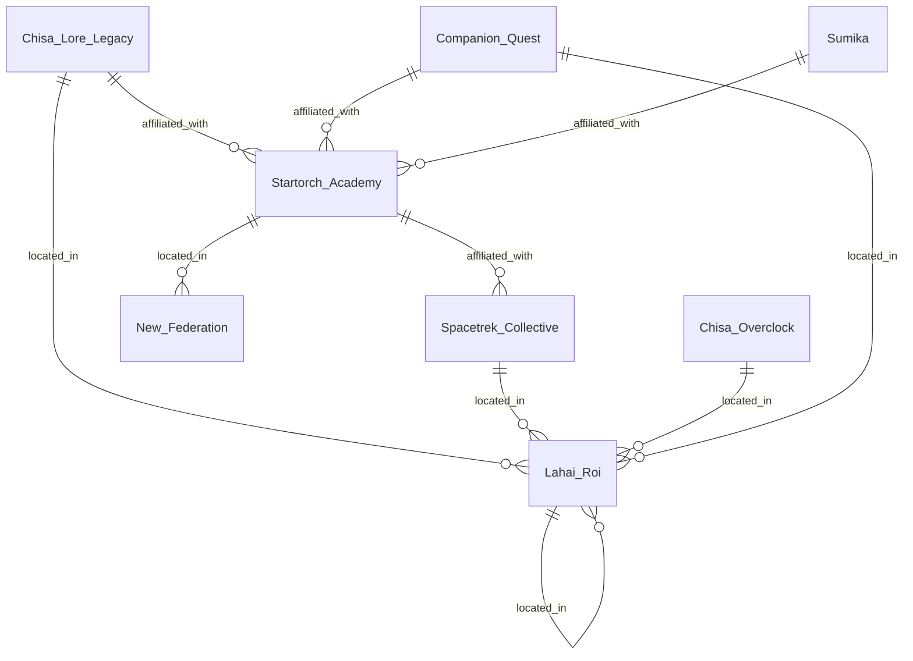

# STRUCTURAL DIAGRAM & TAXONOMY: WUTHERING WAVES WIKI

> **Tự động trích xuất từ dữ liệu Wiki**: 20 trang đã được phân tích.  
> **Thời gian tạo**: 2026-07-26  

---

## 1. PHÂN LOẠI CẤU TRÚC WIKI (DYNAMIC WIKI TAXONOMY MINDMAP)

```mermaid
mindmap
  root((Wuthering Waves Wiki Structure))
    GENERIC[Page Type: GENERIC (19 pages)]
      Common Headings: Solaris-3, CHUNK 2 — Honami Loop and Sumika, Sumika Relationship, Resonator
    FACTION[Page Type: FACTION (1 pages)]
      Common Headings: Startorch Academy, Campus Life, Birding Fan Club, Auto Parking & Engineering Xpertise
```

---

## 2. LUỒNG XỬ LÝ DỮ LIỆU WIKI (INGESTION PIPELINE FLOWCHART)



---

## 3. THỐNG KÊ CHI TIẾT CÁC PHÂN LOẠI TRANG (PAGE TYPE & SECTION BREAKDOWN)

| Page Type (`PageTypeEnum`) | So Luong Trang | Infobox Fields Mau | Standard Headings Mau |
| :--- | :--- | :--- | :--- |
| `GENERIC` | 19 | `None` | `Solaris-3, CHUNK 2 — Honami Loop and Sumika, Sumika Relationship` |
| `FACTION` | 1 | `None` | `Startorch Academy, Campus Life, Birding Fan Club` |

---

## 4. MA TRẬN QUAN HỆ THỰC THỂ WIKI (ENTITY RELATIONSHIP ER DIAGRAM)


