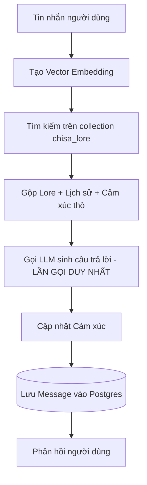
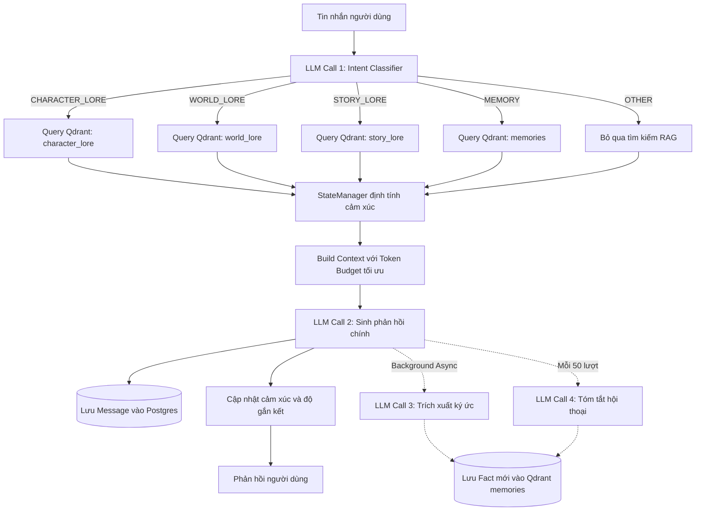

# Báo cáo So sánh Kiến trúc Hệ thống: Legacy Pipeline vs Production Pipeline

Tài liệu này cung cấp cái nhìn chi tiết và so sánh cấu trúc, luồng đi của dữ liệu, ưu điểm và nhược điểm giữa hai hệ thống xử lý chat (Pipelines) của **Chisa Bot**.

---

## 1. Bảng So sánh Tổng quan

| Tiêu chí | Legacy Pipeline (ChatEngine) | Production Pipeline (ProductionChatEngine) |
| :--- | :--- | :--- |
| **Phân loại ý định (Intent)** | Không có. Mọi tin nhắn đều đi qua một luồng xử lý RAG giống nhau. | **Có (Intent Classifier)**. Phân loại tin nhắn thành: `CHARACTER_LORE`, `WORLD_LORE`, `STORY_LORE`, `MEMORY`, `OTHER`. |
| **Số lần gọi LLM / câu hỏi** | **1 lần** duy nhất (sinh câu trả lời). | **2~3 lần**: 1 phân loại ý định + 1 sinh câu trả lời + 1 trích xuất ký ức (chạy ngầm). |
| **Tìm kiếm ngữ cảnh (RAG)** | Truy vấn một collection chung duy nhất (`chisa_lore`). | **Tìm kiếm chuyên biệt (Specialized RAG)**. Chỉ tìm kiếm trên các collection tương ứng với Intent để tối ưu hóa kết quả và tránh nhiễu thông tin. |
| **Tiết kiệm token & chi phí** | Thấp. Luôn gọi RAG ngay cả khi nói chuyện phiếm (Small Talk). | **Cao**. Không thực hiện tìm kiếm vector RAG nếu ý định là `OTHER` (nói chuyện phiếm). |
| **Trạng thái cảm xúc** | Đưa trực tiếp điểm số cảm xúc thô (ví dụ: `0.32`, `0.51`) vào prompt. | **Định tính (Qualitative state)**. Sử dụng `StateManager` để chuyển đổi điểm số thô thành trạng thái (`Low`, `Medium`, `High`) giúp LLM hiểu tự nhiên hơn. |
| **Quản lý ngữ cảnh (Prompt)** | Không phân chia rõ ràng hoặc giới hạn ngân sách ngữ cảnh cụ thể. | **Định dạng cấu trúc chặt chẽ** với ngân sách token được thiết lập tối ưu (Persona ~400, State ~50, Memory ~300, Lore ~800, History ~800). |
| **Trích xuất ký ức (Memory)** | Thủ công và chỉ lưu trữ các phản hồi cảm xúc đơn giản. | **Tự động trích xuất ngầm (Background Memory Extraction)**. LLM tự động phát hiện sở thích, sự kiện cá nhân để lưu vào Qdrant. |
| **Tóm tắt hội thoại** | Không có. | **Tự động tóm tắt hội thoại** sau mỗi 50 lượt chat để nén lịch sử hội thoại dài thành các điểm bộ nhớ bền vững. |
| **Khả năng chống lỗi API** | Retry cơ bản (dễ sập nếu gặp lỗi Rate Limit 429 liên tục). | **Khả năng phục hồi cao** nhờ cơ chế retry tăng cường và backoff thông minh hơn trong GroqAdapter. |

---

## 2. So sánh Luồng Xử lý Dữ liệu (Workflow)

### Luồng xử lý của Legacy Pipeline


### Luồng xử lý của Production Pipeline


---

## 3. Giải thích Chi tiết: Tại sao có nhiều lượt gọi LLM trong một câu hỏi?

Trong **Legacy Pipeline**, mỗi câu hỏi chỉ cần **1 lần gọi LLM** duy nhất — gửi toàn bộ context lên và nhận phản hồi.

Trong **Production Pipeline**, mỗi câu hỏi sẽ gọi LLM **2~3 lần** (hoặc hiếm khi 4 lần), mỗi lần phục vụ một mục đích riêng biệt:

### 🔶 LLM Call 1 — Intent Classifier (Đồng bộ, chặn luồng)

| | |
|---|---|
| **File** | `intent_classifier.py` |
| **Mục đích** | Phân loại tin nhắn của Senpai thành 1 trong 5 loại ý định |
| **Tại sao cần?** | Để biết nên tìm kiếm RAG ở **collection nào** (hay bỏ qua RAG hoàn toàn) |
| **Ví dụ** | `"Em dùng vũ khí gì?"` → `CHARACTER_LORE` · `"Chào em"` → `OTHER` |
| **Khi nào chạy?** | **Luôn luôn** — đây là bước đầu tiên, chạy trước khi làm bất cứ gì khác |

### 🔴 LLM Call 2 — Main Generation (Đồng bộ, chặn luồng)

| | |
|---|---|
| **File** | `production_chat_engine.py` (dòng 142) |
| **Mục đích** | Sinh câu trả lời chính của Chisa + phân tích sentiment |
| **Tại sao cần?** | Đây là lõi của hệ thống — tạo ra câu thoại mà Senpai nhìn thấy |
| **Input** | System prompt đầy đủ (Persona + State + Lore/Memory + History) |
| **Khi nào chạy?** | **Luôn luôn** — sau khi Intent Classifier xong và RAG retrieval xong |

### 🟣 LLM Call 3 — Memory Extractor (Bất đồng bộ, chạy ngầm)

| | |
|---|---|
| **File** | `memory_extractor.py` |
| **Mục đích** | Phân tích tin nhắn Senpai để trích xuất sự kiện/sở thích cá nhân |
| **Tại sao cần?** | Để Chisa có thể **nhớ lâu dài** những gì Senpai chia sẻ |
| **Ví dụ** | `"Ngày mai anh đi phỏng vấn Viettel"` → lưu Fact: `"Senpai phỏng vấn Viettel"` |
| **Khi nào chạy?** | **Luôn luôn**, nhưng chạy **ngầm (async)** — không làm chậm phản hồi |

### 🟣 LLM Call 4 — Summarizer (Bất đồng bộ, chạy ngầm, hiếm khi)

| | |
|---|---|
| **File** | `production_chat_engine.py` (dòng 214-221) |
| **Mục đích** | Tóm tắt 40 tin nhắn gần nhất thành các điểm bộ nhớ ngắn gọn |
| **Tại sao cần?** | Nén lịch sử chat dài thành memory bền vững, tránh mất thông tin khi history quá dài |
| **Khi nào chạy?** | **Rất hiếm** — chỉ khi `interaction_count` chia hết cho 50 |

### Tóm tắt tác động đến thời gian phản hồi

```
Legacy:    [═══ LLM Call ═══] → Trả lời
            ~1-3 giây

Production: [═ Intent ═][══ RAG ══][══ Main LLM ══] → Trả lời
             ~0.5s       ~0.3s       ~1-3s
                                          ╰─── [Memory Extract] (ngầm, không ảnh hưởng)
```

> **Quan trọng**: Chỉ có Call 1 (Intent) và Call 2 (Main) là **chặn luồng** (Senpai phải đợi). Call 3 và Call 4 chạy **hoàn toàn ngầm** — Senpai nhận được phản hồi ngay khi Call 2 xong mà không cần đợi Call 3/4 hoàn thành.

---

## 4. Phân tích Chi tiết Tính năng Nổi bật trong Production Pipeline

### 4.1. Phân loại Ý định (Intent Classification)
Khi Senpai gửi tin nhắn, pipeline sẽ sử dụng một mô hình LLM siêu nhẹ để gắn thẻ ý định của người dùng ngay lập tức. Điều này giúp Chisa định hình được ngữ cảnh cần tìm kiếm:
*   *Senpai hỏi: "Em dùng vũ khí gì?"* -> Hệ thống hiểu ngay là `CHARACTER_LORE` và chỉ lục tìm trong tệp hồ sơ cá nhân của Chisa.
*   *Senpai hỏi: "Ngày mai anh làm gì em nhớ không?"* -> Hệ thống gắn thẻ `MEMORY`, kích hoạt lục lọi bộ nhớ cá nhân được lưu giữa hai người.
*   *Senpai chỉ chào: "Chào em"* -> Hệ thống gắn thẻ `OTHER`, bỏ qua việc tìm kiếm cơ sở dữ liệu để phản hồi ngay lập tức, tiết kiệm tài nguyên.

### 4.2. Trích xuất Ký ức Ngầm định (Background Memory Extraction)
Ở Legacy Pipeline, nếu Senpai nói: *"Ngày mai anh đi phỏng vấn tại Viettel"* Chisa chỉ biết chúc mừng vào thời điểm đó, nhưng sau đó sẽ hoàn toàn quên mất do lịch sử chat bị trôi đi.
Trong Production Pipeline:
*   Một tác vụ chạy ngầm (**Asynchronous Background Task**) sẽ tự động phân tích tin nhắn của Senpai.
*   Nếu phát hiện một thông tin cá nhân quan trọng, hệ thống sẽ tự động lưu thông tin đó dưới dạng một Fact cộng hưởng vào Qdrant (ví dụ: `"Senpai chuẩn bị phỏng vấn ở Viettel"`).
*   Trong tương lai, chỉ cần Senpai hỏi lại: *"Ngày mai anh làm gì em nhớ không?"*, hệ thống sẽ kích hoạt truy vấn bộ nhớ và giúp Chisa nhớ lại chính xác.

### 4.3. State Manager & Định lượng Cảm xúc
Thay vì đưa các con số khô khan mà mô hình LLM khó diễn giải trực quan như `joy=0.86, trust=0.54`, `StateManager` sẽ chuyển dịch chúng thành:
*   `Trust: Medium`
*   `Affection: Low`
*   `Mood: Happy`
Từ đó, prompt sẽ yêu cầu Chisa đóng vai Kuudere với trạng thái cảm xúc tương xứng một cách tự nhiên và sinh động hơn.

### 4.4. Quản lý Ngăn chặn Tràn ngữ cảnh (Context Budget)
Prompt được phân vùng rõ rệt với ngân sách token nghiêm ngặt, ngăn chặn tối đa tình trạng "loãng" hoặc "quên" quy tắc (roleplay rules) khi lịch sử trò chuyện quá dài.

---

## 5. Đánh giá Ưu và Nhược điểm

### 5.1. Legacy Pipeline
*   **Ưu điểm**: Cực kỳ đơn giản, thời gian phản hồi (latency) thấp do chỉ thực hiện tối đa 1 cuộc gọi LLM duy nhất.
*   **Nhược điểm**: Bộ nhớ ngắn hạn dễ bị trôi; RAG không chính xác và dễ bị loãng thông tin do tìm kiếm chung chung; tiêu tốn token vô ích cho các câu chat ngắn.

### 5.2. Production Pipeline
*   **Ưu điểm**:
    *   Thông minh vượt trội, có thể nhớ được những sự kiện cá nhân mà Senpai chia sẻ lâu dài (LTM).
    *   Câu trả lời bám sát cốt truyện và thông tin thế giới nhờ RAG phân luồng chuyên biệt.
    *   Tính cách Kuudere của Chisa biến chuyển tự nhiên và logic hơn theo cảm xúc định tính.
*   **Nhược điểm**:
    *   Thời gian phản hồi (latency) cao hơn một chút do phải chạy Intent Classifier trước khi sinh phản hồi (~0.5s thêm).
    *   Tiêu tốn nhiều lượt gọi LLM hơn: 2 lượt đồng bộ (Intent + Main) và 1 lượt ngầm (Memory Extract), tổng ~3 lượt/câu hỏi.
