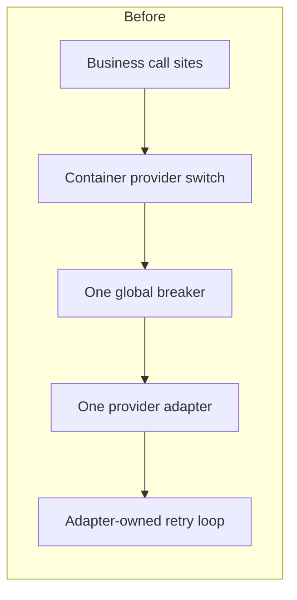
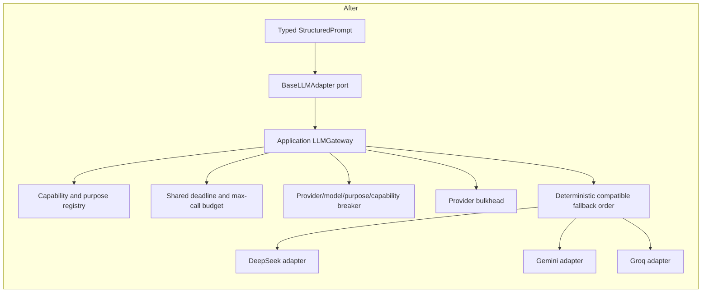

# BE-02 — LLM gateway, provider isolation and failover

Date: 2026-09-12
Branch: `reliability/p2-be02-llm-gateway`
Traceability: `BE-02`, `NFR-REL-002`, `NFR-REL-003`, `NFR-PERF-009`, `TD-017`, `TD-018`, `TD-022`

## Pre-implementation audit

The application container selected one adapter from `LLM_PROVIDER` and wrapped it
with a module-global circuit breaker. DeepSeek, Gemini and Groq each also owned
an independent retry loop, so gateway and adapter attempts could not be bounded
as one logical request. Provider/model capabilities, compatible fallback,
provider-local concurrency and a shared nested-call budget did not exist.

| Call path | Purpose and required capability | Initial behavior and risk | BE-02 disposition |
|---|---|---|---|
| `ContextBuilder` → `LLMGenerationStage` | Chat response; text + structured output, tool contract for grounded output; optional vision/stream | Single configured provider; adapter-local retries; streaming vision could lose image semantics | Typed `CHAT_RESPONSE`; capability route; shared request budget; streaming vision must find a compatible model or degrade explicitly |
| `QueryRewriter` | Structured query rewrite | Extra provider call had no shared budget | Typed `QUERY_REWRITE`; uses the request budget |
| `ContextAssessor` | Structured context sufficiency | Extra LLM gate failed open and shared the global breaker | Typed `CONTEXT_ASSESSMENT`; deterministic budget-preserving decision when only the final call remains |
| `ThinkingLoopAgent` | Structured reasoning/search decision | Cycle count was independent of final generation budget | Typed `THINKING_LOOP`; nested calls share the request budget and preserve the last call for final generation |
| `MemoryExtractor` reconciliation | Structured memory conflict decision | Global breaker and adapter retry behavior | Typed `MEMORY_RECONCILIATION`; one gateway-governed provider attempt per adapter invocation |
| `MemoryExtractor` extraction | Structured durable background extraction | Global breaker and adapter retry behavior | Typed `MEMORY_EXTRACTION`; independent background-job budget |
| Private auto-summary | Structured private conversation summary | String context-variable purpose; no typed route | Typed `PRIVATE_SUMMARY`; independent durable job invocation |
| Community topic summary | Structured guild/channel summary | String context-variable purpose; no typed route | Typed `COMMUNITY_SUMMARY` |
| Conversation summarize tool | Structured user-requested summary | No typed route | Typed `CONVERSATION_SUMMARY` |
| Startup and `/ready` | Provider configuration/capability readiness | Production-failure decision ran before the old API-key validation block (`TD-022`) | Central sanitized configuration validation runs before the production decision and appears separately as `llm_config` readiness |

All of these are LLM calls for `NFR-PERF-009`. A chat request shares one
`LLMCallBudget`; a durable background job is a separate logical request. Fast
deterministic rewrite/assessment branches make no provider call.

## Before/after architecture

Provider SDKs and HTTP details remain in infrastructure adapters. Domain and
application callers see provider-neutral prompts, responses, outcomes and typed
failure classes only.

## Gateway contract

`StructuredPrompt` now carries:

- typed purpose;
- required capability set;
- model profile;
- structured response schema and optional tool-contract identity;
- streaming/vision requirements derived from the actual request;
- remote-provider eligibility;
- one mutable request-scoped `LLMCallBudget` containing max calls and deadline.

`LLMGateway.execute()` returns a typed success/failure/degraded outcome.
`generate()` preserves the existing adapter port and converts a non-success
outcome into a sanitized `LLMGatewayError`. Provider response objects, SDK
exceptions, prompts and secrets never cross this boundary.

## Capability registry and fallback matrix

| Provider/model route | Text | Structured | Stream | Vision | Tool/function | Default use |
|---|---:|---:|---:|---:|---:|---|
| DeepSeek text model | Yes | Yes | Yes | No | Yes | Approved primary text/grounded generation |
| DeepSeek vision model | Yes | Yes | No | Yes | Yes | Non-stream vision/grounded generation |
| Gemini text model | Yes | Yes | Yes | No | No | Optional configured compatible fallback |
| Groq text model | Yes | Yes | Yes | No | No | Optional configured compatible fallback |

Eligibility requires the configured purpose, model profile, privacy eligibility
and every requested capability. Provider order is the configured primary then
the ordered fallback list. A tool or vision request cannot fall back to the
current Gemini/Groq text routes. Streaming vision is explicitly unsupported by
the current registry and therefore degrades without removing the image.

## Breaker, bulkhead, timeout and retry design

- Breaker keys are immutable `(provider, model, purpose, capability_profile)`
  values. Closed/open/half-open transitions use a lock and allow only one
  bounded recovery probe.
- Timeout, transport, rate limit, provider 5xx and invalid response contribute
  to breaker state. Authentication/configuration and token overflow are
  terminal and are never retried.
- One bounded semaphore per provider enforces configurable concurrency. A
  saturated primary can fall back without consuming the secondary provider's
  capacity.
- The DeepSeek HTTP client has an explicit connect timeout. Gateway policy has
  first-token, per-attempt, bulkhead-wait and total-request deadline limits.
  Streaming retry/fallback is allowed only before the first
  emitted chunk; partial output is never concatenated with another provider.
- Adapters execute exactly one provider call. Retry/failover exists only in the
  gateway, uses capped exponential backoff with jitter, checks cancellation and
  remaining deadline, and cannot exceed the shared call budget.

## NFR-PERF-009 call budget

`ChatEngine` creates one budget per normal or streaming chat request. Query
rewrite, context assessment, thinking and final generation receive the same
object. Every outbound attempt—including a retry or compatible fallback—must
reserve one of at most two calls. The optional assessor switches to a
deterministic check when one call remains, and a multi-cycle thinking loop
preserves the last call for final generation. Exhaustion or deadline expiry
returns a typed degraded result and makes no hidden third call.

## Safe degradation and vision safety

When no healthy compatible provider remains, the gateway returns/raises a typed
sanitized unavailable state. Vision generation maps that state to the existing
chat result boundary as `degraded_vision_unavailable`, emits no citation and
does not retry the request as text-only. Grounded structured output continues
through the existing strict schema and server-owned citation validators.

## Debt disposition

| Debt | Disposition | Evidence |
|---|---|---|
| `TD-017` | **RESOLVED** | Global LLM breaker removed; breaker/bulkhead state is isolated by provider/model/purpose/capability. Optional assessor respects the shared final-call budget. |
| `TD-018` | **RESOLVED** | Explicit capability registry and compatible fallback matrix; text-only fallback cannot receive image/tool requests; streaming vision fails explicitly instead of stripping images. |
| `TD-022` | **RESOLVED** | `validate_llm_configuration()` checks enabled/primary/fallback providers, credentials, models, purposes and DeepSeek grounded/vision capability before the production startup decision; `/ready` reports `llm_config` separately. |

## Acceptance evidence

| Acceptance criterion | Evidence | Result |
|---|---|---|
| Typed provider-neutral gateway | Domain prompt/response/failure contracts plus application `LLMGateway`; no SDK types outside infrastructure | PASS |
| Registry controls provider/model eligibility | Text, structured, stream, vision, tool, profile and purpose positive/negative tests | PASS |
| Breaker isolation and recovery | Provider, model, purpose and capability isolation; open/half-open/single-probe tests | PASS |
| Provider bulkheads prevent cross-provider starvation | Saturated-primary concurrent test falls back to an independent secondary semaphore | PASS |
| Retry is classified, bounded and deadline-aware | Timeout/transport/429/5xx/invalid versus auth/config tests; cancellation/deadline tests | PASS |
| Compatible fallback only | Structured/text/tool/vision/stream combination tests | PASS |
| Vision is never silently dropped | Non-stream and streaming negative tests plus pipeline degraded-result regression | PASS |
| Maximum two provider calls | Retry, fallback, nested prompt and thinking/final reservation tests | PASS |
| Safe terminal degradation | No-compatible, privacy-ineligible, budget-exhausted and all-provider failure tests | PASS |
| Startup/readiness validation | Missing key/model/purpose/fallback and production aggregation/readiness tests | PASS |
| Secrets/prompts excluded from errors/logs | Sanitized HTTP/transport errors and captured-log regression | PASS |
| Grounding and strict output preserved | Existing grounding, citation and strict attachment suites in focused and isolated runs | PASS |
| BE-01/BE-03 regression | Direct unit batch and isolated Linux integration suite | PASS |

## Verification receipt

- Python: **3.11.9** on the requested project interpreter.
- Focused BE-02/generation/grounding/readiness/memory suite: **101 passed**.
- Final pre-commit gateway/health/vision/grounding/attachment/memory regression
  batch: **93 passed**, 1 dependency warning.
- BE-02 gateway suite after duplicate-test collection audit: **37 passed**.
- Full host unit suite before the final collection-only test correction: **515 passed**;
  the newly exposed/added BE-02 tests then passed in the focused suite and in
  the final Linux suite.
- Relevant BE-01/BE-03 unit regression: **12 passed**.
- Isolated Linux PostgreSQL/Redis/Qdrant suite on the current bind-mounted
  worktree: **533 passed**, 2 pre-existing warnings.
- Isolated Alembic upgrade and drift check: **PASS**, head
  `9c0e1f2a3b4d`; BE-02 adds no schema migration.
- Host `mypy app`: **PASS**, 290 source files.
- Isolated Linux `mypy app`: **PASS**, 290 source files.
- Changed-lines Ruff: **PASS**.
- New-file Ruff: **PASS**.
- Legacy Ruff debt ratchet: **PASS**, 2,823 <= baseline 2,914.
- `pip check`: **PASS**.
- `compileall app tests`: **PASS**.
- Test and production Compose configuration rendering: **PASS**; production
  render used command-scoped placeholder secret references and printed no
  secret.
- `git diff --check`: **PASS**.

The first host-wide run produced 605 passes and 43 PostgreSQL/Redis integration
setup failures while the disposable services were absent; no BE-02 assertion
failed. The authoritative isolated run provisioned those dependencies and
passed all 533 CI-scoped unit/integration tests. A fresh Docker image pull was
not repeated because the Docker Desktop proxy could not reach Docker Hub; the
existing Python 3.11 test image ran the current worktree via a bind mount. No
provider benchmark or paid provider request was made.

## Protected-content audit

The worktree blobs for `persona_loader.py`, `chisa_personality.md`, `rover.md`
and `sumika.md` exactly match `HEAD`. `context_builder.py` differs only by the
`LLMPurpose` import and `purpose=LLMPurpose.CHAT_RESPONSE`; zero-context diff
shows no prompt-literal change. The vision change is an operational degraded
result outside protected system/persona/relationship prompt content. No
protected prompt wording was added, removed, hardened or normalized.

## Architecture review

**PASS.** Provider-neutral contracts live in the domain boundary, orchestration
and reliability policy live in the application gateway, and SDK/HTTP behavior
remains in infrastructure adapters. Retry, breaker, fallback and budget policy
are centralized instead of duplicated across routes or adapters. No external
queue was introduced for synchronous requests, and BE-01 durable workers remain
separate.

## Remaining technical debt

- `TD-025` lore-answer cache version/ACL correctness remains open and was not
  absorbed into BE-02.
- Full OpenTelemetry metrics, dashboards and alerting for gateway attempts,
  breaker state, fallback and cost remain `OPS-02`.
- Legacy Ruff findings remain governed by `TD-036`; this task reduced the count
  and admitted no new changed-line debt.
- Docker Desktop's normal `desktop-linux` pipe and registry proxy were unhealthy
  in this workstation session. Verification used the same local Linux engine
  through its functioning `docker_engine_linux` pipe; this is an environment
  limitation, not an application fallback or production configuration change.

## Refreshed P2 acceptance matrix

| P2 task | Status after this receipt |
|---|---|
| `DB-01` | PASS |
| `BE-01` | PASS |
| `BE-02` | **PASS** |
| `BE-03` | PASS |
| `OPS-02` | OPEN |
| `OPS-03` | OPEN |
| `CH-01` | OPEN |
| `OPS-04` | OPEN |

**BE-02 FORMAL CLOSURE: PASS.**

Next recommended task: `TD-025`, as explicitly sequenced by the BE-02 directive.
Do not infer P2 closure from this receipt.
