# BÁO CÁO TOÀN DIỆN KIẾN TRÚC CHAT PIPELINE (KUCHIBA CHISA)

> **Tài liệu Kỹ thuật & Đặc tả Luồng Thực thi (Technical Architecture & Pipeline Execution Specification)**  
> **Dự án**: Kuchiba Chisa — AI Companion & Game Knowledge Assistant (Wuthering Waves)  
> **Phiên bản Pipeline**: 3.0 (Hỗ trợ Đa Chế Độ & Multimodal Vision Memory)  
> **Xác minh Codebase**: $100\%$ đối chiếu mã nguồn thực tế (`app/domain/services/chat_pipeline/`, `app/application/dependencies.py`, `chat_engine.py`)  
> **Thời gian cập nhật**: 31/08/2026

---

## 📑 MỤC LỤC
1. [Tổng Quan Kiến Trúc: 10 Canonical Stages vs 11 Python Filter Classes](#1-tổng-quan-kiến-trúc-10-canonical-stages-vs-11-python-filter-classes)
2. [Sơ Đồ Luồng Dữ Liệu Toàn Cảnh (Mermaid Architecture Flowchart)](#2-sơ-đồ-luồng-dữ-liệu-toàn-cảnh)
3. [Ma Trận So Sánh 3 Chế Độ Tương Tác](#3-ma-trận-so-sánh-3-chế-độ-tương-tác)
4. [Đặc Tả Chi Tiết 10 Giai Đoạn Chuẩn (Canonical Stages)](#4-đặc-tả-chi-tiết-10-giai-đoạn-chuẩn)
   - [Stage 1: InitializationStage (Khởi tạo Phiên, Hồ sơ, Write-Through State Cache & Ngữ cảnh)](#stage-1-initializationstage)
   - [Stage 2: IntentStage & QueryRewriter (Phân loại Ý định, Bypass & Tái cấu trúc Truy vấn)](#stage-2-intentstage--queryrewriter)
   - [Stage 3: CacheStage (Kiểm tra Bộ nhớ đệm Lore 0ms)](#stage-3-cachestage)
   - [Stage 4: ToolRoutingStage (Định tuyến Công cụ & Thao tác Hệ thống)](#stage-4-toolroutingstage)
   - [Stage 5: RAGStage & RAGPipeline (Truy xuất Đa nguồn Song song & Thinking Loop)](#stage-5-ragstage--ragpipeline)
   - [Stage 6: ContextBuildingStage & BudgetManager (Hybrid Anchor Window & Flex Ceiling)](#stage-6-contextbuildingstage--budgetmanager)
   - [Stage 7: LLMGenerationStage (Sinh Phản hồi & Xử lý Luồng JSON)](#stage-7-llmgenerationstage)
   - [Stage 8: EmotionUpdateStage (RESONA Engine 3.0 & Server Ambient Sync)](#stage-8-emotionupdatestage)
   - [Stage 9: Persistence & Cache Synchronization (PostgreSQL & Redis Dual Sync)](#stage-9-persistence--cache-synchronization)
   - [Stage 10: Background Tasks (Tác vụ Nền Bất Đồng Bộ Đa Nhiệm)](#stage-10-background-tasks)
5. [Cơ Chế Bảo Mật, An Toàn & Fallback Resilience](#5-cơ-chế-bảo-mật-an-toàn--fallback-resilience)
6. [Bảng Tổng Hợp Hằng Số Cấu Hình Vận Hành](#6-bảng-tổng-hợp-hằng-số-cấu-hình-vận-hành)

---

## 1. Tổng Quan Kiến Trúc: 10 Canonical Stages vs 11 Python Filter Classes

Hệ thống Chat Pipeline của Kuchiba Chisa được xây dựng theo mô hình **Pipes and Filters Architecture** kết hợp nguyên lý **Clean Architecture**.

### ❓ Tại sao trong Code có 11 lớp Filter nhưng Kiến trúc & Visualizer lại quy chuẩn 10 Stage?

1. **Chuẩn Kiến Trúc Khái Niệm & Telemetry (10 Canonical Stages)**:
   - Hệ thống được thiết kế xoay quanh **10 mốc chức năng lớn** xuyên suốt toàn bộ Pipeline Tracker và Dashboard Visualizer (`pipeline-tree.js`, `node-inspector.js`):
     - `Stage 1: Initialization` $\rightarrow$ `Stage 2: Intent` $\rightarrow$ `Stage 3: Cache Lookup` $\rightarrow$ `Stage 4: Tool Routing` $\rightarrow$ `Stage 5: RAG Multi-Collection` $\rightarrow$ `Stage 6: Context Building` $\rightarrow$ `Stage 7: LLM Generation` $\rightarrow$ `Stage 8: Emotion Update` $\rightarrow$ `Stage 9: Persistence & Sync` $\rightarrow$ `Stage 10: Background Tasks`.

2. **Tách Biệt Lớp Thực Thi Mã Nguồn (11 Python Filter Classes)**:
   - Để tuân thủ nghiêm ngặt **Single Responsibility Principle (SRP)**, tại tầng mã nguồn `app/application/dependencies.py`, bước lưu trữ dữ liệu được tách thành 2 class độc lập:
     - `PersistenceStage` (Stage 9.a): Chuyên trách ghi PostgreSQL qua Unit of Work và đồng bộ `UserStateCache` (UserStats + Emotion).
     - `CacheUpdateStage` (Stage 9.b): Chuyên trách băm query và lưu câu trả lời vào Redis Lore Answer Cache (`chisa:answer_cache:lore:*`).
   - Việc tách lớp chuyên biệt này giúp cô lập rủi ro lỗi và dễ dàng bảo trì độc lập mà không ảnh hưởng tới luồng dữ liệu.

Mỗi lượt gọi chat được kiểm soát bởi một **Distributed Redis Lock** (`chisa:chat_lock:{user_id}`, TTL = 120s) tại `ChatEngine` để ngăn chặn race condition khi người dùng nhắn dồn dập.

---

## 2. Sơ Đồ Luồng Dữ Liệu Toàn Cảnh

```mermaid
flowchart TD
    Inbound["Inbound Request (Discord / Web API)<br/>[User Query, Mentions, Attachments]"] --> Lock["Distributed Redis Lock (TTL 120s)<br/>'chisa:chat_lock:{user_id}'"]
    Lock --> S1

    subgraph S1_Init ["Stage 1: InitializationStage"]
        S1["Khởi tạo Phiên & Danh tính (UUID5)"] --> S1_Cache{"Kiểm tra Redis State Cache<br/>'chisa:user:{user_id}:state'"}
        S1_Cache -- "Cache HIT (~0.2ms)" --> S1_Hit["Nạp nhanh Stats & Emotion từ Redis (Bỏ qua 3 query SQL)"]
        S1_Cache -- "Cache MISS" --> S1_Miss["Nạp từ PostgreSQL & Write-Through vào Redis (TTL 7d)"]
        S1_Hit & S1_Miss --> S1_Check{"Kiểm tra Chế độ Chat"}
        S1_Check -- "Private / Semi-Private" --> S1_Priv["Nạp SQL History + 1-on-1 Summary (Redis/Postgres)"]
        S1_Check -- "Community" --> S1_Comm["Nạp Live Channel Transcript (15 msgs) + Rolling Topic Summary (Redis)"]
        S1_Check -- "Semi-Private / Community" --> S1_Amb["Nạp Server Ambient Mood (Half-life 30m Decay)"]
        S1 --> S1_Img["ImageIngestionService:<br/>SSRF Guard + Decompression Bomb Guard + WebP Re-encoding"]
    end

    S1_Img --> S2

    subgraph S2_Intent ["Stage 2: IntentStage & QueryRewriter"]
        S2["Phân loại Ý định & Ngữ cảnh"] --> S2_Check{"Phát hiện Small Talk 3 Vòng?<br/>(Hardcore + Regex + Semantic Anchors)"}
        S2_Check -- "Khớp (0ms, 0 Token)" --> S2_Fast["Fast-Path Bypass RAG (Bypass Rewrite)"]
        S2_Check -- "Không khớp" --> S2_Rewriter["Micro LLM Query Rewriter (DeepSeek Flash 2.5s)"]
        S2_Rewriter --> S2_Matrix["Ma Trận Định Tuyến 3 Cờ:<br/>1. Vector Lore | 2. Web Search | 3. Visual Memory"]
        S2_Rewriter --> S2_Lookback["Context Chaining:<br/>SQL Lookback (Private) vs Channel Transcript (Community)"]
    end

    S2_Matrix --> S3
    S2_Fast --> S3

    subgraph S3_Cache ["Stage 3: CacheStage"]
        S3["Redis Answer Cache Lookup (Pure Lore)"] --> S3_Hit{"Cache HIT?"}
        S3_Hit -- "HIT (Lore thuần)" --> S3_Done["Trả về kết quả ngay (0ms LLM)"]
        S3_Hit -- "MISS / Có ảnh" --> S4
    end

    subgraph S4_Tools ["Stage 4: ToolRoutingStage"]
        S4["Kiểm tra System Actions & Tools"] --> S4_Check{"Phân loại Công cụ"}
        S4_Check -- "Web Search" --> S4_Delegate["ỦY QUYỀN SANG STAGE 5<br/>(Bật cờ needs_web_search = True)"]
        S4_Check -- "Công cụ Hệ thống" --> S4_Exec["Thực thi Nội bộ: Emotion Report / Manual Summarizer"]
        S4_Exec --> S4_Res["Lưu Tool Result vào Context"]
    end

    S4_Delegate --> S5
    S4_Res --> S5

    subgraph S5_RAG ["Stage 5: RAGStage & RAGPipeline"]
        S5["Truy xuất Đa nguồn Song song (asyncio.gather)"]
        S5 --> R1[("5.1.a Qdrant: 'character_lore' / 'world_lore' / 'story_lore'<br/>Windowed Parent Resolution 1200 chars")]
        S5 --> R2[("5.1.b [SEARCH] DuckDuckGo & Deep Crawler<br/>(Thực thi Web Search khi needs_web_search)")]
        S5 --> R3[("5.1.c Qdrant: 'memories' (Personal Facts)<br/>Adaptive Ebbinghaus Decay")]
        S5 --> R4[("5.1.d Qdrant: 'guild_memories' (Server Facts)<br/>Exclude Expired Events")]
        S5 --> R5[("5.1.e Qdrant: 'image_memories' (Reverse Image)<br/>Self-Healing Orphan Cleanup")]
        R1 & R2 & R3 & R4 & R5 --> S5_Rank["Hybrid Scorer (0.80/0.10/0.10) + RRF Rank Fusion"]
        S5_Rank --> S5_Audit["5.2 ContextAssessor (Thẩm định 80/20 Sufficiency Gate)"]
        S5_Audit -- "Thiếu dữ kiện (<80%)" --> S5_Loop["5.3 Thinking Loop Agent<br/>(Tìm kiếm Web / Vector Thích ứng Vòng 2)"]
        S5_Audit -- "Đủ căn cứ" --> S6
        S5_Loop --> S6
    end

    subgraph S6_Prompt ["Stage 6: ContextBuildingStage & BudgetManager"]
        S6["Lắp ráp StructuredPrompt"]
        S6 --> P_Persona["Persona Skeleton & Kuudere Core"]
        S6 --> P_Env["Environment / Ambient Mood / Topic Summary"]
        S6 --> P_Mem["Retrieved Lore, Memories & Attached Images"]
        S6 --> P_Hist["Hybrid Anchor Window (Cắt tỉa tin cũ theo mốc Summary)"]
        S6 --> P_Budget["Flex Ceiling Token Budget (Phân bổ surplus cho Lore/Memories)"]
        S6 --> P_Ucurve["U-Shaped Attention Sorting (_u_curve_sort)"]
    end

    P_Ucurve --> S7

    subgraph S7_LLM ["Stage 7: LLMGenerationStage"]
        S7["DeepSeek V4 Flash / Vision Generation"]
        S7 --> S7_Parser["IncrementalJsonParser (Streaming response)"]
        S7 --> S7_Gen["Structured Output: response + sentiment + attached_images + tags"]
        S7 --> S7_Guard["Kuudere Tone Guard & Vision Roleplay Fallback"]
    end

    S7_Guard --> S8

    subgraph S8_Emotion ["Stage 8: EmotionUpdateStage"]
        S8["RESONA Emotion Engine 3.0"]
        S8 --> S8_Rel["7 Archetypes x 5 Stances Dynamic Matrix<br/>Saturation Headroom Law & Pout Shield"]
        S8 --> S8_Inhibit["Antagonistic Cross-Inhibition Layer (Joy-Sadness, Anger-Comfort)"]
        S8 --> S8_Amb["Đồng bộ Ambient Mood Server vào Redis (TTL 7200s)"]
    end

    S8_Amb --> S9

    subgraph S9_Persist ["Stage 9: Persistence & Cache Synchronization"]
        S9["9.a PersistenceStage: PostgreSQL Commit (SQLAlchemy UoW)"] --> S9_State["Đồng bộ Write-Through State Cache (Redis TTL 7d)"]
        S9_State --> S9_Lore["9.b CacheUpdateStage: Lưu Answer Cache Pure Lore (Redis TTL 24h)"]
    end

    S9_Lore --> S10

    subgraph S10_BG ["Stage 10: Background Tasks (Async Unblocked)"]
        S10["Khởi chạy Tác vụ Nền (BackgroundTaskManager.spawn)"]
        S10 --> BG1["10.1 Batch Fact Extractor (Chu kỳ 3 lượt - N % 3 == 0)<br/>Single Batched Conflict Reconciliation (CONTRADICT/DUPLICATE)"]
        S10 --> BG2["10.2 Pure Narrative Auto-Summarizer (Chu kỳ 10 lượt - N % 10 == 0)<br/>Nén 80-120 từ · Lọc sạch debug cảm xúc · Đồng bộ Redis & Postgres"]
        S10 --> BG3["10.3 Community Topic Summarizer (Chu kỳ 30 tin - N % 30 == 0)<br/>3-Tier Synthesis · Lọc rác 2 tầng · Redis Rolling Buffer (Max 60, Overlap 10)"]
        S10 --> BG4["10.4 Visual Memory Ingestion (Kích hoạt khi có ảnh)<br/>Vector Embed WebP sạch vào Qdrant 'image_memories'"]
    end

    S10 --> Outbound["Trả phản hồi về Discord Client / Web API"]
```

---

## 3. Ma Trận So Sánh 3 Chế Độ Tương Tác

| Tiêu chí / Thành phần | Private Mode (DM 1-on-1) | Semi-Private Mode (Guild Private) | Community Mode (Chat Server / Group) |
| :--- | :--- | :--- | :--- |
| **Vị trí tương tác** | Discord DM | Kênh Server có `mode: 'private'` | Kênh Server có `mode: 'community'` |
| **Điều kiện kích hoạt** | Nhắn trực tiếp hoặc `/ask` | Nhắn trong kênh riêng | `@mention Chisa` hoặc Reply tin nhắn |
| **Identity Resolution** | `resolvedGuildId = 'DM'` | `resolvedGuildId = 'CHANNEL_<channel_id>'` | `resolvedGuildId = message.guildId` |
| **Lịch sử Hội thoại** | SQL `get_recent_history` (Hybrid Anchor Window) | SQL `get_recent_history` | Live `channel_transcript` (15 tin phòng chat) |
| **Tóm tắt Lịch sử** | SQL + Redis `user:{id}:summary` (80-120 từ) | SQL + Redis `user:{id}:summary` | Redis `topic_summary` (50-80 từ, 3-Tier Synthesis) |
| **Ambient Mood Server** | ❌ Không nạp (Cảm xúc cá nhân thuần) | ✅ Nạp khí sắc chung server (phân rã) | ✅ Nạp & Cập nhật khí sắc server thời gian thực |
| **Context Chaining** | SQL 1-Turn Lookback (Câu hỏi trước) | SQL 1-Turn Lookback | Channel Transcript Chaining (1-2 câu chat phòng) |
| **Truy xuất Ký ức** | `memories` (Cá nhân) + Lore | `memories` (Cá nhân) + Lore | `memories` + `guild_memories` (Server facts) + Lore |
| **Định danh Người nói** | `Senpai` (mặc định) | `Senpai` (hoặc Display Name) | `[{speaker_name}]: {message}` (Display Name) |
| **Quyền Riêng Tư** | Tuyệt đối riêng tư | Riêng tư trong môi trường Guild | Cách ly 100% tóm tắt và bí mật riêng của từng người |

---

## 4. Đặc Tả Chi Tiết 10 Giai Đoạn Chuẩn

### Stage 1: InitializationStage
* **File**: `app/domain/services/chat_pipeline/stages/initialization_stage.py` (222 dòng)
* **Nhiệm vụ & Cơ chế Kỹ thuật**:
  1. **Định danh User UUID**: Gọi `normalize_user_id(context.user_id)` sinh deterministic `UUID5`.
  2. **Redis Write-Through State Cache (Fast-Path ~0.2ms)**:
     - Đọc khóa `chisa:user:{user_id}:state` từ Redis qua `UserStateCache.get_state`.
     - **Cache HIT**: Nạp trực tiếp `UserStats`, `EmotionState` và `conv_id` từ RAM Redis, **bỏ qua 100% 3 câu truy vấn SQL (`get_or_create_user`, `get_user_stats`, `get_emotion_state`)**, giảm $95\%$ độ trễ Stage 1.
     - **Cache MISS / Redis Restart**: Truy vấn PostgreSQL và tự động đẩy ngược vào Redis với TTL 7 ngày (Rolling Expiration).
     - **Fail-Safe Fallback**: Tự động fallback về PostgreSQL an toàn nếu Redis gặp sự cố.
  3. **Redis Summary Cache (Fast-Path ~0.2ms)**: Đọc bản tóm tắt 1-on-1 từ Redis `chisa:user:{user_id}:summary` trước khi truy vấn SQL.
  4. **Phân lập Ngữ cảnh Lịch sử**:
     - *Private/Semi-Private*: Nạp tin nhắn `history` từ PostgreSQL theo cơ chế Hybrid Anchor Window.
     - *Community*: Nạp 15 tin nhắn gần nhất qua `ChannelTranscriptFormatter.format_transcript()` (lọc bot spam 2 tầng, gộp tin nhắn liên tiếp cùng người nói) và đọc `topic_summary` từ Redis.
  5. **Ambient Mood Dynamics (Continuous Exponential Decay)**:
     - Với server có `guild_id`, đọc snapshot từ Redis `chisa:guild:{guild_id}:ambient_mood`.
     - Phân rã liên tục theo thời gian thực về Kuudere Baseline ($\text{Half-Life} = 1800\text{s}$, $\tau = 2597.07\text{s}$):
       $$E(t) = \text{Baseline} + (\text{Stored} - \text{Baseline}) \cdot \exp\left(-\frac{\Delta t}{2597.07}\right)$$
  6. **Multimodal Image Ingestion & An Toàn (`ImageIngestionService`)**:
     - Kiểm tra SSRF qua `SecureImageFetcher` (chặn 19 dải IP Private/Cloud-Metadata, whitelist Discord CDN).
     - Phòng vệ Decompression Bomb: Giới hạn Pillow `MAX_IMAGE_PIXELS = 100_000_000`, `max_dimension = 4096px`.
     - Tước bỏ $100\%$ EXIF/GPS, nén lại thành file WebP sạch lưu trữ tại `app/static/uploads/`.

---

### Stage 2: IntentStage & QueryRewriter
* **File**: `app/domain/services/chat_pipeline/stages/intent_stage.py` (152 dòng), `app/domain/services/rag/query_rewriter.py` (386 dòng)
* **Nhiệm vụ & Cơ chế Kỹ thuật**:
  1. **Small Talk 3-Tier Detection (Fast-Path 0ms Bypass RAG)**:
     - **Tier 1 (Hardcore Set & Regex Anchor)**: Bắt các mẫu câu chào hỏi siêu ngắn, xác nhận, khen ngợi.
     - **Tier 2 (Semantic Anchors Cosine Sim)**: So khớp vector embedding với tập mẫu câu giao tiếp cơ bản.
     - **Tier 3 (Zero-Token Bypass)**: Khi phát hiện Small Talk, bỏ qua hoàn toàn bước Rewrite và toàn bộ Stage 5 RAG.
  2. **Micro LLM Query Rewriter (DeepSeek Flash)**:
     - **Tri-State Routing Flags**: Bật/tắt 3 cờ `needs_vector_search`, `needs_web_search`, `needs_image_retrieval`.
     - **Reverse Visual Memory**: Tự động phát hiện ý định tìm lại ảnh cũ ("gửi lại ảnh...", "xem lại ảnh...") $\rightarrow$ bật `needs_image_retrieval = True`.
     - **Entity Resolution & Expansion**: Tự động bóc tách thực thể Game (nhân vật, echo, boss, vũ khí) và alias tiếng Việt $\rightarrow$ tiếng Anh.
     - **Context Chaining**:
       + *Private Mode*: Nạp 1 turn Q&A gần nhất từ SQL để giải quyết đại từ chỉ định ("cô ấy", "vũ khí đó").
       + *Community Mode*: Nạp 1-2 tin nhắn thảo luận gần nhất từ phòng chat Discord để bắt mạch chủ đề đang nói.

---

### Stage 3: CacheStage
* **File**: `app/domain/services/chat_pipeline/stages/cache_stage.py` (52 dòng)
* **Nhiệm vụ & Cơ chế Kỹ thuật**:
  1. Băm MD5 query sạch và tìm kiếm trong Redis `chisa:answer_cache:lore:{query_hash}`.
  2. **Bypass Guard**: Tự động bỏ qua cache khi tin nhắn có đính kèm ảnh, hoặc khi yêu cầu bối cảnh động (thời gian thực, cảm xúc cá nhân).
  3. **0ms LLM Return**: Nếu HIT câu hỏi Lore thuần, trả về ngay câu trả lời đã được cache, tiết kiệm $100\%$ chi phí token.

---

### Stage 4: ToolRoutingStage
* **File**: `app/domain/services/chat_pipeline/stages/tool_routing_stage.py` (89 dòng)
* **Nhiệm vụ & Cơ chế Kỹ thuật**:
  1. Phân loại lệnh hệ thống: Web Search, Emotion Report, Memory Summarizer, Clear History.
  2. **Web Search Delegation**: Khi phát hiện yêu cầu tra cứu web, ủy quyền sang Stage 5 bằng cách bật `needs_web_search = True` (tránh thực thi công cụ 2 lần gây nghẽn event loop).
  3. Đóng gói kết quả đầu ra của công cụ hệ thống vào `context.tool_output_msg`.

---

### Stage 5: RAGStage & RAGPipeline
* **File**: `app/domain/services/chat_pipeline/stages/rag_stage.py` (59 dòng), `app/domain/services/rag/pipeline.py` (633 dòng)
* **Nhiệm vụ & Cơ chế Kỹ thuật**:
  1. **Truy hồi Đa Collection Song song (`asyncio.gather`)**:
     - **Lore (`character_lore`, `world_lore`, `story_lore`)**: `LoreRetriever` tìm kiếm vector kết hợp bộ lọc thực thể từ `EntityResolver`.
       + **Windowed Parent Resolution**: Truy vấn PostgreSQL `lore_parent_docs` lấy markdown của Section cha, cắt cửa sổ ngữ cảnh tối ưu $1200\text{ ký tự}$, giữ nguyên Header `# ...`.
       + **Hybrid Scoring**: $\text{Score} = (0.80 \times \text{Vector}) + (0.10 \times \text{Keyword}) + (0.10 \times \text{Metadata})$.
       + **Reciprocal Rank Fusion (RRF)**: Hợp nhất và phân bổ xen kẽ các chunk từ 3 collection để chống thiên lệch.
     - **Personal Memories (`memories`)**: `MemoryRetriever` tìm kiếm ký ức cá nhân theo `user_id`.
       + **Adaptive Ebbinghaus Decay**: Core Memory ($\lambda = 0.005$, nửa đời $\approx 138$ ngày), Habit ($\lambda = 0.025$, nửa đời $\approx 28$ ngày), Casual ($\lambda = 0.10$, nửa đời $\approx 7$ ngày). Spaced repetition theo $\max(\text{created\_at}, \text{last\_accessed\_at})$.
     - **Guild Memories (`guild_memories`)**: `GuildMemoryRetriever` tìm kiếm tri thức server theo `guild_id`, tự động loại bỏ sự kiện hết hạn (`expires_at < now`).
     - **Image Memories (`image_memories`)**: `ImageMemoryRetriever` tìm kiếm vector mô tả ảnh (score $\ge 0.68$), kiểm tra file vật lý trên đĩa, tự động xóa orphan points.
  2. **Web Search & Deep Crawler Trực tiếp (Node 5.1.b)**: Nếu `needs_web_search = True`, thực thi DuckDuckGo Search & Deep Crawler cào sâu nội dung web thời gian thực.
  3. **Universal Context Assessor (80/20 Sufficiency Gate)**: Đánh giá xem dữ liệu đã đủ $\ge 80\%$ để trả lời chính xác chưa. Nếu thiếu dữ liệu, chắt lọc `extracted_facts` và kích hoạt `ThinkingLoopAgent` tìm kiếm bổ sung vòng 2 thích ứng.

---

### Stage 6: ContextBuildingStage & BudgetManager
* **File**: `app/domain/services/chat_pipeline/stages/context_building_stage.py` (112 dòng), `app/domain/services/context_budget_manager.py` (454 dòng), `app/domain/services/context_builder.py` (589 dòng)
* **Nhiệm vụ & Cơ chế Kỹ thuật**:
  1. **Hybrid Anchor Window & Quản lý Ngân sách Flex Ceiling**:
     - **Dynamic History Trimming**: Khi có bản tóm tắt tích lũy (`summary`), hệ thống tự động cắt tỉa lịch sử chỉ giữ lại số tin nhắn kể từ mốc tóm tắt gần nhất $+ 2$ lượt đệm:
       $$\text{turns\_since\_summary} = \text{interaction\_count} \pmod{10}$$
       $$\text{max\_history\_messages} = \max(4, (\text{turns\_since\_summary} + 2) \times 2)$$
     - **35% History Token Grant Reduction**: Tự động giảm $35\%$ hạn mức token dành cho History, giải phóng $300 - 500\text{ tokens}$ chuyển vào Flex Pool để tăng cường ngân sách cho Lore và Memories.
  2. **U-Curve Attention Sorting (`_u_curve_sort`)**: Khắc phục Lost-in-the-Middle bằng cách đẩy các chunk quan trọng nhất về đầu và cuối khối dữ liệu tham chiếu.
  3. **XML Sandboxing cho Multimodal Vision**: Bọc câu hỏi người dùng trong thẻ `<user_image_context>` và `<user_query>` để LLM chỉ coi chữ trong ảnh là dữ liệu thụ động, chống Visual Prompt Injection.
  4. **Dynamic Temperature**: Vision ($0.4$), Web/Loop ($0.3$), Lore/Memory ($0.5$), Small talk ($0.8$).

---

### Stage 7: LLMGenerationStage
* **File**: `app/domain/services/chat_pipeline/stages/llm_generation_stage.py` (222 dòng)
* **Nhiệm vụ & Cơ chế Kỹ thuật**:
  1. **Streaming với `IncrementalJsonParser`**: Trích xuất luồng ký tự trực tiếp từ trường `"response": "..."` trong JSON payload mà không cần đợi đóng ngoặc JSON hoàn chỉnh, truyền qua callback `on_token()`.
  2. **Structured Output JSON Schema**: Bắt buộc trả về `response`, `sentiment` (`reaction`, `user_stance`, `intensity`, `variance`), `attached_images`, `image_tags` (auto-tagging 0ms), `visual_caption`.
  3. **Kuudere Roleplay Fallback**: Tự động ứng biến tự nhiên theo phong cách Kuudere khi gặp sự cố mạng hoặc lỗi phân tích ảnh.

---

### Stage 8: EmotionUpdateStage
* **File**: `app/domain/services/chat_pipeline/stages/emotion_update_stage.py` (148 dòng), `app/domain/services/emotion_engine.py` (533 dòng)
* **Nhiệm vụ & Cơ chế Kỹ thuật**:
  1. **RESONA Engine 3.0 Dual-Flag Matrix**: 7 Reaction Archetypes $\times$ 5 User Stances kết hợp hệ số tương hỗ.
  2. **Saturation Headroom Law**: Tốc độ tăng trưởng cảm xúc giảm dần khi tiệm cận biên giới $1.0$ hoặc $0.0$:
     $$\Delta E = \text{Raw Stimulus} \times (1.0 - E_{current})$$
  3. **Pout Shield**: Bảo vệ Trust & Attachment không bị trừ khi user trêu đùa yêu và Chisa hờn dỗi (`playful_pout`).
  4. **Antagonistic Cross-Inhibition Layer**: Triệt tiêu chéo giữa Joy và Sadness ($\min \times 0.5$); tức giận thật ức chế Shyness và Comfort.
  5. **Homeostasis Exponential Decay**: Suy hao thụ động cảm xúc theo thời gian vắng mặt.
  6. **Đồng bộ Ambient Mood Server**: Ở Community Mode, ghi nhận biến thiên khí sắc phòng chat vào Redis key `chisa:guild:{guild_id}:ambient_mood` (TTL = 7200s).

---

### Stage 9: Persistence & Cache Synchronization
* **Gồm 2 Filter Classes trong Code**:
  - `PersistenceStage` (`app/domain/services/chat_pipeline/stages/persistence_stage.py` - 104 dòng)
  - `CacheUpdateStage` (`app/domain/services/chat_pipeline/stages/cache_update_stage.py` - 31 dòng)
* **Nhiệm vụ & Cơ chế Kỹ thuật**:
  1. **PostgreSQL Commit (ACID UoW)**: Lưu tin nhắn User, tin nhắn Assistant, cập nhật `stats.interaction_count += 1`, `stats.last_seen` và `EmotionState`.
  2. **Redis Write-Through State Cache Sync**: Ngay sau khi commit DB thành công, tự động đồng bộ hóa `UserStats`, `EmotionState` và `conv_id` mới nhất lên Redis khóa `chisa:user:{user_id}:state` (TTL 7 ngày) phục vụ Fast-Path Stage 1 cho turn chat tiếp theo.
  3. **Redis Lore Answer Cache**: Nếu câu hỏi thuần túy là Lore game, băm MD5 query và lưu câu trả lời vào Redis `chisa:answer_cache:lore:{query_hash}` với TTL = 86,400s (24 giờ).

---

### Stage 10: Background Tasks
* **File**: `app/domain/services/chat_pipeline/stages/background_task_stage.py` (136 dòng)
* **Nhiệm vụ & Cơ chế Kỹ thuật**:
  Khởi chạy các tác vụ nền qua `BackgroundTaskManager.spawn()` (hoàn toàn không block phản hồi trả về người dùng):
  1. **10.1 Batch Fact Extraction (Chu kỳ 3 lượt - $N \% 3 == 0$)**: `MemoryExtractor` trích xuất 4 loại ký ức (`user_fact`, `shared_story`, `guild_event`, `guild_culture`). Thực hiện **Single Batched Reconciliation LLM Call** để xử lý xung đột:
     - `CONTRADICT`: Xóa point cũ khỏi Qdrant, chèn point mới.
     - `DUPLICATE`: Bỏ qua không lưu trùng.
     - `KEEP_BOTH`: Chèn fact mới vào Qdrant (`memories` hoặc `guild_memories`).
  2. **10.2 Pure Narrative Auto-Summarization (Chu kỳ 10 lượt - $N \% 10 == 0$)**:
     - Lọc sạch rác cảm xúc kỹ thuật và debug codeblock qua `ChannelTranscriptFormatter.clean_message_content()`.
     - Gọi LLM DeepSeek Flash nén narrative summary cô đọng **$80 - 120\text{ từ}$ tiếng Việt** (chống phình to summary).
     - Lưu đồng thời vào PostgreSQL `conversations.summary` và đồng bộ **Redis Summary Cache** (`chisa:user:{user_id}:summary`, TTL 7 ngày) phục vụ Fast-Path Stage 1 ($0.2\text{ms}$).
  3. **10.3 Community Channel Topic Summarizer (Chu kỳ 30 tin - $N \% 30 == 0$)**:
     - Duy trì **Redis Rolling Message Buffer** (`chisa:channel:{channel_id}:rolling_buffer`, tối đa 60 tin, TTL 7 ngày) tự động gom tích lũy toàn bộ các đoạn chat trôi và các lượt hỏi đáp Chisa qua từng turn.
     - **Bộ lọc rác 2 tầng (Two-Layer Noise Defense)**: Loại bỏ $100\%$ bot thứ ba, lệnh bot, biểu ngữ thông báo hệ thống và khối debug cảm xúc.
     - **Cấu trúc Tổng hợp 3 Tầng (3-Tier Synthesis Prompt)** nạp vào LLM DeepSeek Flash:
       1. *Bản Tóm tắt Chu kỳ Trước (Previous Topic Summary)* từ Redis.
       2. *Hàng đợi Lịch sử Tích lũy (Accumulated History Buffer)*: Toàn bộ diễn biến thảo luận các turn trước trong chu kỳ (tối đa 800 tokens).
       3. *Bối cảnh Kênh Tức thời (Live Recent Context)*: 15 tin nhắn nóng hổi nhất hiện tại từ Discord (tối đa 600 tokens).
     - Nén thành bản tóm tắt mạch lạc $50 - 80\text{ từ}$ lưu vào Redis `chisa:channel:{channel_id}:topic_summary`.
     - Tự động tỉa buffer giữ lại 10 tin nhắn gần nhất làm vùng đệm tiếp nối (rolling overlap).
  4. **10.4 Visual Memory Ingestion (Kích hoạt khi có ảnh đính kèm)**: `VisualMemoryIngestionWorker` lấy visual tags và caption từ Stage 7, tạo vector embedding và upsert vào Qdrant collection `image_memories`.

---

## 5. Cơ Chế Bảo Mật, An Toàn & Fallback Resilience

1. **Phòng vệ Tải Ảnh & SSRF (`vision_security.py`)**:
   - Chặn 19 dải IP nội bộ/link-local/cloud-metadata.
   - Whitelist tên miền an toàn: `cdn.discordapp.com`, `media.discordapp.net`.
   - Giới hạn kích thước tệp $\le 10\text{MB}$, Content-Type `image/png`, `image/jpeg`, `image/webp`, `image/gif`.
2. **Triệt tiêu Mã Độc & EXIF Stripping**:
   - Re-encoding toàn bộ ảnh tải về bằng Pillow sang chuẩn WebP thuần pixel, loại bỏ hoàn toàn các trường EXIF/GPS metadata.
3. **XML Prompt Defense (Chống Visual Injection)**:
   - Ngăn chặn triệt để tấn công chèn lệnh ẩn trong hình ảnh (Visual Prompt Injection) bằng cách sandbox câu hỏi trong XML tags.
4. **Phân Quyền & Cô Lập Ký Ức (Isolation Guard)**:
   - Truy vấn Qdrant luôn kèm bộ lọc bắt buộc `user_id` (Private) hoặc `guild_id` (Community), ngăn ngừa rò rỉ thông tin chéo giữa các người dùng hoặc giữa các server khác nhau.
5. **Circuit Breaker & Fallback**:
   - Tự động fallback về SQL khi Redis Restart.
   - Tự động fallback sang Gemini Vision khi DeepSeek Vision gặp sự cố.

---

## 6. Bảng Tổng Hợp Hằng Số Cấu Hình Vận Hành

| Hằng số Cấu hình | Giá trị Mặc định | Vị trí Khai báo | Mô tả Kỹ thuật |
| :--- | :--- | :--- | :--- |
| `DISTRIBUTED_LOCK_TTL` | `120s` | `ChatEngine` | Thời gian khóa Redis chống race condition khi chat dồn dập |
| `BUFFER_MAX_MESSAGES` | `60` | `TopicSummarizer` | Số tin nhắn tối đa tích lũy trong Redis Rolling Buffer |
| `BUFFER_OVERLAP_MESSAGES`| `10` | `TopicSummarizer` | Số tin nhắn giữ lại làm vùng đệm tiếp nối sau khi tóm tắt kênh |
| `TOPIC_SUMMARY_WORDS` | `50 - 80 words` | `TopicSummarizer` | Độ dài chuẩn của bản tóm tắt chủ đề kênh cộng đồng |
| `PRIVATE_SUMMARY_WORDS` | `80 - 120 words` | `ChatEngine` | Độ dài chuẩn của bản tóm tắt hội thoại 1-on-1 riêng tư |
| `USER_STATE_CACHE_TTL` | `7 days` | `UserStateCache` | Thời gian lưu cache trạng thái người dùng (Stats + Emotion + ConvID) |
| `AMBIENT_HALF_LIFE` | `1800s (30m)` | `AmbientManager` | Chu kỳ bán rã của cảm xúc môi trường chung Server |
| `RAG_SCORE_THRESHOLD` | `0.70` (Mem) / `0.68` (Img) | `RAGPipeline` | Ngưỡng tương đồng cosine tối thiểu để nạp vào prompt |
| `WINDOWED_PARENT_CHARS` | `1200 chars` | `LoreRetriever` | Độ dài cửa sổ văn bản cha tối ưu tránh tràn token |
| `IMAGE_MAX_PIXELS` | `100_000_000` | `VisionSecurity` | Giới hạn giải nén ảnh tối đa chống Decompression Bomb |
