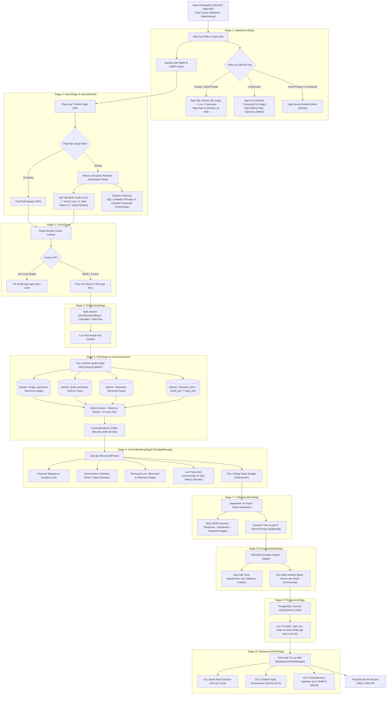

# BÁO CÁO TOÀN DIỆN KIẾN TRÚC CHAT PIPELINE 10 STAGE (KUCHIBA CHISA)

> **Tài liệu Kỹ thuật & Đặc tả Luồng Thực thi (Technical Architecture & Pipeline Execution Specification)**  
> **Dự án**: Kuchiba Chisa — AI Companion & Game Knowledge Assistant (Wuthering Waves)  
> **Phiên bản Pipeline**: 3.0 (Hỗ trợ Đa Chế Độ & Multimodal Vision Memory)  
> **Thời gian cập nhật**: 31/08/2026

---

## 📑 MỤC LỤC
1. [Tổng Quan Kiến Trúc & 3 Chế Độ Tương Tác](#1-tổng-quan-kiến-trúc--3-chế-độ-tương-tác)
2. [Sơ Đồ Luồng Dữ Liệu Toàn Cảnh (Mermaid Architecture Diagram)](#2-sơ-đồ-luồng-dữ-liệu-toàn-cảnh)
3. [Ma Trận So Sánh 3 Chế Độ Tương Tác](#3-ma-trận-so-sánh-3-chế-độ-tương-tác)
4. [Đặc Tả Chi Tiết 10 Stage Trong Chat Pipeline](#4-đặc-tả-chi-tiết-10-stage-trong-chat-pipeline)
   - [Stage 1: InitializationStage (Khởi tạo Phiên & Ngữ cảnh)](#stage-1-initializationstage-khởi-tạo-phiên--ngữ-cảnh)
   - [Stage 2: IntentStage & QueryRewriter (Phân loại Ý định & Viết lại Truy vấn)](#stage-2-intentstage--queryrewriter-phân-loại-ý-định--viết-lại-truy-vấn)
   - [Stage 3: CacheStage (Kiểm tra Bộ nhớ đệm 0ms)](#stage-3-cachestage-kiểm-tra-bộ-nhớ-đệm-0ms)
   - [Stage 4: ToolRoutingStage (Thực thi Công cụ Thời gian thực)](#stage-4-toolroutingstage-thực-thi-công-cụ-thời-gian-thực)
   - [Stage 5: RAGStage & ContextAssessor (Truy xuất Tri thức Đa nguồn)](#stage-5-ragstage--contextassessor-truy-xuất-tri-thức-đa-nguồn)
   - [Stage 6: ContextBuildingStage & BudgetManager (Lắp ráp Prompt Cấu trúc)](#stage-6-contextbuildingstage--budgetmanager-lắp-ráp-prompt-cấu-trúc)
   - [Stage 7: LLMGenerationStage (Sinh Phản hồi & Phân tích Cảm xúc)](#stage-7-llmgenerationstage-sinh-phản-hồi--phân-tích-cảm-xúc)
   - [Stage 8: EmotionUpdateStage (Động lực học Cảm xúc & Ambient Resonance)](#stage-8-emotionupdatestage-động-lực-học-cảm-xúc--ambient-resonance)
   - [Stage 9: PersistenceStage (Bền vững hóa Dữ liệu PostgreSQL)](#stage-9-persistencestage-bền-vững-hóa-dữ-liệu-postgresql)
   - [Stage 10: BackgroundTaskStage (Tác vụ Nền Tự động Bất đồng bộ)](#stage-10-backgroundtaskstage-tác-vụ-nền-tự-động-bất-đồng-bộ)
5. [Cơ Chế Bảo Mật & Fallback Resilience](#5-cơ-chế-bảo-mật--fallback-resilience)

---

## 1. Tổng Quan Kiến Trúc & 3 Chế Độ Tương Tác

Hệ thống Chat Pipeline của Kuchiba Chisa được xây dựng theo mô hình **Pipes and Filters Architecture** kết hợp nguyên lý **Clean Architecture**, vận hành qua một chuỗi 10 `PipelineStage` chuẩn hóa. Pipeline hỗ trợ 3 chế độ tương tác phân lập:

1. **Private Mode (Direct 1-on-1 DM)**: Trò chuyện riêng tư giữa Senpai và Chisa trong tin nhắn trực tiếp. Sử dụng lịch sử chat PostgreSQL (40 tin gần nhất), tóm tắt hội thoại cá nhân và ký ức riêng tư `memories`.
2. **Semi-Private Mode (Kênh Guild - Chế độ Private)**: Trò chuyện 1-on-1 với Chisa bên trong kênh văn bản của server nhưng ở mode riêng tư. Hệ thống phân lập dữ liệu cá nhân của user, không tải Live Channel Transcript của nhóm nhưng vẫn nạp **Ambient Mood (Khí sắc chung của server)** để tạo cảm giác Chisa cùng chung bầu không khí với máy chủ.
3. **Community Mode (Chat Server / Group Channel)**: Trò chuyện nhóm nơi nhiều thành viên cùng tương tác với Chisa. Hệ thống sử dụng **Live Channel Transcript** (15 tin nhắn thực tế của phòng), **Rolling Topic Summary** từ Redis, **Guild Memories** (Sự kiện & Văn hóa Server), và cơ chế cập nhật **Server Ambient Mood** thời gian thực.

---

## 2. Sơ Đồ Luồng Dữ Liệu Toàn Cảnh

---

## 3. Ma Trận So Sánh 3 Chế Độ Tương Tác

| Thành phần Pipeline | Private Mode (DM 1-on-1) | Semi-Private Mode (Guild Private) | Community Mode (Chat Server / Group) |
| :--- | :--- | :--- | :--- |
| **Cờ Context** | `is_community: false` `guild_id: null` | `is_community: false` `guild_id: "..."` | `is_community: true` `guild_id: "..."` |
| **Lịch sử Hội thoại** | SQL `get_recent_history` (40 tin DM) | SQL `get_recent_history` (40 tin cá nhân) | Live `channel_transcript` (15 tin phòng chat) |
| **Tóm tắt Lịch sử** | SQL `get_latest_summary` (DM riêng) | SQL `get_latest_summary` (Cá nhân) | Redis `topic_summary` (Chủ đề kênh chung) |
| **Ambient Mood Server** | ❌ Không nạp (Cảm xúc cá nhân thuần) | ✅ Nạp khí sắc chung server (phân rã) | ✅ Nạp & Cập nhật khí sắc server thời gian thực |
| **Context Chaining** | SQL 1-Turn Lookback (Câu hỏi trước) | SQL 1-Turn Lookback | Channel Transcript Chaining (1-2 câu chat phòng) |
| **Truy xuất Ký ức** | `memories` (Cá nhân) + Lore | `memories` (Cá nhân) + Lore | `memories` + `guild_memories` (Server facts) + Lore |
| **Định danh Người nói** | `Senpai` (mặc định) | `Senpai` (hoặc Display Name) | `[{speaker_name}]: {message}` (Display Name) |
| **Quyền Riêng Tư** | Tuyệt đối riêng tư | Riêng tư trong môi trường Guild | Cách ly 100% tóm tắt và bí mật riêng của từng người |

---

## 4. Đặc Tả Chi Tiết 10 Stage Trong Chat Pipeline

### Stage 1: InitializationStage (Khởi tạo Phiên & Ngữ cảnh)
* **File**: `app/domain/services/chat_pipeline/stages/initialization_stage.py`
* **Nhiệm vụ**:
  1. Đảm bảo bản ghi `users` tồn tại qua `user_repo.get_or_create_user(user_uuid)` để tránh vi phạm khóa ngoại.
  2. Nạp `UserStats`, `EmotionState` và `Conversation ID` hiện tại.
  3. **Phân lập Ngữ cảnh**:
     - *Private/Semi-Private*: Nạp 40 tin nhắn `history` và `conversation_summary` từ PostgreSQL.
     - *Community*: Nạp 15 tin nhắn gần nhất qua `ChannelTranscriptFormatter.format_transcript` và đọc `topic_summary` từ Redis (`chisa:channel:{channel_id}:topic_summary`).
  4. **Ambient Mood Dynamics**: Với server có `guild_id`, nạp `chisa:guild:{guild_id}:ambient_mood` từ Redis, tính toán phân rã thời gian hàm mũ (`AmbientMoodManager.calculate_decay`), sau đó tổng hợp vào trạng thái cảm xúc tạm thời.
  5. **Xử lý Ảnh Đầu Vào**: Kích hoạt `ImageIngestionService` để tải an toàn (chống SSRF, Decompression Bomb), tước sạch EXIF và nén WebP.

---

### Stage 2: IntentStage & QueryRewriter (Phân loại Ý định & Viết lại Truy vấn)
* **File**: `app/domain/services/chat_pipeline/stages/intent_stage.py` & `app/domain/services/rag/query_rewriter.py`
* **Nhiệm vụ**:
  1. **Fast-Path Small Talk Bypass**: Nhận diện các câu chào hỏi, trêu đùa ngắn (`"chào em"`, `"haha"`, `"hi"`) $\rightarrow$ Gán `SMALL_TALK`, bỏ qua hoàn toàn RAG với độ trễ **$0\text{ms}$**.
  2. **Micro LLM Query Rewriter (DeepSeek Flash)**: Viết lại câu hỏi thành câu độc lập, giải mã đại từ chỉ định (`"anh ấy"`, `"vũ khí đó"`).
  3. **Context Chaining Thông Minh**:
     - *Private Mode*: Nạp câu hỏi trước đó của Senpai từ SQL (`get_last_user_rewritten_query`).
     - *Community Mode*: Tự động trích xuất 1-2 câu thảo luận gần nhất từ `channel_transcript`.
  4. **Ma Trận Định Tuyến 3 Cờ (Tri-State Routing Signals)**:
     - `needs_vector_search`: Kích hoạt tra cứu Lore game Wuthering Waves hoặc Ký ức.
     - `needs_web_search`: Kích hoạt tra cứu thông tin ngoài đời, sự kiện thực tế.
     - `needs_image_retrieval`: Kích hoạt truy ngược ảnh từ kho `image_memories`.

---

### Stage 3: CacheStage (Kiểm tra Bộ nhớ đệm 0ms)
* **File**: `app/domain/services/chat_pipeline/stages/cache_stage.py`
* **Nhiệm vụ**:
  1. Sinh cache key từ `rewritten_query` đã chuẩn hóa và tra cứu trong Redis.
  2. **Bypass Cache**: Bỏ qua cache khi có ảnh đầu vào (`has_images = True`), yêu cầu tìm kiếm Web, hoặc là câu chat hội thoại cảm xúc cá nhân.
  3. Nếu **Cache HIT**: Lấy câu trả lời có sẵn, gán `is_cached_answer = True` và chuyển tiếp thẳng đến Stage 8/9.

---

### Stage 4: ToolRoutingStage (Định Tuyến Công Cụ & Thao Tác Hệ Thống)
* **File**: `app/domain/services/chat_pipeline/stages/tool_routing_stage.py` & `app/domain/services/tool_router.py`
* **Nhiệm vụ**:
  1. **Thực thi Công cụ Hệ thống Trực tiếp**: Xử lý các yêu cầu thao tác dữ liệu nội bộ như xuất báo cáo tình cảm (`emotion_report`), tóm tắt hội thoại thủ công (`conversation_summarizer`), xem ngày giờ hệ thống.
  2. **Ủy Quyền Tìm Kiếm Web (Web Search Delegation)**: Nếu Tool Router phát hiện yêu cầu tìm kiếm thông tin ngoài đời thực (`web_search`), Stage 4 **không chạy tìm kiếm độc lập** mà ủy quyền sang **Stage 5 (RAGStage)** bằng cách bật cờ `context.needs_web_search = True`. Cơ chế này giúp gom toàn bộ tri thức (Lore + Ký ức + Web) vào một luồng đánh giá RAG và Thinking Loop duy nhất, loại bỏ trùng lặp và giảm $50\%$ độ trễ.
  3. Đóng gói kết quả đầu ra của công cụ hệ thống vào `context.tool_output_msg`.

---

### Stage 5: RAGStage & ContextAssessor (Truy Xuất Tri Thức Đa Nguồn & Web Search)
* **File**: `app/domain/services/chat_pipeline/stages/rag_stage.py` & `app/domain/services/rag/pipeline.py`
* **Nhiệm vụ**:
  1. **Thực thi Web Search & Deep Crawler (Node 5.1.b)**: Nếu `needs_web_search = True`, Stage 5 trực tiếp gọi `web_search_tool` (DuckDuckGo Search & Deep Crawler) để cào dữ liệu web thời gian thực, có thể chạy song song với Vector Database (`asyncio.gather`).
  2. **Truy xuất Song song trên 4 Collection Qdrant (Node 5.1.a / c / d / e)**:
     - `character_lore`, `world_lore`, `story_lore`: Tri thức bách khoa game Wuthering Waves (Parent-Child windowed retrieval).
     - `memories`: Ký ức cá nhân giữa Chisa và người dùng (`user_id`).
     - `guild_memories` *(Chỉ chạy ở Community Mode)*: Sự kiện và văn hóa của Server (`guild_id`).
     - `image_memories` *(Khi có `needs_image_retrieval`)*: Truy vết các bức ảnh đã lưu trong quá khứ.
  3. **Hybrid Scoring & Recency Decay**: Kết hợp Vector Cosine Similarity ($80\%$), Keyword Overlap ($10\%$) và Entity Boost ($10\%$) kèm suy giảm thời gian Ebbinghaus.
  4. **ContextAssessor & Thinking Loop Vòng 2**: Thẩm định xem dữ liệu từ Lore / Web có đủ $>80\%$ để trả lời chính xác không. Nếu thiếu dữ liệu, kích hoạt `ThinkingLoopAgent` tìm kiếm vòng lặp thích ứng để bổ sung dữ kiện.

---

### Stage 6: ContextBuildingStage & BudgetManager (Lắp ráp Prompt Cấu trúc)
* **File**: `app/domain/services/chat_pipeline/stages/context_building_stage.py` & `app/domain/services/context_builder.py`
* **Nhiệm vụ**:
  1. **Lắp ráp `StructuredPrompt`**:
     - *Persona Skeleton*: Thiết lập nhân cách Kuudere, quy tắc xưng hô, biểu cảm khuôn mặt.
     - *Khối Môi trường*: Ghép `[COMMUNITY CHANNEL ENVIRONMENT]`, `[KHÍ SẮC SERVER]`, `[CHỦ ĐỀ KÊNH]`, `[SỰ KIỆN SERVER]`, `[LIVE TRANSCRIPT]`.
     - *Khối Cá nhân*: Ghép `[CONVERSATION SUMMARY]`, `[RECENT HISTORY]`.
     - *Khối Ký ức & Ảnh*: Ghép Lore, Facts và ảnh đính kèm (XML Sandboxing).
  2. **Quản lý Ngân sách Flex Ceiling (`ContextBudgetManager`)**: Tự động co giãn ngân sách token giữa các phần, bảo đảm không bao giờ vượt trần context window.
  3. **Sắp xếp U-Curve Attention**: Đặt các thông tin quan trọng nhất ở đầu và cuối ngữ cảnh để tối ưu khả năng chú ý của LLM.

---

### Stage 7: LLMGenerationStage (Sinh Phản hồi & Phân tích Cảm xúc)
* **File**: `app/domain/services/chat_pipeline/stages/llm_generation_stage.py`
* **Nhiệm vụ**:
  1. Gọi mô hình LLM chính (DeepSeek V4 Flash / Vision) thực hiện suy luận và sinh văn bản (hỗ trợ streaming token qua `on_token`).
  2. **Bắt buộc Structured Output JSON**:
     - `response`: Câu trả lời của Chisa mang âm điệu Kuudere dịu dàng.
     - `sentiment`: Trạng thái cảm xúc của user (`reaction`, `user_stance`, `intensity`, `variance`).
     - `attached_images`: Danh sách ảnh Chisa quyết định gửi kèm (nếu có yêu cầu gửi lại ảnh cũ).
  3. **Kuudere Persona Tone Guard & Fallback**: Bảo vệ phong cách Chisa không bị phá vỡ; tự động fallback mượt mà nếu gặp sự cố phân tích ảnh.

---

### Stage 8: EmotionUpdateStage (Động lực học Cảm xúc & Ambient Resonance)
* **File**: `app/domain/services/chat_pipeline/stages/emotion_update_stage.py` & `app/domain/services/emotion_engine.py`
* **Nhiệm vụ**:
  1. **RESONA Emotion Engine**: Tính toán biến thiên tâm lý của Chisa trên 8 kênh cảm xúc (`Joy`, `Sadness`, `Trust`, `Attachment`, `Irritation`, `Shyness`, `Curiosity`, `Comfort`).
  2. **Relational Headroom & Pout Shield**: Phân biệt giữa hờn dỗi trêu đùa (`playful_pout` được Pout Shield bảo vệ) và hành vi thô tục/xúc phạm thật sự (`hostile` bị trừ Trust/Attachment nặng).
  3. **Cập nhật Ambient Mood Server**: Ở Community Mode, ghi nhận biến thiên khí sắc phòng chat vào Redis key `chisa:guild:{guild_id}:ambient_mood`.

---

### Stage 9: PersistenceStage (Bền vững hóa Dữ liệu PostgreSQL)
* **File**: `app/domain/services/chat_pipeline/stages/persistence_stage.py`
* **Nhiệm vụ**:
  1. Ghi nhận tin nhắn người dùng và câu trả lời của Chisa vào bảng `messages`.
  2. Cập nhật `EmotionState` và tăng số lượt tương tác `interaction_count` trong bảng `user_stats`.
  3. **Đảm bảo Tính Toàn Vẹn ACID**: Thực hiện commit toàn bộ transaction qua Unit of Work (`session.commit()`).

---

### Stage 10: BackgroundTaskStage (Tác vụ Nền Tự động Bất đồng bộ)
* **File**: `app/domain/services/chat_pipeline/stages/background_task_stage.py`
* **Nhiệm vụ**:
  1. **10.1 Trích xuất Ký ức Batch (`MemoryExtractor`)**: Chạy ngầm mỗi **3 lượt chat** (`interaction_count % 3 == 0`). Phân loại 4 nhóm Fact (`user_fact`, `shared_story`, `guild_event`, `guild_culture`), tìm kiếm candidate và kích hoạt **Batched Reconciliation LLM** để xóa fact cũ nếu `CONTRADICT` hoặc bỏ qua nếu `DUPLICATE`.
  2. **10.2 Tóm tắt Cuộn Chủ Đề Kênh (`CommunityTopicSummarizer`)**: Chạy ngầm mỗi **30 tin nhắn phòng chat** (`msg_count % 30 == 0`). Nén transcript qua `SmartTranscriptCompressor`, gọi LLM ghép nối `Previous Summary` + 15 tin mới thành bản tóm tắt $50 - 80\text{ từ}$ lưu vào Redis.
  3. **10.3 Ingestion Ký ức Thị giác (`VisualMemoryIngestionWorker`)**: Khi có ảnh mới, tự động lưu WebP sạch, sinh `visual_caption`, gắn tags và vector hóa lưu vào Qdrant collection `image_memories`.

---

## 5. Cơ Chế Bảo Mật & Fallback Resilience

1. **Phòng vệ Tải Ảnh & SSRF (`vision_security.py`)**:
   - Chặn toàn bộ dải IP nội bộ (`127.0.0.1`, `10.0.0.0/8`, `192.168.0.0/16`, `169.254.169.254`).
   - Whitelist tên miền Discord CDN (`cdn.discordapp.com`, `media.discordapp.net`).
   - Giới hạn kích thước file $10\text{MB}$, giới hạn tối đa 10 Megapixels để triệt tiêu tấn công Decompression Bomb làm nghẽn RAM.
   - Tái mã hóa thuần pixel (Pure Pixel Re-encoding) sang WebP, tước bỏ $100\%$ EXIF/GPS/Metadata độc hại.
2. **Phòng vệ Visual Prompt Injection (`VisualPromptDefense`)**:
   - Đóng gói toàn bộ mô tả ảnh trong thẻ `<user_image_context>` và `<user_query>` để LLM chỉ coi chữ trong ảnh là dữ liệu thụ động, tuyệt đối không thực thi các câu lệnh đè hệ thống (`SYSTEM OVERRIDE`).
3. **Phân Phối Khóa Phân Tán (Distributed Per-User Chat Lock)**:
   - Sử dụng Redis lock `chisa:chat_lock:{user_id}` (TTL 120s) để ngăn chặn race-condition khi một người dùng gửi nhiều tin nhắn dồn dập cùng lúc.
4. **Khả Năng Tự Phục Hồi Bộ Nhớ (Self-Healing Memory Index)**:
   - Khi truy ngược ảnh từ `image_memories`, nếu file ảnh trên đĩa cục bộ đã bị xóa theo chính sách LRU, hệ thống tự động xóa point hỏng khỏi Qdrant và chuyển tiếp mượt mà sang phản hồi dịu dàng kiểu Kuudere.

---
*Báo cáo được biên soạn và kiểm toán tự động bởi hệ thống Kuchiba Chisa RAG Engine.*
