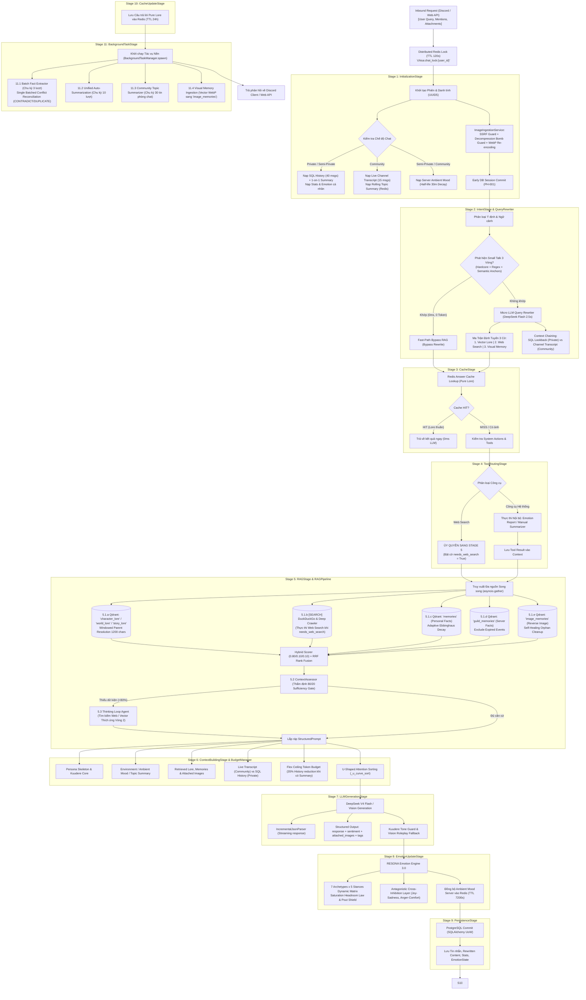

# BÁO CÁO TOÀN DIỆN KIẾN TRÚC CHAT PIPELINE (KUCHIBA CHISA)

> **Tài liệu Kỹ thuật & Đặc tả Luồng Thực thi (Technical Architecture & Pipeline Execution Specification)**  
> **Dự án**: Kuchiba Chisa — AI Companion & Game Knowledge Assistant (Wuthering Waves)  
> **Phiên bản Pipeline**: 3.0 (Hỗ trợ Đa Chế Độ & Multimodal Vision Memory)  
> **Xác minh Codebase**: $100\%$ đối chiếu mã nguồn thực tế (`app/domain/services/chat_pipeline/`, `app/application/dependencies.py`, `chat_engine.py`)  
> **Thời gian cập nhật**: 31/08/2026

---

## 📑 MỤC LỤC
1. [Tổng Quan Kiến Trúc & 3 Chế Độ Tương Tác](#1-tổng-quan-kiến-trúc--3-chế-độ-tương-tác)
2. [Sơ Đồ Luồng Dữ Liệu Toàn Cảnh (Mermaid Architecture Flowchart)](#2-sơ-đồ-luồng-dữ-liệu-toàn-cảnh)
3. [Ma Trận So Sánh 3 Chế Độ Tương Tác](#3-ma-trận-so-sánh-3-chế-độ-tương-tác)
4. [Đặc Tả Chi Tiết Chuỗi 11 Stage Tuần Tự (Sequential Stages)](#4-đặc-tả-chi-tiết-chuỗi-11-stage-tuần-tự)
   - [Stage 1: InitializationStage (Khởi tạo Phiên, Hồ sơ & Ngữ cảnh)](#stage-1-initializationstage-khởi-tạo-phiên-hồ-sơ--ngữ-cảnh)
   - [Stage 2: IntentStage & QueryRewriter (Phân loại Ý định, Bypass & Tái cấu trúc Truy vấn)](#stage-2-intentstage--queryrewriter-phân-loại-ý-định-bypass--tái-cấu-trúc-truy-vấn)
   - [Stage 3: CacheStage (Kiểm tra Bộ nhớ đệm Lore 0ms)](#stage-3-cachestage-kiểm-tra-bộ-nhớ-đệm-lore-0ms)
   - [Stage 4: ToolRoutingStage (Định tuyến Công cụ & Thao tác Hệ thống)](#stage-4-toolroutingstage-định-tuyến-công-cụ--thao-tác-hệ-thống)
   - [Stage 5: RAGStage & RAGPipeline (Truy xuất Đa nguồn Song song & Thinking Loop)](#stage-5-ragstage--ragpipeline-truy-xuất-đa-nguồn-song-song--thinking-loop)
   - [Stage 6: ContextBuildingStage & BudgetManager (Lắp ráp Prompt Cấu trúc & Flex Ceiling)](#stage-6-contextbuildingstage--budgetmanager-lắp-ráp-prompt-cấu-trúc--flex-ceiling)
   - [Stage 7: LLMGenerationStage (Sinh Phản hồi & Xử lý Luồng JSON)](#stage-7-llmgenerationstage-sinh-phản-hồi--xử-lý-luồng-json)
   - [Stage 8: EmotionUpdateStage (RESONA Engine 3.0 & Server Ambient Sync)](#stage-8-emotionupdatestage-resona-engine-30--server-ambient-sync)
   - [Stage 9: PersistenceStage (Bền vững hóa Dữ liệu PostgreSQL)](#stage-9-persistencestage-bền-vững-hóa-dữ-liệu-postgresql)
   - [Stage 10: CacheUpdateStage (Lưu Bộ nhớ đệm Câu trả lời Lore)](#stage-10-cacheupdatestage-lưu-bộ-nhớ-đệm-câu-trả-lời-lore)
   - [Stage 11: BackgroundTaskStage (Khởi chạy Tác vụ Nền Tự động Bất đồng bộ)](#stage-11-backgroundtaskstage-khởi-chạy-tác-vụ-nền-tự-động-bất-đồng-bộ)
5. [Cơ Chế Bảo Mật, An Toàn & Fallback Resilience](#5-cơ-chế-bảo-mật-an-toàn--fallback-resilience)
6. [Bảng Tổng Hợp Hằng Số Cấu Hình Vận Hành](#6-bảng-tổng-hợp-hằng-số-cấu-hình-vận-hành)

---

## 1. Tổng Quan Kiến Trúc & 3 Chế Độ Tương Tác

Hệ thống Chat Pipeline của Kuchiba Chisa được xây dựng theo mô hình **Pipes and Filters Architecture** kết hợp nguyên lý **Clean Architecture**. Toàn bộ luồng trò chuyện được chuẩn hóa thành chuỗi **11 Stage tuần tự** kế thừa từ `PipelineStage` (`app/domain/services/chat_pipeline/stage.py`), được khởi tạo tại `app/application/dependencies.py` (dòng 210–272).

Mỗi lượt gọi chat được kiểm soát bởi một **Distributed Redis Lock** (`chisa:chat_lock:{user_id}`, TTL = 120s) tại `ChatEngine` để ngăn chặn race condition khi người dùng nhắn dồn dập. Pipeline hỗ trợ 3 chế độ tương tác phân lập:

1. **Private Mode (Direct 1-on-1 DM)**: Trò chuyện riêng tư trong Discord DM (`guild_id = "DM"`). Sử dụng lịch sử chat PostgreSQL (tối đa 40 tin gần nhất trong RAM, cắt gọt vào Prompt theo budget), tóm tắt tích lũy `conversations.summary` và ký ức riêng tư `memories`.
2. **Semi-Private Mode (Kênh Guild - Chế độ Private)**: Trò chuyện 1-on-1 với Chisa bên trong kênh văn bản của server nhưng ở mode riêng tư (`guild_id = "CHANNEL_<channel_id>"`). Phân lập ký ức/stats cá nhân theo từng kênh riêng, không tải Live Channel Transcript nhưng vẫn nạp **Ambient Mood (Khí sắc chung của server)** để Chisa cùng chung bầu không khí với máy chủ.
3. **Community Mode (Chat Server / Group Channel)**: Trò chuyện nhóm nơi nhiều thành viên cùng tương tác với Chisa (`guild_id = message.guildId`). Kích hoạt:
   - **Live Channel Transcript**: 15 tin nhắn gần nhất từ Discord channel qua `ChannelTranscriptFormatter`.
   - **Rolling Topic Summary**: Bản tóm tắt $50 - 80\text{ từ}$ cuộn liên tục từ Redis.
   - **Guild Memories**: Sự kiện, lịch trình và văn hóa chung của Server.
   - **Server Ambient Mood**: Khí sắc cảm xúc chung của Server cập nhật thời gian thực.

---

## 2. Sơ Đồ Luồng Dữ Liệu Toàn Cảnh

---

## 3. Ma Trận So Sánh 3 Chế Độ Tương Tác

| Tiêu chí / Thành phần | Private Mode (DM 1-on-1) | Semi-Private Mode (Guild Private) | Community Mode (Chat Server / Group) |
| :--- | :--- | :--- | :--- |
| **Vị trí tương tác** | Discord DM | Kênh Server có `mode: 'private'` | Kênh Server có `mode: 'community'` |
| **Điều kiện kích hoạt** | Nhắn trực tiếp hoặc `/ask` | Nhắn trong kênh riêng | `@mention Chisa` hoặc Reply tin nhắn |
| **Identity Resolution** | `resolvedGuildId = 'DM'` | `resolvedGuildId = 'CHANNEL_<channel_id>'` | `resolvedGuildId = message.guildId` |
| **Lịch sử Hội thoại** | SQL `get_recent_history` (40 tin DM) | SQL `get_recent_history` (40 tin kênh) | Live `channel_transcript` (15 tin phòng chat) |
| **Tóm tắt Lịch sử** | SQL `get_latest_summary` (DM riêng) | SQL `get_latest_summary` (Kênh riêng) | Redis `topic_summary` (Chủ đề kênh chung) |
| **Ambient Mood Server** | ❌ Không nạp (Cảm xúc cá nhân thuần) | ✅ Nạp khí sắc chung server (phân rã) | ✅ Nạp & Cập nhật khí sắc server thời gian thực |
| **Context Chaining** | SQL 1-Turn Lookback (Câu hỏi trước) | SQL 1-Turn Lookback | Channel Transcript Chaining (1-2 câu chat phòng) |
| **Truy xuất Ký ức** | `memories` (Cá nhân) + Lore | `memories` (Cá nhân) + Lore | `memories` + `guild_memories` (Server facts) + Lore |
| **Định danh Người nói** | `Senpai` (mặc định) | `Senpai` (hoặc Display Name) | `[{speaker_name}]: {message}` (Display Name) |
| **Quyền Riêng Tư** | Tuyệt đối riêng tư | Riêng tư trong môi trường Guild | Cách ly 100% tóm tắt và bí mật riêng của từng người |

---

## 4. Đặc Tả Chi Tiết Chuỗi 11 Stage Tuần Tự

### Stage 1: InitializationStage (Khởi tạo Phiên, Hồ sơ & Ngữ cảnh)
* **File**: `app/domain/services/chat_pipeline/stages/initialization_stage.py` (208 dòng)
* **Nhiệm vụ & Cơ chế Kỹ thuật**:
  1. **Định danh User UUID**: Gọi `normalize_user_id(context.user_id)` sinh deterministic `UUID5`.
  2. **Redis Write-Through State Cache (Fast-Path ~0.2ms)**:
     - Đọc khóa `chisa:user:{user_id}:state` từ Redis qua `UserStateCache.get_state`.
     - **Cache HIT**: Nạp trực tiếp `UserStats`, `EmotionState` và `conv_id` từ RAM Redis, **bỏ qua 100% 3 câu truy vấn SQL (`get_or_create_user`, `get_user_stats`, `get_emotion_state`)**, giảm $95\%$ độ trễ Stage 1.
     - **Cache MISS / Redis Restart**: Truy vấn PostgreSQL và tự động đẩy ngược vào Redis với TTL 7 ngày (Rolling Expiration).
     - **Fail-Safe Fallback**: Tự động fallback về PostgreSQL an toàn nếu Redis gặp sự cố.
  3. **Phân lập Ngữ cảnh Lịch sử**:
     - *Private/Semi-Private*: Nạp 40 tin nhắn `history` và `conversation_summary` từ PostgreSQL.
     - *Community*: Nạp 15 tin nhắn gần nhất qua `ChannelTranscriptFormatter.format_transcript()` (lọc bot spam, gộp tin nhắn liên tiếp cùng người nói) và đọc `topic_summary` từ Redis (`chisa:channel:{channel_id}:topic_summary`).
  4. **Ambient Mood Dynamics (Continuous Exponential Decay)**:
     - Với server có `guild_id`, đọc snapshot từ Redis `chisa:guild:{guild_id}:ambient_mood`.
     - Phân rã liên tục theo thời gian thực về Kuudere Baseline ($\text{Half-Life} = 1800\text{s}$, $\tau = 2597.07\text{s}$):
       $$E(t) = \text{Baseline} + (\text{Stored} - \text{Baseline}) \cdot \exp\left(-\frac{\Delta t}{2597.07}\right)$$
     - Hòa quyện 6 kênh xúc cảm nhất thời vào Chisa, **bảo toàn 100% Trust & Attachment cá nhân**.
  5. **Multimodal Image Ingestion & An Toàn (`ImageIngestionService`)**:
     - Kiểm tra SSRF qua `SecureImageFetcher` (chặn 19 dải IP Private/Cloud-Metadata, whitelist Discord CDN).
     - Giới hạn kích thước ảnh $10\text{MP}$ (`Image.MAX_IMAGE_PIXELS = 10_000_000`), bóc tách sạch EXIF/GPS, resize $\le 1536\text{px}$, nén WebP chất lượng 85 và sinh Base64 Data URI cho Vision LLM.
  6. **Early DB Session Commit (PH-001)**: Commit sớm giải phóng read-connection về pool trước khi bước vào các bước gọi mạng LLM.

---

### Stage 2: IntentStage & QueryRewriter (Phân loại Ý định, Bypass & Tái cấu trúc Truy vấn)
* **File**: `app/domain/services/chat_pipeline/stages/intent_stage.py` (325 dòng)
* **Sub-services**: `app/domain/services/intent_classifier.py`, `app/domain/services/rag/query_rewriter.py`
* **Nhiệm vụ & Cơ chế Kỹ thuật**:
  1. **Gateway Small Talk 3 Vòng (Hardcore Guarded Hybrid)**:
     - *Vòng 1 (Hardcore Guards)*: Chặn code syntax, từ khóa nghi vấn ("là gì", "forte", "vũ khí"), thực thể Lore, độ dài > 25 từ.
     - *Vòng 2 (Regex Fast-Path)*: Khớp biểu thức quy chuẩn `_SMALL_TALK_PATTERNS` (<0.05ms).
     - *Vòng 3 (Dual-Signal Semantic Anchors)*: So khớp Cosine Similarity với 45 anchor mẫu:
       $$\text{Small Talk Accepted} \iff S_{pos} \ge 0.86 \land (S_{pos} - S_{neg} \ge 0.04) \land S_{pos} > S_{neg}$$
  2. **Fast-Path Small Talk Bypass**: Gán `rewrite_method = "BYPASS"`, `needs_vector_search = False`, `needs_web_search = False` (**0ms Latency, 0 Token Overhead**).
  3. **Micro LLM Query Rewriter (DeepSeek Flash)**:
     - Context Chaining: Lấy query trước từ SQL (Private) hoặc 1–2 câu thảo luận gần nhất từ transcript (Community).
     - Giải quyết đại từ liên kết ("anh ấy", "cô ta" $\rightarrow$ tên nhân vật), chuẩn hóa danh xưng ("em/chisa" $\rightarrow$ "Kuchiba Chisa", "anh/tôi" $\rightarrow$ "Senpai").
     - Định tuyến Ma trận 3 Cờ (`needs_vector_search`, `needs_web_search`, `needs_image_retrieval`).
  4. **Reverse Visual Search Detector**: Nhận diện yêu cầu xem lại ảnh cũ $\rightarrow$ Gán `ChatIntent.RETRIEVE_PAST_IMAGE` và ép `needs_vector_search = True`.

---

### Stage 3: CacheStage (Kiểm tra Bộ nhớ đệm Lore 0ms)
* **File**: `app/domain/services/chat_pipeline/stages/cache_stage.py` (66 dòng)
* **Nhiệm vụ & Cơ chế Kỹ thuật**:
  1. Kích hoạt khi Intent duy nhất là `ChatIntent.LORE` và không có ảnh đính kèm.
  2. Tính MD5 hash của `cleaned_query` $\rightarrow$ Tra cứu Redis `chisa:answer_cache:lore:{query_hash}`.
  3. **Invalidation Guard**: Nếu câu trả lời trong cache chứa nội dung lỗi/fallback (`is_fallback_reply`), tự động xóa key khỏi Redis.
  4. **Cache HIT**: Gán `is_cached_answer = True`, chuyển tiếp thẳng sang Stage 8/9 (**tiết kiệm 100% chi phí tính toán RAG và LLM**).

---

### Stage 4: ToolRoutingStage (Định tuyến Công cụ & Thao tác Hệ thống)
* **File**: `app/domain/services/chat_pipeline/stages/tool_routing_stage.py` (121 dòng)
* **Sub-service**: `app/domain/services/tool_router.py`
* **Nhiệm vụ & Cơ chế Kỹ thuật**:
  1. **Thực thi Công cụ Hệ thống Nội bộ**: Xử lý các yêu cầu thao tác dữ liệu như báo cáo tình cảm (`emotion_report`), tóm tắt hội thoại thủ công (`conversation_summarizer`).
  2. **Ủy Quyền Tìm Kiếm Web (Web Search Delegation)**: Nếu Tool Router phát hiện yêu cầu tìm kiếm web (`web_search`), Stage 4 **không chạy tìm kiếm độc lập** mà ủy quyền sang **Stage 5 (RAGStage)** bằng cách bật `context.needs_web_search = True`. Cơ chế này gom toàn bộ tri thức vào một luồng đánh giá RAG duy nhất, loại bỏ trùng lặp và giảm $50\%$ độ trễ.
  3. Đóng gói kết quả đầu ra của công cụ hệ thống vào `context.tool_output_msg`.

---

### Stage 5: RAGStage & RAGPipeline (Truy xuất Đa nguồn Song song & Thinking Loop)
* **File**: `app/domain/services/chat_pipeline/stages/rag_stage.py` (59 dòng), `app/domain/services/rag/pipeline.py` (633 dòng)
* **Nhiệm vụ & Cơ chế Kỹ thuật**:
  1. **Truy hồi Đa Collection Song song (`asyncio.gather`)**:
     - **Lore (`character_lore`, `world_lore`, `story_lore`)**: `LoreRetriever` tìm kiếm vector kết hợp bộ lọc thực thể từ `EntityResolver`.
       + **Windowed Parent Resolution**: Truy vấn PostgreSQL `lore_parent_docs` lấy markdown của Section cha, cắt cửa sổ ngữ cảnh tối ưu $1200\text{ ký tự}$, giữ nguyên Header `# ...`, ngăn ngừa Parent Bloat.
       + **Hybrid Scoring**: $\text{Score} = (0.80 \times \text{Vector}) + (0.10 \times \text{Keyword}) + (0.10 \times \text{Metadata})$.
       + **Reciprocal Rank Fusion (RRF)**: Hợp nhất và phân bổ xen kẽ các chunk từ 3 collection để chống thiên lệch.
     - **Personal Memories (`memories`)**: `MemoryRetriever` tìm kiếm ký ức cá nhân theo `user_id`.
       + **Adaptive Ebbinghaus Decay**: Core Memory ($\lambda = 0.005$, nửa đời $\approx 138$ ngày), Habit ($\lambda = 0.025$, nửa đời $\approx 28$ ngày), Casual ($\lambda = 0.10$, nửa đời $\approx 7$ ngày). Spaced repetition theo $\max(\text{created\_at}, \text{last\_accessed\_at})$.
     - **Guild Memories (`guild_memories`)**: `GuildMemoryRetriever` tìm kiếm tri thức server theo `guild_id`, tự động loại bỏ sự kiện hết hạn (`expires_at < now`).
     - **Image Memories (`image_memories`)**: `ImageMemoryRetriever` tìm kiếm vector mô tả ảnh (score $\ge 0.68$), kiểm tra file vật lý trên đĩa, tự động xóa orphan points.
  2. **Web Search & Deep Crawler Trực tiếp (Node 5.1.b)**: Nếu `needs_web_search = True`, thực thi DuckDuckGo Search & Deep Crawler cào sâu nội dung web thời gian thực.
  3. **Universal Context Assessor (80/20 Sufficiency Gate)**: Đánh giá xem dữ liệu đã đủ $\ge 80\%$ để trả lời chính xác chưa. Nếu thiếu dữ liệu, chắt lọc `extracted_facts` và kích hoạt `ThinkingLoopAgent` tìm kiếm bổ sung vòng 2 thích ứng.

---

### Stage 6: ContextBuildingStage & BudgetManager (Lắp ráp Prompt Cấu trúc & Flex Ceiling)
* **File**: `app/domain/services/chat_pipeline/stages/context_building_stage.py` (112 dòng), `app/domain/services/context_budget_manager.py` (433 dòng), `app/domain/services/context_builder.py` (589 dòng)
* **Nhiệm vụ & Cơ chế Kỹ thuật**:
  1. **Quản lý Ngân sách Flex Ceiling (`ContextBudgetManager`)**:
     - Phân bổ ngân sách linh hoạt theo Mode: `SMALL_TALK` ($5000\text{ tok}$), `RAG` ($8000\text{ tok}$), `LOOP` ($12000\text{ tok}$).
     - **35% History Reduction khi có Summary**: Tự động giảm $35\%$ ngân sách của History khi có Summary, chuyển token dư vào Flex Pool cho Lore/Memory.
     - **`_fit_history`**: Thu thập tin nhắn ngược từ mới nhất trở về trước, đảm bảo không bao giờ tràn context window.
  2. **U-Curve Attention Sorting (`_u_curve_sort`)**: Khắc phục Lost-in-the-Middle bằng cách đẩy các chunk quan trọng nhất về đầu và cuối khối dữ liệu tham chiếu.
  3. **XML Sandboxing cho Multimodal Vision**: Bọc câu hỏi người dùng trong thẻ `<user_image_context>` và `<user_query>` để LLM chỉ coi chữ trong ảnh là dữ liệu thụ động, chống Visual Prompt Injection.
  4. **Dynamic Temperature**: Vision ($0.4$), Web/Loop ($0.3$), Lore/Memory ($0.5$), Small talk ($0.8$).

---

### Stage 7: LLMGenerationStage (Sinh Phản hồi & Xử lý Luồng JSON)
* **File**: `app/domain/services/chat_pipeline/stages/llm_generation_stage.py` (222 dòng)
* **Nhiệm vụ & Cơ chế Kỹ thuật**:
  1. **Streaming với `IncrementalJsonParser`**: Trích xuất luồng ký tự trực tiếp từ trường `"response": "..."` trong JSON payload mà không cần đợi đóng ngoặc JSON hoàn chỉnh, truyền qua callback `on_token()`.
  2. **Structured Output JSON Schema**: Bắt buộc trả về `response`, `sentiment` (`reaction`, `user_stance`, `intensity`, `variance`), `attached_images`, `image_tags` (auto-tagging 0ms), `visual_caption`.
  3. **Kuudere Roleplay Fallback**: Tự động ứng biến tự nhiên theo phong cách Kuudere khi gặp sự cố mạng hoặc lỗi phân tích ảnh.

---

### Stage 8: EmotionUpdateStage (RESONA Engine 3.0 & Server Ambient Sync)
* **File**: `app/domain/services/chat_pipeline/stages/emotion_update_stage.py` (148 dòng), `app/domain/services/emotion_engine.py` (533 dòng)
* **Nhiệm vụ & Cơ chế Kỹ thuật**:
  1. **RESONA Engine 3.0 Dual-Flag Matrix**: 7 Reaction Archetypes $\times$ 5 User Stances kết hợp hệ số tương hỗ.
  2. **Saturation Headroom Law**: Tốc độ tăng trưởng cảm xúc giảm dần khi tiệm cận biên giới $1.0$ hoặc $0.0$:
     $$\Delta E = \text{Raw Stimulus} \times (1.0 - E_{current})$$
  3. **Pout Shield**: Bảo vệ Trust & Attachment không bị trừ khi user trêu đùa yêu và Chisa hờn dỗi (`playful_pout`).
  4. **Antagonistic Cross-Inhibition Layer**: Triệt tiêu chéo giữa Joy và Sadness ($\min \times 0.5$); tức giận thật ức chế Shyness và Comfort.
  5. **Homeostasis Exponential Decay**: Suy hao thụ động cảm xúc theo thời gian vắng mặt.
  6. **Đồng bộ Ambient Mood Server**: Ở Community Mode, ghi nhận biến thiên khí sắc phòng chat vào Redis key `chisa:guild:{guild_id}:ambient_mood` (TTL = 7200s).

---

### Stage 9: PersistenceStage (Bền vững hóa Dữ liệu PostgreSQL & Redis Write-Through)
* **File**: `app/domain/services/chat_pipeline/stages/persistence_stage.py` (104 dòng)
* **Nhiệm vụ & Cơ chế Kỹ thuật**:
  1. Ghi nhận tin nhắn User (kèm `rewritten_content` và `media_metadata`) và tin nhắn Assistant vào bảng `messages`.
  2. Cập nhật `stats.interaction_count += 1`, `stats.last_seen` và trạng thái `EmotionState` vào PostgreSQL qua Unit of Work (ACID).
  3. **Redis Write-Through State Cache Sync**: Sau khi hoàn tất ghi DB, tự động đồng bộ hóa `UserStats`, `EmotionState` và `conv_id` mới nhất lên Redis khóa `chisa:user:{user_id}:state` (TTL 7 ngày) phục vụ Fast-Path Stage 1 cho các turn chat tiếp theo.

---

### Stage 10: CacheUpdateStage (Lưu Bộ nhớ đệm Câu trả lời Lore)
* **File**: `app/domain/services/chat_pipeline/stages/cache_update_stage.py` (31 dòng)
* **Nhiệm vụ & Cơ chế Kỹ thuật**:
  1. Kiểm tra nếu câu hỏi thuần túy là LORE game và câu trả lời không bị lỗi.
  2. Băm MD5 query và lưu câu trả lời vào Redis `chisa:answer_cache:lore:{query_hash}` với TTL = 86,400s (24 giờ).

---

### Stage 11: BackgroundTaskStage (Khởi chạy Tác vụ Nền Tự động Bất đồng bộ)
* **File**: `app/domain/services/chat_pipeline/stages/background_task_stage.py` (136 dòng)
* **Nhiệm vụ & Cơ chế Kỹ thuật**:
  Khởi chạy các tác vụ nền qua `BackgroundTaskManager.spawn()` (không block phản hồi của user):
  1. **11.1 Batch Fact Extraction (Chu kỳ 3 lượt - $N \% 3 == 0$)**: `MemoryExtractor` trích xuất 4 loại ký ức (`user_fact`, `shared_story`, `guild_event`, `guild_culture`). Thực hiện **Single Batched Reconciliation LLM Call** để xử lý xung đột:
     - `CONTRADICT`: Xóa point cũ khỏi Qdrant, chèn point mới.
     - `DUPLICATE`: Bỏ qua không lưu trùng.
     - `KEEP_BOTH`: Chèn fact mới vào Qdrant (`memories` hoặc `guild_memories`).
  2. **11.2 Pure Narrative Auto-Summarization (Chu kỳ 10 lượt - $N \% 10 == 0$)**:
     - Lọc sạch rác cảm xúc kỹ thuật và debug codeblock qua `ChannelTranscriptFormatter.clean_message_content()`.
     - Gọi LLM DeepSeek Flash nén narrative summary cô đọng **$80 - 120\text{ từ}$ tiếng Việt** (chống phình to summary).
     - Lưu đồng thời vào PostgreSQL `conversations.summary` và đồng bộ **Redis Summary Cache** (`chisa:user:{user_id}:summary`, TTL 7 ngày) phục vụ Fast-Path Stage 1 ($0.2\text{ms}$).
  3. **11.3 Community Channel Topic Summarizer (Chu kỳ 30 tin - $N \% 30 == 0$)**:
     - Duy trì **Redis Rolling Message Buffer** (`chisa:channel:{channel_id}:rolling_buffer`, tối đa 60 tin, TTL 7 ngày) tự động gom tích lũy toàn bộ các đoạn chat trôi và các lượt hỏi đáp Chisa qua từng turn.
     - **Cấu trúc Tổng hợp 3 Tầng (3-Tier Synthesis Prompt)** nạp vào LLM DeepSeek Flash:
       1. *Bản Tóm tắt Chu kỳ Trước (Previous Topic Summary)* từ Redis.
       2. *Hàng đợi Lịch sử Tích lũy (Accumulated History Buffer)*: Toàn bộ diễn biến thảo luận các turn trước trong chu kỳ (tối đa 800 tokens).
       3. *Bối cảnh Kênh Tức thời (Live Recent Context)*: 15 tin nhắn nóng hổi nhất hiện tại từ Discord (tối đa 600 tokens).
     - Nén thành bản tóm tắt mạch lạc $50 - 80\text{ từ}$ lưu vào Redis `chisa:channel:{channel_id}:topic_summary`.
     - Tự động tỉa buffer giữ lại 10 tin nhắn gần nhất làm vùng đệm tiếp nối (rolling overlap).
  4. **11.4 Visual Memory Ingestion (Kích hoạt khi có ảnh đính kèm)**: `VisualMemoryIngestionWorker` lấy visual tags và caption từ Stage 7, tạo vector embedding và upsert vào Qdrant collection `image_memories`.

---

## 5. Cơ Chế Bảo Mật, An Toàn & Fallback Resilience

1. **Phòng vệ Tải Ảnh & SSRF (`vision_security.py`)**:
   - Chặn 19 dải IP nội bộ/link-local/cloud-metadata.
   - Whitelist tên miền Discord CDN (`cdn.discordapp.com`, `media.discordapp.net`).
   - Giới hạn kích thước file $10\text{MB}$, giới hạn tối đa $10\text{MP}$ để triệt tiêu tấn công Decompression Bomb làm nghẽn RAM.
   - Tái mã hóa thuần pixel (Pure Pixel Re-encoding) sang WebP, tước bỏ $100\%$ EXIF/GPS/Metadata độc hại.
2. **Phòng vệ Visual Prompt Injection (`VisualPromptDefense`)**:
   - Đóng gói toàn bộ mô tả ảnh trong thẻ `<user_image_context>` và `<user_query>` để LLM chỉ coi chữ trong ảnh là dữ liệu thụ động, tuyệt đối không thực thi các câu lệnh đè hệ thống (`SYSTEM OVERRIDE`).
3. **Phân Phối Khóa Phân Tán (Distributed Per-User Chat Lock)**:
   - Sử dụng Redis lock `chisa:chat_lock:{user_id}` (TTL 120s) để ngăn chặn race-condition khi một người dùng gửi nhiều tin nhắn dồn dập cùng lúc.
4. **Khả Năng Tự Phục Hồi Bộ Nhớ (Self-Healing Memory Index)**:
   - Khi truy ngược ảnh từ `image_memories`, nếu file ảnh trên đĩa cục bộ đã bị xóa theo chính sách LRU, hệ thống tự động xóa point hỏng khỏi Qdrant và chuyển tiếp mượt mà sang phản hồi dịu dàng kiểu Kuudere.

---

## 6. Bảng Tổng Hợp Hằng Số Cấu Hình Vận Hành

| Thành phần / Module | Hằng số Cấu hình | Giá trị Mặc định | Mục đích Kỹ thuật |
| :--- | :--- | :--- | :--- |
| **Distributed Lock** | `Chat lock TTL` | `120s` | Khóa phân tán chống race condition cho cùng 1 user |
| **Prompt Budget** | `PROMPT_BUDGET_SMALL_TALK` | `5000 tokens` | Ngân sách context tối đa cho Small Talk |
| **Prompt Budget** | `PROMPT_BUDGET_RAG` | `8000 tokens` | Ngân sách context tối đa cho RAG tiêu chuẩn |
| **Prompt Budget** | `PROMPT_BUDGET_LOOP` | `12000 tokens` | Ngân sách context tối đa cho Thinking Loop phức tạp |
| **Prompt Budget** | `PROMPT_FLEX_RATIO` | `0.08` ($8\%$) | Tỷ lệ co giãn trần ngân sách linh hoạt |
| **Prompt Budget** | `MAX_RESPONSE_TOKENS` | `1000 tokens` | Giới hạn độ dài output tối đa từ LLM |
| **RAG Lore** | `TOP_K` / `SCORE_THRESHOLD` | `5` / `0.35` | Số chunk Lore tối đa lấy từ Qdrant và ngưỡng cosine |
| **RAG Lore Window** | `window_chars` | `1200 chars` | Kích thước cửa sổ trích xuất đoạn cha Section Parent |
| **Image Memory** | `SCORE_THRESHOLD` | `0.68` | Ngưỡng cosine tối thiểu để kích hoạt ảnh trong kho ký ức |
| **Memory Decay** | `Half-Life (Core / Habit / Casual)`| `138d / 28d / 7d` | Chu kỳ bán rã suy hao ký ức theo thuật toán Ebbinghaus |
| **Ambient Mood** | `HALF_LIFE_SECONDS` / $\tau$ | `1800s` / `2597.07s` | Chu kỳ suy hao cảm xúc server về Kuudere Baseline |
| **Vision Security** | `MAX_IMAGE_PIXELS_ALLOWED` | `10,000,000` (10MP) | Giới hạn giải nén ảnh tối đa chống Decompression Bomb |
| **Vision Security** | `TARGET_MAX_DIM` / Quality | `1536px` / `85 WebP` | Kích thước chuẩn hóa và nén WebP trước khi gửi LLM |
| **Background Tasks** | `Batch Fact Extraction` | Chu kỳ 3 lượt ($N \% 3 == 0$) | Tần suất trích xuất ký ức cá nhân & guild |
| **Background Tasks** | `Auto-Summarization` | Chu kỳ 10 lượt ($N \% 10 == 0$) | Tần suất tóm tắt narrative cuộc trò chuyện vào SQL |
| **Background Tasks** | `Topic Summarization` | Chu kỳ 30 tin ($N \% 30 == 0$)| Tần suất tóm tắt chủ đề kênh cộng đồng vào Redis |

---
*Báo cáo được đối soát và xác minh trực tiếp từ toàn bộ codebase của Kuchiba Chisa.*
