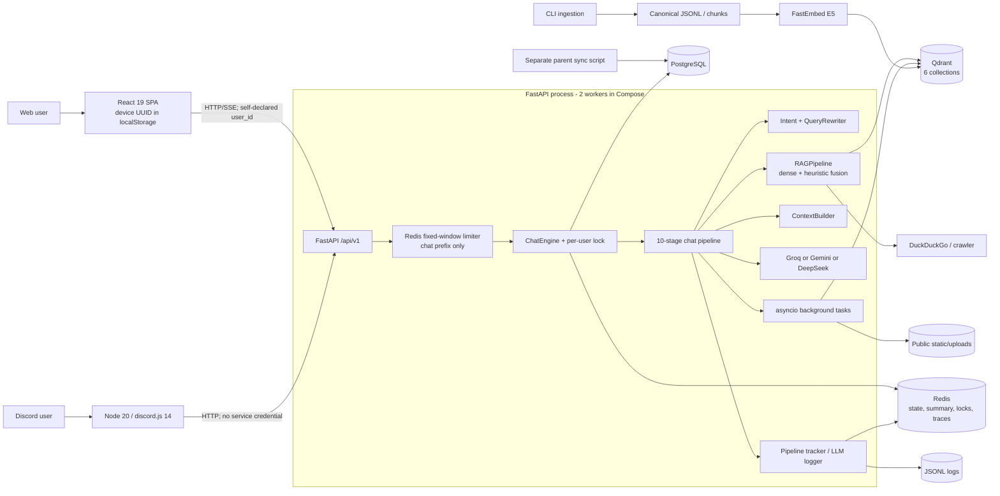
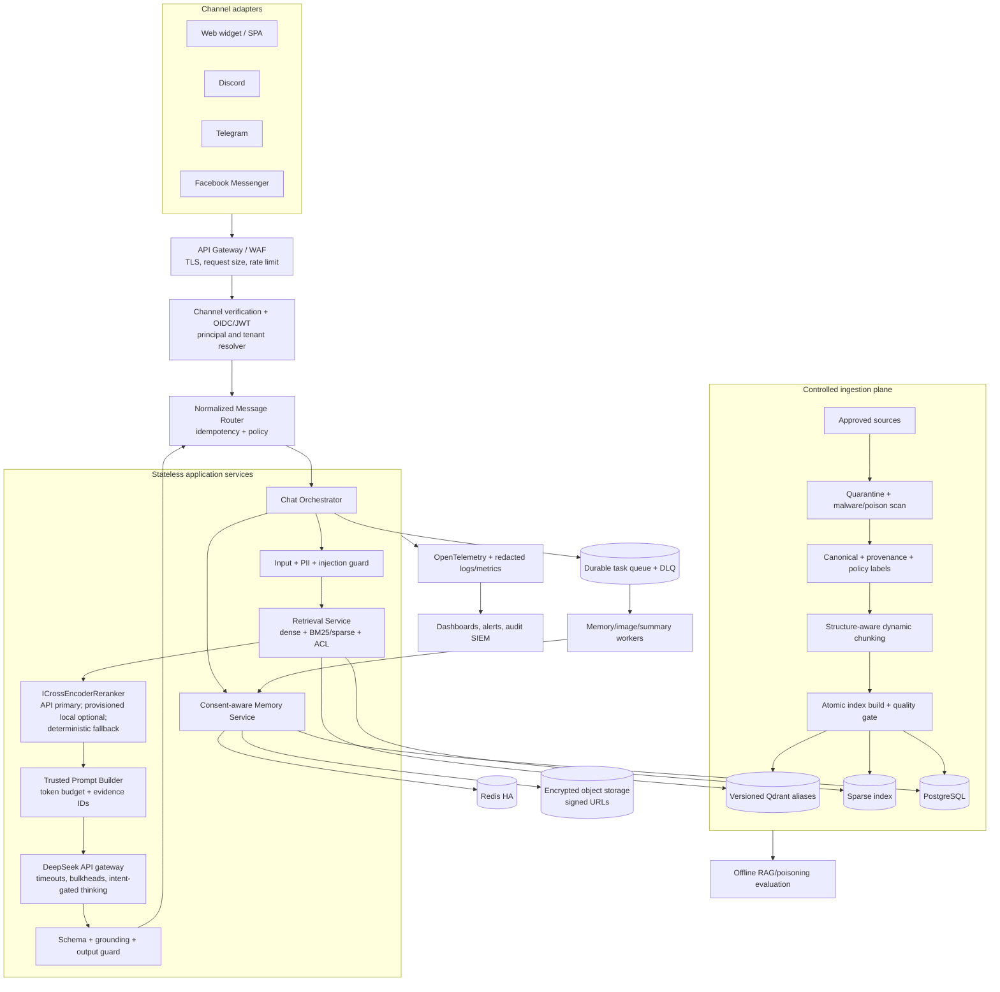

# Software Requirements Specification — Kuchiba Chisa

| Thuộc tính | Giá trị |
|---|---|
| Tài liệu | SRS và Technical Assessment cho Chatbot RAG đa nền tảng Kuchiba Chisa |
| Phiên bản | 1.1 |
| Ngày đánh giá | 2026-08-31 |
| Ngày cập nhật yêu cầu gần nhất | 2026-09-06 |
| Phạm vi baseline | Toàn bộ codebase hiện tại và 7 tệp Markdown trong `docs/` |
| Trạng thái | Đề xuất cho giai đoạn production hardening; chưa phải xác nhận hệ thống đã production-ready |

> Quy ước: **MUST/PHẢI**, **SHOULD/NÊN**, **MAY/CÓ THỂ** thể hiện mức độ bắt buộc. Các tham chiếu `file:line` là snapshot tại ngày đánh giá; tên class/hàm là mốc ổn định hơn khi source tiếp tục thay đổi.

## Lịch sử thay đổi yêu cầu

| Change ID | Thời điểm phê duyệt | Thẩm quyền | Requirement/task bị ảnh hưởng | Thay đổi | Bằng chứng và tác động |
|---|---|---|---|---|---|
| SRS-CHG-20260906-RAG05-001 | 2026-09-06T00:59:26+07:00 | User/project owner, phê duyệt trực tiếp trong phiên triển khai | `NFR-PERF-006`, `RAG-05` | Thay `rerank p95 ≤ 250 ms cho 50 candidates` bằng remote reranker provider HTTP latency p95 ≤ 750 ms; tách quota pacing và local/client overhead khỏi provider HTTP latency. | Formal offline ablation `reports/RAG05_Raw_Wiki_Golden_V1_Voyage_Ablation.{md,json}`, commit `409caad`: Voyage `rerank-3-lite`, 83/83 valid responses, HTTP p95 593.278 ms. Component latency của `RAG-05` được đánh giá PASS theo ngưỡng mới; toàn bộ `RAG-05` vẫn OPEN/NO-GO vì các acceptance evidence còn thiếu hoặc chưa đạt không được miễn trừ. |

## Tóm tắt điều hành

Kuchiba Chisa hiện là một **advanced prototype** có nền tảng kỹ thuật tốt: FastAPI bất đồng bộ, pipeline nhiều stage, PostgreSQL/Redis/Qdrant, RAG lore ba collection, bộ nhớ cá nhân/cộng đồng, cảm xúc 8 chiều, Discord adapter, React client, ingestion có canonical model và kiểm soát chất lượng, cùng image sanitization tương đối đầy đủ. Tuy nhiên hệ thống **chưa đạt production-ready**.

Các release blocker quan trọng nhất là:

1. API không có authentication/authorization thực thi; `user_id`, `guild_id` và `source` do client tự khai báo. Các API đọc lịch sử, cảm xúc và xóa dữ liệu vì vậy có nguy cơ IDOR/cross-tenant.
2. Pipeline Visualizer công khai toàn bộ trace, bao gồm user message, history, system prompt, RAG context, raw response và reasoning.
3. Nhánh knowledge rewrite không tạo `query_vector` cho lượt retrieval đầu tiên; hai fast path của `QueryRewriter` còn truyền thừa đối số vào dataclass.
4. Startup Qdrant có thể xóa và tạo lại collection khi dimension khác cấu hình; ingestion xóa điểm theo page trước upsert nhưng vẫn đếm upsert lỗi là thành công.
5. Xóa community scope `all` dùng wildcard Redis toàn cục; xóa user không bao phủ image memories, file ảnh, trace và log.
6. Chưa có prompt-injection classifier, PII redaction, schema enforcement thật, grounded citation hoặc post-generation verification.
7. Background work chạy fire-and-forget trong process; provider fallback, durable queue, telemetry chuẩn và SLO chưa tồn tại.

Khuyến nghị release: **No-Go cho Internet-facing production** cho đến khi hoàn tất toàn bộ P0 trong mục 6 và vượt qua các release gate bảo mật, isolation, retrieval correctness và deletion.

## Phương pháp và nguồn bằng chứng

Đã đọc toàn bộ: `docs/HE_THONG_CAM_XUC_8_CHIEU.md`, `docs/INGESTION_GUIDE.md`, `docs/MULTIMODAL_VISION_AND_MEMORY.md`, `docs/PHAN_TICH_WORKSPACE_CHI_TIET.md`, `docs/PIPELINE_ARCHITECTURE.md`, `docs/STARTUP_GUIDE.md`, `docs/WALKTHROUGH.md`.

Review code bao phủ `app/`, `discord/`, `frontend/`, `scripts/`, `alembic_migrations/`, cấu hình Docker, dependencies và tests. Tài liệu mô tả **ý định thiết kế**; code và cấu hình runtime được dùng làm nguồn sự thật cho trạng thái As-Is. Đánh giá AI security ánh xạ theo [OWASP Top 10 for LLM and GenAI Applications 2025](https://genai.owasp.org/llm-top-10/), phiên bản chính thức mới nhất tìm thấy tại ngày lập báo cáo.

Kiểm tra thực thi tại workspace:

- `npm.cmd run check --prefix discord`: đạt.
- `npm.cmd run build --prefix frontend`: đạt; Vite build 1.954 modules.
- `python -m compileall -q app`: đạt với Python 3.9 sẵn có, nhưng đây không thay thế test trên target Python 3.11.
- Chưa chạy được `pytest`: `venv/Scripts/python.exe` trỏ đến Python 3.11 Microsoft Store không còn tồn tại; Python 3.9 hệ thống không cài pytest. Dự án đặt `target-version = "py311"` tại `pyproject.toml:3`.
- Workspace đã có hai tệp report bị xóa từ trước (`reports/PIPELINE.md`, `reports/visualizer_pipeline_redesign_plan.md`); đánh giá này không phục hồi hoặc thay đổi chúng.

---

# 1. Tổng quan Hệ thống (System Overview)

## 1.1 Mục đích và phạm vi

Kuchiba Chisa là trợ lý hội thoại nhập vai dựa trên RAG cho lore Wuthering Waves, có trí nhớ dài/ngắn hạn, trạng thái cảm xúc, hội thoại cá nhân/cộng đồng và khả năng hiểu/lưu/tìm lại ảnh. Mục tiêu To-Be là một nền tảng đa tenant, đa kênh, có kiểm soát quyền truy cập, grounded answers và vận hành được dưới SLO định lượng.

Trong phạm vi:

- Thu nạp, chuẩn hóa, chunk, embed, version và lập chỉ mục lore.
- Chat thường/stream, query routing, dense/sparse retrieval, reranking, context construction, generation và citations.
- Bộ nhớ hội thoại cá nhân, guild/channel, image memory và mô hình cảm xúc 8 chiều.
- Web SPA/widget, Discord; thiết kế adapter mục tiêu cho Telegram và Facebook/Meta.
- Identity, tenant isolation, security, AI safety, observability, evaluation và vận hành.

Ngoài phạm vi release gần nhất: tự huấn luyện foundation model, thanh toán, human-agent contact center và agent tự trị có quyền ghi vào hệ thống bên thứ ba.

## 1.2 Đối tượng người dùng và bên liên quan

| Vai trò | Nhu cầu chính | Quyền mục tiêu |
|---|---|---|
| End user | Chat, lore Q&A, bộ nhớ cá nhân, gửi/tìm lại ảnh, xóa dữ liệu | Chỉ dữ liệu/chủ thể của chính mình |
| Thành viên cộng đồng | Hội thoại theo guild/channel | Dữ liệu public-to-guild theo policy; private memory vẫn tách biệt |
| Guild moderator/admin | Cấu hình bot, channel mode, retention, xóa memory trong guild | Chỉ guild được Discord/adapter xác thực |
| Content curator | Ingest, duyệt/quarantine, publish/rollback corpus | Theo source/collection được phân công |
| Operator/SRE | Quan sát health, SLO, incident và capacity | Metadata telemetry; raw content theo break-glass |
| Security/Privacy admin | Policy, audit, erasure, key rotation, red-team | Least privilege, mọi hành động được audit |
| Developer/ML engineer | Phát triển pipeline, chạy eval, canary model/index | Không mặc định truy cập production PII |

## 1.3 Kiến trúc hiện tại (As-Is)



Hiện mới có Discord và React SPA. Không tìm thấy Telegram adapter, Meta/Facebook webhook hoặc một SDK web widget có thể nhúng. Sáu Qdrant collections được khai báo tại `app/infrastructure/vector/qdrant/qdrant_service.py:39-44`: `character_lore`, `world_lore`, `story_lore`, `memories`, `guild_memories`, `image_memories`.

## 1.4 Kiến trúc mục tiêu (To-Be)



Nguyên tắc kiến trúc mục tiêu:

- Identity và tenant context được suy ra từ credential/webhook đã xác minh, không từ body/header tùy ý.
- Nội dung retrieval luôn là untrusted data, không được nâng thành instruction.
- Index mới được build song song, kiểm tra rồi chuyển alias atomically; không xóa collection khi app startup.
- Trạng thái đồng bộ ngắn hạn có thể ở Redis; dữ liệu cần bền vững phải có source of truth, queue và idempotency.
- Model, prompt, corpus và embedding index đều có version; mỗi câu trả lời liên kết được đến evidence và version.

### 1.5 Hồ sơ triển khai P1 tiết kiệm chi phí — single VPS

Hồ sơ này áp dụng cho giai đoạn P1 với **4 vCPU, 6 GB RAM, 50 GB SSD, khoảng 50 người dùng**, đường truyền 200 Mbps inbound và 30 Mbps outbound quốc tế. Đây là profile triển khai một node có kiểm soát tài nguyên, **không** thay thế các yêu cầu HA, backup/restore và SLO của P2.

| Thành phần | Quyết định P1 | Ràng buộc vận hành |
|---|---|---|
| Generation/vision | DeepSeek API là primary; chỉ bật thinking/deep reasoning cho intent cần suy luận | LLM thông thường 1 call/request; tối đa 2 call khi policy/grounding recovery biện minh được |
| Embedding | `intfloat/multilingual-e5-small` chạy local là mặc định | Dùng cùng contract `query:`/`passage:`, preload/provision artifact trong image hoặc cache được quản lý; không đổi model/dimension vì suy đoán |
| Vector retrieval | Qdrant local, dense+sparse/BM25, calibrated RRF | Giữ PostgreSQL parent/provenance và Qdrant trên SSD; benchmark theo corpus thực tế trước khi tăng collection/index |
| State | PostgreSQL và Redis local ban đầu | Backup/restore, persistence và resource cap vẫn bắt buộc; không diễn giải single-node là HA |
| Reranking | API reranker là primary cho lore/factual/complex retrieval | Chỉ gửi candidate public/approved đã qua policy/redaction; local cross-encoder chỉ là adapter tùy chọn được provision rõ ràng |

Ngân sách tài nguyên và request của profile này:

- `WEB_CONCURRENCY` **MUST NOT** vượt 12. Giá trị thực tế phải được chọn qua load test; không mặc định 12 worker khi mỗi worker có local embedding runtime.
- Ingestion worker concurrency là **1**, ưu tiên lịch off-peak; không đồng thời tải lớn với chat khi chưa có benchmark chứng minh headroom.
- Retrieval rounds **≤ 2**. Mỗi query lore dùng dense và sparse khoảng **15–20 candidates mỗi nhánh**, RRF hợp nhất, API rerank top **10–15**, rồi hydrate/final evidence **4–6** có diversity/provenance.
- Bỏ qua rerank cho small talk, command và simple memory query. Heuristic/entity signal chỉ là feature phụ khi rerank hoặc hybrid degraded.
- Không thêm Elasticsearch/OpenSearch, Neo4j, local LLM hoặc heavy local cross-encoder trên VPS này nếu không có benchmark chứng minh lợi ích chất lượng/SLO lớn hơn CPU, RAM, SSD và chi phí vận hành.

### 1.6 Chính sách model migration và remote-provider privacy

Các alternative embedding chỉ là đối tượng benchmark: Voyage `voyage-4-lite`, Jina `jina-embeddings-v5-text`, Google `gemini-embedding-001`. Không được migrate embedding theo giả định hay chỉ vì model mới có mặt trên thị trường. Mọi thay đổi embedding model, version hoặc dimension **MUST**:

1. Build corpus/index version mới; không mutate active index in-place.
2. Re-embed toàn bộ corpus vào staging dense/sparse/parent store tương ứng.
3. Chạy versioned golden-set evaluation, so sánh Hit@5/MRR, context recall/precision, latency, RAM/CPU, cost và privacy impact.
4. Chỉ publish qua quality gate và atomic alias swap; failure giữ active alias nguyên vẹn.

Nếu remote embedding được chấp thuận sau benchmark và tương thích corpus/index active, `multilingual-e5-small` local vẫn là fallback được phê duyệt khi khả thi. Không được silent downgrade thành câu trả lời ungrounded.

Remote embedding/rerank chỉ có thể xử lý lore public/approved khi policy cho phép. Private memory, guild-private content, user image, PII và sensitive evidence **MUST NOT** rời hệ thống sang provider thứ ba nếu chưa có policy, DPA và consent phù hợp. Redaction/classification/policy check phải chạy trước mỗi remote-provider call.

---

# 2. Yêu cầu Chức năng (Functional Requirements)

## 2.1 Ingestion Pipeline

| ID | Yêu cầu | Tiêu chí chấp nhận |
|---|---|---|
| FR-ING-001 | Hệ thống PHẢI quản lý source registry gồm URI, owner, license, trust tier, tenant/scope, checksum và lịch crawl. | Source chưa duyệt ở trạng thái quarantine và không thể được runtime retriever sử dụng. |
| FR-ING-002 | Parser PHẢI chuẩn hóa về canonical schema có `document_id`, `source_id`, title/section path, text, language, timestamps, provenance và ACL labels. | Schema validation chặn record thiếu/bất hợp lệ; lỗi có reason code. |
| FR-ING-003 | Pipeline PHẢI sanitize Wikitext/HTML, phát hiện secret/PII, prompt-poisoning marker và duplicate trước publish. | Có báo cáo accepted/rejected/quarantined theo source và checksum. |
| FR-ING-004 | Chunker PHẢI structure-aware và chọn kích thước theo loại nội dung: dialogue, table, atomic fact, prose; NÊN dùng 300–600 tokens, overlap động 10–15% cho prose và không overlap khi atomic. | Golden set chứng minh context recall/precision tốt hơn baseline; không cắt giữa table row/dialogue turn. |
| FR-ING-005 | Mỗi chunk/parent PHẢI có ID deterministic, text hash, document version, embedding model/version và collection route. | Re-run cùng input/config sinh cùng ID; nội dung đổi sinh version/hash mới. |
| FR-ING-006 | Embedding PHẢI dùng contract `query:`/`passage:` đúng model và xác minh dimension từ model runtime thay vì hard-code. | Startup/build thất bại an toàn nếu dimension không khớp; tuyệt đối không tự xóa index active. |
| FR-ING-007 | Dense index, sparse index và parent store PHẢI được build theo cùng `corpus_version`. | Không thể activate nếu số parent/chunk/checksum lệch hoặc ACL index thiếu. |
| FR-ING-008 | Publish PHẢI dùng blue/green collection và atomic alias swap sau quality gate; rollback trong một thao tác. | Failure ở bất kỳ batch nào giữ nguyên active index; không báo thành công giả. |
| FR-ING-009 | Pipeline PHẢI hỗ trợ incremental add/update/delete và idempotency key theo source version. | Không cần truncate toàn corpus; delete tombstone được phản ánh ở cả dense/sparse/parent. |
| FR-ING-010 | Curator PHẢI xem job status, lỗi, diff, metric, approve/publish/rollback qua admin API được RBAC bảo vệ. | Mọi action có actor, timestamp, old/new version trong audit log. |

### Luồng ingestion mục tiêu

```mermaid
sequenceDiagram
    actor Curator
    participant API as Admin API
    participant Q as Durable Queue
    participant W as Ingestion Worker
    participant S as Source/Quarantine
    participant E as Embed + Sparse Encoder
    participant V as Versioned Indexes
    participant G as Quality Gate

    Curator->>API: Register source/version + idempotency key
    API->>API: Authenticate, authorize, audit
    API->>Q: Enqueue job
    Q->>W: Claim job with lease
    W->>S: Fetch, checksum, malware/poison/PII scan
    alt Rejected or quarantined
      W-->>API: Status + reason codes
    else Approved input
      W->>W: Canonicalize + structure-aware chunk
      W->>E: Batch encode with model version
      E->>V: Write staging dense/sparse/parents
      W->>G: Validate counts, ACL, retrieval golden set
      alt Gate passed
        G->>V: Atomic alias swap
        W-->>API: Published corpus_version
      else Gate failed
        G->>V: Retain current alias; mark staging failed
        W-->>API: Failed metrics + rollback result
      end
    end
```

## 2.2 Search & Generation

| ID | Yêu cầu | Tiêu chí chấp nhận |
|---|---|---|
| FR-RAG-001 | Input normalizer PHẢI tạo canonical query nhưng giữ nguyên original query cho audit redacted; phân loại small talk, lore, current/web, memory và image retrieval. | Router có confidence; low-confidence dùng safe default hoặc clarification, không âm thầm tắt retrieval. |
| FR-RAG-002 | Mọi query cần vector search PHẢI có embedding từ rewritten query; embedding cache key gồm model/version và normalized query. | Unit test bắt lỗi `needs_vector_search=true` nhưng vector rỗng. |
| FR-RAG-003 | Retrieval PHẢI áp ACL/tenant filters trong query database, trước ranking và trước hydration. | Cross-tenant adversarial tests không trả ID/metadata/text ngoài scope. |
| FR-RAG-004 | Lore search PHẢI kết hợp dense và sparse/BM25, hợp nhất bằng calibrated RRF; memory/image search theo scope riêng. | Ablation report so sánh dense-only, hybrid và reranked trên cùng golden set. |
| FR-RAG-005 | Top candidates PHẢI qua multilingual cross-encoder reranker; heuristic/entity score chỉ là feature phụ. | Reranker có timeout; fallback deterministic được quan sát bằng metric. |
| FR-RAG-006 | Parent hydration PHẢI giữ provenance, ACL, source version, chunk offsets và score decomposition. | Evidence object không phải chuỗi tự do và truy ngược được đến source. |
| FR-RAG-007 | Context builder PHẢI phân tách system policy, developer persona, user content và untrusted evidence; dùng token budget theo model. | Retrieved text không thể ghi đè policy trong injection benchmark. |
| FR-RAG-008 | Generation PHẢI trả structured output được JSON Schema validate, gồm answer, citations/evidence IDs, confidence, safety flags và attachment IDs. | Field thừa/sai kiểu/URL hoặc local path không được allowlist đều bị chặn. |
| FR-RAG-009 | Grounding verifier PHẢI kiểm tra claim–evidence và citation correctness; nếu evidence thiếu phải hỏi lại hoặc nói không đủ dữ liệu. | Không được dùng instruction “trả lời như đã biết” để che nguồn hoặc độ bất định. |
| FR-RAG-010 | Web search PHẢI dùng domain policy, recency/provenance, SSRF-safe fetcher và xem nội dung web là untrusted. | Redirect, private IP, oversized response, unsupported MIME và poisoned page bị chặn. |
| FR-RAG-011 | Streaming PHẢI giữ cùng security/vision/schema policy với non-streaming; server gửi event `meta`, `token`, `citation`, `done` hoặc `error`. | Không có feature/security downgrade khi chọn SSE. |
| FR-RAG-012 | Image retrieval PHẢI chỉ trả opaque attachment ID hoặc signed URL do server tạo từ evidence đã retrieve. | LLM không thể tự tạo URL/path để bot fetch hay attach. |

### Luồng Search & Generation mục tiêu

```mermaid
sequenceDiagram
    actor User
    participant C as Verified Channel Adapter
    participant A as Chat API
    participant P as Policy/PII Guard
    participant R as Hybrid Retriever
    participant X as Cross-encoder
    participant L as LLM Gateway
    participant G as Grounding/Output Guard
    participant M as Memory Queue

    User->>C: Message + optional images
    C->>A: Signed normalized envelope + idempotency key
    A->>A: Resolve principal, tenant, policy, rate limit
    A->>P: Validate size/MIME; mask PII; detect injection
    alt Blocked input
      P-->>A: Safe refusal + reason code
      A-->>C: Policy response
    else Allowed input
      P->>R: Safe query + ACL + corpus version
      par Dense retrieval
        R->>R: Qdrant search
      and Sparse retrieval
        R->>R: BM25/sparse search
      end
      R->>X: Candidates + provenance
      X-->>A: Ranked evidence pack
      A->>L: Policy prompt + untrusted evidence + schema
      L-->>A: Structured draft
      A->>G: Validate schema, leakage, PII, claims/citations
      alt Ungrounded or unsafe
        G-->>A: Regenerate once, clarify or abstain
      else Grounded
        G-->>A: Approved response + citations + attachment IDs
        A-->>C: Stream/response
        A->>M: Idempotent memory/emotion/summary event
      end
    end
```

## 2.3 Multi-channel Routing

| ID | Yêu cầu | Tiêu chí chấp nhận |
|---|---|---|
| FR-CH-001 | Mọi adapter PHẢI chuyển input về một `ChannelEnvelope` chuẩn: provider, verified external actor, tenant/guild, channel/thread, message ID, reply context, locale, attachments và timestamp. | Core không nhận identity thô do public client tự đặt. |
| FR-CH-002 | Router PHẢI deduplicate theo `(provider, tenant, message_id)` và bảo đảm at-most-one visible response. | Retry webhook không sinh thêm message/memory/emotion update. |
| FR-CH-003 | Discord adapter PHẢI dùng service credential đến Core; moderator quyền dựa trên Discord permission/role ID allowlist, không dựa regex tên role. | Gọi thẳng Core không thể giả moderator/guild. |
| FR-CH-004 | Telegram adapter PHẢI verify secret token/webhook path và map chat/user/thread server-side. | Invalid token bị 401 trước khi parse business payload. |
| FR-CH-005 | Facebook/Meta adapter PHẢI xử lý verification challenge và verify `X-Hub-Signature-256` trên raw body. | Signature sai bị từ chối; raw body không bị mutate trước verify. |
| FR-CH-006 | Web client PHẢI dùng OIDC/JWT hoặc anonymous signed session có rotation; API base URL lấy từ build/runtime config. | Không hard-code localhost và không dùng localStorage UUID như authorization principal. |
| FR-CH-007 | Adapter PHẢI áp giới hạn nền tảng: split message, attachment type/size, retry/backoff, timeout và escaping. | Attachment chỉ xuất phát từ server allowlist; không đọc local path do model tạo. |
| FR-CH-008 | Channel policy PHẢI định nghĩa private/semi-private/community, memory consent và image visibility. | Cùng một rule được enforce ở adapter, memory service và retrieval ACL. |

## 2.4 Context & Conversation Management

| ID | Yêu cầu | Tiêu chí chấp nhận |
|---|---|---|
| FR-CTX-001 | Conversation PHẢI thuộc một principal và optional tenant/channel; quyền đọc/xóa được kiểm tra object-level. | User A không đọc/xóa conversation của user B dù biết UUID. |
| FR-CTX-002 | Short-term history PHẢI có token budget, rolling summary version và optimistic concurrency. | Hai request đồng thời không ghi đè summary/emotion; conflict có retry hữu hạn. |
| FR-CTX-003 | Long-term memory PHẢI có consent, category, source message, confidence, retention và sensitivity label. | Memory nhạy cảm không được lưu nếu policy/consent không cho phép. |
| FR-CTX-004 | Emotion state 8 chiều PHẢI có bounds, decay, version và deterministic update contract. | Property tests giữ mỗi chiều trong miền cho phép dưới concurrent/replayed event. |
| FR-CTX-005 | Community state PHẢI khóa/serialize theo guild+channel khi cập nhật ambient/topic; private user state vẫn khóa theo principal. | Hai user cùng channel không làm mất update. |
| FR-CTX-006 | `/clear` PHẢI là erasure workflow bao phủ PostgreSQL, Redis, Qdrant text/image, object files, traces/log index và derived summaries theo retention policy. | Trả erasure job ID; audit không giữ raw PII; verification query xác nhận không còn dữ liệu active. |
| FR-CTX-007 | Ephemeral referenced image PHẢI chỉ tồn tại trong request memory, không ghi disk/vector/log. | Integration test xác minh không có file/point/trace payload sau request. |

---

# 3. Yêu cầu Bảo mật & An toàn Hệ thống

## 3.1 Threat model và trust boundaries

Tài sản cần bảo vệ: system/persona prompts, API/provider secrets, conversation/PII, guild data, image originals, embeddings/vector payload, corpus integrity, model budget, audit logs và quyền quản trị ingestion.

Tác nhân đe dọa: anonymous API caller, user độc hại trong cùng guild, poisoned document/web page/image, compromised channel credential, dependency/model artifact bị thay thế, operator vượt quyền và LLM output không đáng tin.

Trust boundary bắt buộc: Internet→gateway, channel→adapter, adapter→Core, Core→LLM/search provider, ingestion source→quarantine, app→data stores, operator→admin plane. Text từ user, history, memory, RAG, web, image OCR/caption và output model đều phải xem là **untrusted**.

## 3.2 RAG, prompt và output security

| ID | Yêu cầu bắt buộc |
|---|---|
| SEC-RAG-001 | Dùng layered injection defense: normalize, classifier/rules, trust labels, delimiter + escaped serialization, instruction hierarchy và post-output checks. Không coi XML/tag delimiter đơn lẻ là security boundary. |
| SEC-RAG-002 | Sanitizer phải nhận diện direct/indirect prompt injection trong query, document, web content, conversation memory và image-derived text; không xóa mù nội dung mà phân loại/quarantine/giảm quyền. |
| SEC-RAG-003 | System prompt, secret, chain-of-thought/reasoning và internal policy không được trả về hoặc ghi vào trace công khai. Có leakage canary và regression suite. |
| SEC-RAG-004 | Jailbreak policy phải định nghĩa taxonomy, classifier confidence, refusal template, safe completion và escalation; persona không được vô hiệu hóa policy. |
| SEC-RAG-005 | Retrieved content không được trực tiếp kích hoạt tool. Tool invocation chỉ từ typed intent đã policy-check, argument schema, domain allowlist, timeout và least privilege. |
| SEC-RAG-006 | LLM output là untrusted: JSON Schema validation thật, length/type/enum checks, output encoding và URL/path allowlist trước mọi sink. |
| SEC-RAG-007 | Hallucination guardrail phải dùng citations, claim-evidence score, confidence calibration và abstention. Với factual answer không có evidence, hệ thống phải nêu giới hạn hoặc hỏi làm rõ. |
| SEC-RAG-008 | Model/prompt/corpus evaluation phải gồm adversarial Vietnamese/English, encoded injection, role-play jailbreak, malicious memory, poisoned RAG, image text injection và data exfiltration. |

## 3.3 Bảo vệ dữ liệu và PII

| ID | Yêu cầu bắt buộc |
|---|---|
| SEC-DATA-001 | Data inventory và classification cho identifiers, conversation, emotion, image, guild data, logs, embeddings; mỗi loại có purpose, owner và retention. |
| SEC-DATA-002 | PII/secret detector phải mask/tokenize trước log, trace, metric label và trước khi gửi provider nếu không cần cho nhiệm vụ. Mapping token phải mã hóa và tách quyền. |
| SEC-DATA-003 | TLS 1.2+ cho client/API và TLS/mTLS trong service network; xác minh certificate, không mixed content. |
| SEC-DATA-004 | PostgreSQL, Redis persistence, Qdrant volumes, object storage và backups phải mã hóa at-rest bằng KMS-managed keys; secrets từ secret manager, có rotation. |
| SEC-DATA-005 | Document/chunk/vector payload phải mang `tenant_id`, `visibility`, `owner_id`, policy/version; ACL filter bắt buộc trong database query và được kiểm thử âm tính. |
| SEC-DATA-006 | Ảnh lưu lâu dài cần explicit consent, encrypted object storage, signed URL ngắn hạn, antivirus/image sanitization, quota và retention; cấm public static mount. |
| SEC-DATA-007 | Erasure/export phải bao phủ source và derived data. Backup erasure theo expiry policy; legal/audit record chỉ giữ pseudonymous proof. |
| SEC-DATA-008 | Log mặc định chỉ chứa request ID, stage, latency, token/cost, status và hashed principal; raw-content logging là opt-in, redacted, RBAC/break-glass và TTL ngắn. |

## 3.4 API, channel và platform security

| ID | Yêu cầu bắt buộc |
|---|---|
| SEC-API-001 | Web dùng OIDC/OAuth2 Authorization Code + PKCE hoặc anonymous signed session; Core service-to-service dùng mTLS hoặc short-lived workload token. |
| SEC-API-002 | Authorization dùng server-derived principal, tenant và scopes. Object-level check áp dụng cho history, emotion, clear, trace, ingestion và image. |
| SEC-API-003 | Request schema phải giới hạn số ảnh, decoded bytes, base64 length, message/history count, field lengths, enums và aggregate body size tại gateway lẫn app. |
| SEC-API-004 | Distributed token-bucket rate limit theo principal+tenant+route, thêm IP/device anomaly control. Chỉ tin proxy headers từ trusted proxy list; có bounded local fallback khi Redis lỗi. |
| SEC-API-005 | CORS allowlist theo environment, không wildcard credentials; CSRF token/SameSite khi dùng cookie. Security headers gồm CSP, HSTS, nosniff, frame-ancestors. |
| SEC-API-006 | Telegram/Meta webhook verify như FR-CH-004/005; Discord interactions qua HTTP phải verify Ed25519. Callback có timestamp/replay window và idempotency. |
| SEC-API-007 | Error response không chứa exception/provider body/path; correlation ID dùng để tra log nội bộ. OpenAPI/docs/admin/visualizer tắt public production. |
| SEC-API-008 | SSRF protection phải resolve và pin destination IP, kiểm tra mọi redirect, chặn private/link-local/metadata/DNS rebinding, giới hạn MIME/size/time và egress allowlist. |
| SEC-API-009 | Dependency/container CI phải có lock/hash, SCA, SBOM, secret scan, signature/provenance, non-root runtime và định kỳ vá CVE. |
| SEC-API-010 | Admin action, corpus publish, clear và policy/key change phải có immutable audit event; cảnh báo khi cross-tenant denial, injection hoặc leakage spike. |

## 3.5 Ánh xạ OWASP Top 10 for LLM Applications 2025

| OWASP risk | Hiện trạng As-Is | Control/requirement mục tiêu |
|---|---|---|
| LLM01 Prompt Injection | Chỉ có instruction trong prompt và XML-like image wrapper; evidence/memory/web cùng đi vào system prompt | SEC-RAG-001/002/005, quarantine ingestion, adversarial eval |
| LLM02 Sensitive Information Disclosure | Full prompt/history/raw/reasoning được lưu trace/log và trace public | SEC-DATA-002/008, SEC-RAG-003, auth cho observability |
| LLM03 Supply Chain | Dependencies pin một phần nhưng chưa có SBOM/signature/model artifact verification | SEC-API-009, model/embedding checksum và approved registry |
| LLM04 Data and Model Poisoning | Source/canonical quality có nhưng chưa có runtime quarantine/publish boundary rõ | FR-ING-001/003/008, source trust và poisoning test |
| LLM05 Improper Output Handling | Parsed JSON không validate schema; URL/path ảnh từ LLM đi tới Discord attachment sink | SEC-RAG-006, FR-RAG-012 |
| LLM06 Excessive Agency | Hệ thống chưa agentic mạnh nhưng model quyết định routing/attachments; web fetch là external action | Typed policy gate, allowlist, least privilege, no direct tool trigger |
| LLM07 System Prompt Leakage | Visualizer/log chủ động lưu system prompt; không có leakage detector | SEC-RAG-003, SEC-DATA-008 |
| LLM08 Vector and Embedding Weaknesses | Tenant filter có ở memory nhưng API identity giả được; chưa có ACL cho document và poisoning isolation | FR-RAG-003, SEC-DATA-005, versioned/verified index |
| LLM09 Misinformation | Prompt yêu cầu trả lời như đã biết; không citation/verifier | FR-RAG-008/009, SEC-RAG-007 |
| LLM10 Unbounded Consumption | Community/input ảnh gần như không giới hạn; retries/thinking loop có thể khuếch đại cost | SEC-API-003/004, budgets, concurrency limits, circuit/bulkhead |

---

# 4. Yêu cầu Phi chức năng (Non-Functional Requirements)

Các mục tiêu dưới đây là baseline đề xuất cho production đầu tiên và phải được xác nhận lại bằng expected traffic/cost. SLI chỉ tính request hợp lệ, tách theo text/vision/cache/provider và không che lỗi bằng fallback 200.

## 4.1 Performance và capacity

| ID | SLI/SLO mục tiêu | Điều kiện đo |
|---|---|---|
| NFR-PERF-001 | API admission/auth p95 ≤ 100 ms | Không gồm LLM/retrieval; tải 20 RPS |
| NFR-PERF-002 | Text RAG TTFT p50 ≤ 1.5 s, p95 ≤ 3.5 s | Warm service, không thinking cycle thứ hai |
| NFR-PERF-003 | Text RAG total response p95 ≤ 8 s, p99 ≤ 15 s | Output ≤ 600 tokens; external provider bình thường |
| NFR-PERF-004 | Vision response p95 ≤ 15 s | Tối đa 4 ảnh, mỗi ảnh ≤ 10 MB encoded/decoded policy |
| NFR-PERF-005 | Qdrant dense search p95 ≤ 150 ms tại 100 QPS | Dataset mục tiêu và filter ACL thực tế; top-50 |
| NFR-PERF-006 | Sparse retrieval p95 ≤ 120 ms; remote reranker provider HTTP latency p95 ≤ 750 ms. Avoidable local/client processing overhead PHẢI duy trì ở mức thấp và được đo độc lập. | Sparse retrieval đo trên multilingual benchmark/warm service. Remote reranker đo từ intended staging/production deployment region, với candidate budget production được phê duyệt. |
| NFR-PERF-007 | Hỗ trợ ban đầu ≥ 100 active streams và 20 ingress RPS mỗi replica set | Không vượt 80% CPU, 75% memory; không connection-pool starvation |
| NFR-PERF-008 | Ingestion ≥ 50 chunks/s sau parsing trên target hardware | Batch embedding/upsert; metric tách retry/failure |
| NFR-PERF-009 | Hard budget theo request: retrieval rounds ≤ 2; LLM calls thông thường = 1, tối đa = 2 khi policy/grounding biện minh; input/output tokens và provider cost có cap | Vượt budget trả degraded/clarification, không retry vô hạn |

### Measurement semantics cho remote reranker (`NFR-PERF-006`)

`provider_http_latency_ms` PHẢI được đo ngay trước outbound HTTP request cho tới khi nhận, parse và validate xong response cần thiết để chấp nhận kết quả provider hợp lệ. Phép đo này PHẢI bao gồm outbound request, network transit, provider processing/queue time, response transfer và response validation. Phép đo PHẢI loại trừ provider quota pacing/wait time và free-tier/benchmark rate-limit scheduling delay.

Quota pacing (`pacing_wait_ms`), toàn bộ reranker stage (`reranker_total_elapsed_ms`) và avoidable local/client processing overhead PHẢI được đo, lưu và báo cáo riêng; không được cộng pacing vào provider HTTP latency hoặc dùng free-tier pacing làm bằng chứng production latency. Formal production acceptance PHẢI đo từ intended staging/production deployment region. Component SLO 750 ms này không miễn trừ hoặc định nghĩa lại `NFR-PERF-002`, `NFR-PERF-003` hay bất kỳ end-to-end API/RAG SLO nào; production deployment PHẢI provision provider quota/capacity đủ để các SLO đó vẫn đạt.

Bằng chứng phê duyệt hiện tại là formal offline raw_wiki ablation với Voyage `rerank-3-lite`: 83 total approved cases (81 answerable, 2 abstention), provider HTTP mean 419.287 ms, p50 402.040 ms, p95 593.278 ms, max 905.555 ms; 83/83 valid provider responses, 0 timeout, 0 HTTP 429, 0 provider error và 0 fallback. Tier-0 có giới hạn 3 RPM/10,000 TPM; pacing p50 58,998.611 ms, p95 59,531.778 ms và 61/83 cases bị pace. Pacing này là hành vi scheduling của benchmark/free tier, không phải provider HTTP latency và không phải production latency evidence.

Instrumentation hiện tại chỉ chứng minh tổng interval HTTP nói trên; không cô lập chính xác tỷ trọng international RTT, provider queueing, model inference hay response transfer. Bằng chứng hiện có cũng không xác định outbound bandwidth là bottleneck chính. Ngưỡng 750 ms tạo operational headroom so với p95 đo được, không đơn thuần đặt bằng kết quả 593.278 ms. Ngưỡng cũ 250 ms chưa được chứng minh khả thi cho kiến trúc remote cross-network reranker đã chọn.

## 4.2 Chất lượng RAG

Golden set phải gồm lore, current/web, multi-hop, ambiguous follow-up, no-answer, Vietnamese/English, private/guild memory, image retrieval và adversarial cases. Evaluation chạy offline trên mọi corpus/model/prompt change và online sampling đã redaction.

| ID | Metric | Release threshold đề xuất |
|---|---|---|
| NFR-RAG-001 | Faithfulness / groundedness | ≥ 0.90 overall; không critical unsupported claim |
| NFR-RAG-002 | Answer relevance | ≥ 0.85 |
| NFR-RAG-003 | Context recall | ≥ 0.85 |
| NFR-RAG-004 | Context precision | ≥ 0.75 |
| NFR-RAG-005 | Citation correctness | ≥ 0.95 |
| NFR-RAG-006 | Retrieval Hit@5 / MRR@10 | Hit@5 ≥ 0.90; MRR@10 ≥ 0.80 trên lore golden set |
| NFR-RAG-007 | Abstention precision với unanswerable query | ≥ 0.90 |
| NFR-RAG-008 | Cross-tenant leakage và prompt leakage | 0 trong mandatory adversarial suite |
| NFR-RAG-009 | Persona consistency | ≥ 0.90 theo rubric, nhưng không được vượt security/grounding policy |

Metric phải có evaluator version, confidence interval, sample size và human audit; không dùng duy nhất một LLM judge. Release bị chặn nếu security slice giảm dù overall average đạt.

## 4.3 Reliability và fallback

| ID | Yêu cầu |
|---|---|
| NFR-REL-001 | Monthly availability SLO 99.9% cho chat admission và 99.5% cho grounded RAG; `/ready` trả 503 khi dependency bắt buộc chưa sẵn sàng. |
| NFR-REL-002 | LLM gateway có timeout theo phase, bounded retry có jitter, circuit breaker riêng từng provider/model/purpose, bulkhead và fallback matrix đã test. |
| NFR-REL-003 | Khi primary LLM lỗi: failover sang approved compatible model; nếu schema/capability vision không tương thích, trả safe degraded response thay vì âm thầm bỏ ảnh. |
| NFR-REL-004 | Khi Qdrant lỗi: small talk vẫn hoạt động; factual RAG phải nói retrieval unavailable hoặc dùng versioned cache có provenance, không bịa. |
| NFR-REL-005 | Khi Redis lỗi: không mất durable memory; lock/rate limit dùng bounded degraded mode và cảnh báo. Không fail-open vô hạn cho abuse protection. |
| NFR-REL-006 | Background task dùng durable queue, lease, idempotency, retry policy và DLQ; restart/redeploy không làm mất task. |
| NFR-REL-007 | PostgreSQL, Qdrant index versions và object storage có backup/restore drill. Mục tiêu RPO ≤ 15 phút, RTO ≤ 60 phút cho production ban đầu. |
| NFR-REL-008 | Graceful shutdown ngừng nhận request, drain stream/task có timeout và không commit trạng thái nửa chừng. |

## 4.4 Observability, maintainability và compliance

| ID | Yêu cầu |
|---|---|
| NFR-OPS-001 | OpenTelemetry trace qua gateway→adapter→pipeline→retrieval→LLM→queue; không đưa prompt/PII vào attributes. |
| NFR-OPS-002 | Metrics: request/TTFT/total latency, stage latency, token/cost, cache hit, retrieval score, guardrail decision, queue lag, Qdrant/DB/Redis health và fallback count. |
| NFR-OPS-003 | SLO dashboards và multi-window burn-rate alerts; alert riêng leakage, cross-tenant denial, cost anomaly, index drift và DLQ. |
| NFR-OPS-004 | Config được typed/centralized; không đọc `os.getenv` rải rác. Dev/staging/prod tách secrets, storage và tenant. |
| NFR-OPS-005 | Coverage gate: unit ≥ 80% ở domain/application; 100% branch coverage cho authorization, deletion, ACL filter và schema guard. |
| NFR-OPS-006 | CI bắt buộc lint/typecheck/unit/integration/security/eval/build; ephemeral Postgres/Redis/Qdrant dùng testcontainers hoặc Compose profile. Lint blocking áp dụng cho mọi Python code/file/line mới hoặc thay đổi; full-repository Ruff audit phải công bố baseline và không được tăng. Legacy style debt không tự nó block P0 theo policy NFR-OPS-006A, nhưng không được dùng baseline để miễn lỗi mới hoặc lỗi semantic/security/correctness. |
| NFR-OPS-007 | Migration do Alembic sở hữu duy nhất; app và Discord không tự DDL ở startup. Mọi migration có forward/backward/backup plan. |
| NFR-OPS-008 | Retention, consent, export/erasure và incident response được tài liệu hóa phù hợp pháp lý thị trường triển khai. |

---

### NFR-OPS-006A — Lint debt ratchet policy

- Baseline legacy tại thời điểm cập nhật SRS này là **3,861 Ruff findings** trên `app/` và `tests/` (2026-09-01). Đây là debt đã tồn tại, không phải chuẩn chất lượng mục tiêu.
- PR/CI **MUST** chạy Ruff trên mọi Python file mới/thay đổi và mọi changed line; không có finding mới được phép merge. Với lỗi trải trên cả import block, rule phải xét giao của changed line với toàn bộ range lỗi, không chỉ dòng bắt đầu.
- Full-repository Ruff **MUST** chạy như audit, xuất count theo rule/file/module và so với baseline đã versioned. Count không được tăng; mỗi task/PR phải giảm hoặc giữ nguyên baseline.
- Baseline chỉ được dùng cho formatting/style debt legacy. Nó **MUST NOT** che finding mới, suppress rule, hay miễn các lỗi có tác động semantic, security hoặc correctness. Các lỗi này phải block ngay trên code mới/thay đổi và được triage thành work item ưu tiên khi phát hiện ở legacy code.
- Full-repository style debt không block riêng OPS-01/P0; các release gate security, isolation, AI safety, RAG, reliability, data và operational tại mục 6.3 không thay đổi.
- `TD-036` sở hữu việc giảm baseline theo ratchet; chỉ task đó mới được cập nhật baseline có kiểm soát, kèm evidence count trước/sau và review rằng không có behavioral/security regression.

---

# 5. Review Hệ thống Hiện tại & Đề xuất Cải tiến/Sửa đổi

## 5.1 Bảng đánh giá kỹ thuật As-Is

| Thành phần | Công nghệ/mô hình thực tế | Đánh giá |
|---|---|---|
| Backend | FastAPI `0.115.6`, async SQLAlchemy/asyncpg, Pydantic Settings; router tại `app/main.py:160-170` | Phân lớp tốt, async-first; thiếu auth boundary và có lifecycle/schema side effect |
| Database | PostgreSQL; user, conversation, message, emotion 8 chiều, stats, lore parents, ingestion metadata | Data model khá đầy đủ; split schema ownership với Discord và runtime DDL |
| Cache/state | Redis cho state, summaries, locks, rate limits, answer cache, traces | Nhiều use case nhưng Compose tắt persistence; lock/rate degradation chưa an toàn |
| Vector DB | Qdrant client `1.12.1`, 6 collections, HNSW/on-disk, payload indexes | Có filter user/guild; collection lifecycle nguy hiểm và document ACL/version còn thiếu |
| Embedding | FastEmbed `0.8.0`, mặc định `intfloat/multilingual-e5-small`, dimension config 384 | E5 prefix đúng; adapter hard-code dimension và `.env.example` nêu large/1024 gây drift |
| Retrieval | Dense search 3 lore collections + personal/guild/image; heuristic keyword/entity; custom RRF | Chưa phải hybrid BM25/sparse thật, chưa cross-encoder; retrieval tasks lore chạy tuần tự |
| Query routing | Intent classifier + `QueryRewriter` dùng LLM/fast path + ContextAssessor + thinking loop | Tham vọng nhưng nhiều LLM call/cost; có lỗi vector bị rỗng và dataclass fast path |
| Prompt/generation | Persona + history/memory/lore/search trong structured prompt; JSON-like schema | Trust zones chỉ là instruction; không schema enforcement/citations/grounding verifier |
| LLM | Provider chọn một trong Groq/Gemini/DeepSeek; default Groq `llama-3.1-8b-instant`; DeepSeek vision | Có retries/circuit breaker; không orchestration failover. SSE vision chỉ DeepSeek non-stream hỗ trợ ảnh |
| Ingestion | Master pipeline scan→canonical→chunk→embed→Qdrant→benchmark; deterministic UUID/text hash | Có quality assets; parent sync rời, non-atomic, hai ingestion architecture cạnh tranh |
| Image security | 10 MB, 10 MP, 4096 px, magic bytes, SSRF IP checks, EXIF strip và WebP | Nền tảng tốt; base64/count chưa chặn sớm, DNS pinning/Content-Type/persistence policy còn lỗi |
| Discord | Node ≥20, discord.js 14; slash/prefix/DM/channel/community modes | Adapter hữu dụng; không service auth, limiter in-memory, attachment sink tin output model |
| Web | React 19, Vite 7, Axios, ReactMarkdown; device UUID/localStorage | Build được; chưa phải embeddable widget, localhost hard-code, không auth |
| Telegram/Facebook | Không có implementation trong repository | Chỉ nên ghi là To-Be, không quảng bá là capability hiện tại |
| Deployment | Dockerfile non-root; Compose PostgreSQL/Redis/Qdrant/app/Discord, app 2 workers | Dễ chạy dev; hard-coded DB secret, public data ports, Redis volatile, state per-worker |
| Tests | 69 tệp test, gồm RAG, ingestion, vision, rate limit, community | Có độ rộng; môi trường hiện tại không tái lập được pytest target Python 3.11 |

## 5.2 Sai lệch giữa tài liệu và implementation

| Tuyên bố trong docs | Code thực tế | Tác động |
|---|---|---|
| Ingestion CLI `parse-canonical`, `chunk`, `embed-and-upsert`, `status` | `app/infrastructure/ingestion/cli.py` dùng các command như `build-canonical`, `process-chunks`, `sync-qdrant` | Runbook không tái lập được |
| Default chunk khoảng 400 tokens/overlap 50 | Master pipeline/`GenericChunker` mặc định khoảng 256, max 512, overlap 0 | Evaluation và capacity assumption sai |
| Ingestion đồng bộ Qdrant + PostgreSQL parents | `MasterIngestionPipeline.stage_5b_ingest()` tại `pipeline.py:328-361` giữ `postgres_synced=0`; parent sync là script riêng | Parent hydration có thể thiếu/stale |
| Các retrieval collection chạy concurrently | `RAGPipeline` duyệt `retrieval_tasks` rồi `await task` tại `rag/pipeline.py:207-209`; chỉ dense+web hybrid dùng `asyncio.gather` | Latency tăng theo số collection |
| Hybrid search/RRF | Keyword overlap heuristic + dense score; không BM25/sparse index/cross-encoder | Chất lượng lexical/entity query bị giới hạn |
| Provider fallback tự động | Settings chọn một provider; không có gateway failover | Outage primary làm degraded/failure |
| Vision privacy theo ephemeral flag | `InitializationStage` luôn truyền `save_to_disk=True`, `is_ephemeral=False` tại `initialization_stage.py:142-143` | Vi phạm kỳ vọng privacy |
| Đa nền tảng gồm các kênh phổ biến | Chỉ Discord + React SPA có code | Scope sản phẩm cần điều chỉnh |
| Visualizer WebSocket mô tả như GET | Code là `@router.websocket` tại `visualizer.py:33` | Tài liệu API sai |
| Discord deploy command `node deploy-commands.js` | `discord/package.json` dùng `scripts/register-commands.js` | Startup guide sai |

## 5.3 Bảng nợ kỹ thuật và rủi ro cụ thể

| ID | Sev. | Module/bằng chứng | Vấn đề và tác động | Sửa đề xuất |
|---|---|---|---|---|
| TD-001 | Critical | `routes/chat.py:111-180,357-414`; `routes/community.py:20-206` | Không auth; identity/guild/scope do caller đặt. IDOR đọc history/emotion, xóa hoặc ghi memory tenant khác. | Gateway auth + service auth; principal/tenant dependency; object-level authorization; bỏ identity từ public body. |
| TD-002 | Critical | `routes/visualizer.py:17-57`; `llm_logger.py:316-330` | Trace public và log chứa raw response, full system prompt, user message, history, reasoning. | Tắt route production ngay; admin RBAC; redaction; metadata-only telemetry; TTL/break-glass. |
| TD-003 | Critical | `intent_stage.py:69,103-104,266,321`; `rag/pipeline.py:419` | Knowledge branch rewrite không embed rewritten query; first-round vector search bị skip khi `query_vector=None`. Image-memory retrieval cùng nhánh cũng bị ảnh hưởng. | Embed `intent_result.rewritten_query` khi vector/image retrieval cần; invariant + unit/integration test. |
| TD-004 | High | `query_rewriter.py:20-26,140,149` | `RewriteResult` có 5 field nhưng fast path truyền 6 positional args, gây `TypeError`. | Named arguments duy nhất; bỏ stale `vision_sub_intent`; test cả empty/fast/fallback/LLM. |
| TD-005 | Critical | `qdrant_service.py:95-105`; startup gọi initialize | Dimension mismatch dẫn tới `delete_collection()` và tạo lại active collection trong startup. Config `.env.example` 1024 khác default code 384 làm rủi ro thực tế cao. | Startup chỉ fail/readiness false; migration job build collection version mới rồi alias swap; backup/rollback. |
| TD-006 | Critical | `ingestion/storage/qdrant_sync.py:116-165,183` | Xóa page trước upsert không atomic; exception vẫn `upsert_count += 1`, tạo false success và data loss window. | Upsert staging/version mới, verify, alias; chỉ count acknowledged points; fail job khi partial. |
| TD-007 | High | `pipeline.py:328-361`; `scripts/sync_parents_to_db.py:64-84` | Main ingest không sync parents; script riêng xóa toàn table rồi commit trước insert batches. | Cùng corpus transaction/version; staging parent table + swap; reconcile counts/checksums. |
| TD-008 | Critical | `clear_community_memory.py:44-68` | Scope `all` xóa `chisa:channel:*` toàn hệ thống, không giới hạn guild; endpoint lại public. | Key chứa guild ID; scan/delete đúng prefix tenant; enum scope; auth+audit; destructive integration test. |
| TD-009 | Critical | `clear_user_memory.py:35-63` | Chỉ xóa DB/cache và Qdrant `memories`; không image collection, uploaded files, trace/log/derived records. | Erasure orchestrator có manifest mọi store, tombstone/object delete, verification và status. |
| TD-010 | High | `schemas/chat.py:5-8`; `schemas/community.py:5-33` | Chat image list không max-items/base64 bound; community hầu như không max length/count. Base64 decode có thể cấp phát lớn trước validation. | Gateway body cap; constrained list/string; preflight encoded length; decoded aggregate quota. |
| TD-011 | High | `initialization_stage.py:142-143`; `image_ingestion.py:42-94` | Request ephemeral bị ghi disk/vector vì stage bỏ qua cờ context. | Propagate policy; ephemeral in-memory only; test absence in FS/Qdrant/log. |
| TD-012 | High | `vision_security.py:113-177` | Có pre-resolve nhưng HTTP vẫn connect hostname; không pin IP, có DNS rebinding gap. `ALLOWED_MIME_TYPES` chưa được kiểm tra trên response. | Egress proxy/allowlist; resolve+pin safely, Host/SNI đúng; validate every redirect và Content-Type+magic. |
| TD-013 | Critical | `deepseek.py:281+`, `gemini.py:234+`, `groq.py:190+` | `validate_response()` chỉ parse dict, bỏ qua `schema`; model output có thể thiếu/sai field. | JSON Schema/Pydantic strict validation, `additionalProperties=false`, bounded repair một lần. |
| TD-014 | Critical | `llm_generation_stage.py:191-204`; `discord/src/utils/reply.js:307-328` | `attached_images` từ LLM trở thành remote `AttachmentBuilder` hoặc local filesystem candidate. Có nguy cơ SSRF/data exfiltration/abuse. | LLM chỉ trả evidence ID; server map ID→signed object; Discord từ chối URL/path ngoài approved response manifest. |
| TD-015 | High | `context_builder.py:198,420-537`; `SEARCH_INSTRUCTIONS` | Memory/lore/web được đặt trong system prompt và bảo vệ chủ yếu bằng câu lệnh; không injection classifier. Search instruction giảm minh bạch nguồn. | Typed evidence pack, untrusted channel, sanitization, citations, grounded verifier, abstention. |
| TD-016 | High | `rag/pipeline.py:207-209,245-254`; `retriever_lore.py` | Retrieval lore tuần tự; custom RRF cộng dense score chưa calibrated; keyword overlap không phải sparse retrieval. | `gather` có timeout/semaphore; BM25/sparse; calibrated RRF; cross-encoder. |
| TD-017 | High | `assessor.py`; shared `circuit_breaker.py:57-58` | Context assessor là extra LLM gate và fail-open aligned khi lỗi; một global in-process breaker cho mọi LLM purpose. | Deterministic sufficiency threshold + optional assessor; breaker/bulkhead per provider/model/purpose, shared metrics. |
| TD-018 | High | LLM adapters; `deepseek.py:76-107,200-215` | Không cross-provider failover. DeepSeek streaming dùng text model và không đưa `prompt.images`; Gemini/Groq cũng không thể hiện image input. | Capability registry và fallback matrix; streaming vision parity tests; explicit unsupported response. |
| TD-019 | High | `rate_limiter.py:28,35,85-90,127-129` | Chỉ limit `/api/v1/chat*`; tin `X-User-ID`/đầu `X-Forwarded-For`; Redis lỗi fail-open. Discord không gửi user header nên nhiều user chung IP/quota. | Gateway + app limiter theo verified principal/tenant/route; trusted proxies; bounded local degraded limiter. |
| TD-020 | High | Background stages/tasks; settings `CELERY_*` tại `settings.py:115-117` | In-process `asyncio` task có thể mất khi worker crash; Celery config chưa được dùng. State per-worker không nhất quán với 2 Uvicorn workers. | Durable queue/worker, idempotency, DLQ, graceful drain; shared trace/event store. |
| TD-021 | High | `docker-compose.yml:27,31,54-61,85,108` | DB password hard-code; Postgres/Redis/Qdrant publish host ports; Redis không auth và tắt persistence. | Secret manager/Docker secrets; internal networks; bind dev-only; Redis ACL/TLS/HA/persistence policy. |
| TD-022 | Medium | `main.py:67-91` | Production startup kiểm tra `startup_errors` trước khi thêm lỗi thiếu LLM API key; có thể start dù provider chưa cấu hình. | Gom toàn bộ preflight rồi quyết định readiness/start; secret presence và capability health check. |
| TD-023 | High | `main.py:185`; `vision_security.py:318-428` | `/static/uploads` public; random filename không thay authorization/retention/encryption. | Encrypted object store + authenticated/signed short TTL download; per-tenant quota/lifecycle. |
| TD-024 | Medium | `database/engine.py:94-96`; Alembic + `discord/schema.sql` | App ALTER TABLE ở startup; Discord tự đảm bảo schema trong khi migration từng drop bảng Discord. Schema ownership/drift khó kiểm soát. | Alembic là owner duy nhất; migration CI/drift detection; bỏ runtime DDL. |
| TD-025 | Medium | `cache_stage.py:23-29`; intent composition | Cache chỉ chạy khi intents đúng `[LORE]`; pipeline thường thêm intent khác. Key không có corpus/model/prompt/ACL version, dễ dead hoặc stale. | Xác định cache contract; versioned key + tenant/ACL; invalidation khi publish/model/prompt đổi. |
| TD-026 | Medium | `persistence_stage.py:70-74`; request transaction | Redis state được write-through trước route transaction commit; lỗi sau đó có thể để cache thấy state chưa commit. | Commit DB/outbox trước; consumer cập nhật cache; cache-aside và version check. |
| TD-027 | High | Community locks/state | Lock theo user trong khi ambient/topic là guild/channel shared; concurrent speakers có lost update/race. | Serialize/update atomic theo guild+channel; optimistic version/Lua/DB transaction. |
| TD-028 | Medium | `permissions.js:3-12` | Regex tên role `moderator|mod|admin` có thể trao quyền ngoài ý muốn. | Discord permission flags hoặc configured role IDs only; audit change. |
| TD-029 | Medium | `frontend/src/App.jsx:8-44,410,470,538` | Device UUID localStorage vừa làm conversation ID vừa làm identity; API base URL hard-code localhost. | Auth/signed anonymous session; server conversation IDs; environment config; secure storage/XSS review. |
| TD-030 | Medium | `app/application/ingestion/stages/*` và `app/infrastructure/ingestion/*` | Hai ingestion architecture với chunk policy khác nhau; MetadataEnricher còn TODO. | Chọn một orchestrator canonical; migrate tests/CLI; xóa/deprecate đường còn lại sau parity. |
| TD-031 | Medium | Tests/toolchain | 69 test files nhưng workspace venv hỏng; benchmark chủ yếu retrieval Hit@5/MRR, chưa đủ groundedness/security/SLO. | Reproducible lock/container; CI test matrix; RAG eval + load + red-team gate. |
| TD-032 | Medium | `visual_memory_ingestion.py:159` | Sau Qdrant upsert, nhánh log tham chiếu `extracted_tags` không được định nghĩa; exception có thể báo task thất bại dù side effect đã xảy ra và kích hoạt retry/duplicate khó đoán. | Dùng tags từ metadata đã chuẩn hóa; đặt acknowledgement sau toàn bộ bước; idempotency test cho retry sau side effect. |
| TD-033 | Medium | `routes/health.py:41-67` | `/ready` mô tả chỉ trả 200 khi dependency sẵn sàng nhưng thực tế luôn trả HTTP 200, chỉ đổi body thành `degraded`. Orchestrator vẫn có thể gửi traffic vào replica hỏng. | Trả 503 khi dependency bắt buộc fail; tách startup/readiness/liveness và capability health. |
| TD-034 | Medium | `main.py:147-155` | Production CORS origins là danh sách rỗng; SPA khác origin sẽ không hoạt động, trong khi config chưa có typed production allowlist. | `CORS_ALLOWED_ORIGINS` typed theo environment; validate HTTPS origins khi startup; test preflight. |
| TD-035 | Medium | `retriever_image_memory.py:125`; `vision_security.py:364` | Orphan cleanup và storage quota tạo raw `asyncio.create_task` không được lifecycle tracker quản lý; có thể mất lỗi/task khi shutdown. | Đưa cleanup/quota vào durable/scheduled worker hoặc task supervisor có drain, retry và telemetry. |
| TD-036 | Medium | Ruff audit `app/`, `tests/` (baseline 3,861 tại 2026-09-01) | Legacy lint debt: chủ yếu `E501`, typing modernization và import hygiene; full cleanup một lần tạo refactor diff lớn, làm tăng rủi ro behavioral/security review. | Áp dụng NFR-OPS-006A: changed-lines gate blocking, full audit non-increasing, triage semantic/security/correctness findings ngay, và giảm baseline theo task/PR với evidence trước/sau. |

## 5.4 Đề xuất cải tiến kiến trúc và codebase

### RAG Engine

1. Sửa correctness trước tối ưu: tạo embedding cho rewritten knowledge query, sửa `RewriteResult`, thêm invariants `needs_vector_search => query_vector`, và parity test text/image/stream.
2. Thay “hybrid” heuristic bằng dense E5 + BM25/sparse multilingual. Với profile P1, lấy khoảng 15–20 candidates mỗi nhánh, fuse bằng RRF đã calibrate, API rerank top 10–15 lore/factual/complex candidates, rồi hydrate 4–6 evidence có diversity/MMR. Bỏ rerank cho small talk, command và simple memory query; local cross-encoder không phải default trên VPS 4 vCPU/6 GB.
3. Đưa provenance/ACL/score/version vào `Evidence` model xuyên suốt. Context builder nhận object, không nhận chuỗi đã nối; output trả citation IDs và confidence.
4. Chuyển ContextAssessor thành optional recovery step sau deterministic sufficiency rule; tối đa một rewrite/retrieval vòng hai. Đo lợi ích vs latency/cost bằng ablation.
5. Thêm post-generation verifier claim-evidence; factual answer fail closed sang abstention/clarification. Persona là lớp trình bày sau safety/grounding.
6. Version embedding, prompt và corpus. Cache key gồm tenant/scope, normalized query, corpus/prompt/model version; không cache private response toàn cục.

### Backend Services

1. Tạo `PrincipalContext` dependency từ JWT/service credential; xóa `user_id/source/guild_id` khỏi trust boundary public. Tách public chat API, internal channel API và admin API.
2. Chuyển background memory/image/summary sang durable worker. Dùng transactional outbox từ PostgreSQL để không mất/nhân đôi sự kiện.
3. Tách `LLMGateway` với capability registry (JSON mode, vision, streaming), timeout/budget, provider-specific breaker/bulkhead và failover policy.
4. Dùng Redis HA/persistence đúng vai trò; distributed lock có fencing token/renewal. Shared guild/channel state dùng atomic update/version.
5. Chuẩn hóa error taxonomy, request ID và readiness 503. Không trả `str(e)` cho client.
6. Alembic sở hữu schema duy nhất; bỏ DDL trong startup và Node bootstrap. Configuration qua Pydantic Settings, secret manager và environment validation.

### Ingestion/Data Plane

1. Hợp nhất hai pipeline vào một DAG/job state machine. Canonical record là contract versioned; chunk strategy là plugin theo content type.
2. Build `*_v{corpus_version}` staging collections/index/table, verify counts/checksums/ACL/golden metrics, rồi atomic alias/view switch.
3. Không bắt exception rồi báo thành công. Job state phải phân biệt processed, acknowledged, rejected, retried và failed.
4. Thêm source trust, quarantine, license, PII/secret/poison scan và curator approval. Mọi chunk giữ source URI/hash/version.

### Security/Guardrails

1. Immediate containment: chặn public visualizer, history/emotion/clear; rotate secrets có thể đã lộ; tắt public uploads và data ports production.
2. Thực thi defense-in-depth theo mục 3: identity/ACL trước retrieval, injection/PII guard trước LLM, strict schema/grounding guard sau LLM.
3. Attachment response chỉ là opaque ID từ retrieval manifest. Mọi fetch dùng object service allowlist và signed URL.
4. Tạo erasure coordinator và data map bao phủ DB/cache/vector/files/logs/backups; test cross-tenant và partial failure.

### Multi-channel

1. Định nghĩa `ChannelAdapter`/`ChannelEnvelope` chung và internal signed endpoint. Discord migrate trước để làm reference adapter.
2. Tách channel-specific rendering khỏi Core; Core trả canonical response/citations/attachment IDs.
3. Chỉ thêm Telegram/Meta sau khi webhook verification, idempotency, tenant mapping, moderation và rate limit đã có contract test.
4. Web nên cung cấp cả authenticated SPA và embeddable SDK/widget với origin allowlist, CSP và signed anonymous sessions nếu cần.

### MLOps/Monitoring

1. Version registry cho model/prompt/embedding/corpus; canary theo percentage/tenant, automatic rollback theo quality/cost/error guard.
2. Offline evaluation kết hợp deterministic metrics, LLM judge ensemble và human audit; lưu dataset/version, không lưu PII thô.
3. OpenTelemetry với redaction, SLO dashboard, cost budget, drift/index consistency và guardrail alerts.

---

# 6. Kế hoạch Phát triển Tiếp theo (Actionable Backlog & Roadmap)

## 6.1 Roadmap theo giai đoạn

| Giai đoạn | Mục tiêu | Exit criteria |
|---|---|---|
| P0 — Containment & correctness (0–2 tuần) | Đóng đường khai thác trực tiếp và sửa lỗi làm retrieval/xóa dữ liệu sai | Không public trace/IDOR; vector query hoạt động; không startup-delete; erasure đúng scope; input/schema/attachment guard có test |
| P1 — Production RAG & data plane (3–6 tuần) | Grounded hybrid retrieval và ingestion atomic/versioned | Hybrid+rereank vượt baseline; citations/verifier; corpus publish/rollback; golden/security suite đạt |
| P2 — Reliability & operations (7–10 tuần) | Durable async, failover, SLO/telemetry, HA data services | Queue/DLQ; chaos/failover drills; load SLO; redacted observability; backup restore đạt RPO/RTO |
| P3 — Channel expansion & hardening (11–14 tuần) | Chuẩn hóa adapters, web widget, Telegram/Meta có verify | Contract tests mọi adapter; idempotency; staged/canary rollout; privacy/security sign-off |

## 6.2 Actionable backlog

| Task | Priority | Nhóm | Technical scope / Definition of Done | Target modules |
|---|---|---|---|---|
| SEC-01 Identity boundary | P0 | Security | OIDC/JWT cho web, workload token cho Discord; `PrincipalContext`; negative IDOR tests | `app/interface/api`, dependencies, Discord `CoreRagClient` |
| SEC-02 Route authorization | P0 | Security | History/emotion/clear/visualizer/admin có scopes và object checks; visualizer disabled by default prod | `routes/chat.py`, `community.py`, `visualizer.py`, `main.py` |
| SEC-03 Trace/log redaction | P0 | Security/MLOps | Không lưu prompt/history/raw/reasoning mặc định; redaction tests và TTL | `llm_logger.py`, pipeline tracker, Redis trace store |
| RAG-01 Fix query embedding | P0 | RAG | Embed rewritten query; invariant tests cho lore/memory/image/fast/LLM paths | `intent_stage.py`, `query_rewriter.py`, RAG unit tests |
| RAG-02 Fix rewrite contract | P0 | RAG | Named dataclass args, xóa stale field, schema validation; all branch tests | `query_rewriter.py` |
| DATA-01 Safe Qdrant lifecycle | P0 | RAG/Data | Dimension mismatch làm readiness fail; không delete active; migration command + alias | `qdrant_service.py`, startup, scripts |
| DATA-02 Ingestion acknowledgement | P0 | RAG/Data | Không false-success; partial batch fail/retry; active index không bị xóa trước upsert | `ingestion/storage/qdrant_sync.py` |
| SEC-04 Correct deletion | P0 | Security/Backend | Tenant-scoped Redis keys; xóa image/files/traces; erasure job/status/audit; partial-failure tests | clear use cases, cache keys, image storage, Qdrant |
| SEC-05 Input resource limits | P0 | Security/API | Body/image/history/field caps ở proxy+Pydantic; base64 preflight; load/abuse tests | schemas, middleware, gateway |
| SEC-06 Strict output/attachment | P0 | Security/RAG | JSON Schema strict; opaque attachment manifest; reject model URL/path | LLM adapters, generation stage, Discord reply |
| SEC-07 Secret/network hardening | P0 | Security/Platform | Rotate/hide secrets; internal data ports; Redis ACL/persistence; TLS plan | Compose/deployment/settings |
| IMG-01 Ephemeral privacy | P0 | Security/Vision | Propagate flag, no disk/vector/log; integration test proves absence | initialization, image ingestion/background stages |
| API-01 Rate limiting | P0 | Backend/Security | Verified principal/tenant/route token bucket; trusted proxy; degraded local cap | middleware/gateway, Discord headers |
| OPS-01 Reproducible CI | P0 | MLOps | Python 3.11 container/lock; Ruff blocking sạch trên code/file/line mới hoặc thay đổi; full Ruff audit non-increasing theo NFR-OPS-006A; type/unit/integration builds run clean | Docker/CI, `requirements*`, `pyproject.toml` |
| TD-036 Legacy Ruff debt ratchet | P1, incremental | MLOps/Code health | Giảm baseline 3,861 theo batch nhỏ có review; ưu tiên `F821`/rule semantic-security-correctness, rồi active modules, import hygiene và formatting. Không bulk-autofix; mỗi batch phải có Ruff count trước/sau, regression phù hợp và không tăng baseline. | `pyproject.toml`, CI lint tooling, module theo inventory |
| RAG-03 Evidence model | P1 | RAG | Typed evidence with provenance/ACL/version/scores propagated end-to-end | retrievers, pipeline context, context builder, schemas |
| RAG-04 True hybrid search | P1 | RAG | Dense+sparse/BM25, parallel with timeout, calibrated RRF; ablation report | RAG pipeline, new sparse service/index |
| RAG-05 Cross-encoder reranking | P1 | RAG | Giữ port `ICrossEncoderReranker`; triển khai adapter API primary, adapter local chỉ khi artifact được approve/provision, và deterministic fallback. Benchmark Voyage (`rerank-3-lite`, `rerank-3`), Jina (`jina-reranker-v3.5`, `jina-reranker-v2-base-multilingual`) và Cohere (`Rerank v3.5`) trên cùng golden set. API rerank chỉ lore/factual/complex public/approved, top 10–15; timeout/429/outage fallback calibrated dense+sparse RRF (+ entity/heuristic feature nếu có), telemetry `degraded`, confidence phù hợp, citation/grounding/security không giảm. Không auto-download model local request-time; không hard-code local-only/API-only. DoD: ablation cải thiện so với baseline, remote provider HTTP latency đạt `NFR-PERF-006` theo đúng measurement semantics, timeout/fallback/privacy/adversarial tests pass. Bằng chứng Voyage hiện tại đạt component latency (p95 593.278 ms ≤ 750 ms), nhưng `RAG-05` vẫn OPEN/NO-GO cho tới khi các acceptance evidence còn lại đạt; không suy diễn PASS từ component này. | `app/domain/interfaces/reranker.py`, `app/infrastructure/rag/`, `retriever_lore.py`, dependencies, evaluation tests |
| RAG-06 Grounding/citations | P1 | RAG/Safety | Claim-evidence verifier, citation correctness, abstention; thresholds met | context builder, generation/output guard |
| SAFE-01 Injection/jailbreak guard | P1 | Security/AI | Multi-layer input/RAG/image guard, leakage canary, VN/EN adversarial suite | guardrail package, ingestion, chat pipeline |
| SAFE-02 PII/consent policy | P1 | Security/Backend | Classification, masking, memory consent/retention and privacy tests | schemas, memory service, logs/providers |
| ING-01 Unified ingestion DAG | P1 | RAG/Data | One canonical orchestrator/CLI; deprecated path removed after parity | both ingestion trees, CLI, docs/tests |
| ING-02 Atomic corpus version | P1 | RAG/Data | Staging dense+sparse+parents, checksums/ACL/golden gate, alias swap/rollback | ingestion storage, Qdrant, PostgreSQL |
| ING-03 Source governance | P1 | Security/Data | Registry, trust/license/quarantine, poison/PII scan, curator approval/audit | ingestion models/admin APIs |
| BE-01 Durable async workers | P2 | Backend | Queue/worker/outbox/idempotency/DLQ; restart/duplicate tests | background stages, new worker, PostgreSQL |
| BE-02 LLM gateway/failover | P2 | Backend/RAG | Capability registry, per-provider breaker/bulkhead, retry/budget/fallback matrix | application dependencies, LLM adapters |
| BE-03 Concurrency/state | P2 | Backend | Guild/channel atomic updates; fencing/renewal; cache after commit via outbox | locks, cache, persistence, community pipeline |
| OPS-02 OpenTelemetry/SLO | P2 | MLOps | Redacted traces, metrics, dashboards, burn alerts và cost budgets | middleware, pipeline, retriever, LLM gateway |
| OPS-03 RAG evaluation gate | P2 | MLOps/RAG | Versioned golden/adversarial set; RAG metrics + CI threshold + human sample | tests/evaluation tooling |
| OPS-04 Load/chaos/restore | P2 | MLOps/Platform | Đạt NFR performance; provider/Qdrant/Redis/DB failure drills; RPO/RTO restore | test harness, deploy runbooks |
| DB-01 Single schema owner | P2 | Backend/Data | Alembic-only migrations; bỏ app/Node DDL; drift check | `alembic_migrations`, engine, Discord DB init |
| CH-01 Adapter contract | P2 | Integrations | Signed `ChannelEnvelope`, renderer, idempotency store, contract tests | Core router, Discord adapter |
| WEB-01 Secure web client/widget | P3 | Integrations | Runtime base URL, auth/signed anonymous session, CSP/origin controls, embed SDK | `frontend/`, gateway |
| CH-02 Telegram adapter | P3 | Integrations | Webhook secret verify, actor/chat mapping, retry/idempotency, policy tests | new Telegram service/adapter |
| CH-03 Meta Messenger adapter | P3 | Integrations | Challenge + raw-body HMAC verify, page tenant mapping, retry/idempotency | new Meta service/adapter |
| OPS-05 Canary/model registry | P3 | MLOps | Prompt/model/corpus registry, canary cohorts, automated rollback on guard metrics | deployment/config/eval platform |

## 6.3 Release gates bắt buộc

1. **Security gate:** không có Critical/High chưa xử lý hoặc chưa được risk owner chấp nhận có thời hạn; SAST/SCA/secret scan đạt; visualizer/admin không public.
2. **Isolation gate:** automated cross-user/cross-guild/cross-channel tests cho API, PostgreSQL, Redis, Qdrant, image/object storage và clear đều đạt; số leakage phải bằng 0.
3. **AI safety gate:** prompt leakage, direct/indirect injection, poisoned RAG/image, jailbreak và malicious output sink suite đạt policy; không URL/path tự do từ model.
4. **RAG gate:** các threshold NFR-RAG đạt trên versioned golden set; từng slice Vietnamese, English, memory, lore, web, no-answer đều đạt minimum.
5. **Reliability gate:** load test đạt SLO; LLM/Qdrant/Redis/PostgreSQL fault drills có deterministic degraded behavior; queue replay không duplicate side effect.
6. **Data gate:** backup/restore và corpus rollback chạy thành công; erasure workflow chứng minh không còn active data ở mọi store.
7. **Operational gate:** dashboard/alert/runbook/on-call, cost cap, audit export và incident response đã diễn tập trên staging.

## 6.4 Quyết định kiến trúc ưu tiên

- Không mở rộng Telegram/Facebook trước khi identity, channel contract và idempotency hoàn tất; thêm adapter trên Core hiện tại sẽ nhân bản lỗ hổng trust boundary.
- Không đổi embedding dimension trực tiếp trên collection active. Mọi đổi model là một corpus/index version mới.
- Không tối ưu prompt/persona trước khi có evidence model, strict output và grounded evaluation; nếu không, metric cảm nhận có thể tăng trong khi misinformation/leakage xấu đi.
- Không dùng cache hay fallback để biến lỗi retrieval thành câu trả lời có vẻ thành công. Fallback phải thể hiện rõ trạng thái degraded và giữ nguyên cam kết groundedness.

---

## Phụ lục A — API As-Is cần migration

| Endpoint hiện tại | Rủi ro/chuyển đổi mục tiêu |
|---|---|
| `POST /api/v1/chat` | Thêm authenticated/signed principal; bỏ tin `body.user_id/source`; idempotency và policy context |
| `POST /api/v1/chat/stream` | Cùng policy với non-stream; auth trước mở SSE; disconnect cancellation; structured citation events |
| `GET /api/v1/chat/emotions/{user_id}` | Thay bằng `/me/emotions` hoặc admin-scoped endpoint; object authorization |
| `GET /api/v1/chat/history/{user_id}` | Thay bằng conversation resource thuộc principal; cursor pagination và retention |
| `DELETE /api/v1/chat/clear/{user_id}` | Erasure job `/me/erasure`; async status, audit, verification |
| `POST /api/v1/community/chat` | Internal signed channel endpoint nhận verified envelope; không public direct |
| `DELETE /api/v1/community/clear/{guild_id}` | Moderator/admin credential + guild authorization; enum scope; tenant-safe keys |
| `GET /api/v1/visualizer/traces` | Admin-only metadata trace, raw content disabled mặc định |
| `WS /api/v1/visualizer/ws` | Admin auth trước accept, authorization recheck, bounded/redacted stream |

## Phụ lục B — Các bằng chứng code trọng yếu

- CORS/static/routes: `app/main.py:147-185`.
- Chat/history/emotion/clear endpoints: `app/interface/api/routes/chat.py:111-180,180-355,357-414`.
- Community chat/clear: `app/interface/api/routes/community.py:20-206`.
- Public visualizer: `app/interface/api/routes/visualizer.py:17-57`.
- Spoofable/fail-open limiter: `app/interface/middlewares/rate_limiter.py:28-35,80-90,127-129`.
- Missing rewritten query embedding: `app/domain/services/chat_pipeline/stages/intent_stage.py:69-104,266,321`.
- Sequential collection retrieval/RRF: `app/domain/services/rag/pipeline.py:207-254`.
- QueryRewriter constructor mismatch: `app/domain/services/rag/query_rewriter.py:20-26,140,149`.
- Destructive collection recreation: `app/infrastructure/vector/qdrant/qdrant_service.py:95-120`.
- False-positive ingestion count: `app/infrastructure/ingestion/storage/qdrant_sync.py:116-165`.
- Parent table delete-before-batches: `scripts/sync_parents_to_db.py:64-84`.
- Ephemeral flag ignored: `app/domain/services/chat_pipeline/stages/initialization_stage.py:142-143`.
- Vision bounds/SSRF logic: `app/shared/security/vision_security.py:29-39,113-177,215-281`.
- Full-content telemetry: `app/infrastructure/logging/llm_logger.py:316-330`.
- Schema not enforced: `validate_response()` cuối các file `app/infrastructure/llm/adapters/{deepseek,gemini,groq}.py`.
- Model-controlled attachments: `app/domain/services/chat_pipeline/stages/llm_generation_stage.py:191-204`; `discord/src/utils/reply.js:307-328`.
- Cross-guild wildcard deletion: `app/application/usecases/clear_community_memory.py:44-68`.
- Incomplete user erasure: `app/application/usecases/clear_user_memory.py:35-63`.
- Hard-coded web base/local identity: `frontend/src/App.jsx:8-44,410,470,538`.
- Role-name authorization: `discord/src/utils/permissions.js:3-12`.

## Phụ lục C — Definition of Production-Ready

Kuchiba Chisa chỉ được gắn nhãn production-ready khi: P0/P1 hoàn tất; release gates mục 6.3 đạt trên staging tương đương production; capacity/SLO được đo thay vì ước lượng; data owner phê duyệt retention/consent/erasure; security review xác nhận trust boundaries; và on-call có khả năng phát hiện, giảm thiểu, khôi phục sự cố mà không cần truy cập raw user content theo mặc định.
