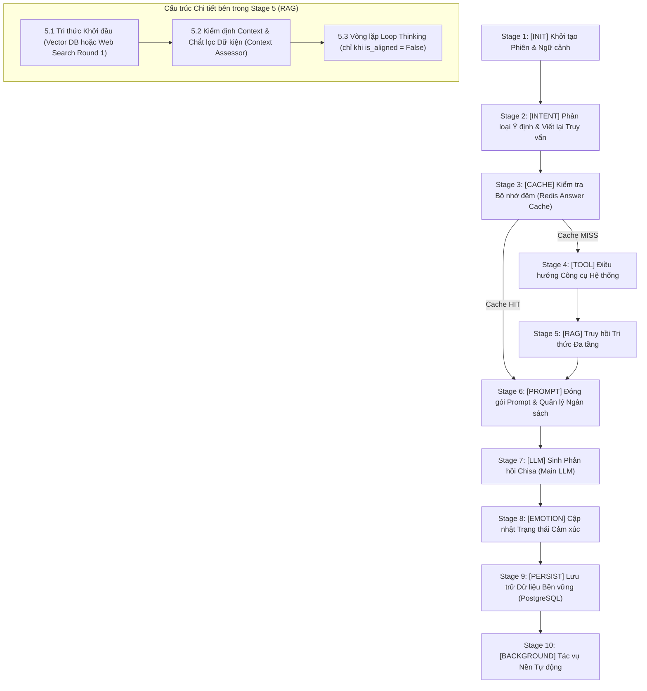

# KẾ HOẠCH TÁI THIẾT KẾ TOÀN DIỆN HỆ THỐNG TRACE LOG VISUALIZER
**Dự án:** Kuchiba Chisa AI (Wuthering Waves Companion)  
**Tác giả:** Antigravity AI & HoanBuCon  
**Ngày lập kế hoạch:** 20/08/2026  
**Vị trí lưu trữ:** `reports/visualizer_pipeline_redesign_plan.md`  

---

## 1. TỔNG QUAN & BỐI CẢNH (EXECUTIVE SUMMARY)

Hệ thống **Trace Log Visualizer** đóng vai trò là bảng điều khiển quan sát (Observability Dashboard) trung tâm của Kuchiba Chisa, cho phép theo dõi trực quan từng bước suy luận, truy hồi tri thức (Vector/Web Search), vòng lặp Loop Thinking, đóng gói System Prompt, và cập nhật cảm xúc 8 chiều.

Tuy nhiên, sau các đợt mở rộng tính năng gần đây, Visualizer đang gặp các vấn đề nghiêm trọng:
1. **Cây Pipeline hiển thị hỗn loạn:** Các node không phân cấp rõ ràng, phụ thuộc vào hàm phỏng đoán chuỗi (`getNodeDepth()`) ở frontend.
2. **Trùng lặp tác vụ (Task Duplication):** Nhiều cặp node khác nhau nhưng lại hiển thị cùng 1 thông tin (ví dụ: Node *Intent Classification* và Node *LLM Micro Rewrite*; Node *Information Alignment Check* và Node *LLM Assessor*).
3. **Mã nguồn Frontend cồng kềnh, khó bảo trì:** File `node-inspector.js` phình to lên gần 2.000 dòng mã với hàng chục khối HTML lặp đi lặp lại.
4. **Không phản ánh đầy đủ vòng đời Pipeline:** Một số Stage quan trọng như *Initialization*, *Redis Cache*, *Persistence*, *Background Tasks* hoàn toàn không có node hiển thị trên cây.

Kế hoạch này đưa ra giải pháp tái cấu trúc toàn diện từ Backend (Python Trace Emitters) đến Frontend (Modular JavaScript/CSS) để đạt 4 mục tiêu cốt lõi:
- **Dễ mở rộng, dễ bảo trì:** Chuẩn hóa Envelope Schema, thêm Stage mới chỉ cần khai báo schema.
- **Minh bạch, không lặp task:** Gom các LLM sub-calls vào trực tiếp payload của Stage cha, triệt tiêu 100% node trùng lặp.
- **Tính tái sử dụng cao:** Xây dựng thư viện Widget dùng chung (`inspector-widgets.js`).
- **Phản ánh chuẩn Pipeline:** Cây Visualizer phản ánh chính xác 1-1 toàn bộ 10 Giai đoạn chuẩn (Canonical 10 Stages).

---

## 2. CHẨN ĐOÁN GỐC RỄ NGUYÊN NHÂN (ROOT CAUSE ANALYSIS)

```
┌──────────────────────────────────────────────────────────────────────────────────┐
│                         NGUYÊN NHÂN GÂY LOẠN & TRÙNG LẶP                         │
├──────────────────────────────────────────────────────────────────────────────────┤
│ 1. DUPLICATE DO LLM LOGGER TỰ PHÁT STEP RỜI RẠC:                                 │
│    • Mỗi khi có bất kỳ lệnh gọi LLM nào, `llm_logger.py` tự động phát 1 step     │
│      `"llm_generation"` phẳng vào trace.                                         │
│    • Hậu quả:                                                                    │
│      - Node #1 Intent phát `intent_classification`, ngay sau đó xuất hiện thêm  │
│        Node #1.1 `llm_generation (micro_llm_query_rewrite)` -> TRÙNG NỘI DUNG!  │
│      - Node #3.1 `llm_generation (alignment_assessor)` xuất hiện song song với   │
│        Node #3.2 `information_alignment_check` -> TRÙNG CÙNG 1 TÁC VỤ!          │
│                                                                                  │
│ 2. CÂY PHẲNG KHÔNG CÓ PHÂN CẤP (FLAT ARRAY):                                    │
│    • Backend `PipelineTracker` chỉ lưu 1 danh sách phẳng `trace["steps"] = []`,   │
│      không có `stage_id`, `parent_step_id` hay `depth`.                          │
│    • Frontend `pipeline-tree.js` phải dùng chuỗi if-else dài dặc để "đoán mò"     │
│      depth = 0, 1 hay 2 -> Chỉ cần đổi tên 1 step là vỡ toàn bộ layout.        │
│                                                                                  │
│ 3. THIẾU CÁC GIAI ĐOẠN ROOT CHUẨN:                                               │
│    • Stage 1 (Init), Stage 3 (Cache), Stage 9 (Persistence) không phát step,     │
│      trong khi Web Search Mode lại làm biến mất luôn Stage 4 RAG cha.             │
└──────────────────────────────────────────────────────────────────────────────────┘
```

### Bảng Kiểm Kê & Phân Tích 16 Step Hiện Tại:

| Step Hiện Tại | File Backend Phát Lệnh | Tình Trạng | Giải Pháp Tái Cấu Trúc |
|---|---|---|---|
| `intent_classification` | `intent_stage.py` | Bị tách rời khỏi LLM Rewrite | Gộp toàn bộ dữ liệu phân loại ý định + LLM Rewrite vào **Stage 2 Root Node**. |
| `llm_generation` *(rewrite)* | `llm_logger.py` | **TRÙNG LẶP** với Intent | Chuyển thành telemetry nhúng trong Stage 2, không phát step ngoài. |
| `tool_routing` | `tool_routing_stage.py` | Phát step dù tool="none" | Chuẩn hóa hiển thị **Stage 4 Root Node** (Bypass 0ms hoặc Action). |
| `web_search` *(round 1)* | `rag/pipeline.py` | Làm biến mất Stage RAG cha | Trở thành Sub-Node `5.1.b` nằm bên dưới **Stage 5 RAG Root Node**. |
| `rag_retrieval` *(vector)* | `rag/pipeline.py` | Không đồng nhất schema | Trở thành Sub-Node `5.1.a` nằm bên dưới **Stage 5 RAG Root Node**. |
| `llm_generation` *(assessor)* | `llm_logger.py` | **TRÙNG LẶP** với Assessor | Nhúng vào telemetry của Context Assessor Sub-Node. |
| `information_alignment_check` | `rag/pipeline.py` | Tách rời LLM call | Trở thành Sub-Node `5.2` (Context Assessor & Factual Distillation). |
| `thinking_loop_cycle_X` | `rag/thinking_loop.py` | Tên step bị động | Trở thành Sub-Node `5.3.X` (Loop Thinking Cycles). |
| `thinking_loop_auto_satisfy`| `rag/thinking_loop.py` | Step phụ trợ riêng lẻ | Tích hợp thành badge hoàn tất trong Cycle 1. |
| `context_building` | `context_building_stage.py`| Hoạt động tốt | Chuẩn hóa thành **Stage 6 Root Node**. |
| `llm_generation` *(chat)* | `llm_logger.py` | Chưa có Stage Root bọc ngoài | Chuẩn hóa thành **Stage 7 Root Node** (Main LLM Generation). |
| `emotion_update` | `emotion_update_stage.py` | Hoạt động tốt | Chuẩn hóa thành **Stage 8 Root Node**. |
| `memory_extraction` | `memory_extractor.py` | Chạy ngầm dễ race condition | Chuẩn hóa thành Sub-Node bên dưới **Stage 10 (Background Tasks)**. |
| *(Missing)* `initialization` | `initialization_stage.py` | Chưa emit | Bổ sung **Stage 1 Root Node** (User info, History count, Baseline). |
| *(Missing)* `cache_check` | `cache_stage.py` | Chưa emit | Bổ sung **Stage 3 Root Node** (Redis Cache HIT/MISS). |
| *(Missing)* `persistence` | `persistence_stage.py` | Chưa emit | Bổ sung **Stage 9 Root Node** (SQL Messages & Last Seen). |
| *(Missing)* `background_tasks` | `background_task_stage.py` | Chưa emit | Bổ sung **Stage 10 Root Node** (Batch Memories & Auto Summary). |

---

## 3. KIẾN TRÚC PIPELINE CHUẨN 10 GIAI ĐOẠN (CANONICAL 10-STAGE HIERARCHY)



### Chi Tiết Cây Phân Cấp Chuẩn (Standardized Tree Structure):

```
========================================================================================
                        CHISA CANONICAL PIPELINE EXECUTION TREE
========================================================================================

Stage 1: [INIT] Khởi tạo Phiên & Ngữ cảnh (Initialization)
   └── 1.1 [DATA] Tải thông tin User, Lịch sử trò chuyện & Baseline Cảm xúc

Stage 2: [INTENT] Phân loại Ý định & Viết lại Truy vấn (Intent & Query Rewrite)
   ├── 2.1 [DECISION] Phân loại Semantic / Hybrid Small Talk (0ms Bypass)
   └── 2.2 [LLM] Micro LLM Query Rewriter & Tri-State Knowledge Routing (Tích hợp Telemetry)

Stage 3: [CACHE] Kiểm tra Bộ nhớ đệm (Redis Answer Cache Verification)
   └── 3.1 [DATA] Redis Answer Cache Check (HIT: Trả về ngay / MISS: Chuyển tiếp RAG)

Stage 4: [TOOL] Điều hướng Công cụ Hệ thống (System Tool Routing)
   └── 4.1 [DECISION] Phân tích Semantic Actions (Bypass 0ms nếu là Chat / Lore)

Stage 5: [RAG] Truy hồi Tri thức Đa tầng (Tri-State Knowledge Retrieval)
   ├── 5.1 [RETRIEVAL] Qdrant Vector Lore & Memories (hoặc Web Search Round 1 + Deep Crawl)
   ├── 5.2 [LLM & DECISION] Context Assessor & Chắt lọc Dữ kiện (Factual Distillation)
   └── 5.3 [THINKING] Vòng lặp Loop Thinking (chỉ kích hoạt nếu Assessor phát hiện thiếu)
        ├── 5.3.1 [CYCLE 1] Reasoning & Web Search Round 2
        │    └── 5.3.1.1 [TOOL] DuckDuckGo Search & Deep Page Crawler
        └── 5.3.2 [AUTO-SATISFY / CYCLE 2] Đánh giá hoàn tất dữ liệu

Stage 6: [PROMPT] Đóng gói Prompt & Quản lý Ngân sách (Context & Budget Manager)
   └── 6.1 [DATA] Ghép System Prompt, Context Lore/Facts, Lịch sử chat & Audit Token

Stage 7: [LLM] Sinh Phản hồi Chisa (Main LLM Generation)
   └── 7.1 [LLM] Model Inference, Chain-of-Thought (CoT) & Telemetry Token

Stage 8: [EMOTION] Cập nhật Trạng thái Cảm xúc (Emotion Engine Update)
   └── 8.1 [DATA] Phân tích Sentiment, Tính Delta Cảm xúc (Joy/Trust/Irritation/Attachment)

Stage 9: [PERSIST] Lưu trữ Dữ liệu Bền vững (Persistence)
   └── 9.1 [DATA] Ghi nhận Tin nhắn vào PostgreSQL & Cập nhật Last Seen

Stage 10: [BACKGROUND] Tác vụ Nền Tự động (Background Tasks Orchestration)
   ├── 10.1 [BG] Lên lịch Batch Fact Extraction (Trích xuất Ký ức định kỳ 3 lượt)
   └── 10.2 [BG] Lên lịch Unified Auto-Summarization (Tự động tóm tắt mỗi 10 lượt)
========================================================================================
```

---

## 4. CHUẨN HÓA ENVELOPE SCHEMA & DỮ LIỆU STEP (DATA CONTRACT)

Mọi Step phát từ Backend sẽ tuân thủ cấu trúc Envelope chuẩn:

```python
class StepCategory(str, Enum):
    STAGE_ROOT = "stage_root"           # Node gốc của 1 trong 10 giai đoạn
    LLM_INFERENCE = "llm_inference"     # Lượt gọi LLM (có prompt, response, tokens)
    RETRIEVAL = "retrieval"             # Truy vấn vector hoặc web search
    TOOL_EXECUTION = "tool_execution"   # Thực thi công cụ
    DECISION = "decision"               # Đánh giá logic, phân loại
    DATA_PROCESSING = "data_processing"  # Tính toán nội bộ, cảm xúc, persistence

class PipelineStepEnvelope(BaseModel):
    id: str                             # Unique ID (vd: "step_2_root", "step_5_2")
    stage_id: str                       # 1 trong 10 Stage ID chuẩn
    parent_step_id: Optional[str] = None # ID node cha (None nếu là Stage Root cấp 0)
    depth: int = 0                      # 0: Root Stage, 1: Sub-node, 2: Inner-cycle
    name: str                           # Canonical Step Name
    category: StepCategory              # Phân loại nghiệp vụ
    title: str                          # Tiêu đề hiển thị thân thiện (Tiếng Việt)
    subtitle: Optional[str] = None      # Tóm tắt 1 dòng
    status: str = "success"             # "success" | "skipped" | "cached" | "failed"
    duration_ms: float = 0.0            # Thời gian thực thi chính xác (ms)
    timestamp: str                      # ISO8601 UTC
    tokens: Optional[Dict[str, Any]] = None  # Telemetry token nếu có
    data: Dict[str, Any]                # Payload chuyên biệt của step
```

---

## 5. THIẾT KẾ MODULE HÓA FRONTEND (MODULAR UI ARCHITECTURE)

Tái cấu trúc thư mục `app/interface/api/static/visualizer/` theo mô hình Component-Driven:

```
app/interface/api/static/visualizer/
├── visualizer.js            # [Controller] Quản lý State, WebSocket, Filter & Selection
├── pipeline-tree.js         # [View: Tree] Render cây 10 giai đoạn dựa trên stage_id & depth từ Backend
├── inspector-widgets.js     # [Shared UI Library] Thư viện Widget dùng chung
├── node-inspector.js        # [View: Detail] Lắp ghép Widget vào các Tab chuyên biệt của từng Node
├── report-export.js         # [Exporter] Xuất báo cáo Markdown đồng bộ 1-1 với cây Pipeline
└── style.css                # [Styles] Theme Cyber-Kuudere Dark Design Tokens
```

### Thư Viện Widget Dùng Chung (`inspector-widgets.js`):
1. **`Widgets.renderMetricGrid(items)`**: Hiển thị card lưới thông số (Status, Latency, Tokens, Model, Routing Mode).
2. **`Widgets.renderTokenBreakdown(tokenBreakdown)`**: Thanh phân bổ token trực quan (System, Lore, Memory, History, CoT, Output).
3. **`Widgets.renderPromptViewer({ system, user, history })`**: Trình đọc prompt chuyên dụng có highlight markdown, phân chia role và nút copy 1-click.
4. **`Widgets.renderFactList(facts, title)`**: Danh sách các fact tri thức/ký ức đã chắt lọc kèm badge trạng thái.
5. **`Widgets.renderSearchSnippetList(snippets, urls, deepCrawl)`**: Khối hiển thị kết quả DuckDuckGo kèm link nguồn và bản preview cào sâu (Trafilatura).
6. **`Widgets.renderEmotionComparison(oldEmotions, newEmotions, delta)`**: Biểu đồ so sánh biến thiên 8 chiều cảm xúc (Joy, Trust, Irritation, Attachment, Shyness, Curiosity, Comfort).
7. **`Widgets.renderJsonViewer(data, title)`**: Khối JSON chuẩn hóa có highlight cú pháp và nút copy.

---

## 6. LỘ TRÌNH TRIỂN KHAI CHI TIẾT (4-SPRINT IMPLEMENTATION ROADMAP)

### 🏃 SPRINT 1: Chuẩn hóa Backend Envelope & PipelineTracker
- [ ] Cập nhật `app/infrastructure/logging/pipeline_tracker.py`:
  - Bổ sung các trường `stage_id`, `parent_step_id`, `depth`, `category`, `duration_ms` vào method `add_step()`.
  - Bổ sung helper method `start_stage()` và `add_sub_step()`.
- [ ] Bổ sung phát step cho các stage còn thiếu:
  - `InitializationStage` (`initialization_stage.py`)
  - `CacheStage` (`cache_stage.py`)
  - `PersistenceStage` (`persistence_stage.py`)
  - `CacheUpdateStage` (`cache_update_stage.py`)
  - `BackgroundTaskStage` (`background_task_stage.py`)

### 🏃 SPRINT 2: Triệt tiêu Trùng lặp & Tinh gọn LLM Logger
- [ ] Cập nhật `app/infrastructure/logging/llm_logger.py`:
  - Chỉ phát step `llm_generation` độc lập đối với LLM chính (`purpose == "chat_response"`).
  - Với các LLM sub-calls (`micro_llm_query_rewrite`, `alignment_assessor`, `thinking_loop_cycle_X`), nhúng toàn bộ telemetry token/prompt vào payload của Stage cha tương ứng.
- [ ] Cập nhật `app/domain/services/rag/pipeline.py` & `thinking_loop.py`:
  - Luôn đảm bảo `rag_retrieval` là Root Stage (kể cả trong Web Search Mode).
  - Gắn `parent_step_id` và `depth = 1` cho `context_assessor` và `thinking_loop`.

### 🏃 SPRINT 3: Xây dựng Thư Viện Widget UI & Viết lại Pipeline Tree
- [ ] Tạo file mới `app/interface/api/static/visualizer/inspector-widgets.js` chứa 7 hàm render widget dùng chung.
- [ ] Viết lại `app/interface/api/static/visualizer/pipeline-tree.js`:
  - Xóa bỏ 100% các hàm regex `getNodeDepth()`.
  - Render cấu trúc cây phân cấp trực tiếp dựa trên `step.depth`, `step.stage_id`, và `step.parent_step_id`.
  - Đánh số thứ tự chuẩn hóa: `#1`, `#2`, `#2.1`, `#3`, `#4`, `#5`, `#5.1`, `#5.2`, `#5.3`...

### 🏃 SPRINT 4: Tái cấu trúc Node Inspector & Kiểm thử Toàn diện
- [ ] Tái cấu trúc `app/interface/api/static/visualizer/node-inspector.js`:
  - Thay thế toàn bộ mã HTML lặp lại bằng các widget từ `inspector-widgets.js`.
  - Giảm dung lượng file từ 1.877 dòng xuống còn ~450 dòng.
- [ ] Cập nhật `app/interface/api/static/visualizer/report-export.js` đồng bộ 10 Stage khi xuất Markdown.
- [ ] Chạy toàn bộ bộ kiểm thử Unit Tests và Integration Tests để xác nhận 100% hệ thống hoạt động hoàn hảo.

---

## 7. TIÊU CHÍ NGHIỆM THU (ACCEPTANCE CRITERIA)

| Tiêu Chí | Trạng Thái Kỳ Vọng |
|---|---|
| **Zero Duplication** | 0 node nào bị trùng lặp nội dung trên cây Visualizer ở mọi loại câu hỏi (Small Talk, Lore, Web Search, Code, Loop Thinking). |
| **10 Canonical Stages** | Mọi request đều hiển thị mạch lạc theo đúng 10 giai đoạn chuẩn của pipeline. |
| **Phân cấp Rõ ràng** | Sub-nodes (Cấp 1 & Cấp 2) thụt lề chuẩn xác dựa trên `depth` từ Backend, không dùng regex phỏng đoán. |
| **Modular Inspector** | `node-inspector.js` gọn gàng, tái sử dụng 100% component từ `inspector-widgets.js`. |
| **Test Suite Pass** | 100% Unit Tests (`pytest`) và Integration Tests vượt qua thành công không có lỗi. |

---
*Kế hoạch đã được phê duyệt và sẵn sàng cho giai đoạn triển khai.*
